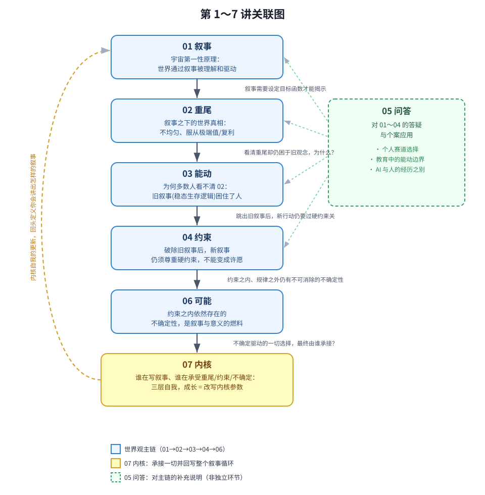
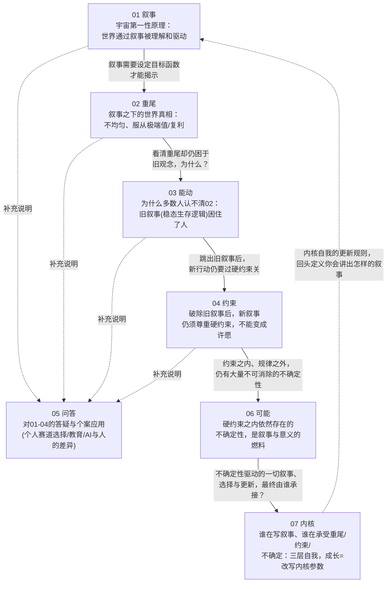

# E01 基本世界觀（第 01～07 講）

> 来源：《现代思维工具课》板块一「基本世界观」
> 涵盖：001叙事、002重尾、003能动、004约束、005问答、006可能、007内核

万维钢在这个板块提出：**世界观不能自主选择，只能认识到什么程度就接受到什么程度**。这七讲给出了理解世界最基础的六条设定（叙事、重尾、能动、约束、可能、内核），第 005 讲则是前四讲的问答补充。

---

## 一、逐讲重点摘要

### 01 叙事：这个宇宙的第一性原理

- 沃尔夫勒姆物理项目提出「Ruliad」概念：无数可能的物理定律构成总集合，我们的宇宙只是其中一个切片。而这个切片之所以长这样，是因为它满足了「叙事」的条件。
- 三大物理理论对应叙事的三要素：狭义相对论提供**因果**（顺序一致），量子力学提供**想象力**（未来不确定），广义相对论提供**舞台**（引力聚合秩序）。
- 「自我」不是实体，而是丹尼特所说的「叙事重心」——不是先有我才有叙事，是先有叙事才需要一个我来讲述。
- 叙事的三个作用：**预测处理**（弗里斯顿自由能原理：大脑靠叙事做预测，惊讶越少越好）、**提供意义**（关心一个人的意图，价值观由此而来）、**公共协调**（赫拉利式的共同虚构：货币、公司、国家）。
- 核心结论：**一切叙事都是主观的**。同一组事实可以被讲成不同方向的故事（"负增长""待业""返乡创业"），叙事决定了你的目标函数。人可以跳出别人设定的叙事，也可以主动争取"叙事权"。

### 02 重尾：世界服从极端值

- 人从小生活在"平均化的小世界"（家庭、学校、单位），因此默认平均才是正义。但真实世界是**重尾分布（幂律）**：少数人/公司/产品占据绝大部分财富、业务、关注度（80/20法则）。
- 区分**加法世界**（一天劳动换一天报酬，无复利）与**乘法世界**（增量 = 动作 × 存量，越大越容易更大，即正反馈/马太效应）。财富、名气、学术声望都是乘法世界的产物。
- 重尾不能靠"拉平"解决（乌干达驱赶亚裔企业家导致经济崩溃的反例），因为强强联手对所有参与方都是多赢——胜者通吃是有代价的，但取消乘法代价更大。而且富人不会永远富（投资失败、代际稀释、行业衰退）。
- 行动启示：**跳出"求平均、补短板"的加法思维，找到自己能做乘法的长板**，通过正反馈、复利、按比例追加投资（pro rata rights）等方式加入重尾。

### 03 能动：稳态生存的观念陷阱

- 用"转世写人生说明书"的思想实验引出：多数人被"稳态生存逻辑"束缚而不自知，这是**文化滞后**（观念更新慢于物质条件变化）的结果。
- 稳态生存逻辑三大基因：
  - **资源匮乏** → 风险厌恶、勤俭美德、"人情"互助、孝道绑架、零和思维（贫穷=道德、仇富）
  - **强从众**（弱规则社会的自我保护）→ 顺从价值观、"态度文化"（忙碌为荣、姿势当成果）、面子文化
  - **简单思维模型** → 线性努力观（"我努力了世界就该给回报"）、指标主义（达标即应得回报）
- 这些观念在匮乏、高风险的旧时代是好用的局部理性，但在**高波动的现代世界**反而成了枷锁。
- 核心结论：真正爱孩子的家长该希望孩子不那么听话、不必过度努力、敢制造波动。你要做**能动者（agent）**——调用工具的人，而不是被旧叙事驱使的工具。

### 04 约束：先尊重，再行动

- 用六层小说分类（系统外挂→霸道总裁→金庸武侠→升级打怪→对抗体制→寻找意义）说明：大多数人的生活叙事其实是"许愿"，一厢情愿程度不同而已，最接近现实的第六层仍不能代表真实世界。
- 现实与想象的根本区别在于**硬约束**——无法绕开的限制条件。事儿越大，硬约束越多，自由发挥空间越小（连总统和马斯克都受制于预算结构，DOGE"省两万亿"的承诺被硬约束击碎的真实案例）。
- 四种无法逃避的硬约束：**能量守恒**（资源有限）、**时间窗口**（机遇期）、**自然规律**（不因人而变）、**他人的能动性**（别人不是NPC）。
- 破除神话思维的方法论：**算账**。宏大叙事最怕算账，"谁出钱？"一句话就能戳破许多一厢情愿的设想。
- 核心结论：有效的叙事一定是在硬约束范围内找出路，而不是把世界当成愿望实现机——约束也意味着别人同样不能为所欲为，这才提供了确定性和安全感。

### 05 问答：叙事与讲故事、造梦的区别

对前四讲的补充与答疑，几个关键澄清：

- **叙事 vs 故事/造梦**：叙事是广义的、可以毫无戏剧性（"我吃了个馒头"），故事和造梦有强烈的虚构感和戏剧性。用"叙事"提醒人保持警惕，意识到是叙事就能跳出来。
- **AI 与人的经历之别**：AI 的上下文像工作记忆而非真实经历，调用结束即"出戏"，模型参数不受影响；人的每次经历都在改写神经元——这决定了后面第07讲"内核自我"的伏笔。
- **重尾在个人策略上的应用**：能力和资源不占优时，应选**小众赛道**（多面手+结构洞策略：斯科特·亚当斯"多项技能进前25%"、"结构洞"如"卖豆腐的西施"）。大公司因难以归因而倾向"抹平"薪酬，小公司则更贴近真实的重尾分布。
- **能动的边界**：对于一年级小孩的适应问题，建议"不干预就是最好的干预"——能动不等于事事介入，而是分清哪些该由时间自动解决。

### 06 可能：不确定性是意义的燃料

- 五种无法消除的不确定性：**混沌**（对初始条件敏感，如天气预报14天上限）、**计算不可约性**（沃尔夫勒姆：有些系统你只能老实演化，无法抄近路提前算出结果）、**量子随机**（世界本体的"摇骰子"）、**奈特不确定性**（模型之外的黑天鹅，连概率都无法定义）、**博弈不确定性/反身性**（索罗斯：预测本身会改变结果）。
- 用意大利科学家的模拟实验证明：**运气比能力更重要**。让能力呈正态分布的人群经历40年随机幸运/不幸事件，最终财富呈重尾分布，且最富有的人并非最聪明，而是最幸运的。能力本身也是一种运气（基因、时代、际遇）。
- 面对不确定性的三种态度：
  - 消极①**渴望确定**：补偿性控制心理，会被野心家利用（"贩卖确定感"是权力的来源）
  - 消极②**被动接受**："一切都是最好的安排"等于放弃主动性
  - 积极：**合理分析、管理坏的、拥抱好的、甚至制造不确定性**
- GPT 的洞见：人类真正渴望的不是确定性本身，而是"把不确定变成确定"那个瞬间带来的愉悦——这正是叙事和意义感的来源。
- 核心结论：**不确定性是意义的燃料**——不多不少，"一大块熟悉+一小块意外"最好；解决的不确定性越大，回报（意义）越高。

### 07 内核：你的三个「自我」

- 提出人有**三层自我**的工作模型，并与大语言模型类比：

| 自我 | 定义 | LLM 类比 |
|---|---|---|
| **进程自我**（Process Self） | 当下直观感受到的"我"，区分我与非我；被动的运行日志，非真正的决策者（决定先于意识到） | 单次运行中的输入-推理-输出流 |
| **界面自我**（Interface Self） | 更稳定、可被他人观察的人设/性格标签/自传，受情境（context）强烈影响，是变量非常量 | 系统提示词（prompt）/角色设定 |
| **内核自我**（Core Self） | 不可被自我直接感知的先验假设与预测模型，决定直觉、冲动、潜意识判断，是慢变量 | 模型权重（weights） |

- 借用弗里斯顿自由能原理/预测加工理论：内核自我是那套持续对世界做预测、并根据预测误差更新的算法参数。
- 真正的成长 = **改写内核自我的参数**，而非仅改情绪（进程自我）或人设（界面自我）。杠杆有二：
  1. **训练语料**（你摄入的信息、模仿的行为、所处的圈子）→ 决定你的敏感点和价值观，垃圾信息会让神经网络"过拟合"
  2. **奖励函数**（什么在给你的行为打分）→ 必须具体明确才有效，"强化什么，你就会成为什么"
- 面对预测误差（被现实打脸）的三种应对，由劣到优：改注意力（回避证据）→ 改行为（绕开场景）→ **改模型**（承认"原来我是错的"，重写参数）——这才是真正的成长契机。
- 结论：人比 AI 多一层自由——**可以自主选择自己的训练样本和奖励函数**，这是人的终极自由，也是最根本的元认知。

---

## 二、七讲亮点提炼

- **认知反差最大的洞见**：财富、声望、学术产出的重尾分布，根源不在能力（正态分布）而在运气+正反馈的复利结构（02、06 呼应）。
- **最具行动力的方法论**：宏大叙事"算账破除法"——用能量、成本、预算结构直接检验一个叙事是否可行（04 的地底文明/DOGE案例）。
- **最颠覆常识的框架**：三个自我的 LLM 类比——把"人设崩塌""情绪调节"和"真正成长"清晰分层，说明多数人一生都在改"提示词"而非"权重"（07）。
- **最具警世意味的判断**：稳态生存逻辑（勤俭、顺从、指标主义）曾是匮乏时代的理性策略，在高波动的现代却成为陷阱——这解释了为何"听话的好孩子"常常走向平庸（03）。
- **贯穿全局的元命题**：叙事是主观的、可选择的接口（01），但必须在硬约束（04）与不确定性（06）之间寻找路径，而真正能做这件事的主体，落到底是可以被重新训练的内核自我（07）。

---

## 三、第 1～7 讲关联图

若圖片未顯示，點此展開 Mermaid 原始碼版本（需閱讀器支援 Mermaid）

**关系解读（一句话版）**：
世界的本体是**叙事**（01）；叙事如实揭开后，世界真相是**重尾**而非平均（02）；但多数人被文化滞后的旧叙事困住，缺乏**能动**性去回应这个真相（03）；一旦决心能动地行动，就必须先尊重**约束**，不能把叙事当许愿（04）；05 讲把以上四条用具体问答串起来落地；约束之内仍有大量无法消除的**不确定性**，它恰恰是叙事得以持续、意义得以产生的燃料（06）；而承受这一切、并且唯一能够被重新训练和更新的主体，是隐藏在进程自我和界面自我背后的**内核自我**（07）——内核自我的更新，又会反过来决定你下一次讲出什么样的叙事，构成整个板块的闭环。

---

## 四、延伸思考（可选）

1. 03「能动」与 07「内核」呼应：稳态生存逻辑本质上是一种被固化的"内核参数"（训练语料+奖励函数长期作用的结果），要摆脱它就是要主动重写内核，而非仅仅"想开点"。
2. 02「重尾」与 06「可能」呼应：重尾世界的赢家更多是"运气"（不确定性的正面兑现），这提示我们对成功者的归因要更谦逊，对自己的失败也不必全归咎于能力。
3. 01「叙事」与 04「约束」构成一对张力：叙事给了主观选择的自由，约束划定了这份自由的边界——现代人的成熟，就是学会在这两者之间寻找可执行的路径。
