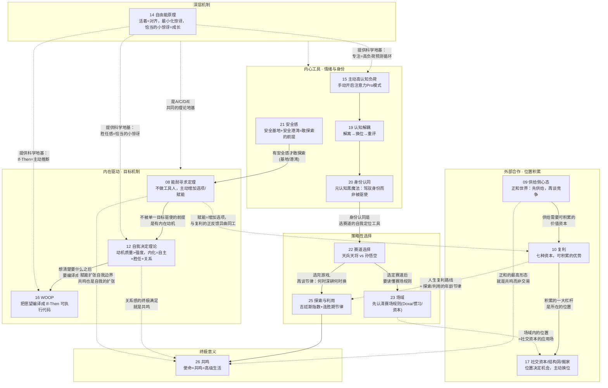

# E02 模块一：成长战略（第 08～26 讲）

> 来源：《现代思维工具课》模块一「个人成长战略」
> 涵盖：008能耐寻求定理、009供给侧心态、010复利、011问答、012自我决定理论、013特别放送(基本世界观模块答疑)、014自由能原理、015主动高认知负荷、016WOOP、017社交资本结构洞和搬家、018问答、019认知解耦、020身份认同、021安全感、022赛道选择、023场域、024问答、025探索与利用、026共鸣

第 026 讲开篇点明：这是"个人成长战略板块的最后一讲"。所以 008～026 这十九讲构成一个完整模块——回答"一个人该如何主动地把自己活成一个能持续变强、又不被异化的能动者"。第 013 讲比较特殊，它是板块一（基本世界观，即 E01 涵盖的 001～007 讲）的直播答疑纪要，内容是对前六条世界观的复盘和延伸，本篇把它当作两个模块之间的"桥梁"一并收录。

---

## 一、逐讲重点摘要

### 008 能耐寻求定理：君子不器

- 提出「能耐寻求定理（Power-Seeking Theorem）」——源自 AI 智能体研究：面对不确定的奖励环境，最优策略是尽量增加自己未来的「选项（options）」，而不是押注单一目标。这与"君子不器""人只能是目的不能是手段"（康德）暗合。
- 区分"器"与"君子"：器是被单一目标函数驱动的工具人（贫困、上瘾、KPI 至上都是"隧道效应"造成的认知窄化）；君子可以在特定时刻专注于一个目标，但他是目标的主人而非奴隶，随时可以跳出。
- 好东西（金钱、声望、好心情）往往是"直接追求追不到、间接才能得到"的副产品（斜行定律 obliquity），君子真正该追求的是可以直接寻求的「赋能（empowerment）」——增加未来状态的信道容量，本质是人和生物最原始的内驱力。
- 应用：决策多想一个选项、身份认同保留多角色、学习追求可迁移的理解力、社会关系保持独立性——凡是让你选项变多的都是赋能，凡是让你受制于人的都是失能。

### 009 供给侧心态：怎样在正和的世界合作（以及竞争）

- 现代人的最大精神内耗，是把零和当常识、把正和当理想。但生物进化的主干是合作而非杀戮，现代市场因为「信息可复制」和「分工+网络效应」两个 buff 而天然正和。
- 「供给侧心态」= 把自己当成提供可验证价值的模块，主动降低协作摩擦，嵌入长期重复博弈且有网络效应的结构里，包含三件事：价值生产、摩擦消除（"胶水员工"、改名换取更低摩擦合作接口等真实研究）、网络触达。
- 深层认知：现代竞争的本质不是抢资源，而是抢「合作资格」；被从合作名单中划掉，是现代社会对个体最大的惩罚。声誉是重复博弈中他人对你未来合作价值的贴现。

### 010 复利：可积累的优势

- 复利的真正秘密不是利率高，而是持续时间长（巴菲特 vs 西蒙斯的对比；小张小李的定投思想实验）。r（资本回报率）> g（劳动/经济增长率，皮凯蒂）解释了贫富差距的本质：富人的优势可积累，打工挣钱不可积累。
- 提出七种值得积累复利的资本：金钱资本、人力资本、健康资本、社会资本、声望资本、心理资本、体验资本——彼此可以互相叠加转化，形成正反馈飞轮。
- ROI 意识 + 人生复利路线：18-25 抬利率期（重仓人力资本）、25-35 锁赛道期（深耕+建声望）、35-50 规模期（用杠杆放大）、50-65 抗衰/新探索期（压缩经验、外包琐事）、65+ 分红期。年轻的强是增长，中年的强是杠杆，老年的强是取舍。

### 011 问答：为什么承认"原来我是错的"那么难？

对 004（约束）、006（可能）、007（内核）、008（能耐寻求定理）、009（供给侧心态）的补充：判断硬约束是否被突破的标准是"这件事本身会不会成为头条新闻"；用笔记积累与 AI 对话来内化思维工具；内核自我的改变靠"发现苗头+反向训练"而非说理；破除习得性无助要靠"最小的胜利"；说服人放弃错误观念的关键是把观念与身份认同解离开，而不是直接否定；能耐寻求定理不是无脑探索，探索/利用要动态平衡，且期权有到期时间。

### 012 自我决定理论：一流人物不可能是痛苦的卷王

- 「自我决定理论（SDT）」区分动机质量而非强度：从无动机→外部调节→内摄调节→认同调节→整合调节→内在动机，六层是一个从外控到内控的连续体，对应孔子"知之者不如好之者，好之者不如乐之者"。
- 内化的关键是满足三种与生俱来的心理需求：自主感（Autonomy）、胜任感（Competence）、关系感（Relatedness）——环境满足这三者，能动性会自动发芽；「过度理由效应」证明外部金钱奖励反而会挤掉内在动机。
- 应用：管理者/家长要给选择、给挑战反馈、给连接支持；打工人可以主动挖掘意义、搞"微决策"、把任务游戏化，把控制点向内移动。

### 013 特别放送：基本世界观模块答疑直播笔记（模块一回顾/桥梁）

对 001～007 讲的现场答疑精华：叙事是"相对权力"（区别于官宣式的"话语权"），核心技巧是选择强调哪些事实、定义对方的身份认同；做乘法要靠"虚拟成分可复制"来放大效数；AI 不会颠覆这些底层原理，因为讲的是人性和社会结构；高波动是不可逆的历史大趋势（除非是资源单一靠分配的国家）；智商是软约束不是硬约束，考上大学后不必再谈智商；好运气的本质是可主动创造的优质合作机会（提高可见性+做好接口）；元认知能力的关键在青少年自由社交习得的"心智理论"。

### 014 自由能原理：活着就是对齐

- 「自由能原理（Free Energy Principle）」：生命的策略是把生存当成优化问题，尽量最小化「自由能」（≈ 惊讶/Surprise，即你与环境的不融洽程度）。做鱼不是做水——必须保持形状边界，又要与环境融洽相处，即"双向对齐"。
- 「马尔可夫毯」是内外分界的接口，通过「知觉推断」（改想法适应世界）和「主动推断」（改世界符合想法）两招降低自由能。恰到好处的"小惊讶"才是学习区/心流/胜任感的来源——不能追求零惊讶（钝化），也不能大惊讶（崩溃）。
- 应用：遭遇难以接受的惊讶时先问"是我该变还是环境该变"；主动制造小惊讶克服拖延（把宏观预测改成微观预测）；抑郁症可理解为对未来持极度负面先验、拒绝更新模型；习惯难改是因为不愿支付短期自由能上升的代价。

### 015 主动高认知负荷：注意力的 Pro 模式

- 注意力才是真正稀缺的资源。基于「认知负荷理论」：工作记忆容量极其有限（约 4 个组块），任务简单时大脑会切换到「默认模式网络」走神——真正的专注不是靠意志力压走神，而是用高难度任务"挤走"走神。
- 万维钢原创提法「主动高认知负荷」：你可以手动把任何任务变成高认知负荷任务（逆向工程一个短视频、分析一次会议、质疑一部剧的剧情走向），关键不是任务本身而是思考模式。
- 引用哈佛研究《走神的心是不快乐的心》：人清醒时 46.9% 的时间在走神，而走神导致不快乐（因果关系已被证实）。年轻一代尽责性下降、神经质上升的趋势，与长期低认知负荷、被短视频重塑神经回路有关。

### 016 WOOP：从生活的默认设置中觉醒

- 98% 的人一生处于「漂流（Drifting）」状态——没有精确计划，让环境和默认选项替自己做决定（如"默认器官捐献选项"实验所示，默认设置极其强大）。自律不如习惯，习惯出自系统。
- 「WOOP」四步：Wish（愿望）→ Outcome（结果，需具体到感受）→ Obstacle（内心障碍，而非外部环境）→ Plan（If-Then 执行意图）。核心武器是「心理比对」（幻想完美结果后立刻拉回现实障碍）和「执行意图」（把情境线索与行动预先绑定）。
- WOOP 不要求你变成不一样的人，只要求"那一秒钟别漂流"；还能通过"蔡加尼克效应/注意力残留"的消解带来心静——想清楚的事会从工作记忆中被移除。

### 017 社交资本、结构洞和搬家：容易向上流动的位置

- 拉吉·切蒂的研究证明：出生在机会多的城市（如硅谷）比机会少的城市，向上流动概率高两三倍；而且越早搬家越好，孩子更多是向周围成年人学习而非向父母学习。
- 三种社会资本中，只有「经济连通性」（跨阶层交友）显著预测穷人向上流动，「社会凝聚力」「公民参与度」几乎无效；打破"交友偏差"最好靠共同任务（一起扛过枪、一起同过窗），而不是市侩式"人脉"。
- 「结构洞」（Ronald Burt）：站在两个互不相连网络之间的"经纪人"位置，价值不在传话而在翻译/创造（邓小平作为红区党-白区党结构洞的例子）。位置是命运的一部分，越是不利的位置，越要主动换位置。

### 018 问答：为什么喜欢的事却难以启动？

对 010（复利）、012（SDT）、014（自由能原理）、015（主动高认知负荷）、016（WOOP）的补充：换赛道不等于浪费积累，经验、说话能力、人脉都是可迁移资本，但要警惕"补偿性追赶"的透支；有些窗口期错过就是错过，人生不止一局，新技术/新局面就是"重开一局"；破解拖延要"多做少想"（零内省的硅谷精神），先做了才知道自己是否真的喜欢（吸血鬼悖论）；佛法"无我"不是让鱼变成水，而是不执着于"我"必须固定不变；乔治·马丁式的分心探索也许不是缺点，只需一个 deadline 兜底；WOOP 最适合习惯养成，不适合重大人生抉择。

### 019 认知解耦：三步调节负面情绪

- 「认知解耦（Cognitive Decoupling）」是系统2思维的核心能力，把"心中叙事"和"眼前事实"拆开，分三步：认知解离（把感觉从真相中剥离，情绪由感知触发而非真相触发）→ 调用视角（换位思考、直接询问对方真实诉求）→ 认知重评（事实不变，换一个解释框架和意义）。
- 引用巴瑞特"情绪不是对世界的反应，而是你对世界的构建"；认知解离的关键功夫是拉开距离（时间抽离、第三人称自称），这是「元认知」能力的入门。
- 三招认知重评：把"威胁"改写成"挑战"、把"针对我"改写成"因为情境"、挖掘负面情绪的正面意义。整套流程是"接化发"：先防守（解离）、再化解（换位）、再转向（重评）。

### 020 身份认同：元认知黑魔法

- 「身份认同」= 我是谁/人设/对人的定义权。它给人归属感、连贯感、可预测性，副作用是天然带刚性——把身份当"我"就被驱使，把身份当"我用的"就能驾驭。经典案例"Don't mess with Texas"用重构身份叙事而非说教解决了乱扔垃圾问题。
- 借用凯根的「成人心智发展理论」五阶段（冲动心智→帝王/工具心智→社会化心智→自我授权心智→自我转化心智），只有 1% 的成年人到达最高阶——能把身份当客体来审视和调用，而非被身份主体化驱使（主体-客体转化）。
- "黑魔法"的高阶用法是同时设定别人的身份，甚至借用丹尼特的三种解释立场（意向/设计/物理立场）剥离对方主体性以获得情绪自由（把杠精当"甲虫"而非"辩论对手"）。忠告：内核自我必须保持稳定，否则"什么都能理解，什么都不再相信"。

### 021 安全感：人需要有所依靠

- 安斯沃斯的陌生情境实验：焦虑型依恋、回避型依恋、安全型依恋——童年依恋类型会延续到成年后的婚恋、职场表现。人类的本能是寻求依靠而非寻求独立。
- 安全感来自关系提供的两个功能：「安全基地」（鼓励你出去探索冒险）和「安全港湾」（接住你的失败和脆弱）——基地鼓励勇敢，港湾允许脆弱，最理想的关系两者兼具。
- 安全感可以后天习得：觉察自己的依恋类型→成为自己的安全港湾（自我关怀）→建立可控小环境→主动寻找外部盟友。谷歌"亚里士多德计划"发现团队第一成功要素是「心理安全」，而非个人能力。被依赖，是当今世界给你最好的待遇。

### 022 赛道选择：做天兵天将，还是做孙悟空？

- 「赛道选择（Game Selection）」：选择大于努力，因为重尾世界是乘法游戏，跟谁相乘比多努力更关键。天兵天将（体制内，遵循人际关系逻辑，地位靠分配）与孙悟空（体制外，遵循物理世界逻辑，地位靠自己创造）是两种完全不同的游戏，没有高低之分，但混淆二者的心智会很惨。
- 天兵修行：把指标当工具而非人生，学会"搞政治"（政治技巧与晋升显著正相关），但要警惕规则突变的系统性风险，最好悄悄修一个"花果山副本"（保留能耐寻求定理的多选项思维）。
- 孙悟空修行：练不对称技能，用「利基构建」（主动创造生态位而非寻找现成岗位）和「效应化」（Effectuation，从手头资源出发拼凑创新，而非先定目标找方案，"打开冰箱看有什么菜就做什么饭"）。问答（024）补充还有太上老君（借体制练自己的丹）、工匠（专业不可替代）、散仙（自由职业）、小妖（缝隙生存）等更多选项。

### 023 场域：识时务者为俊杰

- 布迪厄的「场域理论」：场域是一个游戏赛场/关系网络，每个场域有自己的规则、筹码和裁判；你能否被认可不取决于多优秀，而取决于是否符合该场域对"好"的定义。核心概念四件套：场域（位置关系网）、Doxa（不言自明的潜规则/正统观念）、惯习（内化的默认反应模式）、资本（场域内的货币）。
- 案例：萨根效应（学术界 Doxa 排斥"太出名"的科学家）说明高级场域同样有严苛潜规则；场域内不同资本可能冲突（新闻界的关注度 vs 专业声誉）。
- 最值钱的是「象征资本」——决定谁有资格定义其他资本的正当性，拥有者可以行使"象征暴力"。应对策略：了解网络结构→识别 Doxa→检视自身惯习是否兼容→积累该场域看重的资本。场域可以被改变，但你必须先承认"这是水"。

### 024 问答：如何判断"该深耕"还是"该挪位置"？

对 017（社交资本结构洞和搬家）、019（认知解耦）、020（身份认同）、021（安全感）、022（赛道选择）的补充：信任只能靠现场相处建立，无法靠指标或 AI 替代；判断去留看三个信号——参考类（同背景的人过得如何）、宏观前景、个人体感（是否在积累复利）；阿Q精神（自我欺骗保尊严）、朴素辩证法（大道理但不具体）、认知重评（承认事实+具体改进）三者的精细区分；"好妈妈"应由自己重新定义角色，而非活在想象中的社会期待；比身份更深的是先验（priors）——对逻辑、善意、世界会变好的基本信念；健康的依赖关系是互相赋能而非互相失能；赛道选择之外还有太上老君/工匠/散仙/小妖等多种生态位可选。

### 025 探索与利用：怎样继续做个年轻人

- 借用「多臂老虎机问题」引出「探索（Explore）与利用（Exploit）的权衡」：先探索再利用（不能没采样就下注）；不能只探索不利用（该收网时收网，"37% 法则"/秘书问题）；哪怕已有不错的可利用选项，只要时间允许也该继续探索（边际效益递减）。数学最优解是「吉廷斯指数」：剩余时间越长越该探索。
- 反直觉发现：从社会生活中退出会加速衰老（社交孤立→输入减少→节能模式→更退出的恶性循环）；反过来，持续探索特别是"真学习"（而非刷手机式伪参与）能让「超级老年人」的认知水平远超实际年龄。
- 「连胜期（hot streak）」研究（王大顺）：成功人士的模式是先探索多样风格，捕捉到"对了"的感觉后转向利用深耕出成绩，然后再开启新一轮探索——年轻不是皮肤状态，而是系统更新的频率；人们真正喜欢的也许不是年轻本身，而是探索。

### 026 共鸣：高级生活的秘密（模块收官）

- 努力叙事的根本困境是「享乐适应」：赢了比较也只会暂时快乐，因为你总能找到比你更强的人再比较一次。躺平也不是答案，真正答案是"追求比自己更大的东西"（使命/Purpose）。
- 哈特穆特·罗萨的「共鸣理论」：现代人执着于三个A（可得、可达、可控），却把世界变成沉默的资源而非对话者，导致「异化」；「共鸣」= 独立主体之间发生共振（你有动作、别人有回应），分横向（人与人）、斜向（人与物/工作）、纵向（人与宏大存在）三个维度。共鸣的反义词是「比较」——比较关注振幅（谁更强），共鸣关注频率（谁同频）。
- 使命×共鸣构成四象限：高使命高共鸣（使命共同体，最高级）、高使命低共鸣（孤勇者，易耗竭）、低使命高共鸣（氛围组，热闹但空虚）、低使命低共鸣（漂流，见016）。共鸣需要四个条件：被触动、能回应、会转化、不完全可控——正因为不可控，回应才是真的，这是罗萨理论最精妙之处。

---

## 二、十九讲亮点提炼

- **最具颠覆性的重新定义**：把"专注力"从道德/意志力问题重新定义为认知负荷的工程问题（015）——真正的专注不是压制走神，而是用高难度任务把走神"挤"出大脑。
- **最具操作性的日常武器**：WOOP 的 If-Then 执行意图（016）与认知解耦的"解离-换位-重评"三步法（019），都把抽象的"要主动""要理性"翻译成了可以现场执行的具体动作。
- **最颠覆常识的因果关系**：不是不快乐导致走神，而是走神导致不快乐（015）；不是因为衰老而退出社会，而是因为退出而加速衰老（025）——两处因果方向的反转都对"躺平""随便刷手机"式生活方式构成了实证意义上的警告。
- **最具统一性的理论**：自由能原理（014）用一个"最小化惊讶"的框架，同时解释了生命的本质、学习区/心流、抑郁症机制、习惯为何难改——是贯穿本模块几乎一半思维工具的深层地基。
- **最反直觉的社交建议**：向上流动最有效的社会资本不是"朋友多""关系铁"，而是跨阶层的"经济连通性"（017）——这比一般"人脉论"精确得多。
- **最富人生阶段智慧的框架**：复利的七种资本 + ROI 人生路线图（010）与探索/利用的吉廷斯指数、连胜期节律（025），前后呼应，共同构成了一套"什么年龄该重仓什么"的战略地图。
- **最具危险性也最强大的工具**：身份认同"元认知黑魔法"（020）——同一个工具，用于自己是解放，用于他人可以是操控，万维钢特别提醒必须守住内核自我的稳定性。
- **最终极的落点**：共鸣理论（026）把整个"成长战略"模块从"如何变强、如何积累"拉回到"为什么要变强"——答案不是拥有更多可控资源，而是获得更多不可控的、真实的回响。

---

## 三、第 8～26 讲关联图

**关系解读（一句话版）**：
本模块围绕"如何主动地把自己活成一个能持续变强的能动者"展开，内核是 014 的**自由能原理**——它既解释了 012（为什么胜任感让人有动力）、015（为什么专注即幸福）、016（为什么 If-Then 能改写行为）背后的科学机制，也是整个成长战略的深层地基。往外一层，008「能耐寻求定理」提供总方针——不做单一目标的工具人，主动增加未来的选项；这需要 021「安全感」作为敢于探索的心理前提，需要 019「认知解耦」和 020「身份认同」作为管理情绪和自我叙事的日常工具。再往外，09/10/17 三讲回答"如何与世界打交道、如何积累复利、该站在什么位置"，是外部资源积累层；022/023/025 三讲则是更高层的策略选择——选哪个赛道（孙悟空/天兵天将）、认清赛场规则（场域）、以及终身如何在探索与利用之间切换节律。最终，026「共鸣」是整个模块的收束：所有的能动性、复利、位置、策略，如果不能带来与世界的真实回响，就仍是异化的空转——高级生活 = 使命 × 共鸣。

---

## 四、延伸思考（可选）

1. 008「能耐寻求定理」与 025「探索与利用」构成一对呼应：前者说任何时候都该给自己增加选项，后者说选项的价值会随"剩余时间"和"是否已找到值得深耕的矿脉"而变化——真正成熟的能动性，是知道什么时候该继续赋能、什么时候该收网利用。
2. 014「自由能原理」重新解释了 E01 中 006「可能」讲的"不确定性是意义的燃料"：所谓恰到好处的意义，其实就是恰到好处的"惊讶量"——太熟悉会钝化，太意外会崩溃，这条线索贯穿注意力（015）、动机（012）、习惯改变（014）乃至教育设计（蒙台梭利）。
3. 020「身份认同」与 022「赛道选择」形成方法论闭环：先用身份认同的"主体-客体转化"把自己从被定义的角色中松绑，再用赛道选择主动决定"我要在哪个场域里，把哪个身份当作我的战袍"——而 023「场域」提醒你，无论选哪条赛道，都要先老实承认"这是水"，尊重场域的 Doxa 和资本规则，才能真正地在其中如鱼得水，甚至改变这片水域。
