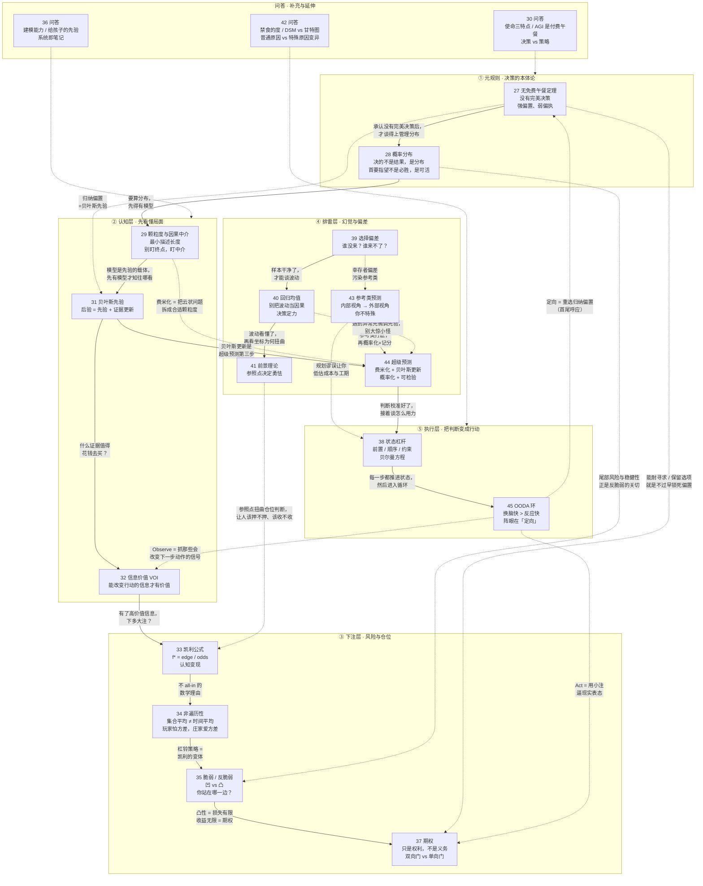

# E03 模块二：决策与判断（第 027～045 讲）

> 来源：《现代思维工具课》模块二「决策与判断」
> 涵盖：027无免费午餐定理、028概率分布、029颗粒度和因果中介、030问答、031贝叶斯先验、032信息价值、033凯利公式、034非遍历性、035脆弱和反脆弱、036问答、037期权、038状态杠杆、039选择偏差、040回归均值、041前景理论、042问答、043参考类、044超级预测、045OODA 环

第 027 讲开篇明言：「这一讲我们进入第二个板块，决策与判断」；第 045 讲开篇亦点明这是「这个板块的最后一讲」。所以 027～045 这十九讲构成一个完整模块——回答「在一个根本无法被算尽的世界里，一个人该如何设定立场、看清局面、管理风险、避开幻觉，并把判断转化为可持续修正的行动」。

本模块的整体骨架可以概括为五层：

1. **元规则**（027-028）：决策不可能客观中立，决策决的不是结果而是概率分布；
2. **认知工具**（029、031、032）：建模、更新先验、筛选真正有价值的信息；
3. **下注与风险**（033-035、037）：凯利仓位、非遍历性、脆弱/反脆弱、期权；
4. **排雷与纠偏**（039-041、043-044）：选择偏差、回归均值、前景理论、参考类、超级预测；
5. **落地执行**（038、045）：状态杠杆决定「怎么用力」，OODA 环决定「怎么循环迭代」。

---

## 一、逐讲重点摘要

### 027 无免费午餐定理：诸行无常，有偏置才有决策（模块开篇）

- 「无免费午餐定理（No Free Lunch Theorem, 1997, Wolpert & Macready）」：把所有可能问题平均起来看，任何两个算法的表现都一样。你想在一个领域比别的算法好，就必然在另一个领域比它差——AlphaGo 之所以下棋厉害，是因为它偏科。**你必须为优化付出代价。**
- 因此机器学习必须先有「归纳偏置（Inductive Bias）」——先盲目相信点什么（先验），才能从有限经验中学习（CNN 相信局部特征可组合、RNN 相信前后词有时间关联）。**你必须先押注结构，才能找到结构。**
- 推论到人生：决策的初心一定是一个「任性」。「我要去广州工作赚钱」不是决策，是「发愿」——发愿把搜索空间圈起来、把目标函数定下来，之后才谈得上决策。德里达：「一个决断如果没有穿过无可决断之折磨，那它将不可能是一个自由的决断。」
- 决策的元认知心法三步：① **强先验**（设定偏置，来源是价值观 + 你对世界的基本假设）；② **算法搜索**（这一步必须极度理性客观，尊重硬条件）；③ **系统化冒险**。核心分野是「强偏置、弱偏执」——偏置是剑，偏执是枷锁；老百姓要么无偏置（优柔寡断），要么全偏执（一条道走到黑）。
- 万维钢的终极提法：**「什么都不做才是最完美、最没有偏见的状态。偏见是你生命力的证明。」** AGI 时代人的核心价值就在于设定偏置。

### 028 概率分布：到底什么是决策？

- 以「赤马红羊劫」的采样验证开场：34 组赤马红羊年落在重大动荡期的比例是 38%，而随机抽取 34 组连续两年的比例约 37%——**看事情不能只看单个结果，要看统计。**
- 用结果评价决策的好坏叫「结果偏误（Outcome Bias）」，安妮·杜克称之为「结果论（Resulting）」：生活更像扑克而非国际象棋，你的结果往往由抓到的牌决定，而不是由打法决定。
- **决策决的不是单次结果，而是一个「概率分布」**；你真正能决定的是过程，或者更严格说——你决定的是**放弃**哪些东西。Decision 词根 decidere 意为「切断/杀掉」：决策是对平行宇宙剪枝，是一个暴力行为，所以它才让人难受。
- 一个决策至少要看六个参数：均值（数学期望）、方差、上限和下限、偏度、峰度（是否重尾）、稳健性。**决策的首要指望不是「必胜」，而是「可活」**（孙子「先为不可胜」、芒格「我只想知道我会死在哪里」、塔勒布「别因为河平均四英尺深就涉水」、索罗斯「关键是对错之间的不对称性」）。
- 斯科特·亚当斯：长期做事不该追求具体目标，而应追求「系统」——系统的概率分布越来越好，个例成功就是自然而然的。三道演练题（手术 vs 保守治疗看年龄、大厂 vs 创业看个人方差承受力、买不买保险看能否承担损失）都指向同一个原则：**很多时候决策看的不是最好有多好，而是最坏能有多坏。**
- 气质结论：高水平决策者如同斯多葛主义的射箭手——尽全力拉弓瞄准（可控的过程），箭离弦后保持冷静的漠然（风向与噪声的抽样）。

### 029 颗粒度和因果中介：用模型思考

- 破题案例：「癌症是气出来的」是伪科学（ACS/NCI 及多项十万人级研究显示压力与癌症无直接关联），但压力可以有**间接**关系。要操控一个事物，你必须在头脑中建立它的「模型」。
- 「好调节器定理（Good Regulator Theorem, 1970, Conant & Ashby）」：**系统的每一个好调节器，都必须是该系统的一个模型。**从数学上证明你的认知结构必须同构于你想控制的事物——**你能理解到什么程度，才能控制到什么程度。**
- 好模型的第一个要求：**颗粒度（Granularity）恰到好处**。信息论把奥卡姆剃刀变成了可计算准则——「最小描述长度（MDL）」：最好的模型使「模型本身的复杂度 + 例外补丁的长度」之和最小。太长是过拟合，太短是欠拟合。「为什么最近股市在跌？」高手的答案是一句「流动性收紧导致风险资产重估」。**理解即压缩（Understanding is Compression）。**
- 好模型的第二个要求：**包含因果关系**。采用珀尔《为什么》的洞见：不追求哲学上的绝对因果，而问「我做什么能**干预**它」（do-operator）。
- 核心洞见：**别盯终点，盯中介。**「生气 → 不良生活习惯 → 癌症」比「生气 → 癌症」精确得多，找到中介才抓得住控制点。经典案例：《点球成金》比利·比恩发现「（击球+选球眼光）→ 上垒 → 得分 → 赢球」，上垒是被忽视的关键中介；现代足球的对应物不是助攻，而是倒数第二、三脚传球——那个提升「期望威胁（Expected Threat）」、改变场上概率结构的动作。
- 应用：买手机（先想清用途只看几个关键变量）、学习（时间+注意力 → 记忆编码 → 提取 → 成绩，先定位是哪一环）、公司管理（只盯收入是欠拟合，全盯日报是过拟合，要找一两个最关键中介干预）。格言：**「地图不是疆域」，但没有地图你连路都上不了。**

### 030 问答：没有机缘得到使命召唤怎么办？

对 023（场域）、026（共鸣）、027（无免费午餐定理）、028（概率分布）的补充：

- **体制内如何自处**：中国基层官员两千年的解法是老庄（王夫之「其上申韩者，其下必佛老」；秦晖「在上者指鹿为马，在下者难得糊涂」）；理想主义者可参考哈维尔《无权者的权力》的「平行的生活」（对外妥协但不美化妥协，对自己和少数可信的人保持真实）；生存层面则做司马迁笔下的「循吏」——不站队、不折腾、以法理常情教化和稳定社会预期为基础。**酷吏眼中只有皇上，循吏遵从的是法理和常情。**
- **好的人生使命有三个特点**：① 不能是一个具体目标（目标有强烈偶然性，使命必须你单方面就能参与）；② 应该超越自我、有点宏大；③ 必须是你确实能使上劲儿的（否则你只是场边鼓掌的球迷）。使命比职业高一层，最好是「通用但能具体操作、随时可开始却永远干不完」的事业——做探索者/解释者、做建设者（builder）、做照料者/守护者。总纲：**把自己视为一个秩序输出者。**
- **AGI 并未违反无免费午餐定理**：AGI 有偏置（预训练语料是人写的世界、RLHF 迎合主流人群），训练中把某些能力抬上去就得把另一些压下去，这叫「对齐税」——**AGI 是付费午餐**。未来大概率是多模型分工 + 调度层，这不违反 NFL。ASI 则应追求人所不擅长的高度专业化思考（如 AlphaFold）。
- **决策 vs 策略**：决策是针对一个动作「做还是不做」（选择判断问题，通用）；策略是「你怎么做」（预先的计划安排，与领域强相关）。以及重申：**只要你决策，一定先有一个发愿。**

### 031 贝叶斯先验：判断是主观的，但可以更科学一点

- 「先验（prior）」就是你的成见——但**成见是认知的起点**，而且这个起点可以被量化、被更新、被审计。老百姓说「看法」，学者说「先验」。
- 贝叶斯公式白话版：**后验 = 先验 + 证据更新**。罕见病例题（发病率 0.1%，检测准确度 99%）的后验只有 1/11——**如果先验原本很低，哪怕证据很强，把先验提高一百倍，后验也还是不高。**这就是贝叶斯主义者的气度。
- 频率主义 vs 贝叶斯主义：前者认为概率是事物的客观属性（世界的旁观者），后者认为**概率是信念的度量（degree of belief）**，是对你无知程度的量化（世界的参与者）。人生大事根本没有重复机会，谈频率很荒唐。
- 实操心法：**把已知频率/世人普遍信念/科学知识当成先验的出发点，再用具体信息作为证据更新它**——这样就把普遍概率给具体化了（贝叶斯垃圾邮件过滤器就是这么做的：初始先验 20%，看见 "free" 上调、看见 "meeting" 下调）。**这样程序就不是在瞎猜，而是在记账。**
- 现代 LLM 就是一个巨型贝叶斯预测机：训练是把世界的先验嵌入参数，提示词是输入观测证据迫使它更新后验，「对齐」就是给模型一个不易被提示词推翻的强先验。**我们每个人，不都是行走的大语言模型吗？**（过往经历、教育、原生家庭就是我们的预训练数据。）
- 与「自由能原理」连接：证据与先验不符时，除了更新先验（知觉推断），还可以改变环境（主动推断）——但你必须做点什么，不能无动于衷。凯恩斯：「当事实改变时，我改变我的想法。先生，你呢？」
- 两种典型错误：① **完全没有先验**（听风就是雨不是谦逊，而是做人的不可预期）；② **先验不可动摇**（把概率设成 0 或 1）。「克伦威尔法则（Cromwell's Rule）」：真正的贝叶斯主义者永远不会把概率设为 0 或 1——「我恳求你们，想一想你们可能错了。」

### 032 信息价值：怎样区分沙子和金子

- 「信息价值（Value of Information, VOI）」理论（Howard, 1966）对价值的定义极其严格：**只有当一条信息能够改变你的实际行动时，它才有价值。**VOI = 有这条信息时你能做出的最佳选择，比没它时的最佳选择，平均能多赚多少。
- 石油勘探经典案例：打井成本 1000 万、有油值 5000 万、有油概率 20%——不看报告的期望收益是 0，看了报告后期望价值是 800 万，那么这份地震波扫描报告的 VOI 就是 800 万美元。对比之下，**你昨晚看的那篇《万字长文解析 AI 革命》，VOI 也许等于 0。没有决策对象的信息，其价值接近于零。**
- FOMO 的本质不是缺信息，而是**决策没有落地**——那些整天消费信息却不用它做出实质决策的人，处在 WOOP 所说的「漂流」状态（夜晚千条路，白天磨豆腐）。**人们常把消费信息等同于行动，但这完全是两回事。**
- 高价值信息的三个特点：① **目标导向**（且往往是本地的、专门对你的，而不是热搜新闻）；② **带有痛感**（真正有价值的信息一定不符合你原有认知模型，会改变你的先验，因而让你不舒服；对抗确认偏误）；③ **出现在「决策边界」上**（你正好在两个选项之间摇摆时，一条让天平倾斜的信息才是高 VOI）。
- 实战例子：Polymarket 上的博士生发现亚洲博彩市场的赔率更新比 Polymarket 早两三个小时，用跟单机器人套利，两个月三千次下注获利近三百万美元。**高 VOI 不是赔率本身，而是两个市场之间的赔率差异**——没有人会专门写出来告诉你，而且稍纵即逝。
- 进阶概念：**EVPI**（完全信息期望价值，上帝视角，如地震波扫描、二手车专业检测）与 **EVSI**（样本信息期望价值，通过实验/抽样/干预获取的部分信息，如临床试验、A/B 测试、MVP）。同时注意信息有强烈的边际效用递减，**调研适可而止也是一种技能**。
- 各角色的高 VOI 清单：职场员工高估行业宏观趋势（该关心的是公司这个场域的奖励函数、工作流的卡点）；学生高估升学名校信息（该关心自己的薄弱点）；科研人员高估国家大事和江湖八卦（该关心细分领域的热门问题、自己实验为什么做不出来、仪器底噪是多少）；老板高估「第二曲线」「颠覆式创新」（该关心最好的销售为什么离职、供应链为什么总拖两天）。**高 VOI 信息往往细碎、不耀眼、甚至无聊，绝不会出现在媒体头条。**

### 033 凯利公式：乘法世界里的认知变现

- 「凯利公式（Kelly criterion）」1956 年出自贝尔实验室的约翰·凯利，原本研究的是有噪声电话线传递赛马内幕消息该如何下注。结论极其优美：最佳下注比例 f\* 之下，**资金的最大长期对数增长率在数学上完全等同于这条电话线的「信息传输率」**——**你的增长上限，受限于你的认知带宽。**
- 公式白话：f\* = edge / odds。**odds（赔率）是市场给的、体现市场对风险的共识；真正该让你动心的是分子 edge = bp − q，那是你的认知优势**，是你对局面的估计与市场一般判断之间的偏差。**凯利公式让你赚的，是你超出大众认知的钱——你比大众高明多少，凯利就能帮你赚到多少，但不能更多。**如果 edge ≤ 0，凯利就要求你别下注。
- 「押太大和不敢押都是错的。这不是信息问题，这是仓位问题。」曹操评袁绍：「色厉胆薄，好谋无断；干大事而惜身，见小利而忘命」——建安五年田丰建议袭许都，那是巨大的 edge，袁绍却因幼子生病而放弃。**如果 edge 好，出手是一种义务。**
- 跨界之美：单细胞生物的「表型赌注对冲（Phenotypic Bet-Hedging）」——沙门氏菌、枯草芽孢杆菌会让一部分个体休眠、其余出来繁殖，**研究发现休眠细胞的比例在数学上等价于凯利公式中的未下注比例**。也许生物多样性就是系统为应对不确定性而支付的凯利仓位。
- 三个底层指引：① **别把自己清零**（p 不等于 1 就不该 all-in，还得为估计误差留余地）；② **认知先行**（先问 edge 再想仓位；**我们是把认知变现，不是用认知去解释变现**）；③ **追求复利，而不是赢一把**。
- 生活应用：职业规划（先问 edge，再看 odds，最后用「半凯利/分数凯利」先做副业试水）；精力与健康（价值只是赔率，不等于 edge）；时间管理（最重要的凯利策略是「少出手」，把仓位集中到能产生复利的少数变量上）；人际关系（小注起步→表现好逐步加仓→永远保留止损机制，绝不交出能让你瞬间破产的权限）。
- 关于勇敢的重新定义：**「不被暂时的输赢所左右，能够清醒地按照凯利公式出手，才是真正的勇敢。勇敢是对本能的克服。」人生的根本自由是你始终有下一次下注的能力。**

### 034 非遍历性：玩家怕方差，庄家爱方差

- 万维钢自述 2013 年买过 16 个比特币却没拿住的经历，点出一个反鸡汤：**积累复利不是你懂道理就行。阻碍你积累复利的因素只有两个：一个是最初的本钱，一个是方差。**
- 掷硬币思想实验：正面 +50%、反面 −40%，单次期望 +5%，但一正一反后财富变成 0.9 倍，玩 100 把后 100 万变成不到 1 万。那 +5% 是十万人的「**集合平均（ensemble average）**」，由极少数运气超好的人贡献；而你作为个体经历的是「**时间平均（time average）**」，即几何平均。个体沿时间线走下去，几次连亏就会撞上「吸收壁（absorbing barrier）」。
- 定义：**集合平均 = 个体时间平均的系统具备「遍历性」；整体期望值不能代表个体长期命运的系统就是「非遍历性」。**城市通勤是遍历的（平均通勤时间对你有意义），投资是非遍历的（你没必要跟马斯克一起算平均财富）。**数学期望值是上帝视角的平均；时间平均才是凡人视角的命运。**
- 现实解释力：散户跑不赢大盘，真正的机制不是心态或技术，而是数学——**大盘指数是一个集合，享受集合平均，还有定期剔除垃圾股的机制；散户手里只有几只股票，经历的是时间平均。**
- 四个应对策略：
  1. **减少交易次数**（Barber & Odean 分析六万多个散户账户：交易越频繁收益越低；忘了密码再没看过账户的人平均收益最好。「看准了就赌定，用时间磨平剧烈的方差，是穷人的生存智慧」）；
  2. **杠铃策略（barbell strategy）**（90% 极低风险 + 10% 激进高风险，忽略中等风险；本质是凯利公式的变体——代入掷硬币游戏 p=0.5、b=1.25，凯利算出的 f\* 正好是 10%；Ole Peters 2011 年证明每把按凯利下注可以**打败非遍历性**）；
  3. **成为庄家**（VC 分散投资几十上百家，不怕个别项目死亡反而**渴望极端方差**；青训学校希望方差越大越好，而球员家长希望方差越小越好。普通人可用定投指数基金选择跟庄家站在一起）；
  4. **风险共担（Risk Pooling）**（保险的本质；有限责任公司制度的伟大之处；家庭、宗族、互助网络都可理解为用合作把世界「强行遍历化」）。
- 制度层面的吐槽：因为非遍历性风险的高度不对称，**成熟社会都是尽量保护个体、让机构去承担风险**（如交房后才开始还贷、可申请个人破产），而不是把风险下移给老百姓。

### 035 脆弱和反脆弱：怎样利用非对称风险

- 破题：**「有时候你越安稳就越危险，越折腾反而越安全。关键不在于有没有风险，而在于你面对的是什么样的风险。」**
- 「脆弱（Fragile）」的东西不喜欢波动。防御脆弱有两条消极路径：**鲁棒性（Robustness）**（更耐摔）和**韧性（Resilience）**（能复原），二者都要留冗余、都有成本（巴菲特的「安全边际」）。「反脆弱（Antifragile）」则是越折腾越好（九头蛇 Hydra；小创业公司被苹果起诉反而是荣幸，因为它上了新闻）。
- 数学定义：脆弱 = **凹函数（concave, ∩）**，收益有天花板、损失像无底洞；反脆弱 = **凸函数（convex, ∪）**，损失极有限、收益无上限。依据是「詹森不等式（Jensen's Inequality）」——**对于凸函数系统，波动状态下的平均收益必定大于平均状态下的收益。**注意脆弱/反脆弱都是**局部**现象（少量喝酒可能反脆弱，过量就是脆弱）。
- 应对脆弱的两个积极策略（结构性排雷而非扩大冗余）：① **「拆弹」/否定法（Via Negativa）**——直接做减法（剔除有毒关系、拒绝高杠杆、砍掉冗余审批、别熬夜突击）；② **分拆压力/「毁灭隔离（Isolation of Ruin）」**——用允许经常发生小失败来避免一次性大失败（森林小火灾对森林健康有好处；明斯基「稳定孕育不稳定」，长期稳定会让参与者加杠杆最终导致「明斯基时刻」）。**要想宏观安全，你必须允许微观不安全。**
- 践行反脆弱的两个策略：① **见到反脆弱机会就下注**（杠铃策略；给行业大佬发求合作邮件最坏就是被拒；用业余时间搞一个「秘密项目」）；② **主动注入不确定性**——「毒物兴奋效应（Hormesis）」（Calabrese, 2003）证明低剂量刺激会激活过度补偿和修复机制：HIIT、冷水浴、桑拿、间歇性断食、打疫苗都是这个道理。**身体是一个天生的反脆弱系统。**商业案例：奈飞的「混乱猴子（Chaos Monkey）」在最繁忙时段随机搞垮自己的服务器，结果 AWS 史诗级宕机时奈飞照常运行。
- 暗黑真相：**脆弱和反脆弱往往不是事物的绝对属性，而取决于你站在哪一边。**私募 LP 脆弱 / GP 反脆弱；运动员脆弱 / 青训教练反脆弱；创业者脆弱 / VC 反脆弱；购房者脆弱 / 开发商反脆弱……这就是「非对称风险」。塔勒布主张「利益攸关（Skin in the Game）」：**世界上最便宜的勇敢是让别人替你破产；健康生态不应允许「上行收益归你，下行风险归我」的流氓逻辑。**
- 近乎免费的反脆弱清单：职场不做单点依赖的螺丝钉、健康保持可恢复的微压力、社交参加带随机性的聚会、学习多做小测验用小失败避免大失败、让孩子去户外玩耍。**结论：稳定是一种幻觉。你要么是脆弱，要么是反脆弱，而你不可能只要反脆弱不要脆弱。**

### 036 问答：怎样培养自己找到最佳模型的能力？

对 029（模型）、031（贝叶斯先验）、032（信息价值）、033（凯利公式）、034（非遍历性）的补充：

- **如何培养建模能力**：推荐佩奇《模型思考者》、珀尔《为什么》、舒斯特《系统思维的艺术》、梅多斯《系统思维入门》。但**用模型思考不是看几本书掌握通用方法就行，它需要你分析过并且记住一些模型——脑子里有料，看见事情才有思路。**最重要的教训：**世界上不存在客观的建模**，你必须先**想象**出一个中间变量，才能用统计方法去检验它；数据不会自动告诉你因果关系（这完全符合自由能原理和贝叶斯主义）。
- **给孩子什么先验**：安全依恋、自主性、心智理论，以及**不要灌输匮乏的思维模式**（男孩穷养、没苦硬吃）。「原始世界信念」研究的三个维度：世界安全还是危险、精彩还是无趣、活的还是机械运作的。附 GPT-5.5 列出的「五岁孩子二十条好先验」（错误是信息不是羞耻、能力可以长出来、事实比面子重要、我有选择但选择有后果、注意力很宝贵、好奇心比表现更重要……）——**但是成年人，难道不也应该学一学这二十条吗？**
- **如何把加法游戏变成乘法游戏**：建立可成长的系统，而**一个人有没有系统，最明显的区分就是看他有没有一套笔记**。万维钢 2010 年就在 Evernote 开了「写作心得」笔记本，做了一个类似给 AI 智能体写的 Skill.md 的动态文档《文章应该如何写成》，如今已有 247 条笔记。**你得让进度可见、留下痕迹、随时总结经验教训。**
- **edge 到底是什么**：你是否知道别人不知道的？是否会别人不会的？是否拥有别人没有的？——**而不能只是你比别人更勤奋、更聪明或意愿更强。**
- **为什么股市非遍历、通勤遍历**：根本原因是**每一次风险经历会不会改变你**。做乘法使你的整体发生改变；做加法只改变一小部分。每月定投固定比例工资，对你就是遍历的（没风险，但也永远做不大）；**只有非遍历性游戏才能提供从量变到质变的成长性**，代价是有清零风险——凯利公式的价值正是在两者之间找最优点。

### 037 期权：保留可选项的特权

- 老张租商铺的故事：多付 20% 租金换来「一年后有权以锁定价续租四年、不续租也无违约金」——**如果局面你拿不准，有些事最好不要过早锁定（commit），你可以给自己留一张期权。期权就是你的一个可选项：它只是权利，不是义务。**
- 但**不是所有「留着以后再说」都叫期权**。麦格拉思（Rita Gunther McGrath, 2004）的两个条件：① 未来存在多个可能路径；② **你对其中某个结果拥有专有进入权**。**期权的价值不在于自由，而在于它给你一种稀缺的特权**——别人被挡在门外，只有你有资格进场，而你还可以选择不进场。
- 四种日常期权形态：
  - **实验 / MVP / 敏捷开发 = 看涨期权**。传统「瀑布式开发」是先锁定再祈祷；「敏捷开发」把决策推迟到每一轮的「最后负责时刻（last responsible moment）」，是先学习再锁定。**试错并不贵，最贵的是在无知时重仓；实验不是为了证明你对，而是为了便宜地发现你错。**
  - **优先受让权（Right of First Refusal）= 看涨期权**（投资人小额入股换取优先收购权；作家艺术家的下一部作品条款；租客的优先购买权）。
  - **BATNA（谈判破裂时的最佳替代方案）= 看跌期权**。**没有 BATNA 的谈判不叫谈判，叫求情。**有 BATNA 要让对方感受到你有退路但不暴露细节（说「我在同步评估几个选择」，而不是报出具体 offer 数字）；哈佛谈判项目的忠告是**不要虚张声势**。
  - **对赌协议（contingent contract）**：把一方的权利变成另一方的义务，适用于双方对未来看法分歧很大的局面——**我们的观点不必今天就达成一致，但我们仍然可以合作，各自为自己的判断下注。**
- 与 008「能耐寻求定理」呼应：**涨能耐就是获得更多期权。**极端例子：日本的「核潜伏（nuclear latency）」——保持「我随时能造但今天就是没造」的状态，既享受威慑又保留外交回旋余地。**模糊也是一种态度。有选项你就有杠杆。走到门口，和迈进去，不是一回事。**
- 贝佐斯 2015 年股东信的「双向门 vs 单向门」：可逆的决策要快过（等于买期权，应允许基层快速试错），不可逆的决策必须三思，且一旦 commit 就不要天天回头看那个门。人们发明了很多把单向门变成双向门的办法（结婚前恋爱、长约前实习、大宗消费前试用）。
- **反面警告：期权不是越多越好，很多期权有持有成本而且会过期**——市场波动性越大期权价值越高，到期时间越短期权价值越低。有些人只谈恋爱不结婚、拿了一个学位又一个学位，「想做个永远不坍缩的波函数」，殊不知期权已经过期了。反过来，如果一个结果你无论如何都不能接受，就该主动砍掉选项、「破釜沉舟」以使承诺可信。
- 最后的分辨：**人们常常分不清「期权价值」和「实际价值」——聪明只是一种期权**，若不能与执行力、情绪稳定、协作能力结合并转化为真实交付和信用，这张期权就无法兑现。而良好的社会关系本身就是实际价值（**熟人是看跌期权，陌生人是看涨期权**，两种都该维护）。

### 038 状态杠杆：你不是不努力，你是没做在点子上

- 万维钢自创名词「状态杠杆（state leverage）」：**这一步做完之后，世界会不会变得对下一步更友好。**破题：**努力更像一个标量，只有强弱；行动则至少同时有方向、时机和先后次序。**两个生活直觉——排骨买回来就切好分装（把劳动前置到低摩擦状态）；扫塔应该从上往下扫（**从下往上扫，你创造的临时干净会被后面的动作推翻；只有从上往下扫，你创造的才是不可逆进展**）。
- **三种杠杆**：
  1. **前置杠杆（Preventive Leverage）**：NASA 的观察——设计阶段只花 15% 的预算，却锁定了约 75% 的生命周期成本；NIST 2002 年报告估算，缺陷发现得越晚修复成本越高，改进测试基础设施每年可避免超过 220 亿美元损失。**设计看似便宜，其实是全项目最贵的地方。**傅以斌的经验：「慢慢谋定，快速行动」。
  2. **顺序杠杆（Sequencing Leverage）**：任务之间存在信息依赖（装修必须先方案、再水电、再泥木、再刷墙、最后地板）。复杂项目不是待办清单而是**依赖网络**，工具是「设计结构矩阵（Design Structure Matrix, DSM）」——把谁依赖谁画成方阵，找出强耦合和返工回路，重排顺序让信息尽可能单向流动。福特引擎盖案例：造型改一笔 → 结构返工 → 制造重评估 → 安全测试假设失效。**你要让所有人同时开工，那就是在互相制造废品。工作与工作是不平等的。**
  3. **约束杠杆**：高德拉特的「约束理论（TOC）」——**任何系统的产出都受制于最窄的瓶颈**。营销 100 / 销售 50 / 交付 10，瓶颈是交付，此时搞「全员狼性培训」把前端翻倍毫无意义。五步法：识别瓶颈 → 充分利用瓶颈 → 让其他环节服从瓶颈节拍 → 提升瓶颈 → 回到第一步找新瓶颈。综述数据：抓住瓶颈后 lead time 缩短 69%、cycle time 缩短 66%、准时交付率提升 60%、库存下降 50%、吞吐量增加 68%、财务表现提升 82%。**情感难点：如果你不在瓶颈上，你其实没必要干得那么忙——可是老板们却是看谁闲就催谁。**
- **底层数学灵魂**：贝尔曼 1954 年的「动态规划」。绝大多数人干活是在跑局部「贪心算法」（排骨直接扔冰箱），一系列局部最优拼接出全局糟糕结果。贝尔曼方程：**你的总收益 = 眼前的即时回报 + 你即将进入的下一个状态的潜在价值。**动作的目的不只在当下，更在于完成一次「状态转移」——就像职业台球选手不仅要打进当前球，还要让白球停在最完美的位置。「最优性原理」的白话版：**不管你过去多烂，你当下的决策必须能让你在新状态下面对未来时拥有最好的出路。**
- 日常应用：前置杠杆 = 厨房的 "Mise en place"（一切就位，点火后行云流水）；写作前先把数据、文献、大纲全部备齐再进入纯输出状态。顺序杠杆 = 遏制先干那些「看起来像进展」的事的冲动（主题没想好就在调 PPT 皮肤）。瓶颈杠杆 = **不要「到处努力」，而要「只在命门上用力」**——你今天效率低不是意志力薄弱，是昨晚睡眠不足；公司推进慢不是执行力问题，是只有老板一个人有拍板权，他的决策带宽锁死了总吞吐量。
- 收束：**「一个叫积累，一个叫耗费；一个越做越顺，一个越做越堵；一个是在生利息，一个是在交罚息。你是在完成任务，还是在制造一个更好的未来状态？」**

### 039 选择偏差：就算无人说谎，你看到的也不是真实世界

- 破题「今不如昔」的乡愁幻觉：八十年代初城镇化率只有 20%、1990 年高等教育毛入学率才 3%，今天分别是 67% 和 60%+。**中国文化不是降级了，而是扩容了**——原本沉默的人上网了，成了收视主体和广告目标。**你的印象不是由全体样本决定，而是由「上桌样本」决定。**
- 定义：**选择偏差就是进入你视野的样本，并不等概率代表真实世界。**你以为在观察整个大海，其实只是在看渔网捞上来的鱼；你站在急诊室门口看一天，会得出「这座城市的人都在流血」的结论——每一幕都是真的，但你的世界观是假的。
- **四大类**：
  1. **自我选择偏差（Self-selection Bias）**：来参加的人都是自己**想要**来的。典型是「朋友圈悖论」（朋友圈是人生高光集锦，不是生活的随机切片；研究显示越频繁用 Facebook 越觉得别人更幸福，把社媒限制在每天 30 分钟内可显著减少孤独与抑郁）；网络评论的「J 型分布」（五星吹爆+一星痛骂，中间极少，因为「还行吧」没有发言动力，还叠加了购买偏差）；新闻只报道极其罕见极其恶劣的事件。**社交媒体不是生活，评论区不是民意，热搜不是人间。**
  2. **幸存者偏差（Survivorship Bias）**：没来的人不是没兴趣，而是根本来不了。**商业世界最致命的认知陷阱，因为它会帮你总结错误的成功经验**（辍学 + 孤注一掷 = 成功？真实数据是增长最快公司的创始人平均年龄是 45 岁，靠的是行业经验而非叛逆）。基金业绩（清盘、合并、死掉的基金没机会站在你面前，真实业绩必被系统性高估）；偏方与健身法（没效果的人早就离场）；「健康工人幸存效应」（不健康的人根本承受不住重体力劳动，早被淘汰）；怀旧（记忆只留高光，以前的麻烦都已解决而现在的还没有——**不是时代退步了，而是时间替过去做过一轮筛选**）。
  3. **分组选拔偏差（Sorting Bias）**：问题出在一开始就不是随机分组。最刺痛中产的例子是**名校效应**——Dale & Krueger 比较「同样有能力上名校，但有的去了有的没去」的学生，发现名校并未带来明显更高收入，长期看缩水到接近于零（只有出身弱势家庭的学生才明显受益）。**名校更像筛选器，而不是炼丹炉。**补课、素质教育同理。
  4. **门槛偏差 / 伯克森悖论（Berkson's Paradox）**：你看到的都是跨过某个门槛之后的样本。「帅的男人都是渣男」「业务强的人情商低」不是老天讲公平——**两个原本不相关的变量，一旦设定一个总分门槛只看越过门槛的样本，就会显得负相关**（因为两项都高的是极少数，两项都低的进不来）。**相亲不是人口普查，招聘不是社会抽样，门槛会制造对立，筛子会伪造规律。**
- 实操心法：**听说任何故事，先问四句话——谁没来？谁来不了？分组是随机的吗？这里有没有门槛？**并且：**去追踪那些没有出现的人**，他们虽然退出了游戏，但他们可以贡献知识。「灯下看人皆匆忙，瀑前观水势奔狂。若问世间真面目，先寻沉默与退场。」

### 040 回归均值：不要大惊小怪，要有点定力

- 卡尼曼给以色列空军培训的经典故事：老教官坚称表扬后学员表现变差、痛骂后表现变好。**那不是管理学，那是统计学——那不叫批评有效，那叫「回归均值（Regression to the Mean）」。**
- 与上一讲的分工：**选择偏差是你因为数据没看全而总结了错误的因果；回归均值则是你把数据的正常波动当成了因果。**
- 高尔顿 1886 年从身高遗传中发现此现象，其逻辑是：**你的观测结果 = 事物的真实水平 + 随机运气。**极好的表现意味着实力 + 极好的运气，而极好运气很难重现，所以下一次自然回落。**根本没有什么力量在拽你，那只是正常的随机波动。**
- 卡尼曼与特沃斯基总结的两种典型错误，统称「回归谬误（Regression Fallacy）」：**一个是错把波动当因果，一个是错把运气当实力。**案例：登上顶峰的明星 CEO 之后三年业绩明显回落（董事会说他「飘了」）；新秀墙/二年级魔咒；慢性疼痛在最低谷时用任何疗法都容易见效（**这是现代医药判断疗效的严重困扰因素**）；球队成绩差换教练必见效；皇上下罪己诏后天灾果然不再。
- **管理学是回归谬误的重灾区**：部门业绩谷底换主管后反弹（**把一只猴子放在主管位置上，下个月也会反弹**）；小布什「不让一个孩子掉队」政策——垫底学校成绩普遍提高的同时，原本最好的学校成绩反而下滑。**我们给救火队员掌声，却不给防火工程师奖金。**
- **戴明的「漏斗实验（Funnel Experiment）」**——管理学里最漂亮的寓言，四种规则：
  - 规则一：**什么都不动**（相信漏斗已对准靶心，波动是随机现象）——**这是有定力的管理，方差最小**；
  - 规则二：基于偏差**从上一次漏斗位置**做反向补偿（顾客说咸了就少放盐，改来改去）——**方差扩大一倍**；
  - 规则三：参照**桌上靶心**做反向补偿（管理者认为是自己指挥不力，运动式治理、打价格战）——**系统被左右抽打，振荡越来越厉害**；
  - 规则四：上一颗球落哪儿就把漏斗挪到哪儿（没标准也不看反馈，师傅带徒弟口耳相传）——**越走越偏**。
  - 现实案例：福特与马自达用同一套图纸生产变速箱，福特（规则二，稍偏离目标就调机床）的公差反而比马自达（规则一，先调好机床然后不追着乱调）大很多。**过于勤勉的纠偏等于是给系统注入额外波动。眼里不揉沙子见到毛病就改，可不是好管理。**
- 震惊的发现：**著名的「邓宁—克鲁格效应」在相当程度上其实是回归均值导致的**——现场测试分数含运气成分，而自我评价接近平时均值，于是低分者「高估自己」、高分者「低估自己」纯属统计效应（2020 年以来学界的质疑；也有人认为效应仍真实存在但没那么严重）。**要点是：想要从观测中获得一点真知，是非常困难的。**
- 四个自检问题：① 我是不是因为一个极端值才开始注意这件事？② 我看到的是一个点，还是多期数据？③ 如果我什么都不做，它会不会自己缓回来一点？④ 系统的生成机制有没有真的改变？最稳妥的办法是**用贝叶斯公式每次稍稍更新先验**。
- 核心教训是**决策定力**：「一时高，不必封神；一时低，不必诛心。……识得均值回归路，方知遇事缓三分。」**飘风不终朝骤雨不终日，极端不是常态，有见识的人不会事事都管。**

### 041 前景理论：让人铤而走险的不是贪婪，而是不甘

- 卡尼曼与特沃斯基 1979 年的「前景理论（Prospect Theory）」（也是诺奖成果）：传统经济学认为人看「预期效用」和最终财富值，但前景理论说，**人决定做不做一件事，是看相对于心里那个「参照点（Reference Point）」，我是赚还是亏。**
- 参照点两侧是一条非对称的 S 型曲线：收益区缓慢上升，损失区快速下降——**同样 100 块，损失的痛苦大约是获得快乐的两倍**，这就是「损失厌恶」。推论：**站在参照点右侧（对现状满意）你就不想冒险；站在左侧（现状不及预期）你的冒险意愿反而大增**——这就是「光脚不怕穿鞋的」「哀兵必胜」「把包袱甩给对方」。**人不是为贪婪而疯狂，而是为不认输而疯狂。**
- 用参照点统一解释的四大偏误：
  1. **损失厌恶**（宁愿被套牢十几年也不认亏；20 元运费很心疼但「包邮 + 涨价 20 元」大家都接受）；
  2. **现状偏见（Status Quo Bias）**（不跳槽、不换套餐、不取消自动续费——「你说这叫稳定压倒一切，其实你只是习惯了」）；
  3. **禀赋效应（Endowment Effect）**（杯子实验：没得到的人最多出价 3 美元，得到的人给 7 美元都不卖。**卖家卖的是跟了我这么多年的老伙计，买家买的是一辆旧车**）；
  4. **框架效应（Framing Effect）**（「亚洲疾病问题」：数学上完全等价的两种表述，「确定救活 200 人」让 72% 的人保守，「确定死 400 人」让 78% 的人冒险；医疗研究中「一个月存活率 90%」vs「死亡率 10%」显著改变患者是否手术的选择。**生死攸关的重大决策，居然取决于一句话的表述方式**）。
- 真实损失案例：纽约出租车司机设定「每日目标收入」作参照点，导致下雨天（好赚）早早收工、晴天（难赚）苦熬十几小时；散户的「处置效应（disposition effect）」——买入价成为最强参照点，涨一点就锁定利润、跌了就不卖「不算亏」、暴跌反而加仓，**这就是为什么散户总是抓不住大涨，却总能全程经历大跌**；公关危机——参照点是「完美形象」所以想遮掩，而**公众会认为遮掩比错误本身更可恶**（水门、拉链门）。
- 主动管理参照点的方法：
  - **高手应该自由设置自己的参照点**（可以是长期目标或任意东西）——**它应该是激励而不应该是枷锁**；
  - **「心理账户（Mental Accounting）」**：丢了电影票很多人不再买，丢了同等现金却仍然买票——既然如此，何不主动设一个每年两千元的「风险探索账户/交学费账户」，任何意外损失都从这里扣？
  - **给别人设置参照点**：涨薪 5 万不如「2 万涨薪 + 3 万绩效奖金」（否则明年不涨就成了剥夺感）；「升米恩，斗米仇」的解法是以工代赈、把丑话说在前面降低预期、**施恩去规律化**。
- 历史级案例：北宋宣和北伐的战略灾难，根源是朝廷同时有**两个参照点**——「现实安全参照点」（宋辽和平百年，花岁币买平安）与「历史领土参照点」（燕云十六州是汉唐故土）。**两个参照点让朝廷没有清晰的目标函数：一边把国家推向冒险，一边又死死拽住不许真拼命**，结果既打不疼敌人也保不住自己。
- 总纲：**前景理论把「人是追求利益的动物」改写成了「人是守卫参照点的动物」。你的勇敢和怯懦往往不是出自品格，而是出自坐标。**只是今天游戏规则变了——**我们得把参照点从默认改为主动选择。**

### 042 问答：设计结构矩阵和甘特图的区别是什么？

对 035（反脆弱）、038（状态杠杆）、039（选择偏差）、040（回归均值）的补充：

- **禁食的反脆弱机制与「度」**：反脆弱要求是**可承受的小压力 + 能恢复 + 系统因此升级**。禁食在微观上激活压力应答与细胞自噬，宏观上完成从葡萄糖到酮体的代谢转换；**身体的再生不是发生在饿着的时候，而是发生在重新进食的时候（前者是拆迁，后者是重建）**。「你不能单纯用哲学指导健康」——证据较强的两种做法是**间歇性禁食**（每天 8–10 小时进食窗口，早餐越早越好、晚餐不晚于 6 点）与**禁食模拟饮食（FMD）**（第一天 1100 大卡、第 2–5 天各 700 大卡，每月一周期；三个周期后胰岛素抵抗下降、肝脂肪下降，生物年龄中位数据称下降 2.5 岁）。
- **DSM vs 甘特图**：DSM 把步骤同时列在矩阵的横纵坐标上，有依赖就打点——点密集在对角线附近是理想状态；边缘有很多点说明排序不合理；某几步点阵特别密集说明应作为一个模块整体管理；出现回环说明这是迭代过程而非线性流程。**DSM 负责结构（依赖关系决定步骤怎么排），甘特图负责节奏（步骤定了之后怎么排时间）——应该先画 DSM 布局，再画甘特图推进。**（附带心得：GPT-Image 2.0 特别擅长用一张 infographic 解释一件事，**infographic 是比 PPT 更好的信息表现方式**。）
- **为什么大部分人不追求真实信息**：**求真的前提是有反馈。**大部分人并不真的需要真实信息——虚假信息更能建立身份认同、更能解释生活的合理性。只有当你要求学、找工作、投资、做事、领导组织，会影响其他人生活时，才需要真实信息。「不撞南墙不回头，也得先有南墙可撞才行。」练习方法：把自己的判断说给 AI 点评；更有用的是**把对大事件的预测写下来存档，等结果出来再回看**。
- **如何分辨异常事件是波动还是趋势**：看导致事件的原因是**「普通原因变异」**（系统的正常波动，如员工那天身体不适而平时表现良好——什么都不用管）还是**「特殊原因变异」**（正常运行被异常机制打断，如员工不熟悉刚部署的新机器——必须重视）。「老板管的是公司，而不是这一群人。」

### 043 参考类：当局者迷，旁观者清，你不特殊

- 「参考类预测（Reference Class Forecasting, RCF）」表面是预测算法，**实质上是一个「反自恋装置」**——如果你认为「我很特殊」「我这次一定不一样」，你最好先用一下这个工具。
- **「规划谬误（Planning Fallacy）」**：比勒等人的研究中，学生估计毕业论文需 33.9 天，被要求给最悲观估计时说 48.6 天，实际用了 55.5 天——**现实往往比你最悲观的估计还要悲观。**傅以斌研究 258 个交通基建项目：铁路平均超支 45%、桥隧 34%、公路 20%；悉尼歌剧院预算 700 万/4 年，实际 1.02 亿/14 年。
- 规划谬误是一整套幻觉生成器的合谋：乐观偏差 + 确认偏误 + 控制错觉 + 自利归因 + 幸存者偏差 + 可得性偏差，最后由**叙事谬误**把碎片拼成一部热血电影。**你脑子里排练的是剧本，而不是真实世界。**
- **内部视角 vs 外部视角**：内部视角看的是个案信息（你的努力、你的诚意、你的资源），外部视角看的是**分布信息**——在别人眼里你只是一个受制于客观规律的统计学数据点。**旁观者未必比你聪明，但旁观者的好处是没有你那么多自恋情结：人家把你当成样本，而不是当主角。**
- 卡尼曼本人的故事：编写高中决策学教材，团队信誓旦旦说两年，教育专家给出的参考类是 7–10 年且 40% 的团队干脆放弃——卡尼曼心想「我们团队效率更高」，结果花了整整 8 年，而那时教育部已取消这门课。
- 傅以斌的三步标准化流程：① 找一个数量足够多、和你足够相似**而且已经结束**的案例组（不是你喜欢的榜样）；② 找出这个参考类的基准线（平均成本、时间、失败率）；③ 把自己放进去对比微调。**第三步最考验人——最简单的办法是直接用中位数预测自己；如果你非要说自己不一样，就必须有非常强硬的证据，不然你只是在把偏见偷偷放回来。**
- 应用战场：
  - **大型工程**：香港 2012 年把自己的 25 个道路项目与 863 个国际同类项目比较，得出在筹备论证阶段要达到 P80 把握，成本须**上调 44%**、工期须**上调 75%**。**工程界最贵的一句话，就是「我们这次能控制得住」。**
  - **企业并购**：平均而言收购方业绩不会因并购改善甚至轻微负面；CEO 总说「我们企业文化天下无敌」，于是学者用机器学习把 RCF 自动化，「从历史上找一批高度相似的并购，把结局摆出来，完了再听 CEO 解释为什么这次不会翻车」。
  - **电影票房**：2008–2012 年美国上映电影超过一半没盈利，前 10% 吃掉近 70% 票房；2023 年基于 RCF 的随机森林模型把「能否覆盖成本」的预测准确度提到 90%。
  - **核聚变**：万维钢本人是核聚变出身，明确不信十年内能商业化。Helion 的发电时间表从 2024 → 2028 一路后退；用相似高难度项目估算，聚变的上调约 118%，用国际级大型科研基础设施做参考类甚至可能达到 220%——**如果一个核聚变项目说要多少投资，你最好准备三倍以上的钱。**（连马斯克也逃不掉：FSD「明年就能实现」拖了近十年；SpaceX 原以为 1 亿美元够发射 3 次，结果三次全炸、公司濒临破产。）
- 日常用法：学新技能、周末搬家、新房装修、应届生谈薪水（**该考虑的不是你每月开销需要多少，而是参考类；招聘方早就把你这样的人研究得明明白白**）。
- 精妙的补充：**不是每个人都应该活成中位数**——但如果你的天赋、资源和方法论真的特殊到不属于当前参考类，那你也不能听内部叙事，**你属于下一个参考类**。总结：**具体做事，不妨用内部叙事给自己打气；决策，却必须用外部参考类给自己泼冷水。**

### 044 超级预测：给不确定性命名，给自己打分

- 泰特洛克用二十多年追踪 284 位专家的八万多条预测，发现专家的准确度还不如最简单的统计算法、有时连黑猩猩都不如。《专家的政治判断》借柏林的比喻分两类：**「刺猬型」专家知道一件大事**（抱着一套大理论解释世界，易陷一厢情愿）；**「狐狸型」专家知道很多小事**（接受复杂度、考虑多线索、随时修正），后者更准。
- 专家为何不准：老百姓从预测中获取情绪价值、**把预测看成站队**；专家要捍卫学说、为基本盘站台；人还会把内心脆弱带进预测（刚发生恐袭就成倍高估未来袭击概率）。**说白了，预测往往不是反映了那个事情如何，而是反映了预测者自身如何。真正的预测不是表态，是算账。**
- 缘起：2003 年伊拉克大规模杀伤性武器的情报奇耻大辱 → IARPA 2011 年举办为期四年的国家级预测锦标赛 → 泰特洛克组建的「良好判断项目（Good Judgment Project）」由程序员、药剂师、退休大妈等业余选手组成，只做了简单培训，**却以巨大优势夺冠，预测甚至比能接触机密的情报分析师更准**。
- **超级预测的基本思想只有两件事：概率化 + 可检验。**
  - **概率化三步**：① **费米化（Fermi-izing）**——把边界模糊、无法直接判定对错的「云状问题」（如「中美会不会脱钩」）拆成可操作的小问题（「未来六个月内某关税法案通过的概率是多少」）；② **用外部视角打底（参考类基础比率），用内部视角微调**；③ **贝叶斯更新**——利好从 43% 调到 46%，利空再回到 41%，**你没有听而不闻也没有听风就是雨，你非常稳健**。
  - **检验看的是你一揽子预测的长期表现，不是单道题押没押中**：一看「校准度（Calibration）」（你说 70% 的那些事，是不是真的发生了 70%）；二看「区分度（Resolution）」（**你敢不敢给出特别大或特别小的概率，别和稀泥全填 50%**）。评分标准是「布里尔分数（Brier score）」，测量预测概率与实际结果误差的平方，分数越低越准——**它让你不能随便报概率。**
  - **概率和检验构成了一个完美闭环：没有概率就没有校准，没有记分就没有学习。**
- 示范例题（「我搬去广州能幸福吗」）：把「幸福」费米化为工作、居住、婚恋、生活适应四个维度；以工作为例——「3 个月内找到月薪不低于现在 80% 的工作」，猎头数据给出 40% 的参考类基准 → 考虑核心专利与前同事内推上调到 65% → 一周后拿到两个面试再贝叶斯更新到 74%。**你的决策将不再是人格宣言，更不是豪赌。**然后别忘了事后记分复盘——研究表明**哪怕是短期训练，只要计分，就能显著提高预测水平**。
- 战绩与失败：良好判断项目在预测美联储利率上 2023–2025 连续压过市场定价；GiveWell 花钱请他们预测美国对外援助走向。失败教训是俄乌战争——2022 年 1 月 21 日至 2 月 10 日间他们把全面入侵概率一直压在 50% 以下，复盘承认**太过依赖历史参考类**（这种事很罕见）、低估了普京的冒险意愿和美国情报的准确度。
- AI 时代的分工：单独的 LLM 预测能力**不如**人类超级预测者，但**人类 + 大模型协作准确率提高 24%–28%**。人擅长界定问题边界、挑选参考类、决定忽略哪个变量；**AI 能进一步帮人把自尊从判断里剥离出去。**
- 升华：超级预测让我们看到了**社会科学的工程化**——它并没有用到太多模型，**你只要忠诚于「参考类」和「贝叶斯更新」，就已经能做得很好**。最神奇的一步是费米化，呼应西格尔的「Name it to tame it」：**不确定性一旦被拆解和命名、被写成概率，它就从一种令人恐慌的情绪，变成了可求解的工程问题。**「不争『我早就说过』，只问『我当时报了多少』。」

### 045 OODA 环：不是反应快，而是换脑快（模块收官）

- 「OODA 环（OODA Loop）」= 观察—定向—决策—行动（Observe–Orient–Decide–Act）的循环，1970 年代由美国空军传奇飞行员博伊德（John Boyd）提出（他常打 40 美元的赌，说能从劣势位置在 40 秒内翻到对手后方完成反杀）。
- **核心纠偏：很多人把 OODA 理解成反应快，但它的精髓是「换脑快」**——被抛到任何情境中，你能不能迅速判断这是什么局、对方要干什么、什么是重点什么是噪音，建立你的认知地图？**每循环一轮，就是把地图刷新一遍。谁的地图刷新率更高，谁就更能在混乱里保持主动。不是快手赢慢手，而是新脑子赢旧脑子。**
- 更深的一层：**要点不在于你的循环比对方快，而在于你的循环有效——最好你还能误导对方的循环。**拳击案例中，乙不是赢在最后那一拳，而是赢在**他误导了甲 OODA 中的「定向」那一步，把甲的脑子带进了错误地图。**
- 与前面模块的连接：OODA 就是「预测加工（predictive processing）」和自由能原理中「主动推断（active inference）」的行动版——**不是先把世界看清楚再行动，而是带着模型行动，用行动去采样世界。**博伊德后期把 D 更多解释为「假设（Hypothesis）」、把 A 更多解释为对世界的一次「压力测试（Stress Test）」。广义 OODA 是**在不确定中连续地下小注、做实验、收反馈、改地图**：
  - Observe：不是多看几眼堆信息，而是**抓变化、抓异常，抓那些一旦看见就会改变下一步动作的信号**；
  - Orient：不是转个身找方向，而是**重新判断「眼前这到底是什么局」**；
  - Decide：不是宣布真理，而是**选一个当前最值得下注验证的假设**；
  - Act：不是结局，而是**逼现实表态**。
  - **「外行以为高手的每个行动都是为了取得进展，但 OODA 提倡很多行动只是『拨弄』一下现实。这种拨弄感，才是 OODA 高手的作风。」**
- 军事案例：**中途岛海战**。美军破译「AF」（观察）→ 尼米兹猜测是中途岛但不确定（定向）→ 决定验证（决策）→ 中途岛发明码电报称淡水设备坏了（行动）→ 日军发电报「AF 缺水」（新观察）→ 确认目标（定向）→ 决定伏击（决策）→ 航母提前部署（行动）。反观南云忠一：第二轮观察到美军可能有航母时，因换挂载麻烦而**定向失败、决策来回摇摆**，甲板陷入混乱。**一个积极刷新地图让行动产生新信息，一个把自己困在旧地图里让行动制造负担。**
- 组织级 OODA：美军的「决策优势（Decision Advantage）」——今天比的是传感器、数据、通信链、算法、授权机制和前线反馈能不能**一起快速换脑**。乌克兰战场把战场数据开放给盟友训练无人机 AI：前线每一次被干扰都变成后方的预测误差（观察）→ 分析数百万图像更新对俄电子战环境的理解（定向）→ 工程师迅速决定技术路线（决策）→ 前线小队带着刚刷入新固件的无人机实战测试并回传数据（行动）。**现代战争中，决策速度本身就是一种武器系统；在 AI 时代，赢家恐怕是学习链最短的一方。**
- **四个字母里最关键的是第二个 O——「定向（Orientation）」**。博伊德 1987 年即说：「定向是整个 OODA 循环的『阵眼』（Orientation is the Schwerpunkt）。」万维钢的解读：**定向绝不是简单找方向，而是「改叙事」，改叙事才是真正的换脑子**——定向是你意识到局面不是你之前想的那样，原来该用的是这个模型！**定向给了你「归纳偏置」（呼应 027），你才有接下来的决策和行动。**博伊德说定向由四股力量塑造：遗传背景、文化传统、既往经验、正在展开的情境。**同样一条信息，落到不同人脑子里，会长出完全不同的意义。定向是指挥官最高级的本事。**
- 商业案例：**Zara** 与其说是服装公司，不如说是「披着时尚外衣的高频数据处理与物流响应公司」，三周就能完成从重新设计到新品上架。关键在于它的**定向保持了有效的颗粒度**——不是把数据压缩成「这款卖得一般」，而是「它在不同气候、不同穿搭习惯的门店顾客群里意义不一样」，于是决策是做变体分店试销而非盲目砍掉或补货。**完美预测是不可能的，但 Zara 能控制自己脑子的刷新速度。**
- 日常用法（关键仍是定向）：考差了别急着「再刷两百道题」，先定向是审题错、概念错还是时间分配崩了；数据下滑别急着加班加功能加汇报，先做一个**最小探针**（**很多团队不是缺执行，而是缺一次能逼真相现形的小行动**）；夫妻吵架先问「对方眼里现在到底是个什么事儿」（你以为在争事实，对方觉得在争关系）；个人健康每周一次小循环，定向出最关键的单一变量，只改这一个，做七天。
- 收束四句：**不是反应快，而是换脑快；不是永远对，而是及时改；不是求定论，而是先下小注；不是做完一步，而是让每一步都带回下一步的情报。**

---

## 二、十九讲亮点提炼

- **最具颠覆性的元规则**：027 用一个计算机科学定理（无免费午餐）证明了「客观中立」在数学上是死路一条——**决策的初心必然是任性**。这一条把整个模块从「怎样算得更准」重新定义为「先敢有立场，再谈算得准」，并直接给出了高手与老百姓的分界线：**强偏置、弱偏执**。

- **最能改变气质的一讲**：028 把「决策」从选结果改写成选**概率分布**，并给出六个必看参数。它带来的不是技巧而是人格——「不会因为一次侥幸胜利而狂喜，也不会因为一次遵循正确策略的失败而崩溃」，斯多葛射箭手的比喻是全模块最美的意象之一。

- **最强的建模心法**：029「**别盯终点，盯中介**」。从「生气→不良生活习惯→癌症」到《点球成金》的上垒、到足球的「期望威胁」，同一个手法反复奏效。配套的「最小描述长度」把奥卡姆剃刀变成可计算准则，一句「**理解即压缩**」是全模块最锋利的格言之一。

- **最被高估与最被低估的东西**：032 用 VOI 理论给「信息焦虑」下了病理诊断——**陷入信息焦虑绝不是因为缺少信息，而是因为决策没有落地**。它同时给出了一份极实用的反常识清单：宏观趋势、风口、名校榜单都是沙子；本地的、带痛感的、处在决策边界上的细碎信息才是金子。

- **最完整的风险三部曲**：033→034→035 构成一条严密的递进链。凯利公式解决「押多少」（f\* = edge/odds，**你有多大 edge 谈多大变现**）；非遍历性解释「为什么正期望的游戏也会让个体破产」（集合平均 vs 时间平均，**玩家怕方差，庄家爱方差**）；反脆弱回答「该站在曲线的哪一侧」（凹 vs 凸，**脆弱与否取决于你站在哪一边**）。三讲共享同一个数学内核——杠铃策略正是凯利公式的变体，而 Ole Peters 证明了按凯利下注可以打败非遍历性。

- **最具操作性的执行工具**：038「状态杠杆」是全模块唯一从「判断」跨到「干活」的一讲，而且是万维钢原创命名。前置杠杆（NASA：设计阶段花 15% 的钱锁定 75% 的成本）、顺序杠杆（DSM）、约束杠杆（TOC 瓶颈）三者背后统一于贝尔曼方程——**你要优化的不只是这个动作，更是这个动作之后留下来的状态。**「唐僧扫塔应该从上往下扫」是全课最好记的隐喻。

- **最成体系的排雷章节**：039→040→041 是一组「认知除锈剂」。选择偏差处理「样本进不来」（谁没来？谁来不了？分组随机吗？有门槛吗？）；回归均值处理「把波动当因果」（戴明漏斗实验四规则，**过于勤勉的纠偏等于给系统注入额外波动**）；前景理论处理「参照点扭曲了勇气」（**你的勇敢和怯懦往往不是出自品格，而是出自坐标**）。三讲合起来说明：错误判断的来源依次是**样本、噪声、坐标**。

- **最刺痛也最有效的自我校正**：043 参考类预测是一个「反自恋装置」——**你以为你们不一样，其实每个人都觉得自己不一样；在统计学意义上大家都一样。**香港把 25 个道路项目对标 863 个国际项目、成本上调 44% 工期上调 75% 的做法，是把这个心法制度化的最佳范例。

- **最能体现「工程化」野心的一讲**：044 超级预测把预测从跳大神变成硬核工艺，且**它并没有用到太多模型**——忠诚于「参考类 + 贝叶斯更新」就已足够。「费米化」是全模块最具治愈性的一招：**不确定性一旦被拆解、命名、写成概率，就从令人恐慌的情绪变成可求解的工程问题。**「不争『我早就说过』，只问『我当时报了多少』。」

- **最好的收官**：045 把整个模块的静态判断转成了动态循环，并且指出四个字母中最关键的是第二个 O——**「定向」就是改叙事，就是重新选择归纳偏置**。这恰恰与 027 的开篇首尾呼应：模块开始于「你必须先设定偏置才能决策」，结束于「你必须能不断更换偏置才能持续正确」。

- **贯穿全模块的三条暗线**：
  1. **贝叶斯是骨架**——031 给出公式，032 定义什么证据值得买，040 说波动时该微调而非大改，043 提供先验来源，044 把它工程化成可记分的工作流。
  2. **不对称性是母题**——028 的尾部风险、033 的 edge、034 的庄家/玩家、035 的凹凸函数、041 的损失厌恶，讲的都是同一件事：**世界不是对称的，识别并站到有利的那一侧。**
  3. **主观性不是缺陷而是前提**——027 说偏置是生命力的证明，029 说没有绝对标准的颗粒度，031 说概率是信念的度量，041 说参照点纯粹是你的叙事，045 说定向由你的遗传、文化和经验塑造。**这个模块反复告诉你：你没法把自己从判断里摘出去，你能做的是把自己校准得更好。**

---

## 三、第 27～45 讲关联图

**关系解读（一句话版）**：
本模块回答「在一个根本算不尽的世界里，怎样做出好决策」。**起点是 027**——无免费午餐定理证明了「客观中立」在数学上是死路一条，你**必须**先主观押注一个偏置；**028** 紧接着把决策的目标从「选对结果」改写为「管理概率分布」，并把首要指望定为「可活」而非「必胜」。有了这两条元规则，中间三层依次展开：**认知层（029/031/032）**回答「怎样看懂局面」——用最小描述长度和因果中介建模、用贝叶斯更新先验、用 VOI 筛掉 99% 的噪音；**下注层（033/034/035/037）**回答「该押多少、押在哪一侧」——凯利公式把认知优势翻译成仓位，非遍历性解释了为什么正期望游戏也会让个体清零，反脆弱教你识别凹凸并主动站到凸的一侧，期权则是「先不锁死」的制度化形态；**排雷层（039/040/041/043/044）**回答「我的判断哪里会骗我」——样本会骗你（选择偏差）、噪声会骗你（回归均值）、坐标会骗你（前景理论），解药是切换到外部视角（参考类）并把预测变成可记分的工艺（超级预测）。最后 **执行层（038/045）**把一切落地：状态杠杆管「怎么用力」（前置、顺序、瓶颈，本质是贝尔曼方程的「下一个状态的价值」），OODA 环管「怎么循环」——而 OODA 的阵眼「定向」，恰恰就是**重新选择你的归纳偏置**，与 027 首尾闭环。整个模块因此不是十九个孤立工具，而是一条从「敢有立场」→「看懂局面」→「敢下注且不清零」→「不被自己骗」→「持续刷新地图」的完整回路。

---

## 四、延伸思考（可选）

1. **027 与 045 是同一句话的两个时态**。027 说「你必须先有偏置才能启动」，045 说「你必须能不断更换偏置才能持续正确」——前者解决静态的「有没有立场」，后者解决动态的「立场会不会过期」。合起来正是 027 强调的「强偏置、弱偏执」：偏置是剑（027 给你剑），OODA 的定向是磨剑和换剑（045 教你别让剑生锈）。如果只学 027 容易变成偏执，只学 045 容易变成没有主心骨的摇摆。

2. **033/034/035/037 其实是同一条数学曲线的四个视角**。凯利问「押多少」，非遍历性问「重复多少次会清零」，反脆弱问「收益函数是凹还是凸」，期权问「怎样人为把曲线变凸」。它们共同的敌人是「一次性、不可逆、下行无底」的赌局，共同的解法是「小仓位、多回合、损失有限、上行开放」。理解这一点之后，杠铃策略、MVP、敏捷开发、双向门、BATNA、破釜沉舟这些看似分属不同领域的做法，都变成了同一个决策姿势的不同应用场景。

3. **模块二与模块一（E02 成长战略）的接口，是「先验」这个词**。E01/E02 的 008「能耐寻求定理」说要增加选项，本模块 037「期权」给了它精确的金融学定义与到期条件；E02 的 014「自由能原理」说生命在最小化惊讶，本模块 031「贝叶斯先验」给了它可计算的公式，045「OODA」给了它对抗性场景中的行动版本；E02 的 020「身份认同」说要把身份当客体审视，本模块 043「参考类」给了它统计学版本——**把自己从「主角」降格为「样本」**。可以说模块一处理「我是谁、我要变成什么」，模块二处理「在我已经知道自己想要什么之后，怎样不被世界和自己骗」。

4. **一个值得警惕的张力**：本模块同时主张「043/044 要用外部视角给自己泼冷水」和「027 决策的初心一定是任性」。这两者并不矛盾，但需要严格分工——万维钢在 043 结尾已经给出了答案：**具体做事，用内部叙事给自己打气；决策，用外部参考类给自己泼冷水。**误用的两种失败模式是：用外部视角做事（还没开始就被中位数吓退，失去了 027 说的「生命力的证明」），以及用内部叙事做决策（规划谬误、悉尼歌剧院、Helion 的时间表）。

5. **本模块最容易被误读的一讲是 035（反脆弱）**。它极易被读成「多折腾就是好」，但原文反复强调三个限定：脆弱与反脆弱是**局部**现象（曲线可以扭来扭去，少量喝酒和过量喝酒是两回事）；反脆弱要求**压力可承受且能恢复并因此升级**（042 的禁食问答专门澄清了这个「度」）；以及**它取决于你站在哪一边**（GP 的反脆弱是 LP 的脆弱）。把哲学直接当健康或投资指导，正是原文所警告的「那只是哲学」。
