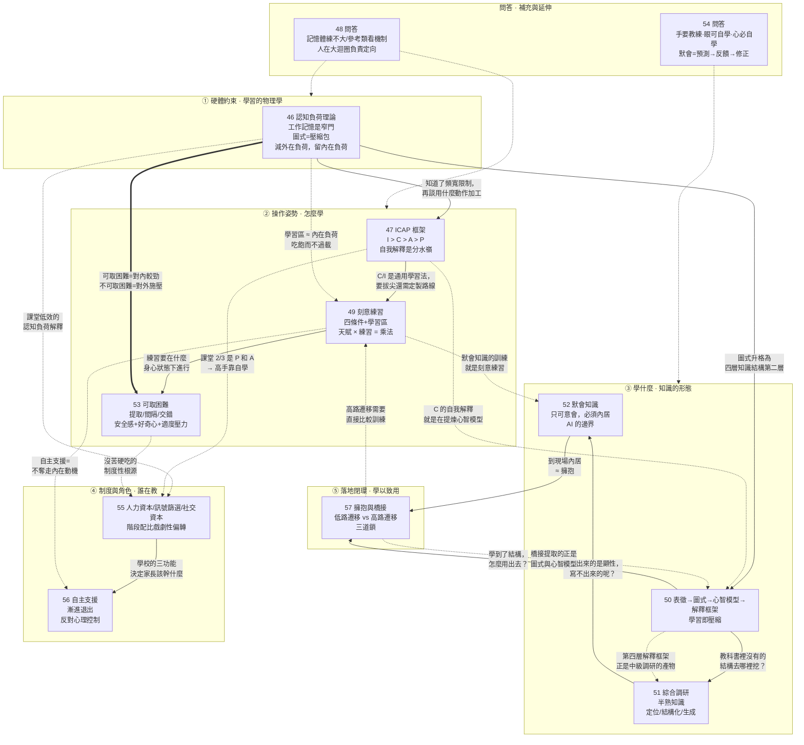

# E04 模組三：學習與教育（第 046～057 講）

> 來源：《現代思維工具課》模組三「教育與學習」
> 涵蓋：046認知負荷理論、047ICAP 框架、048問答、049刻意練習、050表徵圖式心智模型和解釋框架、051綜合調研、052默會知識、053可取（以及不可取）的困難、054問答、055人力資本訊號篩選和社交資本、056自主支援、057擁抱和橋接

第 046 講開篇點明：「作為『教育與學習』板塊的第一講」；第 057 講開篇亦言：「這是學習與教育板塊的最後一講」。所以 046～057 這十二講構成一個完整模組——回答「在一個大腦頻寬極其有限、而 AI 又在快速吃掉顯性知識的時代，一個人到底該學什麼、怎麼學、在什麼狀態下學，以及學校和家長各自應該扮演什麼角色」。

本模組的整體骨架可以概括為五層：

1. **硬體約束**（046）：工作記憶是窄門，學習的瓶頸在頻寬不在硬碟；
2. **操作姿勢**（047、049、053）：ICAP 定義認知參與強度，刻意練習定義誤差壓縮方式，可取困難定義身心狀態；
3. **學什麼**（050、051、052）：四層知識結構（表徵→圖式→心智模型→解釋框架）、教科書之外的綜合調研、寫不進手冊的默會知識；
4. **制度與角色**（055、056）：學校的三種功能配比、家長的自主支援與漸進退出；
5. **落地閉環**（057）：擁抱與橋接，把學到的東西遷移到真實世界。

貫穿全模組的一條主線是：**學習是一個可以工程化的微觀過程，而不是一種道德修行。**

---

## 一、逐講重點摘要

### 046 認知負荷理論：因為文具多，所以是差生（模組開篇）

- 破題案例：2006–2012 年拉美和加勒比 20 國發放近千萬臺膝上型電腦（「每個孩子一臺膝上型電腦」專案），2025 年 NBER 論文揭曉答案——**數學和閱讀成績都沒有改善，按時升年級的比例反而平均下降一個百分點**；唯一提高的技能是操作電腦的技能。**「買電腦」這個動作，正是把學習當成宏觀問題、硬體問題的現代寓言——但學習其實是個微觀問題。**
- 「認知負荷理論（Cognitive Load Theory, CLT）」由澳大利亞教育心理學家約翰·斯韋勒 1980 年代提出。核心區分：**長期記憶（硬碟）容量幾乎無限，瓶頸在工作記憶（記憶體）——普通人最多同時處理 4 到 7 個資訊元素。學習失敗不是因為硬碟存不下，而是因為新資訊透過工作記憶這道窄門時堵車了。**
- 三種負荷：**內在負荷**（材料自帶的複雜度）、**外在負荷**（無關資訊搶戲，包括環境噪聲和老師糟糕的講法）、**增益負荷**（大腦真正把知識轉化為長期記憶的那股勁兒；斯韋勒 2023 年論文認為無需單獨算作一類）。**實操結論：儘可能減少外在負荷，把頻寬留給內在負荷。**
- **最關鍵的概念是「圖式（schema）」**——長期記憶裡存的不是零散資訊碎片，而是把多個元素打包成整體的認知結構（「知識組塊」「思維宏」「壓縮包」）。「中華人民共和國」對小孩是 7 個元素，對你只佔 1 個記憶體槽位。**一份材料到底有多難，不取決於它客觀上有多少資訊，而取決於它在你腦子裡算是多少資訊。優等生學得快不是因為腦子更快或更大，而是因為腦子裡的壓縮包更多。**這就是學習的複利效應。
- 「差生文具多」的完整機制鏈：圖式少 → 內在負荷過載 → 老師用五顏六色粉筆加戲 → 追加外在負荷 → 家長大吵大鬧 → 再追加外在負荷 → 買一堆熒光筆錯題本便利貼提供**虛假的控制感**。**「可以說正是因為干擾因素太多，差生才是差生。」**
- **四個有效教學心法**：
  1. **管理內在負荷**——「有效教學不能是把山峰給孩子削平，而是要給孩子建立攀登高峰的梯子」，內容分段、前置知識預熱、部件先自動化。**有效教學不是降難度，而是排兵佈陣。**
  2. **給「直接教學（Direct Instruction）」**——大量研究證明浪漫的「探索式學習」效率極低（新手的記憶體全消耗在搜尋路徑上）。最高效的是「**範例學習（worked-example）**」：左邊完整例題，右邊結構一致只換數字的練習題，掌握後再「**指導淡出（guidance fading）**」。
  3. **消除外在負荷**——幻燈片裝飾、飛來飛去的動畫、圖在左邊解釋在右邊、老師講一句螢幕再打一遍、按鈕比題目還多的作業平臺，**「這些都不是教學創新，是認知汙染」**。
  4. **優等生和差生區別對待**——2025 年薈萃分析結論清晰：**低先驗知識學習者更受益於高支援教學，高先驗知識學習者更受益於低支援教學**（專家逆轉效應）。
- AI 的兩面：把 ChatGPT 當作業神器（Doer）的學生突擊測試成績顯著下降（**把建構圖式的過程外包了，大腦沒經歷負荷，神經元就沒連線**）；但把 AI 嚴格限定為導師（Tutor）——只拆解、只剔除外在負荷、只引導不給答案——學習效果高於傳統課堂。
- 收束：**「教學，就是給大腦程式設計。」**就算腦機介面再發達也不太可能直接下載技能，因為神經元是肉長的——**這是有關學習和教育最重要的硬約束。**

### 047 ICAP 框架：最高效的學習方法

- 上一講講硬體規律，這一講講操作姿勢：**具體應該用什麼動作，把散碎資訊組裝成長期記憶裡的「圖式」？**
- 「ICAP 框架」源自亞利桑那州立大學認知科學家季清華（Michelene T. H. Chi）2009 年的學說、2014 年與懷利完善。研究思路很巧：既然看不見大腦裡面，那就**觀察學生在外部的可見行為，據此推測和量化大腦內部的認知參與強度**。
- 四層動作：
  - **P（被動 Passive）**：只是朝向材料接收資訊，沒有其他可觀察動作（盯著螢幕看完）；
  - **A（主動 Active）**：有動作但只是初步操控，不產生新資訊（記筆記、劃重點、暫停回放）；
  - **C（建構 Constructive）**：**生成了材料裡原本沒有的新資訊**（用自己的話總結、畫思維導圖、自問自答、設計應用場景）；
  - **I（互動 Interactive）**：與他人進行雙向的、有實質內容的思想交鋒與共創。
- **結論：I > C > A > P。「不是越忙越好也不是越熱鬧越好，是越能生成新資訊、越能得到反饋糾偏越好。」**
- 逐層心法：
  - **P** 的問題在「加工深度理論」——記憶持久度不取決於輸入**頻次**，而取決於加工**深度**；被動接收「資訊就像水流過沙子」。但 P 是速度最快的接收方式，第一次接觸新知識必須靠它（呼應 046 的直接教學）。**「但你千萬別以為這就是學習。」**
  - **A** 的陷阱是**能力錯覺**：反覆背誦產生的「順滑感」讓你以為掌握了，其實只是熟悉了文字的排列組合。**「老師經常讚賞那些筆記工整、書上畫滿線的同學……但這種服從意識其實是一個壞訊號，它通往平庸。」**
  - **C 是掌握的分水嶺**，要害是「**自我解釋（self-explaining）**」——完全用自己的話解釋一個概念，逼大腦調動長期記憶中的圖式與新資訊縫合。**「我認為達到 C，才算是真正的學習。」**
  - **I 是一般人所能體驗的最高階智力活動**——不是坐一桌輪流發言，而是「思想的乒乓球」：有人補充、質疑、糾錯、澄清、反駁、追問、推進。**I 不但要求你構建，而且要求你的構建經得起考驗，防止陷入自我感動。**
- 對照實驗（大學工程課堂學分子結構）嚴格符合 I > C > A > P，且在必須真正理解原理才能答出的推理題上，**I 組顯著壓過 C 組**。
- **重要澄清：這不是打怪通關，而是資源配置**——主要看你已有多少相關先驗知識。全新內容老實做 P 和 A；資深程式設計師學新語言就該直接上手寫程式碼（C）、有麻煩找人或 AI 討論（I）。理想節奏：老師講 10–15 分鐘就停，讓學生自己總結（C），課末互動（I）；**複習備考階段應該完全由 C 和 I 組成。**
- 與費曼學習法的關係：**費曼學習法是 I 和 C 的中間地帶，但以 C 為主**——因為對方未必真聽懂了。要讓它爆發威力，**聽你講的人最好是個圈內人而非純外行。**
- 現實資料令人震驚：中小學課堂 2/3 到 3/4 的活動是 P 和 A，一半的老師幾乎不給 C 和 I 的機會；德國 170 節高校課的研究中，80 分鐘裡 **P 佔 41.5 分鐘、A 佔 12.5 分鐘、C 只有 3.3 分鐘、I 只有 4.5 分鐘**。**「可見課堂教學是一種效率非常低的學習方式。高手都是以自學、單獨練習和私下討論為主。」**
- 收束口訣：**「P 是聽經，A 是抄經，C 是自悟，I 是論道。」**ICAP 問的是：**你有沒有把認知參與，推到當前條件下你能承受的最高層。**

### 048 問答：我們能不能加大自己的「記憶體」？

對 041（前景理論）、044（超級預測）、045（OODA）、046（認知負荷）的補充：

- **參照點該設在哪**：社會比較和歷史高點這類外界給的參照點是有用的（能讓你看見現狀），但關鍵是**主動選擇把更本質的東西作為參照點**——「你希望把可以積累複利的資產，而不是偶然性更大的果實，當作參照點」。同時要誠實：**人既需要內部視角，也需要外部視角**，「沒經歷過風浪的人說『我只在乎自己內心的評價』，一定是站著說話不腰疼」。理想狀態是指標和評價「只是可供參考的訊號，不是你的目標，不是你的指引，更不是誘餌」。
- **怎麼找參考類**：**關鍵不是找相似的「人」，而是找相似的機制/結構。**「一旦你把一個關於人的問題變成一個關於機制的問題，你就把它給一般化了」，從而能利用公開資訊。**「如果我是這個參考類裡的特例怎麼辦？那你就是選錯了參考類」**——也許你的參考類不在本地在遠方，不在同齡人中，而在古往今來跟你有共同志向的人裡。
- **AI 智慧體與 OODA**：真正的智慧體必須體現 OODA（開動後能根據觀察重定向），否則只是自動化指令碼；o3 起的模型已有這個意思。矽谷當前氛圍是 Human-on-the-Loop 甚至 Human-out-of-the-Loop，萬維鋼對此存疑：**以寫作調研為例，每一輪小迴圈 AI 可以自行完成，但這些迴圈之上還有一個大迴圈，人在其中的作用就是第二個 O——定向。**
- **工作記憶能不能練大**（本講核心問答）：工作記憶確實重要，與流體智力/智商相關性接近 0.5，且可測量。但研究結論「既在情理之中，又很讓人無奈」——**所有測試任務都能透過訓練提高，可你訓練哪個任務就只提高哪個任務，遷移能力非常小，也不能提高智商。訓練提高的只是做特定任務的水平，而不是大腦的硬體本身。**研究者推測人們在訓練中其實是發現瞭解題技巧、增加了「圖式」。**「所以練習真的很有效，但是我們也真的不能不服天賦。」**大腦是軟硬結合的東西：你想練硬體，其實練的是軟體；可這個軟體又是用硬體實現的。
- **關於插圖是否構成外在負荷**：「請把這理解成一種『藝術』，而不是嚴格的工程」——如同有的導演畫面中沒有一個多餘元素，有的導演會在街頭打鬥中花幾秒描寫路邊小鳥喝水，那是風格與身臨其境感的取捨。

### 049 刻意練習：天賦的作用究竟是什麼？

- 定位：046 和 047 能讓你在中學大學成績優秀，但那只是「工業化教育流水線上的一件優等品」。**要出類拔萃，必須有額外的、單獨的、定製的學習路線——那就是「刻意練習（deliberate practice）」。**
- 學說史：1993 年艾利克森研究柏林音樂學院小提琴手，發現頂尖與普通演奏者最顯著的區別是累計練習時間 → 被格拉德威爾在《異類》中包裝成「一萬小時定律」→ **但艾利克森學說的精髓恰恰是經驗值不會自動積累**（統計時長只是因為時間最容易統計）。**「一個開了二十年車的計程車司機的駕駛技術未必比一個剛突擊訓練了一年的賽車手高。」**
- **刻意練習 vs 有目的的練習**：光是認真、有校準還不夠，必須**精確**校準。嚴格的刻意練習需滿足四個條件：
  1. **有成熟訓練體系的領域 + 專業導師**——導師的作用是幫你建立精準的「**心理表徵（Mental Representations）**」，讓你知道「正確」應該是什麼樣。**「光會比劃不行，必須『準』才行。」**
  2. **高解析度的目標**——不是練「打籃球」，是練「接球后左腳跨步的那個瞬間動作」；不是「學英語」，是「把這三個總髮錯的音改到連續十次穩定」。**「不是『我要變強』，而是『我今天只改這一個錯誤』。」**
  3. **即時反饋**——錯誤一旦發生必須馬上糾正，否則會被重複、被自動化，變成壞習慣。
  4. **待在「學習區」**（能力邊緣，「你差一點會、但還不會」的地方）——呼應自由能原理：給神經系統喂一點恰好能吸收的驚訝。萬維鋼補了一句現實：**非專業人士很少有自由和資源讓自己一直待在這個區域。**
- 定性：**「刻意練習是一種誤差壓縮技術。」「崇拜苦難的人往往只是在重複自己，一直在改的人才是在重塑自己。」**它代表一種現代精神——不問「你感覺」、不問你捱了多少打，只問「什麼訓練條件能穩定地產生高水平表現」。**我們認為個人的進步可以工程化。**
- **反轉：一旦到了專業級別，刻意練習的解釋力大幅下降。**2014 年大規模研究：刻意練習總量只能解釋遊戲和國際象棋 28%、音樂 21%、體育 18%、教育 4%、程式設計類職業不到 1% 的表現差異；2016 年體育薈萃分析：一般運動員 18%，**只看精英運動員則只剩 1%**。萬維鋼的解讀：一是精英普遍都已使用刻意練習，二是**刻意練習只在規則死板、不確定性低的領域解釋力高；對環境複雜、反饋滯後、評價模糊的領域（商業決策、創意寫作），它只是入場券。**
- **天賦不是玄學，也是一種工程配置。天賦 = 天生的敏感度和可塑性**，具體拆成四項：
  - **感測器更細**（對音高、節奏、時間差、空間差、模式與異常點的高解析度，有相當高的遺傳成分）；
  - **神經網路更新速度更快**（相當程度上取決於工作記憶容量——同樣被教練罵一句，有人只是受傷，有人能立即重放、定位、拆解、重組）；
  - **興趣也是一種天賦**（同一串練習對有些人訊號更密集、回報更快，他不覺得無聊反而上癮）；
  - **環境選擇能力**（會不會主動去尋找好老師、好資源、好同伴，有多大野心）。
  - 另有「通用天賦」與「特定天賦」之分。
- **關鍵關係式：天賦跟刻意練習不是矛盾，而是乘法關係——刻意練習決定你有沒有在更新、在積累複利，天賦決定你每次更新的利率是多少。**
- **從高手到明星，靠的是「風格」**：風格是**在已經滿足硬約束之後，你對剩餘自由度做出的穩定選擇**。**「沒有控制力的選擇叫失誤，有控制力的選擇才是風格。」「風格不是正確的敵人，風格是正確之後的剩餘解空間。」「頂尖高手的風格，不是『我天生不一樣』，而是『我把正確練到足夠穩之後，終於有資格不一樣』。」**
- **重磅反直覺發現**（2025 年 *Science* 綜述）：少年神童和成年後的世界級高手，**將近 90% 不是同一批人**。過早鎖定賽道往往只能找到區域性最優——這是「小時了了，大未必佳」的科學版解釋。真正的高手小時候往往嘗試很多專案、不著急專業化。
- **合理成長路徑六步**：① 初期多探索找賽道 → ② 選定後用「刻意練習 × 天賦」成長 → ③ 達到高水平後再次探索，建立個人風格 → ④ 繼續刻意練習讓風格穩定 → ⑤ 再進一步靠環境和運氣 → ⑥ 一段時間後再次探索新風格。
- 收束：**「沒有天賦，刻意練習也能把你帶到一個不錯的位置；但沒有練習，天賦就只是期權。」**（呼應 037）

### 050 表徵、圖式、心智模型和解釋框架：學習學的是什麼

- 破題：兩本歷史書，一本講趙匡胤打天下的傳奇故事，一本講北宋的政治鬥爭模式——**後者更值得讀**。承接 032 資訊價值：連資訊跟資訊都不平等，知識跟知識怎麼能平等呢？
- **資訊 vs 知識**：資訊是對不確定性的克服（這片地下有沒有石油），**它很有價值但不是知識，因為你沒從中學到任何技能**。「資訊是授人以魚，知識是授人以漁。」而且**知識追求的不是複雜，而是簡單**——學知識必須把瑣碎無關的資訊忽略掉，提取通用結構。
- 理論依據是提斯比的「**資訊瓶頸理論（Information Bottleneck Theory）**」：不管人腦還是深度神經網路，**學習的本質不是記憶，而是壓縮**。**「學習即壓縮。你帶走的規律越簡潔、越能解釋複雜現象，你的壓縮率就越高，你的知識就越高階。」「故事書充其量只能作為餵養規律書的語料。」**
- **四個層級**（本講核心工具）：
  1. **表徵（Representation）**——現實事物在頭腦中的代用品，是**認知地圖的最小單位**，對應概念、名詞、物件、關係和邊界。「我們在大腦中操作的不是疆域，而是地圖。」接觸新領域的第一步是提取關鍵表徵並畫成關係圖。**有了表徵，你就點亮了地圖上的地名。**
  2. **圖式（Schema）**——巴特萊特 1932 年提出、皮亞傑發揚。**如果表徵是單個細胞，圖式就是細胞聚合成的組織（一塊肌肉）；是「模式識別」的模板。**巴特萊特的實驗：英國人回憶印第安神話時會不自覺地用英國邏輯補全細節。**「腦補不是壞事」**——正因為能抽象出圖式再填充細節，我們才能舉一反三（懂了「平臺經濟」這個圖式，淘寶美團滴滴本質上就是一回事）。**「腦子裡沒有圖式的人看什麼劇情都新鮮；圖式多的人看什麼都是套路。」**
  3. **心智模型（Mental Models）**——克雷克 1943 年提出，相當於**器官**，因為它能動、有自身行為邏輯。**心智模型就是「會動的圖式」**：內部有變數、因果、反饋、邊界條件，所以**允許推演**。**「一般的圖式回答『這是什麼』，心智模型則能進一步回答『它怎麼運轉』。」**萬有引力定律是心智模型，本課程的每個「思維工具」都是心智模型。案例：費曼的絕招「在積分號下求導」——他理解原理，所以能靈活運用到不同題目。芒格搞了八九十個心智模型的大合集。
  4. **解釋框架（Explanatory Framework）**——**萬維鋼自創的概念**（註釋中說明它有點像庫恩的「正規化」但小得多，可以是一家之言）。指**當前學界某一派對一個領域的整個系統性看法**，是一個領域的全圖，包含若干心智模型和圖式。例子：秦暉《秦漢史講義》是關於「帝制中國」的一個解釋框架。**「摸到解釋框架，你才開始像學者那樣理解世界：不是追故事，而是問機制；不是擺立場，而是比解釋力和判斷力。」**
- **對「從厚讀到薄、從薄讀到厚」的重新定義**：前者是拋開不重要資訊、提取這四種結構；後者不是糾結細節，而是**在真正學會這張「內在地圖」之後學以致用、舉一反三**。
- **讀書新問法**：不要再問「這篇講了什麼」，要問**「你能從這裡拿走什麼結構」**。表徵只是術語表；學到圖式才看出門道；拿到心智模型才算會用；掌握解釋框架才能判斷什麼值得相信、什麼只是敘事包裝。
- AI 時代的極致案例：MIT 一位研究生用 NotebookLM 把一學期課程壓縮到 48 小時——他上傳了 6 個版本的教材、15 篇論文和所有課堂記錄，然後只問兩個問題：**「這個領域內每個專家都具備的五大核心心智模型是什麼？」「這個領域內三個最大的爭議點，雙方各自最有力的論點是什麼？」**（第一問要心智模型，第二問摸解釋框架），再讓 AI 出 10 道題測試自己，答錯就回原著找答案並追問自己錯過了什麼。（萬維鋼附加評論：**他本人反對突擊學習**，學太快會忘，但這位研究生「是在真學，他知道學習學的是什麼」。）

### 051 綜合調研：在沒有教科書的地方挖掘真知

- **「比聽課和讀書更高水平的學習，是學習教科書裡沒有的知識。」**這門功夫叫「綜合調研（Synthesis）」，是知識工作者的核心競爭力。
- 目標物件是「**邊緣知識**」或「**半熟知識（semi-settled knowledge）**」：已有人研究發表、足夠可靠可以下注，但又沒熟到行內盡人皆知。**「只要想想你們領導的認知有多不靠譜，想想有那麼多人花錢買你確信沒用的東西……你就知道當今世界到處都是半熟知識。」** 收益：投資者能找到市場還沒定價的認知差，產品經理能找到使用者自己都沒說清的真實痛點。**「標準答案只能允許你入場，綜合調研才能幫你超車。」**
- **嚴格區分**：搜尋告訴你「都有些什麼」；總結只是把東西說短；分析是拆開看「這些究竟是什麼」；**而綜合調研是把拆開的東西重新組織成一個新的整體，它解決的是「所以呢」**——我從中得出什麼結論、什麼判斷、應該採取什麼立場、下一步如何決策。
- **必須寫下來**：「如果不寫下來，你分不清自己那個模模糊糊的感覺是真懂還是假懂，發現不了其中的漏洞。」**「寫作不是思考之後的包裝，寫作即思考。」**
- **三個級別**：
  - **初級：定位式調研**（一小時到一天）——目的是讓你對一個事物的認識快速達到「**當前科學理解**」。四個要求：① 把問題壓成一句真問題（要的是定義、機制，還是應用？）；② 尋求可靠資料（高質量論文、主流媒體、權威機構報告）；③ 分清共識、爭議和常見誤區；④ 把結論壓縮成一兩分鐘能講清的話。**「沒有調查研究就沒有發言權，別不帶武器就出門。」**（萬維鋼自建了一個 ChatGPT「調研助手」：先給「電梯致辭」+ 直指要害的暴論，再講當前科學理解、爭議點、常見誤解、更深洞見和應用案例；也可寫成 SKILL.md 交給自己的 AI 助理。）
  - **中級：議題式/結構化調研**（幾個月到一年）——目的是達到**內行水平**。學界指引說以「議題」為中心，但萬維鋼的經驗是**入門的標誌恰恰是「認識人」**：這個領域有哪些高人、哪些門派、各自主張什麼、正在爭論什麼、誰跟誰是冤家、誰掌握話語權。**「下過硬功夫你才有資格說自己支援誰、反對誰。你最好能把你反對的那個學派的意見總結得讓他們自己也認可。」**他本人的實踐：2021 年起花一年多精讀 66 本中國經濟新書，建 9 個超大文件按議題橫向連結筆記。**關鍵發現：主流學者的共識遠遠大於分歧，但他們與老百姓（以及某些官員）的認識差距極大。「分歧都是微妙的，但那個微妙之處，才是最值得說話的地方。」**
  - **高階：生成式調研**——目的不是理解，而是**得出原創新思想乃至新發現**。整合式綜述和薈萃分析本身就是研究方法。急診室比喻：醫生甲看化驗單、乙看影像、丙問病史、護士丁注意到保健品——**「有時候真相不在任何一個材料裡，真相是在材料之間。」**操作像拼圖：把各方證據擺到桌上，**「那個更大的故事就可能是你的新思想；少的那幾塊拼圖，就可能是你的新發現」**。歷史級案例：1854 年倫敦霍亂，學界都在爭論空氣「瘴氣」，而約翰·斯諾把死者名單、街道地圖和公用抽水泵位置三組材料疊在一起畫點，發現死亡病例密集圍繞 Broad Street 那口水泵——**霍亂是透過水源傳播的。**（萬維鋼自陳本課程中的「穩態生存」「三個自我」「主動高認知負荷」「賽道選擇」「狀態槓桿」「解釋框架」等，就是他在拼圖空隙處描的「微原創」。）
- 底層信心來源：**「世界的知識之網並不是嚴絲合縫的，它到處漏風。很多敘事還沒有被提煉出來，很多概念還沒有被命名，很多關係還只是半明半暗地躺在材料裡。」**
- 三句收束：**「讀書不是囤積句子，而是升級壓縮演算法。調研不是蒐羅材料，而是安裝判斷模型。寫作不是展示想法，而是讓思想成形。」**

### 052 默會知識：（但願）AI 永遠都不可能替代的技能

- 驚悚破題：GitHub 上的「同事.skill」程式——上傳離職同事的飛書訊息、釘釘文件、聊天記錄、郵件和截圖，就能生成一個 AI Skill 造出他的數字分身繼續加班。**「下一次，公司會不會先提取我的 skill，再把我直接裁掉？」**
- 定心丸：**「默會知識（Tacit Knowledge）」**——只可意會不可言傳、你知道怎麼做但說不明白、寫不進手冊的知識；與之相對的是「顯性知識（Explicit Knowledge）」。菜譜例子：「中火熱油，蔥姜爆香，收汁至掛勺」每個字你都認識，可你還是不知道怎麼炒。賴爾的區分：knowledge-that（知道是什麼）vs **knowledge-how（知道怎麼做）**；前者是 SOP、定義、步驟、配方，後者是**手感、火候、分寸和節奏**。
- **「顯性知識有時候會被人保密起來，但默會知識無需保密。」**廚師就在你旁邊顛勺，醫生就在你面前下刀，你全程都看見了，可你還是學不會。
- 波蘭尼 1958 年提出此概念，名言：**「我們能知道的比我們能說出來的多（We can know more than we can tell）」**，冰山比喻——露出水面的一角是顯性知識。他解釋難以言說的原因是「**整合（Integration）**」：我們從許多細小線索出發朝向整體意義整合（認臉不是先量眉毛長度；鋼琴家必須把手指「忘掉」音樂才能出來）。**「如果你試圖把那些動作拆解成語言說出來，你反而不會釘釘子了。」**掌握的方式是「**內居（indwelling）**」——**「你不是因為記住了動作要領而會騎腳踏車，是腳踏車已經部分住進了你的身體。」**用今天的話說就是對神經網路進行引數更新和微調。
- **四個根本區別**（使其難以寫進 SKILL.md）：① **複雜的模式識別**（資深醫生看一眼氣色，是對一萬次試錯的高維壓縮）；② **強烈依賴情境**（**「新手醫生看的是指南，高手醫生看的卻是『這個病人現在適不適合按照指南辦』」**）；③ **常是集體共同的財產、長在人與人之間**（團隊磨出的默契：什麼時候「先別說」、什麼叫「技術上正確但政治上錯誤」）；④ **需要身體的參與**（「具身認知」：火候、手感、平衡、語氣、節奏是毫秒級整合，不是自然語言的線性頻寬能承載的）。
- 學習方式只能是**學徒制 + 到現場內居**：在場看 → 跟著做 → 師傅隨時反饋糾錯、把後臺細節拉到前臺 → 一點點刻意練習長成身體圖式。沒有正式導師就觀察身邊處理複雜人事和危機的高手，看他們在正式會議之外怎麼說話、微表情和節奏感。
- **最硬的問題：AI 會不會吃掉默會知識？**誠實的回答是**「AI 已經在吃掉默會知識的外圈」**（人臉識別已被攻克，機器人能學會騎車，AI 診斷準確率已超過人類醫生）。**「不可言傳，不等於不可訓練 AI。不能寫進 SKILL.md，不等於不能融入大模型的引數。」**但有三個理由給我們底氣：
  1. **波蘭尼**：完全顯性的知識不可思議——任何顯性規則的應用都建立在更深一層無法言說的默會背景之上，最終歸結於不講理的公理，即體悟和信仰。**「AI 敢做出躍遷式的信仰嗎？」**
  2. **柯林斯**：人類互動是**動態演化**的過程——機器就算能完全捕捉昨天的統計規律，也沒法預測我們明天湧現出來的新默契。**「小李離職了，我們跟他的數字分身的互動，和跟現在這個小李的互動，怎麼可能一樣呢？也許公司的競爭力就來自那個不一樣的地方。」**
  3. **具身認知 / 莫拉維克悖論**：AI 下棋做題超過人，機器人收拾碗筷卻很難——跟物理世界互動的默會知識是億萬年肉身演化的結果。
  （萬維鋼平心而論：「這些理由並不是絕對的，但這些是非常有用的思考點。」）
- **AI 時代的競爭策略**：藏私是沒有前途的（**「只要『把人變成智慧體』這件事有利可圖，就一定會有一個比你手藝更好的同行，先把這套手藝賣給智慧體公司」**），不如把能寫出來的流程都寫出來變成槓桿。**「如果昨天的默會註定要被自動化，那我們就要把精力投放到明天的新默會上。」**具體：① **搶佔高情境、高例外、高責任的位置**（異常多、反饋快、邊界和責任歸屬難界定，操作難以標準化——診斷、談判、架構、選題、審稿、用人、危機應對、品牌判斷）；② 搶不到就**進現場內居**，絕不紙上談兵或全交給 AI（**「AI 會的都是公共基礎設施，默會知識才是你的私有資本」**）；③ 長期看**最值得積累的是自己的獨特審美、人設和信任關係**——「AI 就算能 100% 模仿也沒用，因為人們想看到的是動態的你」。**「我們想呼叫真魯迅，而不是魯迅的數字分身。」**
- 收尾用《莊子》「輪扁斫輪」：輪扁說制輪「手慢了不行，手快了不行，這個勁兒我無法用語言表達，我都沒法傳授給我的兒子」，所以聖人之言是糟粕。**「如果你聽說前公司把你寫成了 SKILL.md，你完全可以對他們說一句：你們蒸餾的，是我的糟粕。」**

### 053 可取（以及不可取）的困難：把身心調到最適合學習的狀態

- 破題非常尖銳：2024 年彙總 439 項研究的系統綜述估計**中國兒童青少年抑鬱症狀檢出率達 26.17%**；「雙減」後學生睡眠時長增加、抑鬱焦慮下降；深圳研究發現作業時長有**閾值效應**；上海研究發現**最有利於學習成績的睡眠時長是每天 8 小時**。**「沒苦硬吃是愚蠢的自我感動，是拿神經系統的磨損冒充認知能力的增長。」**
- **兩層微觀機制**：
  - **「能不能學進去」**（毫秒到一秒尺度）：大腦做的價值判斷**不是「這題難不難/苦不苦」，而是「新不新、值不值得關心、有沒有獎勵」**——正面則釋放多巴胺讓海馬體開門。這就是「興趣是最好的老師」的神經學解釋（好奇心被真正勾起時，記憶更好，**多巴胺給海馬體加了 buff**）。
  - **「能不能理解」**：關鍵指標是「**喚醒度（arousal）**」（去甲腎上腺素調節）。**太低學不進，太高也不行——學習需要中等的喚醒度**，理想狀態是「可控的興奮：我知道這個事兒很重要，我有點上頭，現在很投入，但是我不害怕」。
  - **高壓的害處有神經基礎**：壓力直接打擊前額葉皮層，威脅和評判降低工作記憶表現；前額葉掉線後靈活推理、工作記憶和認知控制都受損，**「那個狀態更像是在避險而不是在學習。恐懼製造服從，而不是製造理解。」**
- **最有利於學習的情緒配方：安全感打底 + 好奇心點火 + 適度壓力提速。**
- **「可取困難（Desirable Difficulties）」**——比約克夫婦 1990 年代提出，最重要洞見是**必須把「表現（performance）」和「學習（learning）」分開**（刷十道毫無難度的題是表現不是學習；反覆讀到流暢產生的是掌握錯覺）。**可取困難會讓短期表現變差，但讓長期記憶和遷移能力變強。**三個實用心法：
  1. **提取練習（Retrieval Practice）**——多搞小測驗，一次小測驗比重讀一遍書有效得多。
  2. **時間間隔（Spacing）**——與其一天猛學 5 小時，不如每天 1 小時連學 5 天。**「當你集中注意力工作的時候你不希望被打斷，但是對於學習，每天打斷一次反而是好事。」**
  3. **交錯學習（Interleaving）**——混搭不同學科或同一學科的不同內容，逼迫大腦識別深層結構、判斷「這題到底是哪一類」，而不是呼叫肌肉記憶。
  - **精妙的分界線：可取困難是讓學生跟所學的內容較勁，是在內在負荷範圍內折騰；不可取的困難則是從外部施壓，增加毫無價值的外在負荷，讓他們跟疲勞、干擾和威脅較勁。**（直接呼應 046）而且可取困難不增加焦慮——72% 的初高中學生報告提取練習讓他們正式考試時**沒那麼緊張**。
- **兩個狀態增強器**：
  - **鍛鍊**——考前想快速提高腦力，最好的辦法不是喝咖啡，而是 **20 分鐘左右中等強度的急性運動**。運動產生的乳酸可跨越血腦屏障為神經元供能，並刺激「腦源性神經營養因子（BDNF）」這種「大腦的化肥」分泌。效應不大但**非常可靠、穩定存在**。**「讓孩子們課間 10 分鐘去操場上玩一會兒，那不是浪費時間，那是在促進學習。」**
  - **睡眠**——**「睡眠是學習的一道工序」**：類淋巴系統清除代謝垃圾（β-澱粉樣蛋白）幾乎只在睡眠中發生；海馬體把短期記憶轉寫到皮層；做夢是對白天所學的演練。每天睡不到 6 小時會積累認知損傷；成人至少 7 小時，**青少年 8–10 小時**，中學上學時間不應早於 8:30。**「沒有任何一個教練會讓自己的運動員少睡，還說這叫磨練意志。」「人困了應該睡覺，而不是用針扎自己。」**
- **四個「具身認知（Embodied Cognition）」學習心法**（身體是思考的一部分，**「很多時候不是你先想明白了才動手，而是你一動手，腦子才開始明白」**）：
  1. **動手做動作**（做數學題用手懸空比劃、學幾何用手描摹旋轉、學動詞全身做出來——**「這些動作並不是裝飾，而是在替你的工作記憶減負」**）；
  2. **手寫**（比打字更能加深理解記憶；打字太快讓你像速記員，手寫的「慢」逼你重新組織語言，**本身就是一種可取困難**；EEG 研究顯示手寫啟用的腦連通模式更廣泛複雜）；
  3. **讀紙質書**（**紙張提供穩定的空間座標**——內容出現在書中多厚的地方、這一頁的左上還是右下；**別忘了海馬體最早就是用來記憶空間位置和導航的**。越難、越需要批註劃線的內容越該上紙；替代方案是大螢幕或多螢幕增加位置感）；
  4. **想不出答案就站起來走幾步**（提高喚醒度、打破過度聚焦、看見新路徑；安靜自然環境中走還能改善情緒）。
- **運動員式學習流程**：學新東西前先用一個問題把好奇心點亮 → 用腦前先動 10–20 分鐘 → 學習以提取/間隔/交錯為主而非重讀 → 難概念手寫、深閱讀紙讀 → **「把睡眠寫進學習計劃，而不是寫進懺悔錄」**。
- 總綱：**「學習需要可取的困難，但不是吃苦。學習是訓練你，不是消耗你。」**

### 054 問答：靠自學可以成為高手嗎？

對 049（刻意練習）、050（四層知識）、051（綜合調研）、052（默會知識）的補充：

- **沒有導師和快速反饋怎麼辦**——萬維鋼的回答毫不含糊：**那就不是刻意練習**。「人家有條件刻意練習，你沒有，這對你是一個非常不利的因素，意味著你大機率不能跟人競爭。我們必須承認這一點，否則社會科學就沒有意義。」承認硬約束之後的辦法是**選擇一個刻意練習作用小的領域**（網球、鋼琴、外科手術這類「最好連想都別想」）。可自學的領域通常反饋時間長、沒有標準打法（寫作、商業、管理、領導力——「像劉邦，沒上過 MBA 班，但是人家就是會創業」），**但這類領域對悟性（感知敏感度 + 神經網路可塑性）要求更高**——「如果隨便給你看兩篇文章，你分辨不出來哪篇寫得好，你不適合寫作」。
  - **金句總結：「凡是訓練『手』的領域，需要教練；凡是訓練『眼』的領域，適合自學；凡是訓練『心』的領域，必須自學。」**
  - 補充洞見：「窮文富武」——**練武需要的條件遠遠高於學文**（營養 + 請師父），學文鑿壁偷光都行。「你要麼有條件，要麼有天賦。你不能說我這也沒有那也沒有，但是我這也想要那也想要。」
- **是不是每個人都需要「解釋框架」**——不一定，這是個**顆粒度問題**。「一個足球前鋒能把球踢好就很不錯了」，但前鋒不能只知道前鋒的事（得知道後衛怎麼打、怎麼跟隊友配合、瞭解每個對手），只是不必研究各國足球史。反過來科學家一開始就會被導師要求理解 big picture，「不然你就沒有好的問題意識」。「如果一個基層官員連自己這一攤事都沒做好，卻滿腦子全球戰略，只會被人笑話。」
- **調研必須有目的**——**「研究者必須做的工作，是把調研的『目的』貫穿到整個調研過程之中。」**以中美協議開放英偉達 H200 晶片為例：單純報道新鮮事沒意思，但若抱著「這對中國意味著什麼？佔便宜還是吃虧？」的目的，調研瞬間就有方向（H200 處於什麼地位？比 B200 落後多少？比 H20 強是跨了一個臺階還是略好？美國公司實際在用什麼晶片？英偉達有這麼多供貨量嗎？）——**「一個懸念接著一個懸念，你的調研就會變得非常有意思。」**
- **怎麼判斷資訊值不值得展開調研**——「樹立了『我們調研是為了最終下注』這個目的，判斷標準就是顯而易見的」：① 是否足以改變你的行動/先驗（回到 VOI）；② 若能改變就該興奮，並儘快**交叉驗證**真假（主流媒體、主流期刊、多個訊息源、當前科學理解）；③ 對該領域的傳聞要有「體感」。**反面案例：美軍公佈的 UFO 檔案**——雖然可信度高、他本人也感興趣，**但它並沒有改變任何先驗**（材料形態跟過去幾十年的報道毫無二致，「這跟『美國政府宣佈已跟外星人取得接觸』是完全不同的事情」），所以**甚至都不值得花時間仔細閱讀**。
- **默會知識怎麼訓練**（本講最實用的一段）——**「默會知識不是『理解』和『總結』出來的，默會知識是訓練出來的」**，必須走「量」，目標是獲得某種「感」。核心迴圈是「**預測 → 反饋 → 修正**」（看畫猜風格 → 揭示答案 → 內心觸動 → 默默修正）。關鍵前提是**你得知道該看什麼：哪些是真訊號，哪些只是噪聲**（不懂行的人看技術多先進、創始人有沒有激情、PPT 設計；有經驗的 VC 看使用者是否已付費、產品是否獨特、進入成本是否下降、供給是否過度擁擠）。加速辦法：① 老師用**已知結果的成熟案例**指導（商學院案例教學：給出決策現場條件 → 學生模擬決策 → 揭示真實結果）；② **自我訓練：遮住答案，先猜後看**（先看文章開頭，想想換作是你會怎麼寫，再看高手怎麼寫）。
  - **為什麼 AI 還是難以完全獲得人的默會知識**：**「AI 是用語料訓練出來的，而我們是在生活中用一個一個的真實案例，在複雜的環境之中磨練出來的。」**——有時候得跟人衝突好幾次才學會不衝突地辦成事，得連續創業失敗好幾次才學會辦公司，得讓朝代更迭才能讓有識之士比較政治制度。**「我們為訓練付出的代價，是大模型公司支付不起的。」**

### 055 人力資本、訊號篩選和社交資本：學校教育到底是幹啥的？

- 破題：**「關於教育的一切擰巴就在這裡：分數真的能代表能力嗎？」**我們一邊抱怨應試教育，一邊從小學就狠抓分數和競賽證書；既要公平又要效率，「可是哪有既要又要的好事兒呢？」萬維鋼的診斷：**你之所以糾結，是因為你對一個教育場域有太多的期待。**
- **教育的三種功能**：
  - **人力資本（human capital）**——教育的初心和使命，就是**教本事**（知識、技能、思維方式、良好習慣）。它跟師資力量高度相關；有些更有用的課程無法普及不是學生接受不了，而是**沒有那麼多高素質的老師**。
  - **訊號篩選（signaling/screening）**——選拔分流功能，說白了就是**考試排序**。理論依據是斯彭斯的博弈論：真實能力複雜難判，**高考分數是你主動發出的訊號，而這個訊號必須足夠昂貴才有效，因為你必須確保比你水平差的人無法模仿**（公孔雀的長尾巴）。在中國這裡沒有半點虛的——研究證明**精英大學錄取分數線的那一點點差距，後來就是會轉化成畢業生的工資差距**。
  - **社交資本（social capital）**——學校是一群同齡人長期相處的圈子，可以從同學身上學到東西尤其是**默會知識**。隨機分配寢室室友的研究發現**室友的成績會影響你的成績，室友加入哪個社交組織會左右你的決定**。（推論：**從社交資本角度講，讓孩子在家 homeschooling 是錯誤的決定。**）
- **核心洞見：在不同教育階段，三者的權重會發生戲劇性的偏轉。**
  - **小學——人力資本主場，是「最接近教書育人這個理想的地方」。**小學生學的最重要的不是奧數難題，而是**一整套現代社會的基礎作業系統**：讀寫、計算、注意力、習慣、自控、合作、表達、遵守規則。切蒂基於隨機分班實驗的研究證明 K–3 的課堂經歷會直接影響大學入學、成年收入、房產和退休金儲蓄。**但「評價小學老師好不好，並不在於她教出來的成績好不好，而在於這個老師的綜合素質怎麼樣、她對學生好不好」。「小學生最不需要重視的就是學習成績」**（英國報告：11 歲前成績落後不算真落後，11–16 歲還有機會追回；**早教的優勢在一到三年內就會被抹平甚至逆轉**）。跨國研究表明**小升初分流在擴大教育不平等，是把偶然的差距給制度化**。**「小學是塑形器而不是選拔器，學生最重要的不是『領先』，而是『打底』。」**
  - **初中——人力資本與訊號篩選並重。**人力資本仍重要（邏輯、抽象、系統複習、寫作表達），但中考是中國社會分流的**第一道硬閘門**：15 歲就被決定走「普高—大學」還是「職高、中專、技校」。萬維鋼明確表態：**「我認為這麼早分流太殘酷了，也沒必要。藍領工人不需要專門分流培訓，應該儘量讓每個人都有機會上大學。」**同時也肯定：到初中畢業時一個人已具備現代社會的基礎生存能力，**「這放在一百年前可是非常了不起的成就！感謝九年制義務教育。」**
  - **高中——一臺訊號篩選機器。「大學錄取不是對努力的回報，而是對訊號的篩選。」**為什麼要學這麼偏的知識、這麼怪的題型？**「那些內容不是為了教育，而是為了給學生排序而存在的。」**為了公平，差異又不能太依賴家庭資源和名師點撥（所以不能考統計學或狹義相對論——邊遠地區沒有那麼多老師懂）。**這跟古代科舉考八股文是一個道理。這種考試測的不是學問，而是抽象能力、抗壓能力、服從規則的能力、在高強度競爭中持續投入的能力。**全體高中生陷入囚徒困境——**「每逢高考時節都有人『祝全體考生高水平發揮』，殊不知那個效果和全體考生都低水平發揮是一樣的。這是中國最根本的內卷和內耗。」**建議：接受設定、別再糾結有用沒用，**把高考當成一場體育比賽，用競技精神完成高中三年**（考試恰恰是特別適合刻意練習的專案）。**反直覺的政策主張：「有人說要給高考降低難度，我認為那是最愚蠢的政策」**——降難度要麼拉不開分數線變成隨機錄取埋沒人才，要麼逼學生鑽研更沒意義的怪題；**正確路線是加大難度**，讓聰明學生平時多學真學問、考前不必殫精竭慮也能考好，讓天賦一般的同學直接望而卻步。
  - **大學——社交資本主場。**「如果你用上高中的方式上大學，你就錯失了大學教育最值錢的部分。」大學牌子的訊號價值已分配完畢，研究生學歷正越來越不值錢。**大學是進入社會之前最後的試煉場**，學的是「怎麼在複雜組織裡做事」——做專案、進實驗室、實習，這叫「**隱性課程（hidden curriculum）**」。**「這是一個高容錯率的社會沙盒遊戲」**：怎麼給導師發第一封像樣的郵件、怎麼爭取實驗室機會、怎麼開會發言不廢話、怎麼把自己的能力讓別人看見、怎麼建立一個組織——**「同學不只是同伴，同學本身就是課程。」**
- **功能配比估算**（萬維鋼綜合 GPT 與 Gemini 的文獻調研）：

  | 階段 | 人力資本 | 訊號篩選 | 社交資本 |
  |---|---|---|---|
  | 小學 | 80% | 5% | 15% |
  | 初中 | 45% | 40% | 15% |
  | 高中 | 10% | 80% | 10% |
  | 大學 | 30% | 20% | 50% |

  **要點：到什麼場域幹什麼事兒——不要把小學過成高二，不要把高考當成人格審判，不要把大學過成高四。**
- 回答讀者提問「一年級舉手最積極，六年級寥寥無幾，初中生對啥都沒了興趣，與生俱來的學習本領被誰偷走了？」——**「答案當然是訊號篩選。是考試把學習從內在動機給逼成了外部調節，把能動逼成了被動。」「記住高中只有三年。我們要做的是保留好奇心的火種度過高中。」**
- 前瞻：**「我希望這一講說的模型早點失效。」**大學生就業率在下降、文憑訊號作用在減弱；體育、文藝、銷售、修理、運營、直播、創業、組織、談判、審美、手藝這些才能跟考試卷子關係不大。**「『萬物皆可考試』不是社會正常，那是社會病態。」**但在實現理想之前，**你需要暫且尊重硬約束**。

### 056 自主支援：「獻祭式養育」終結者

- 破題：**「獻祭式養育」**——兩歲擔心陪伴不夠，五歲擔心啟蒙晚，十歲擔心沒上對補習班，十五歲擔心說錯一句話毀了孩子一生；放棄事業斷絕社交。**「你有了孩子，孩子就是你唯一的專案嗎？」**
- 三個前置結論：① **養育方法並不是那麼重要**（「如果你沒考上清華大學，難道還能怪父母沒陪你寫作業嗎？」）；② **在可操作空間內也不是投入越多越好**；③ **孩子不是你的作品**——目的不是把孩子**養成**什麼人，而是讓孩子**自己成為**想成為的人，所以**養育必須有一個漸進但堅定的退出機制**。
- **反對獻祭式養育的理由不是家長也有生存權、也不是價效比不高，而是「那種心態、那種養育方式對孩子非常有害」。**
- **算一筆賬**（為什麼可操作空間小）：
  - 2015 年薈萃分析（一千多萬對雙生子、17,804 項性狀）：**平均遺傳率 49%**；
  - 「**遺傳滋養（genetic nurture）**」：你沒傳給孩子的基因也在起作用（你帶「熱愛閱讀」基因，家裡書架就堆滿書），影響力約為直接遺傳效應的 1/3 甚至更高；
  - 環境因素中，**非共享環境**（學校、社會、運氣、偶然事件）的影響遠大於共享環境；
  - 「**喚起性關聯（Evocative rGE）**」：你的養育行為中約 **23%** 的變異是被孩子的基因特質「喚起」的（孩子天生敏感愛哭你就更焦慮嚴厲，天生愛笑你就更溫柔）。
  - **結論：「孩子終究是什麼人，第一取決於他天生是什麼人，第二取決於你控制不了的環境，第三取決於你天生是什麼人，剩下的才是你的育兒方法。所以育兒有什麼可焦慮的？」**
- **養育理論的三級躍遷**：
  1. **權威型養育（Authoritative Parenting）**（鮑姆林德，1960s）——專制型 / 放任型 / **權威型（高溫暖、高邊界、高要求、高回應，一手給愛一手給規矩）**，無數研究結論明確：權威型最好。
  2. **腳手架理論（Scaffolding）**（1970s）——核心心法是**動態支援 + 主動退出**：孩子能站穩了就撤掉一層，樓蓋好了腳手架必須拆除。
  3. **自主支援型養育（Autonomy-Supportive Parenting）**（21 世紀，結合自我決定理論）——**「這是一次觀念躍遷。養育的核心問題已經從『怎麼讓孩子聽話』，改成了『怎麼讓孩子把規則變成自己的意志』。」**
- **核心洞見：一個人只有感受到自己是行為的「發起者」，他才會有真正的內在動力。**
- **自主支援的敵人是「心理控制（Psychological Control）」**——用內疚、羞恥、撤回關愛、情感綁架迫使孩子服從（「你這樣做，媽媽多傷心」「我這麼辛苦都是為了誰」）。**兩者都可能發生在「很愛孩子」的家庭裡，但做法完全不同**：
  - 孩子不想寫作業 → 自主支援：「我知道你現在不想寫，但作業還是要做。你想先做最難的，還是先做最簡單的？卡住了我可以幫你想辦法。」心理控制：「你再不好好寫，我就白養你了。」
  - 想選你不喜歡的專業 → 自主支援：「我會把風險和現實講清楚，但這是你要活進去的人生。你得為你的選擇負責，我也會在你負責的時候支援你。」心理控制：「你這樣選就是不成熟，將來後悔別怪我。」
  - **「自主支援並不等於放任，它照樣有規則、有底線、有後果……而心理控制則是用操縱內心的方式去推進規則。它在孩子身上打道德烙印，它訓練的是順從，它滋生的是怨氣。」**
- 證據：2025 年彙總 238 項研究、超 12 萬名兒童青少年的薈萃分析——自主支援與幸福感顯著正相關，心理控制與痛苦顯著正相關，**且各文化背景皆然**（「並不是中國小孩就應該管，美國小孩就應該哄」）。而對那些「不在乎幸福感、只要成績」的家長，研究結果更有意思：**自主支援對成績的提升有限（學習畢竟是孩子自己的事），但心理控制不但無助於學業，反而透過削弱投入、增加「目標脫離」關聯到更差的學習結果**——「你說得好像學習是為了你學，那我更不想學」。
- **「最好的管教，不是讓孩子聽話，而是讓孩子同意。」**
- **為什麼不能加碼**：① **邊際效益遞減**——對極端不利環境（貧困、父母缺位、虐待）投入一點溫暖效益巨大，「那不是雞娃是救火」；但孩子的認知情緒發展已經合格後繼續加碼，回報就不值得了。② **時間投入與生長階段有關**——0–3 歲「**回應式照料（responsive caregiving）**」有強證據（33 國 102 個 RCT 的薈萃分析：顯著提升認知、語言、運動、社會情緒和安全依戀）；但 **3–11 歲母親投入的絕對時長與行為、情緒、學業結果之間並沒有穩定清楚的關係**；青春期則必須是高質量的共同參與。**「隨著孩子長大，父母陪伴的作用越來越取決於關係質量，而不是時間長度。」**③ **「過度養育（Overparenting）」**與孩子抑鬱、焦慮和內化問題有不大但穩定的正相關——**「孩子需要你扶一把的時候你扶一把，這叫養育；孩子已經自己能走了你還不肯鬆手，這就是過度養育。」「請不要搞什麼『每天愛你多一些』，你那個愛太沉重。正確做法是逐漸退出，每天的接管少一些。」**
- **分階段養育心法**（核心是自主支援 + 漸進式退出）：
  - **0–3 歲**：首要目標**建立安全感**，方法是**及時響應**（此時時間投入槓桿最高）；然後慢慢從「你替他做」變成「你等他做」。
  - **3–11 歲**：你的作用是**腳手架**，目標是讓孩子學會自主，方法是**給規則但也給理由**；每天有一段不被手機打斷的專注相處就已經很值；**允許孩子犯小錯，讓他在試錯中建立自我效能感**。
  - **12 歲以上**：目標是**優雅地撤退**，把監督變成協商，底線守住、主導權交給孩子；**關係要過硬，標準是他在真正有事的時候願意來找你。**
  - **「太早退出叫甩手，永不退出叫統治。退出的不是關係，而是包辦和控制。」**
- 收束：「搞心理控制的是把自己當苦情戲主角，過度照料的是把孩子當寵物，永不退出的是把關係當枷鎖。」**「你不希望孩子離不開你——你希望他離得開你，也願意回來找你。」**

### 057 擁抱和橋接：知識遷移，學以致用（模組收官）

- 破題兩則：孔子「古之學者為己，今之學者為人」；1950 年代費曼在巴西教物理十個月的發現——學生對「折射率」「布魯斯特角」對答如流甚至能精確計算，**卻不知道水和玻璃就是有折射率的介質**；換個問法就不會了，**「更可怕的是，他們根本不在乎」**。費曼公開演講直言：**「巴西沒有在教科學。」**萬維鋼的引申：**「如果我們教的不是真正的『物理』而是『物理課』，教出來的學生都只會考試，考上的學生又只是教下一代學生怎麼考試，教育就成了一個龐氏騙局。」**
- 這就是「**知識遷移（transfer of learning）**」問題。1929 年懷特海已批評過「**惰性知識（inert knowledge）**」——會複述卻不會活用。後來研究者指出原因是**不能把「文字基底（textbase）」和「情景模型（situation model）」聯絡起來**；用本模組的語言說：**你只是學了一大堆「表徵」，沒有真正掌握「心智模型」。掌握的標準不在於懂不懂，而在於換個情境你還能不能認出那個結構。**
- **兩種遷移**：低水平是就近（換個數字再做一遍），高水平是達遠（把統計思維用到投資、談判策略用到婚姻、歷史感用到公司治理）。
- **從「學」到「用」有三道鎖**：① **表徵鎖**（學到的是表徵碎片，不是心智模型）；② **觸發鎖**（理論懂了，但面對現實時沒有線索能把舊知識叫醒）；③ **生態鎖**（叫醒了，但沒有反饋、練習、支援，沒多久又退回舊習慣）。
- 珀金斯與所羅門 1988 年的洞見：**知識不能遷移，是因為我們學的時候沒給應用情境——我們是在一個「無塵實驗室」裡學的。「大腦的檢索機制高度依賴情境」**：你把公式存進了「物理課和考試」資料夾，大街上遇到力學問題時大腦根本不會去掃描那個資料夾。**所以要想學以致用，就必須在學的時候主動給情境。**
- **兩個策略**：
  - **「擁抱（hugging）」→ 對應低路遷移（low-road transfer），靠「像」**。直接在課堂上建立情境，**讓知識一開始就長在將來要用它的土壤裡**。想讓人會談判，就要讓他在時間壓力、情緒波動、資訊不全的情境中真正談一回。醫學院的模擬訓練是典範——**不僅模擬病情，而且模擬壓力**（研究表明模擬訓練使學生手法更熟練、更少犯錯、真上崗後病人結局也更好）。**「真正的擁抱，得有角色、有壓力、有資訊不全、有時間約束，最好還有一點後果。」「知識不是先理解再行動；很多時候，是先在情境裡頂住，再逐漸理解。」**擁抱的目標是建立**自動觸發機制**。
    - 順帶的犀利批評：**「醫生不能透過聽講學會做手術，木匠不是透過記筆記學會幹活兒的——怎麼我們就能指望一群大學生，透過聽課記筆記就成了科學家呢？」**
  - **「橋接（bridging）」→ 對應高路遷移（high-road transfer），靠「想」**。**從具體場景裡抽出「圖式」和「心智模型」，再類比到別的場景**——你必須學會看到兩個表面上差異很大的局面中的共同結構（學了自然選擇，若只當生物學知識就是惰性知識；能看出公司優勝劣汰、流行歌曲演變都是同一邏輯，才叫學會了進化論）。
    - **專家與新手的差別就在這裡**：給一套物理試卷讓人分類，新手分成斜面題、滑輪題、彈簧題（表面特徵），**高手分成「這幾道考能量守恆、那幾道用牛頓第二定律」（深層原理）**。
    - **怎麼教人看深層結構？最好的辦法是把兩個不同場景的案例放在一起直接對比。**經典示範：中東商人與中國出口方爭海運還是空運 / 兩兄弟繼承農場爭今年賣還是明年賣——**表面毫不相干，解法都是「對賭協議」**（先按一方主張執行，事後按實際結果分攤費用或補償）。研究證明這種**直接比較法能讓遷移率提升兩倍**。
    - 熟練後分兩種：**向前橋接（forward-reaching）**——學的時候就主動問「它以後還能用到哪裡」；**向後橋接（backward-reaching）**——碰到新難題時反過來問「這玩意兒像不像我以前學過的某個模型」。
  - **總綱：「擁抱是把知識放回它將來要工作的現場；橋接是把知識從原現場裡提純成可複用的心智模型。一個讓知識落地，一個讓知識出圈。」**
- **學生視角的自我訓練**：讀完一本書先**向前橋接**（這本書解釋了什麼結構？我未來最可能在哪三個情境裡用它？），再**擁抱**（模擬一個具體情境，問自己第一步動作是什麼）——**「這樣你就給知識裝上了觸發器。」**職場技能則是：找一個真實會議、真實微信互動甚至真實衝突做小範圍訓練（擁抱），事後做比較筆記（表面哪裡不同、深層哪裡相同、下次看到什麼訊號就該呼叫這個模型，形成橋接）。**迴圈：擁抱 → 總結 → 橋接 → 再擁抱。**
- **極致樣本：蘇東坡。**三個高明之處——
  1. **壓縮能力**：讀書多（出身文學家庭 + 趕上大宋印刷擴張，「用今天的話說就是他有大量的訓練語料」），但更關鍵的是**把表徵壓縮成大量圖式和心智模型**，即「博觀而約取，厚積而薄發」；
  2. **最好的擁抱**：他是官員、地方治理者、不斷遷徙的人、政治風波中的當事人——**「一個人如果只在概念裡活著，搞不好語言會越來越輕，越來越滑，越來越假；蘇軾之所以厚，是因為他同時活在制度、災難、路途、病痛、山水和人情裡面。」**而且他不垮反而越活越瀟灑（「九死南荒吾不恨」「也無風雨也無晴」「此心安處是吾鄉」），因為心智模型讓他善於情緒調節——這正是最好的橋接。方法論對應他自己的話：**「舊書不厭百回讀，熟讀深思子自知」，又叫「八面受敵」**；
  3. **極擅高路遷移**：能把經典、政治、山水、佛學、日常經驗和人生遭遇拉進同一個內部空間（**latent space**）混合生成新表達——**「蘇軾寫文章是在調動世界。」**
- 三層境界收束：**「讀書的最高境界是完善自我，是像蘇東坡那樣把書讀成自己的一部分。讀書的中等境界是學以致用，是長能耐有本事。像今天這些人，讀書就為考試，實在是極低的層次。」**但對志存高遠的讀書人來說這無所謂——**「你總可以自學，畢竟蘇東坡也不是哪個名校培養出來的。」**

---

## 二、十二講亮點提煉

- **最硬的開場診斷**：046 用一個千萬臺膝上型電腦、十年跟蹤的隨機對照實驗，把「教育=花錢升級硬體」這個國民級共識一擊打穿——**唯一提高的技能是操作電腦的技能**。整個模組的立場由此確立：**學習是微觀問題，不是宏觀問題；是工程問題，不是道德問題。**

- **最具解釋力的單一概念：「圖式」**。它在 046 定義（工作記憶的壓縮包）、在 048 解釋為什麼工作記憶訓練不可遷移（練的其實是圖式不是硬體）、在 050 被升格為四層結構的第二層、在 057 成為橋接的提取物件。**「一份材料到底有多難，不取決於它客觀上有多少資訊，而取決於它在你腦子裡算是多少資訊」**——這一句幾乎重寫了「難度」這個詞的定義。

- **最具操作性的診斷尺**：047 的 ICAP。它的價值不在於說了「互動最好」這種常識，而在於**給出了一把可以當場丈量任何學習活動的尺子**，且丈量結果觸目驚心（德國高校 80 分鐘課堂裡 C 只有 3.3 分鐘、I 只有 4.5 分鐘）。配套的兩個提醒也極精確：**A 的「順滑感」是能力錯覺**；**費曼學習法只是 C 與 I 的中間地帶，聽眾必須是圈內人才能升到 I。**

- **最誠實的一講**：049 對天賦的處理。學界二十年來一直想淡化天賦、把一切技術化，萬維鋼沒有跟隨這個潮流，而是**把天賦拆成四個可討論的工程引數**（感測器解析度、神經網路更新速度、興趣的獎勵函式敏感度、環境選擇能力），並給出關係式——**「天賦跟刻意練習不是矛盾，而是乘法關係：刻意練習決定你有沒有在更新，天賦決定你每次更新的利率是多少。」**加上 054 那句「你要麼有條件，要麼有天賦，不能這也沒有那也沒有但這也想要那也想要」，構成了全模組對**硬約束**最不留情面也最有尊嚴的表述。

- **最反直覺的實證**：049 引用的 2025 年 *Science* 綜述——**少年神童與成年後的世界級高手，將近 90% 不是同一批人**。這一條直接推翻了「早出成績=好苗子」的全民信念，並把 025「探索與利用」的節律重新裝進了成才路徑（探索 → 刻意練習 → 再探索找風格 → 再練習 → 再探索）。

- **最有層次感的知識論**：050 的四層結構（表徵 → 圖式 → 心智模型 → 解釋框架）是整個模組的**認知骨架**，也是萬維鋼的「微原創」之一（「解釋框架」一詞是他自造）。它把「學習學的是什麼」這個含混問題變成了一張可檢查的清單，並給出了新的讀書問法：**不問「這篇講了什麼」，問「你能從這裡拿走什麼結構」。**

- **最能拉開職業差距的一講**：051 綜合調研。核心概念「**半熟知識**」精準命名了一個人人可及卻極少有人系統開採的礦脈；三級劃分（定位/結構化/生成）給出了清晰的能力階梯；而**「有時候真相不在任何一個材料裡，真相是在材料之間」**與約翰·斯諾的霍亂地圖，是全模組最漂亮的方法論意象。另有一句被低估的實操格言：**「寫作不是思考之後的包裝，寫作即思考。」**

- **最貼合當下焦慮的一講**：052 默會知識。它的可貴之處在於**不兜售安慰**——先承認「AI 已經在吃掉默會知識的外圈」，再給出三個有限但真實的理由（波蘭尼的公理不可窮盡、柯林斯的動態湧現、莫拉維克悖論），最後給出的策略也不是藏私（「一定會有比你手藝更好的同行先把這套手藝賣給智慧體公司」），而是**「如果昨天的默會註定要被自動化，那我們就要把精力投放到明天的新默會上」**——搶佔高情境、高例外、高責任的位置。

- **最該被中國家長讀到的兩講**：053 與 056。053 用資料（26.17% 抑鬱檢出率、8 小時最優睡眠、運動的 BDNF 機制）拆穿「學習必須吃苦」的民間信仰，並給出了**最精確的一條分界線**：**可取困難是讓學生跟內容較勁（內在負荷），不可取的困難是讓學生跟疲勞、干擾和威脅較勁（外在負荷）**——一句話把 046 和 053 焊在了一起。056 則用行為遺傳學的賬本（遺傳率 49%、遺傳滋養、喚起性關聯 23%、非共享環境）把「獻祭式養育」在事實層面解除武裝，再用「自主支援 vs 心理控制」在方法層面給出替代方案。**「最好的管教，不是讓孩子聽話，而是讓孩子同意。」**

- **最能解開心結的一講**：055。它沒有呼籲改革，而是做了一件更有用的事——**把「學校」這個被過度期待的單一場域，拆成三種功能並給出階段配比**（小學 80% 人力資本 / 高中 80% 訊號篩選 / 大學 50% 社交資本）。由此推出的實操建議極其清晰：**「不要把小學過成高二，不要把高考當成人格審判，不要把大學過成高四。」**其中「高考改革的正確路線是加大難度」是全模組最反直覺、也最經得起推敲的政策主張。

- **最好的收官**：057 用「擁抱/橋接」這一對策略，把前面十一講的所有成果接回真實世界，並回答了模組開篇隱含的那個問題——學了半天到底有什麼用。**三道鎖（表徵鎖、觸發鎖、生態鎖）**是對「學了用不上」最精確的故障定位。而蘇東坡這個案例之所以有力，是因為他同時示範了四層結構（博觀而約取 = 壓縮）、擁抱（活在制度、災難、路途、病痛、山水和人情裡）和高路遷移（把一切拉進同一個 latent space）。

- **貫穿全模組的三條暗線**：
  1. **「壓縮」是學習的元隱喻**——046 的圖式是壓縮包，050 的資訊瓶頸理論直說「學習即壓縮」，051 的「讀書不是囤積句子，而是升級壓縮演算法」，057 的蘇東坡「博觀而約取」。**從頭到尾，學習被定義為一個降低描述長度的過程**（這也與模組二 029「最小描述長度」直接呼應）。
  2. **「負荷該往哪裡放」是全模組的調節旋鈕**——046 說減外在留內在，047 說把認知參與推到能承受的最高層，049 說待在學習區，053 說可取困難對內不對外。**四講講的是同一件事：把有限的頻寬，精確地投到會產生結構的地方。**
  3. **「AI 既是威脅也是槓桿」貫穿始終**——046（當 Doer 有害、當 Tutor 有益）、048（Human-in-the-Loop 中人負責定向）、050（NotebookLM 48 小時案例）、051（調研助手與 Deep Research）、052（默會知識的三道防線）、054（AI 拿不到我們的真實訓練場景）。**萬維鋼的一貫立場是：把 AI 用在降低外在負荷和加速調研上，而絕不能把建構圖式的過程外包出去。**

---

## 三、第 46～57 講關聯圖

**關係解讀（一句話版）**：
本模組回答「在頻寬極其有限的大腦裡，怎樣把世界裝進去並用得出來」。**起點是 046**——認知負荷理論確立了這個模組唯一的硬約束：工作記憶是窄門，而「圖式」是穿過這道窄門的壓縮包，因此有效教學的全部技藝就是**減外在負荷、精心安排圖式進入的節奏**。有了這個物理學基礎，第二層回答「用什麼姿勢學」：**047** 的 ICAP 給出可丈量的認知參與階梯（I > C > A > P，C 的自我解釋是分水嶺），**049** 的刻意練習給出拔尖路線（四條件 + 學習區，並誠實地承認天賦是乘法項而非可忽略項），**053** 則回到身心狀態——**可取困難（對內容較勁）與不可取困難（對疲勞、干擾、威脅較勁）的分界，正好是 046 內在負荷與外在負荷的分界**。第三層回答「學的到底是什麼」：**050** 給出四層結構（表徵→圖式→心智模型→解釋框架）並把「學習」重新定義為壓縮，**051** 把戰場從教科書推進到「半熟知識」並給出三級調研階梯，**052** 則劃出顯性知識的邊界之外那塊只能靠內居獲得、也是 AI 暫時夠不到的默會資產。第四層是制度與角色：**055** 把「學校」拆成人力資本/訊號篩選/社交資本三種功能並指出配比隨階段劇烈偏轉，**056** 則把家長從「獻祭式養育」中解放出來，代之以自主支援與漸進退出。最後 **057** 收口——用「擁抱」把知識放回它將來要工作的現場，用「橋接」把知識提純成可複用的心智模型，**而橋接所提取的東西，恰恰就是 050 定義的圖式與心智模型**，全模組由此閉環。兩講問答（048、054）分別補強了硬體的可訓練邊界與自學的可行邊界，共同守住了這個模組最一貫的態度：**尊重硬約束，然後在約束之內把一切工程化。**

---

## 四、延伸思考（可選）

1. **046 與 053 是同一把尺子的兩端，值得合起來當作一條家庭/團隊守則。**046 說「減外在負荷」，053 說「增可取困難」——兩者不是矛盾而是互補：**要增加的是學習者與內容之間的摩擦（提取、間隔、交錯、手寫），要減少的是學習者與環境之間的摩擦（噪音、監督、花哨課件、熒光筆、睡眠不足）。**現實中大多數家長和公司做反了：拼命增加環境摩擦（加班、催促、開會、監控），同時拼命降低內容摩擦（直接給答案、提供模板、讓 AI 代做）。這條守則可以一句話記住：**「跟內容較勁，別跟自己較勁。」**

2. **049 的「天賦 × 刻意練習」與 054 的「手/眼/心」構成一張完整的自我定位座標。**如果你所在的領域屬於「手」（有成熟訓練體系、快速反饋、標準動作），那麼沒有教練就是決定性劣勢，不必自我安慰；如果屬於「眼」或「心」（反饋滯後、無標準打法），刻意練習的解釋力本來就只剩百分之幾，此時決定勝負的是悟性、綜合調研能力和默會知識的積累速度——**而這恰恰是 051 和 052 兩講的戰場**。換句話說，**本模組給自學者留的路不是「照樣能刻意練習」，而是「換一個刻意練習不管用的賽道」**——這與模組二 027 的「強偏置」和模組一 022 的「賽道選擇」是同一個動作。

3. **050 的四層結構可以直接改造成個人知識管理的驗收標準。**讀完任何一本書、上完任何一門課，問自己四個問題：我記住的是術語表（表徵）、看出了套路（圖式）、能推演機制（心智模型），還是能判斷這個領域誰在爭什麼、哪一派更可信（解釋框架）？**大多數人的閱讀長期停在第一、二層，卻誤以為自己在第三層。**MIT 那位研究生的兩個提問（五大核心心智模型 + 三個最大爭議點）之所以高效，正是因為它直接從第三層和第四層切入，跳過了第一層的堆積——這套問法完全可以固化成一份自己的 SKILL.md。

4. **052 與 057 合起來，才是「AI 時代該學什麼」的完整答案。**052 說要搶佔高情境、高例外、高責任的位置；057 說知識必須經過擁抱（放回現場）才能觸發、經過橋接（提純為模型）才能出圈。**兩者指向同一個結論：AI 能極大加速的是顯性知識的獲取與壓縮（這正是 051 初級調研該外包給它的部分），而人不可替代的部分同時需要「在現場」和「跨情境」——前者產生默會知識，後者產生高路遷移。**一個只在現場而不橋接的人會變成經驗主義的老師傅（把一個錯誤重複二十年），一個只橋接而不到現場的人會變成 057 批評的「語言越來越輕、越來越滑、越來越假」。蘇東坡之所以是極致樣本，正因為他兩頭都佔滿了。

5. **本模組最容易被誤讀的一講是 055。**它極易被讀成「高中就是內卷，認命吧」，但原文的實際主張要精細得多：**接受設定不等於認同設定**——萬維鋼同時說了「把高考當成一場體育比賽，用競技精神完成高中三年」（戰術上接受）、「我認為初中分流太殘酷了也沒必要」「高考改革的正確路線是加大難度」「我希望這一講說的模型早點失效」（戰略上反對）。真正的操作要點是那句**「保留好奇心的火種度過高中」**——因為按照 053 的機制，好奇心是多巴胺讓海馬體開門的鑰匙，而按照 056 的機制，心理控制會把內在動機逼成外部調節。**一旦火種在高中被燒盡，大學的 50% 社交資本和成年後的終身學習都無從談起——這才是這一講真正的風險提示。**
