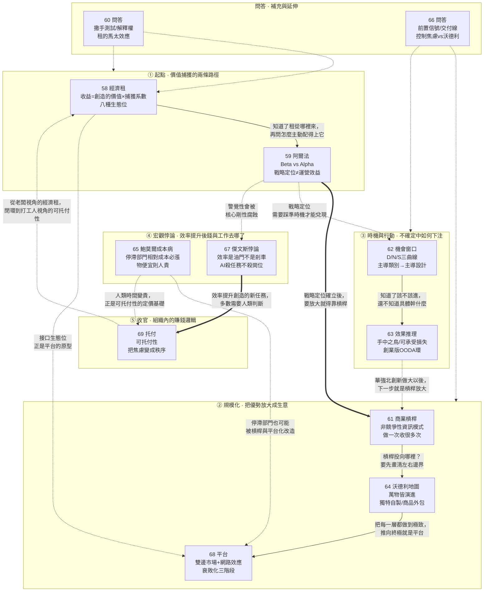

# E05 模組四：賺錢邏輯（第 058～069 講）

> 來源：《現代思維工具課》模組四「賺錢邏輯」
> 涵蓋：058經濟租、059阿爾法、060問答、061商業槓桿、062機會窗口、063效果推理、064沃德利地圖、065鮑莫爾成本病、066問答、067傑文斯悖論、068平台、069托付

第 058 講開篇即言：「這一講我們進入『賺錢』板塊。想要賺錢，你必須創造某種價值。」到 069 講收束在「要拿高薪，你輸出的不是時間，不是體力，也不是技能，而是秩序」——058～069 這十二講構成一個完整模組，回答的問題是：在一個價值由需求主觀決定、創造與捕獲早已脫鉤的世界裡，錢到底流向了誰，為什麼流向他，以及一個沒有董事長姐夫的普通人，該如何主動地把自己放到那個位置上。

本模組的整體骨架可以概括為五層：

1. **起點：價值捕獲的兩條路徑**（058、059）：經濟租定義了「租」在哪裡，阿爾法定義了你憑什麼有資格站到那裡；
2. **規模化：把優勢放大成生意**（061、064、068）：商業槓桿是放大的通用原理，沃德利地圖決定槓桿該往哪裡投，平台則是這一切的終極形態；
3. **時機與行動：不確定中如何下注**（062、063）：機會窗口回答「何時進場」，效果推理回答「不知道幹什麼時怎麼辦」；
4. **宏觀悖論：效率提升之後，錢與工作去哪了**（065、067）：鮑莫爾成本病說明服務為何必然變貴，傑文斯悖論說明效率提升為何不減反增工作；
5. **收官：組織內部的賺錢邏輯**（069）：把整套經濟租的邏輯，翻譯成打工人也能使用的「可托付性」。

貫穿全模組的一條主線是：**「價值創造（value created）」和「價值捕獲（value captured）」並不是一回事——這個模組講的不是怎麼創造價值（那是硅谷創業課的內容），而是創造出來的價值最終落在誰手裡，以及你如何主動把自己放到那個能捕獲價值的位置上。**

---

## 一、逐講重點摘要

### 058 經濟租：賺錢的秘密（模組開篇）

- 破題案例：一家不起眼的私企，管理土、技術也不強，卻異常賺錢——謎底揭曉：老闆是那家配套大型國企董事長的小舅子。**賺錢真正的秘密，叫做「經濟租（Economic Rent）」。**
- 核心定義：經濟租是一筆收入裡，超過「讓這個資源繼續被提供所必需的最低報酬」的那一部分。給出全模組的總方程式：**「收益 = 創造的價值 × 捕獲系數。創造的價值決定你能不能上桌，捕獲系數決定錢為什麼留在你這裡。」**
- 學術脈絡完整梳理：亞當·斯密 1776 年《國富論》直覺提出地租吸走超額剩餘 → 李嘉圖（David Ricardo）19 世紀初系統化地租理論（肥地與薄地的產出差即是租）→ 馬歇爾（Alfred Marshall）把租的概念推廣到機器、建築和技能，稱為「準租（quasi-rent）」→ 塔洛克（Gordon Tullock，1967）提出「寻租（Rent-seeking）」——真正的危害是所有人開始為搶租而浪費資源 → 克魯格（Anne O. Krueger，1974）指出牌照、配額等制度設計本質是在「設租（Rent-creation）」→ 彼得拉夫（Margaret Peteraf，1993）提出「競爭優勢」理論 → 布蘭登伯格與斯圖亞特（1996）提出「附加值（added value）」：一個主體能賺多少錢取決於「如果沒有你，這個系統會壞到什麼程度」。
- 巴菲特「收費橋（Toll Bridge）」比喻：一個生意要想是好生意，裡邊就得有一種收費橋一樣的東西——**「只不過有些人的收費橋是自己創造的，是生產性的；有些人的收費橋是靠關係堵出來的，是寄生性的。」**
- **捕獲經濟租的八種生態位**：土地（黃金地段、港口泊位、資源開採權）、證書（牌照、專利、行醫執照——制度製造的稀缺）、資訊（尽职调查、量化交易等專業壁壘）、關係（「小舅子模式」，降低交易信任成本）、聲望（核心人才與明星的品牌溢價）、接口（互聯網平台的「過路費+廣告費+排序費」，**AI 時代最大的收費橋是輝達**）、配套（供應鏈、分銷網絡等必經環節，「賣鏟子的人」）、資金（承受非遍歷性風險換取的風險溢價與利息）。
- 彼得·蒂爾（Peter Thiel）金句：**「只有 losers 才競爭。」**始終保持競爭狀態就意味著沒有護城河——「你光做得比人好還不行，還得做得比人便宜」，本質上就是在打價格戰。
- 馬祖卡托（Mariana Mazzucato）區分「好租」（創新租）與「壞租」（長期依靠制度壁壘、平台控制和政策設租固化下來的抽取型收益）：**「市場競爭不是要消滅一切經濟租，而是要不斷壓低過高的租金。好市場不是沒有收費橋，而是橋旁邊永遠允許別人修新橋；不是沒有巨頭，而是巨頭不能勾結政府把後來者永遠擋在門外。」**
- 個人操作建議：爭取「一定是複利、能資產化」的競爭優勢而非賣工時；投資或加入公司前必須看穿它真正的「租」在哪裡，而不是聽價值觀話術；大衛·提斯（David Teece）「互補性資產（Complementary Assets）」理論——控制渠道、售後或平台入口的人，往往比創新主角本人賺到更多錢。
- 收束金句：**「自由市場的本意是『自由競爭』，不是『自由收租』。」** 質疑不如理解，理解不如成為——但也要批判別人霸占的那些「壞租」。

### 059 阿爾法：優勢戰略意識

- 破題：人人都在追 AI，但單單會用 AI 給不了你租，因為 AI 是通用技術，別人也能用。**你到底做了什麼別人做不到的事情，以至於天大的好事能落在你頭上？**
- 借用金融學概念：**Beta** 是一隻基金對市場共同風險暴露所得的「跟著市場走」的回報；**Alpha** 則是扣除市場因素之後，靠更高一層認知、判斷和動作硬拿到的風險調整後超額收益。**「Beta 只能讓你在市場中存活，只有 Alpha 才能給你積累經濟租。」**
- 學術脈絡：新古典經濟學假設市場完全均衡、信息完全，一切超額利潤都會被瞬間抹平 → 哈耶克（F. A. Hayek，1968）提出「競爭是一個發現程序（Competition as a Discovery Procedure）」：現實世界知識高度分散，市場永遠存在被低估的需求與「錯配（Mismatch）」→ 柯茲納（Israel Kirzner）進一步提出「企業家發現（Entrepreneurial Discovery）」：真正的企業家具備高度「警覺性（Alertness）」，靠糾正錯配賺取利潤，同時讓市場變得更均衡一點點。
- 麥可·波特（Michael Porter）1996 年《什麼是戰略？》（What Is Strategy?）核心觀點：**「運營效益（Operational Effectiveness）」和「戰略定位（Strategic Positioning）」是兩回事**——運營效益是把大家都在做的事做得更好（別人遲早也能學會），戰略定位是執行與對手完全不同的活動。案例：西南航空只做短途高頻航線、單一機型、簡化服務，圍繞「快速周轉」重新設計整套運營系統。
- 警告：波特式戰略要求痛苦的「取捨（Trade-offs）」——只做這個就必須放棄那個。用 AI 降本增效根本不是戰略，只是在同一賽道上和對手比誰跑得更累：**「競爭高度同質化 → 演變成價格戰 → 利潤率蒸發 → 失去健康的現金流 → 沒有多餘的錢研發新的 Alpha → 消費者會認為你們提供的就是個廉價產品 → 失去品牌資產和創新能力。」低利潤率是一種恥辱，降本增效不是進攻而是防守。**
- 三本帳比喻：現金帳（管今天，天然喜歡 KPI 和周轉率）、能力帳（管明天）、位置帳（管後天）。**「利潤是今天的結果，能力是明天的原因，位置是後天的統治——如果你真的形成統治，那也就是經濟租。Alpha 是動能，經濟租是勢能。」**
- 四組正反對比案例：柯達（早已發明數碼相機卻選擇把資源投入傳統膠捲降本增效，因守住舊租而死）vs ASML（DUV 時代已是贏家，仍主動押注 EUV 及下一代 High NA EUV）；Kmart 與 Sears（合併求規模效應削減管理費用，未創造新體驗，一衰敗一破產）vs 輝達（CUDA 平台十幾年純投資零財務回報，AI 爆發後成為萬億美元帝國的租）；諾基亞（守着硬件製造效率和供應鏈成本）vs Airbnb（發現「阻礙私宅租賃匹配的核心不是技術而是信任」，用互評體系和創始人親自拍照冷啟動搭建新平台）。
- **從 Alpha 到經濟租的五步心法**：①錯配（哪裡有高價值錯配）→ ②認知（憑什麼偏偏是你來糾正它，你有什麼獨特的東西）→ ③執行（沒有取捨就沒有戰略，正因為取捨艱難別人才無法模仿）→ ④佔有（把優勢沉澱成品牌、合同、數據、標準等「互補性資產」）→ ⑤重構（任何經濟租一旦過於舒適就會腐蝕警覺，必須有再造 Alpha 的能力）。
- 收束金句：**「我比你更早站在一個尚未被社會充分定價的真相上」**——如果可以選，我們選擇把 Beta 留給別人。

### 060 問答：怎樣跟青春期的孩子溝通？（跨模組問答，銜接學習教育模組與經濟租）

- 這一講形式特殊——它集中回應了此前學習教育模組（046～057）與本模組 058 讀者的五組提問，是連接兩個模組的橋樑，同時把「賦能」「經濟租」「馬太效應」這些概念前後打通。
- 回應「分數功利」問題：區分**終結性評價（summative assessment）**（期末考試、排名、錄取）與**形成性評價（formative assessment）**（平時測驗、作業、錯題）——真正的功利主義者應該像量化交易員盯收益率一樣，用形成性評價做即時診斷，而不是等期末成績出來才後知後覺。引用 2024、2026 年中國 K-12 教師評價素養研究：許多老師過度依賴終結性評價，不知道如何判斷學生下一步該怎麼走。**「他們崇拜分數，卻不研究分數；崇拜努力，卻不測量努力的產出。」**
- 回應「賦能還是失能」問題：給出可複用的判斷標準——**「撒手測試」**：三個月後家長不提醒、不催促、不監督、不續費、不安排，這個東西還能不能留在孩子身上？能留下就是賦能，不能留下就是家長在緩解自己的焦慮。這個標準可推廣到職場領導、傳銷組織：**「真正的賦能，必須允許、並且支持對方離開你。不能離開的教育是馴養。」**
- 回應青春期溝通：核心是孩子在爭奪自己人生的「解釋權」。家長該守住的不是「我說了算」，而是給孩子一句話：**「你的人生你負責，但我不會消失。」**操作原則是家長只管「責任結構」不管具體行為（幾點寫作業、手機放哪裡），讓孩子自己出方案，複多的最好形式是讓孩子主動透露（Stattin & Kerr，2000 年經典研究：父母瞭解孩子動向多半不是因為監控嚴，而是孩子願意主動說）。
- 回應知識遷移問題：可遷移的不是「客戶這樣說我就那樣回」的話術腳本，而是購買決策鏈條、公司目標函數、瓶頸所在這類心智模型結構——「不能只看表面動作，得抓住動作背後的心智模型」，這正好呼應了學習教育模組第 057 講的「橋接」。
- 回應「財富的馬太效應是否公平」：引用**重尾分佈**——經濟租的八種生態位不是互相獨立的抽屜，而是可以互相強化的卡位（有土地的人更容易拿到牌照，有牌照的人更容易進入關係網絡……），越強大越有能力也越有資源去獲取更多租。更關鍵的是這些強者有強烈的**佔有欲**——「普通人看到一個機會，第一反應是『我能不能幹』；而這些人的第一反應則是『我能不能控制』」。引證：馬斯克起訴 OpenAI 一案中，奧特曼作證馬斯克曾想把 OpenAI 的長期控制權傳給自己的孩子。但也給出三點寬慰：強人財富終究會被稀釋（沒有長盛不衰的商業帝國）、資源掌握在敢冒險的強者手裡未必是壞事（如果不是馬斯克早期入場，OpenAI 未必有資源探索冷門方向，而 xAI 就是馬斯克近期失敗的例子）、私人強者的租終究好過權力設租（權力一旦設租就是直接專賣，禁止別人修橋）。

### 061 商業槓桿：把一個創造賣一百萬次

- 破題：剝削敘事解釋不了今天的財富——高科技公司只有幾百人甚至十幾個人，員工人人持股，財富卻遠超幾萬名工人的傳統工廠；「一人公司」調用一堆 AI 智能體一年能做成幾百上千萬元生意，又剥削了誰？**「你賺錢多，不是因為你干的活多，也不是因為你能讓別人替你干活，甚至不只是因為你能讓很多人替你干活，而是因為你能把一個創造、一個組織、一個信任，賣出很多次。」**
- 亞當·斯密別針工廠的槓桿版本：不是一個人做 20 個、10 個人做 200 個（線性放大），而是 10 個工人分工合作、每人專精一個動作，結果日產 **48,000 個**別針——因為老闆的設計、組織和管理，讓 10 個工人的產量遠超 10 倍，這才叫勞動力槓桿。
- 固定成本（fixed cost）與邊際成本（marginal cost）的分野：買地建廠、研發設計等前期投入是固定成本，之後每多生產一件只需增加少量邊際成本——**賺錢的關鍵就在零售價遠高於邊際成本，一旦銷量越過盈虧點，利潤就會噌噌往上漲。**
- 賣水故事的六級槓桿階梯：①自己挑水（無槓桿，辛苦錢）→ ②雇人挑水（勞動力槓桿）→ ③買駱駝水車（機器槓桿，隔壁業餘人士難以競爭）→ ④建自來水管（基礎設施槓桿，邊際成本極低服務多村）→ ⑤發明「高效取水過濾系統」授權全國收授權費（知識產權槓桿，「賣的已經完全不是水了」）→ ⑥建「可信水源認證」平台（網絡槓桿，「賣的既不是水也不是專利，而是信任、標準和網絡」）。
- **債務槓桿**最危險——引用莫迪利亞尼—米勒定理（Modigliani-Miller theorem，1958）：理想市場中單純改變債務和股權比例並不會憑空創造企業價值，只是重新分配風險和收益；真正創造財富的是項目本身而非債務。並引用明斯基「穩定孕育不穩定」理論：融資結構會從對沖型滑向投機型，最終滑向龐氏騙局型融資。
- 核心心智模型：好的商業槓桿不是把同一塊資產反覆抵押，而是創造一種**可以反覆執行的信息模式**。**「做一次收一次，那叫勞動。做一次收很多次，才叫槓桿。」**
- 底層原理：保羅·羅默（Paul Romer，2018 年諾貝爾經濟學獎）「內生增長理論（endogenous growth theory）」——思想和配方是**「非競爭性（non-rivalrous）」**的：我看了這篇文章不妨礙你也看，我用這套算法不影響你再用一遍。邊際成本趨近於零而邊際收益遠大於邊際成本，財富因此能無中生有地被生成。**「你買的是那個商品的虛擬成分。卖什么都約等於賣軟件，虛擬成分越大，規模化就越能賺錢。」**
- 案例延伸：麥當勞賣的不是漢堡而是「漢堡生產語法」（選址、供應鏈、廚房流程、服務節奏、品牌標識）；可口可樂賣的不是糖水而是口感穩定性和百年消費記憶；平台則是「現代生活的基礎設施」，賣的是市場秩序。保羅·格雷厄姆（Paul Graham，2012）「創業公司的定義就是增長（Startup = Growth）」；納瓦爾（Naval Ravikant）「不需要授權的槓桿（permissionless leverage）」——代碼和媒體不需要許可就能全球規模化。
- 收束悖論：規模化讓少數人擁有巨量財富，但也正因規模化，每個人使用的產品其實都差不多——億萬富豪的手機和普通人並無不同，花再多錢也買不到功能更強的手機。**「要想做大生意，你必須為盡可能多的人服務。這不也是一種平等嗎？」**

### 062 機會窗口：是盲目跟風，還是順應大勢？

- 破題：曾國藩「久利之事勿為，眾爭之地勿往」屬於**選擇偏差**——計算機專業熱門三十年依然是最難報考的專業之一，2018 年高中生報考建築學才真該被勸退；**該不該進入一個領域，跟它看起來有多熱沒有太大關係。**
- 底層信念：趨勢是存在的。過度相信市場有效性等於相信「幹什麼都是一樣的」。莫斯科維茨（Tobias Moskowitz）等人 2012 年經典論文《時間序列動量》（Time Series Momentum）：分析 58 種高流動性合約，發現過去 1 到 12 個月的收益對未來收益有一定正向預測力——**「如果一個東西一直往一個方向走，它常常還會繼續走一段。」**
- 核心理論：戰略管理學家蘇亞雷斯（Fernando F. Suarez）等人 2015 年提出**「機會窗口（window of opportunity）」**理論——你入場的機會窗口，是從**「主導類別（dominant category）」**出現時打開，到**「主導設計（dominant design）」**出現時關閉。來早了要教育市場（替後人開荒），來晚了只能在人家規則的縫隙裡打價格戰。**「來早了，你是幫人家喂豬；來晚了，只能喝湯。」**
- 三個經典案例：**智能手機與蘋果**——PDA、商務手機、黑莓各自定義手機，直到「智能手機」主導類別形成後，蘋果推出 iPhone 一舉確立多點觸控、應用商店的主導設計；**電動汽車與小米**——特斯拉、蔚小理已定義主導設計，但小米賭「軟件定義汽車（software-defined vehicle）」和「人車家生態」，主導設計還沒完全鎖死；**MP3 播放器與微軟 Zune**（2006 年）——硬件不錯但 iPod 已定型主導設計，未能差異化，惨遭失敗。
- 綜合前人智慧建構的**「D/N/S 三曲線趨勢時鐘」**（作者借助 GPT-5.5 Pro，綜合羅傑斯 Everett Rogers「創新擴散」理論、巴斯 Frank Bass 擴散模型、希勒 Robert Shiller「敘事經濟學」、漢南與卡羅爾組織生態學、厄特巴克與阿伯納西產業生命週期理論而成）：**D 曲線＝真實需求（Demand，人是否真花錢）；N 曲線＝敘事（Narrative，社會認可度決定合法性）；S 曲線＝供給（Supply，競爭擁擠程度）**，外加前提變量**能力適配（Capability Fit）**。
- 五階段判斷法：暗流期（有需求苗頭無叙事無供給，充滿風險）→ 風起於青萍之末（高手悄悄積累）→ 最佳入場窗口（需求已驗證、敘事已合法化、供給尚未擁擠）→ 如日中天（需要超強能力才能進）→ 天已過午（主導設計鎖死，正面入場即打價格戰）。
- 實例應用：計算機專業被判斷處於「如日中天」的第四階段（供給因 AI 擁擠但需求仍在、敘事在變），並未到天已過午；「考公」則因供給嚴重過載（2026 年國考通過資格審查人數達 371.8 萬人，比上一年增加 30.2 萬，競爭比高達 98:1，同時招錄人數卻減少 4.3%）被判斷為「花時間備戰考公就如同 2020 年高價買房」。
- 歷史案例：秦末起義——陳勝吳廣開創「造反」的主導類別，用「王侯將相寧有種乎」證明其合法叙事，但入場太早只能替後人教育市場；項羽組織了有效供給但提供過時的分封設計；**劉邦踩準機會窗口，同時提供「統一秩序」與「約法三章」兩項新設計，一舉勝出**——之後韓王信、彭越再想造反時，劉邦的設計已成主導、機會窗口已然關閉。

### 063 效果推理：不知道該幹什麼的時候該幹什麼

- 破題：不需要等一個完美機會，也不需要先找到人生使命——你先出發，後面的事也許就會自然跟進。**「不知道該幹什麼的時候，先用你手裡已經有的東西，幹出一個會改變下一步的小結果。」**
- 兩種創新對比：**「憋大招創新」**（喬布斯做 iPhone：目標已知 → 解決關鍵問題 → 推出產品，需秘密研發兩三年）vs**「華強北創新」**（先看手裡有什麼零件排列組合，例如把摄像头、微型顯示、降噪與 AI 翻譯組合成「AI 翻譯眼鏡」，推向市場再看好不好賣）。**「你做的是你能做的事兒，而不是你該做的事兒。」**憋大招是喬布斯的特權，世間大多數創新是從「我手裡有這些東西」開始，而非「我知道未來」開始。
- 理論來源：弗吉尼亞大學達頓商學院薩拉斯瓦蒂（Saras D. Sarasvathy）教授 2001 年提出**「效果推理（Effectuation）」**，與反義詞**「因果推理（Causation）」**對照——因果推理是目標已知選擇手段（列好菜譜買菜做宮保雞丁）；效果推理是手段已知創造目標（打開冰箱看見剩菜就決定做蛋炒飯）。
- 專家 vs 新手實驗：薩拉斯瓦蒂讓連續創業成功的專家級創業者與 MBA 新手面對同一個極度不確定的商業場景——MBA 學生明顯傾向因果推理（調研、分析、預測），專家們卻大多直接問「我現在能聯繫到誰」「我能承受的最大損失是多少」。另有研究發現：創新程度越高的企業內部研發項目，效果推理與績效越正相關；問題越明確則因果推理更有利。**「探索用效果推理，利用用因果推理。」**
- **效果推理五原則**：①**手中之鳥（Bird-in-Hand）**——先問我是誰、我會什麼、我認識誰，而非先問想達到什麼目標；②**可承受損失（Affordable Loss）**——不問回報問損失，能承受就立即行動；③**瘋狂拼布（Crazy Quilt）**——先找夥伴要真實承諾，而非先分析對手；④**檸檬水（Lemonade）**——擁抱意外，「生活給你檸檬，你就把它做成檸檬水」；⑤**駕駛艙裡的飛行員（Pilot-in-the-Plane）**——相信臨場控制而非精準預測，「你的行動，才是決定航向的最關鍵變量」。
- 作者把五原則對應成一個**創業版 OODA 環**：手中之鳥＝觀察（Observe），檸檬水＝解釋意外並重新定向（Orient），可承受損失＝決定小賭注（Decide），瘋狂拼布＝發動外部承諾（Act），飛行員原則把整個循環鎖定在「我能控制什麼」上。
- 經典案例 U-Haul（美國自助搬家拖車公司）：1945 年二戰退伍兵薩姆·肖恩（L. S. Shoen）夫婦搬家發現租不到單程拖車——他有 5000 美元積蓄和一間親戚家的車庫（**手中之鳥**）；為節省開支搬去妻子家人的牧場住（**可承受損失**）；買來的拖車質量差就自己動手改裝二手底盤、漆成醒目橙色（**檸檬水**）；不自建門店而是找加油站合作、讓租客帶動加盟（**瘋狂拼布**）；沒有全國規劃而是一點點往外鋪（**飛行員**）——1945 年夏天啟動，年底已有 30 輛拖車分佈三城，到 1949 年底已能在美國大部分地區實現單程租賃。
- 收束：**「效果推理不說『相信自己』，而說『盤點自己』；不說『夢想要大』，而說『損失要小』；不說『堅持到底』，而說『先做一小步，讓現實告訴你下一步』。效果推理是華強北宇宙的第一性原理。」**

---
### 064 沃德利地圖：獨一無二的自己做，能外包的盡量外包

- 破題：戰略就是同時決定「絕對不做什麼」——但現實中一堆企業不知道哪些該外包哪些該自製：一家教育機構花一個月自研登入系統，一家製造企業投入巨資自建雲平台，一個自媒體人每天花三小時折騰筆記模板，這些都是「沒有戰略精神的偽勤奮」。
- 理論來源：英國人西蒙·沃德利（Simon Wardley）約 2005 年任 Fotango 公司 CEO 時，有感於高管報告充斥陳詞濫調、大家只在盲目複製對手，因而發明此工具。核心假設**「萬物皆演進（Everything Evolves）」**：任何技術、最佳實踐或商業模式，最終都不可逆轉地走向商品化（Commodity）。**「值得獨一無二的，自己做；可以平平無奇的，外包給世界。」**
- 地圖結構：縱軸是**「價值鏈可見度（Value Chain Visibility）」**——最頂端是最終用戶和核心需求（整張地圖的錨點），越往下越是幕後支撐設施；橫軸是**「演進（Evolution）」**，從左到右分四個不可逆階段：**創生（Genesis）→ 定制（Custom-built）→ 產品或租賃（Product/Rental）→ 商品或公共設施（Commodity/Utility）**。
- 校園咖啡店案例：學生要的不是「體驗自研點單系統」，而是好喝、快、便宜、能坐、有社交感，考試週能續命——支付、會員系統、水電網路等靠右該直接買別費心思；考試週深夜套餐、社團聯名杯套、安靜座位分區、老闆記得學生名字，這些更靠近用戶也更有定制空間，才是戰略重點區域。**「學生不會因為你的資料庫架構性感而買單，但他們會記住你在期末凌晨兩點開門。」**
- 兩個戰略動作：①**下注**在圖中「中左區域」（處於創生和定制階段、距離用戶較近、模糊性高、是建立優勢的源泉），右下角則堅決外包、採買或用 AI 替代（「雲服務要穩定，不必感人；支付接口要可靠，不要浪漫」）；②**制定產品化與遷移路線**——把今天早期為每個客戶手工定制的方案，向右推進沉澱成標準模板、特徵庫和 SOP。**「戰略高手會從一次性的項目中偷出可複製的產品。」**
- 真實案例：2011 年英國政府多個大型 IT 項目慘遭失敗，新成立的政府數位服務局（Government Digital Service, GDS）強制各部門畫沃德利地圖——結果 **80% 的部門無法準確定義他們服務的最終用戶**，服務器機架、支付網關這類本該高度標準化的「商品」組件，竟被各部門當作獨特的「定制」業務**重複建設多達 118 次**；GDS 隨即中止內部定制、轉向大規模市場化採購，一舉為英國公共財政避免了幾十億英鎊的浪費。
- 虛構案例：一家做「預測性維護（predictive maintenance）」的創業公司，四層價值鏈拆解——第 1 層是停機風險提示看板；第 2 層依賴故障解釋、風險評分、工單流程集成；第 3 層依賴故障知識圖譜、設備狀態數據管道、歷史維修記錄；第 4 層則是傳感器、網關、時序數據庫、雲計算。**雲計算、時序數據庫、傳感器、通用大模型 API 都該外購，真正值得自己做的是故障解釋與維護建議、故障知識圖譜、風險評分等中左區域模塊。「模型可以外包，責任不能外包；算力可以租，行業判斷不能租。」**
- 個人發展應用：核心精神是「用戶意識 + 左右意識」——確定用戶是誰（求職看未來雇主、創業看客戶、做研究看學術共同體、做內容看讀者），常見技能如 Python、提示詞模板、RAG 工具已產品化甚至商品化，該往左看的是對特定垂直行業的深度業務理解、把複雜數據轉化為商業決策的敘事能力、真實項目的評測洞察。**「你不是要成為『會用一百個 AI 工具的人』，你要成為『能在一個真實場景中定義問題、組織數據、評估結果、閉環改進的人』。」**
- 心理機制批判：把控制感當成競爭力（「我們有自己的系統」聽起來安全實則不產生利潤）；把技術難度等同戰略價值；用右側的偽努力逃避左側真困難（折騰 AI 寫作流程比寫出一篇有洞見的文章更有「充實感」）。
- 沃德利本人把此工具與《孫子兵法·始計篇》「道天地將法」及 OODA 環對照：「道」是公司的 Purpose，「將」是領導力，「法」是組織原則——沃德利地圖解決的正是「天」（萬物皆向右演進的氣候）與「地」（每個業務模塊在價值鏈上的位置）的問題。收束：**「你的努力必須有地形感。」**

### 065 鮑莫爾成本病：物便宜則人貴

- 破題：中國的「便利」與美國的「昂貴」對比——中國外賣員送一單約 5 到 7 元人民幣，要跑約**一千單**才能買一部 7000 元的手機；美國外賣員一單配送費加小費約 7 到 10 美元，只需跑**一百多單**便夠。**你的生活方便不方便，不只取決於你的絕對收入高不高，還取決於別人的時間便宜不便宜。**
- 馬克·佩里（Mark J. Perry）「世紀圖表（Chart of the Century）」：追蹤 2000 到 2025 年美國各類消費品和服務的價格變化——電視機按質量折算價格降了 98%，衣服幾乎沒怎麼漲；而醫院服務漲了 **271%**、大學學費漲了 **194%**、大學教材漲了 **180%**、兒童看護漲了 **152%**。
- 理論來源：威廉·鮑莫爾與威廉·鮑恩（William J. Baumol & William G. Bowen）1965 年提出，靈感來自表演藝術——貝多芬第 14 號弦樂四重奏 1828 年首演需 4 名音樂家演 40 分鐘，兩百年後的 2026 年依然需要 4 個人演 40 分鐘，生產率毫無提升，但為了不讓音樂家轉行，仍必須被動跟著全社會漲工資。
- 兩部門劃分：**進步部門（progressive sector）**（製造、軟件、物流——生產率提高、單位成本下降、工資上漲）與**停滯部門（stagnant sector）**（藝術、醫療、教育、理髮——生產率很難提高，卻必須跟全社會一起漲工資）。**「停滯部門的相對成本——主要用於支付從業者工資——注定會不可遏制地上升。這就是鮑莫爾成本病。」**
- 社會影響：消費觀念上「修不如買」（車門碰壞直接換新遠比手工敲平便宜）；醫療和教育變成預算黑洞——美國 2024 年醫療支出約 5.3 萬億美元，占 GDP 18%；中國 2024 年衛生總費用 9.09 萬億元人民幣，占 GDP 6.7%，但增速很快；根本原因除行業保護、寻租、生活水平提高外，**最核心的還是鮑莫爾成本病**——醫生面診時間、老師批改心血無法用機器提效百倍。
- 重要澄清（鮑莫爾晚年特別強調）：這不是「病」而是富裕社會的必然階段——正因社會整體變得極其富裕，人們才負擔得起日益昂貴的服務（家庭月入從 1 萬漲到 3 萬後，教育支出占比可以從 10% 提升到 20%，絕對值變貴但整體生活更富裕）。**「現代化並沒有消滅稀缺，只是把稀缺從物轉移到了人。」**古今對比：以前人便宜物貴，窮人可能買不起一件好衣服但能輕易找人跑腿；現代物便宜人貴，窮人能買到高清電視和智能手機，卻負擔不起好醫生、好學校、好律師、好照護。
- AI 能否治好？部分能——很多服務本質是提供可複製的資訊（炒菜流程、合同初稿、客服問答、醫療診斷甚至手術操作機器可以做得很好甚至更好），但有些服務就是要「人的在場」：AI 診斷書可以完美，但誰來幫患者權衡利弊、誰來簽字承擔誤診風險？**「一個護工照顧一個老人，和一個護工借助機器人照顧一百個老人，前者是關懷，後者叫飼養。」**鮑莫爾成本病恰恰讓真正的人類時間更貴。
- 五種利用鮑莫爾成本病賺錢的辦法（注意：高成本不等於高利潤，醫生教授護工都沒有暴富）：①與虛擬成分結合、調動槓桿讓技能可複製（設計進入量產、課程產品化，「把判斷和執行分開，就是你的槓桿」）；②做認證與責任背書（AI 生成內容你簽字擔責，微決策價值千金）；③做服務供需平台（減少填報表、獲客、合規等後台摩擦）；④走奢侈品路線（一對一但賣身份、信任、超行業水平效果，「服務只比 AI 高 20%，有人願多出 200% 價格」）；⑤設租（美國醫生律師考試之難本質是限制從業人數、維持一個比鮑莫爾成本病更高的收租水位）。
- 歷史對照：宋人筆記記載，王安石辭相後「未嘗敢以人代畜也」堅持乘驢不坐轎，司馬光、程頤同樣終身拒坐轎，寧可拄拐杖走山路——唐宋規矩本是「百官出入皆乘馬」，坐轎需特旨恩准，直到南宋高宗才因路滑准朝臣坐轎，明清逐漸放寬。**「他們對此一定會說，人不應該這麼用，人應該貴。他們會說鮑莫爾成本病是個好事兒。」**

### 066 問答：戰略取捨中，怎麼區分專注和固執？（跨講問答，銜接 059/061/062/063/064）

- 這一講串聯 059、061、062、063、064 五組讀者提問，是模組四「下半場」策略執行層面的方法論補丁。
- 回應 059 戰略取捨的困惑：區分堅持與固執有兩個標準。**第一，你堅持的是「戰略定位」還是「既有的打法」**——戰略定位可以不變（服務最挑剔的高端客戶），打法必須不斷學習調整；真正的檢驗是有沒有事先設定好的**「前置信號」**（客單價、複購率、口碑等指標，應在戰略實施前就想好）：這些指標在變好，即使總收入暫時難看，也叫專注；指標並未變好卻還堅持，那就是固執——**「任何壞信號都不能證明你錯，只能證明世界錯——這就是固執。」第二，看有沒有「X 因素」**：哪怕一開始沒多少人喜歡你的產品，但有一小撮人特別喜歡並要求你堅持下去，這是一個很強的希望信號。
- 回應 061 完美主義焦慮的讀者：肯定「金線」意識（頭腦中的高標準）極為可貴——「你應該比別人更強烈地不喜歡自己不夠好的作品」；但金線之下應再設一條**「交付線」**：作品能不能拿出去接受反饋的最低標準（觀點清楚、對觀眾有用、絕對不能有明顯硬傷、要有個人特色的東西）。**「表達欲應該跟想要表達的東西的價值成正比。」**
- 回應 062 機會窗口在 To B 場景的應用：To B 敘事不能是宣傳話術，而要**給趨勢命名，給客戶一個身份**——不要說「我們幫你省 8% 人工」，要說「人工紅利結束以後，製造業必須從人力密集轉向知識密集」；不要說「我們讓設備聯網」，要說「工廠正在從設備孤島進入可觀測生產系統」。**「好的產品敘事不是讓客戶覺得你厲害，而是讓客戶覺得：我參與這件事，我就會很厲害。」**
- 回應 063 如何判斷自己是否真的「入場」了 AI：三層測試——簡單標準（AI 是否改變了你的工作流，讓你進入一個新工作狀態）；更深標準（假設 AI 明天不熱了、沒人再談了，你手上那些調試、迭代的具體活兒你還願不願意幹）；終極測試（你有沒有拿這個風口做出一個別人願意使用、轉發、付費的小東西）。**「理解是觀看，產出才是入場。」**
- 回應 064「卡脖子」焦慮的讀者：中國大公司「什麼都自研」背後不是防卡脖子（一國內部一家供應商沒有動機聯合搞死付錢的客戶），而是一種**控制焦慮**——把所有友商都當成潛在敵人：「只要還有一塊利潤流進了友商兜裡，我就沒贏透」。引用 Netflix 案例：把整個流媒體服務託管在正面競爭對手亞馬遜的雲上（雲計算早是公用事業，有市場、可遷移），但自建 Open Connect 內容分發網絡（因為視頻分發質量、成本和體驗才是它真正的差異化控制點）。**「主動聲明自己不做什麼，不但是一種戰略選擇，而且是一個很好的博弈姿態。」**

### 067 傑文斯悖論：AI 會增加人的工作崗位

- 破題：2026 年 5 月硅谷瀰漫末世感——Anthropic CEO 達里奧·阿莫迪（Dario Amodei）多次警告 AI 將在 1 到 5 年內消滅**一半**初級白領崗位，把失業率推到 10%—20%；但作者拋出一個暴論：**AI 不但不會減少，而且會大大增加人的就業崗位。**
- 早期信號：城堡證券（Citadel Securities）2026 年 2 月報告顯示，軟件工程師招聘崗位在 2025 年五、六月間已實現觸底反彈——按理最先被認為要被 AI 幹掉的編程工作，招聘卻最先反彈。
- 理論起源：威廉·斯坦利·傑文斯（William Stanley Jevons）1865 年出版《煤炭問題》（The Coal Question）——蒸汽機越省煤 → 煤動力越便宜 → 更多行業採用它 → 英國總煤耗反而**上升**。**「杰文斯悖論：原來效率不是剎車，而是油門。」**
- 案例佐證：新疆天山地區 1996 年推廣農業滴灌技術，20 年間用水量反彈超過 **115%**（農民省水後多種地、種更貴的經濟作物、開墾更多耕地）；作者本人用 AI 寫作，文章反而寫得更久（因為調研更多、案例更豐富、要求更高）；返現購物 App 讓每筆消費都省錢，結果總花費反而增加；即時通訊工具讓開會成本降到近乎為零，會議數量反而變多。
- 一般化規律：把「提高效率」換成「自動化」，把「資源」換成「人的工作」，杰文斯悖論就變成**「自動化會增加人的工作」**。歷史反覆驗證：19 世紀紡織機械讓布料價格暴跌，普通人衣服從一套變十幾套，紡織工數量反而大增；1970 年代 ATM 普及後單網點櫃員減少，但銀行瘋狂開設新分行，柜員總數不降反升，且被解放去做開戶、理財諮詢等更高價值工作；計算機視覺普及後，AI 篩掉 90% 正常片子，卻讓醫院開出大量預防性核磁共振和 CT 檢查，掃描量激增，導致全球放射科醫生**不是失業而是嚴重短缺**。
- 中國案例「米畫師」（美術外包平台）：2022 年 10 月一次知名 AI 繪圖模型洩漏事件後，單張圖像平均價格下降 **64%**，但訂單數量增加 **121%**，總收入反而增加 **56%**——增長主要來自過去「不值得做」的低端個人訂單，原有創作者保留了大部分市場份額。
- 任務模型（task-based model，Acemoglu & Restrepo，2019）：自動化有「替代效應（displacement effect）」也有「復職效應（reinstatement effect）」——**「AI 干掉的是任務，而不是崗位。」**世界經濟論壇（WEF）2025 年《未來就業報告》預測到 2030 年全球創造 1.7 億個新崗位、替代 9200 萬個舊崗位，淨增 7800 萬個；美國勞工統計局預測軟件開發人員 2023—2033 年就業增長 **17.9%**。
- 展望 AI 創造的新崗位三類：①**直接與 AI 相關**（AI 工作流架構師、智能體監督員、模型評測師/紅隊測試員、知識庫園丁、機器人艦隊管家）；②**生活增強岗位**（個人學習導演、老人生活增強師、微型體驗策劃人、個人數位檔案館員、一人電影製片人）；③**信任與責任崗位**（AI 輸出審計師、人類責任簽署人、首席審美官）。**「當能力變便宜，需求就會變複雜。當任務被自動化，責任就會被人格化。」**
- 收束：2026 年 GTC 大會，輝達 CEO 黃仁勳受訪表示「那些為了 AI 裁員的公司都缺乏想像力（out of imagination）」，真正有想像力的公司應該用 AI 擴張（do more with more）。**「AI 是對人的解放，而不是對人的限制。只有想像力是我們的限制。」**

### 068 平台：現代世界最厲害的商業模式

- 破題：傳統「開店賣產品給顧客」模式已非常罕見——今天無論淘寶開店、抖音帶貨還是街邊小店做外賣，都必須經過某個「平台」。平台曾是科技烏托邦敘事（消滅中間商、免費補貼），如今商家抱怨抽成越來越高、買家發現搜出來全是廣告、外賣騎手被困在算法裡。**「平台不是一種普通的生意，而是現代商業史上的終極捕食者：它把『市場本身』變成了自己的商品。」**
- 核心結構：**雙邊市場（two-sided market）**——必須同時面對至少兩邊（商家和消費者、司機和乘客），沒有商家消費者不會來，沒有消費者商家不會來，這使平台生意極難啟動，也讓它做大後極難被競爭。最常見打法是免費甚至補貼獲客，解決「先有雞還是先有蛋」問題。
- 兩個邊際效益遞增引擎：**間接網路效應（indirect network effects）**（買家越多賣家越願意來，反之亦然，是邊際效益遞增過程）+ **資料—演算法反饋飛輪（data-algorithm feedback loop）**（用戶越多 → 資料越多 → 演算法越準 → 匹配越好 → 用戶更多）——這是一個自己餵養自己的正反饋過程，指數增長，唯一限制是全球人口總數。
- 加拿大科技思想家科里·多克托羅（Cory Doctorow）發明的詞**「Enshittification」**（譯作「衰敗化」，獲美國方言學會 2023 年度詞彙）描述平台從服務用戶到收割用戶的三階段：**①起家期**補貼終端用戶（早期 Facebook 無廣告不監控隱私、亞馬遜書比書店便宜且會員年費 79 美元全年免運、早期 Twitter API 完全開放讓第三方開發者自由使用）；**②壯大期**補貼商家、私下犧牲用戶（Facebook 向廣告商提供精準定向廣告、蘋果默許第三方應用商業監控、Twitter 為配合審查犧牲部分用戶言論自由）；**③黑化期**壓榨買賣雙方、價值只留給股東（消費者見更多廣告和更差搜索體驗，商家面對更高抽成，創作者不買流量粉絲都看不見自己，開發者感覺在給應用商店打工）。
- 控制機制不靠暴力，只在宏觀概率上影響群體選擇：零工經濟的「靈活性幻覺」——算法監控每一秒，Uber 會判斷司機「什麼單子都接」後自動把利潤最低的單子分派給他；「大數據殺熟」（老用戶看到的價格比新用戶更貴，搜索機票次數越多支付意願被判斷越強、價格反而更高）；排序操縱讓用戶誤以為那是「自己的偏好」。**「我們講真正賺錢都得收經濟租，請問還有比平台更厲害的租嗎？」**平台既不用給零工交退休金保險，也不承擔商家盈虧，卻拿走了勞動成果的大頭。
- 監管回應：歐盟《數位市場法》（Digital Markets Act, DMA）把大型數位平台稱為**「守門人（gatekeepers）」**，限制入口權力被濫用；中國通過《個人資訊保護法》《互聯網平台價格行為規則》監管；亞尼斯·瓦魯法基斯（Yanis Varoufakis）提出**「技術封建主義（technofeudalism）」**概念形容平台占山為王的本質；多克托羅等學者推崇**「互操作性（interoperability）」**（如攜號轉網）——用戶離開平台時可帶走自己的資料、社交關係與粉絲，促進平台間競爭。
- 收束：**「算法不是自然規律，而是人寫出來的制度。人不是資料接口，更不是演算法的奴隸。」**有網約車司機同時開幾部手機在多平台接單，這就對了——平台從來沒有忠於你，它自然沒有權利要求你忠誠於它。**「平台是當今世界最可怕的賺錢機器。我們必須確保它只是一個好用的工具，而不能是一個特別會算賬的主人。」**

### 069 托付：世界獎勵把不確定性變成確定性的人（收官）

- 破題：模組前面幾講都預設讀者是企業家、創業者或自由職業者，直接面對市場、現金流；這一講回到絕大多數人的處境——「打工人」如何在組織內部拿高薪。**「公司用低薪購買員工的時間，用中薪購買技能，用高薪購買……『可托付性（Entrustability）』。」**
- 批判「科舉思維」：以為優秀、努力、名校、加班就理應獲得高薪待遇的邏輯是錯的——**「市場不是考場，公司不是給人頒獎的機構，財富是創造出來不是分配下來的。你優秀不優秀辛苦不辛苦，都不是公司給你高薪的理由。」**公司給高薪，一定是因為你能在財富創造過程中起到關鍵作用。
- 理論根基：弗蘭克·奈特（Frank Knight）1921 年《風險、不確定性與利潤》（Risk, Uncertainty, and Profit）——區分**風險（risk）**（知道概率分布，可用保險管理）與**「奈特不確定性（Knightian uncertainty）」**（連概率分布都不知道）。老闆的利潤來自他承擔的不確定性；如果世界沒有不確定性，公司就只是執行機構，所有人領標準工資即可。**「公司是一台在不確定世界中求生的機器。所以老闆關心的不是『誰最優秀』，而是『哪塊局面最不穩』。」**
- **三級打工人光譜**：初級打工人用時間和體力換工資（「你給我工單，我處理」——外賣、客服、流水線，可替代性極高，工資不可能太高）；中級打工人超越流程、發揮判斷力與創造性（程序員自己設計路徑、律師寫合同、醫生自行判斷處理），但仍在等別人定義任務——**「你要求別人先把需求說清楚，這句話一出口，你工資的上限就出來了。」**這正是很多技術高手薪資天花板的根源；高端打工人不要求先把任務說清楚，直接面對老闆的一團焦慮（「這個大客戶快丟了」「現在 AI 起來了，我們該怎麼調整組織」），做三件事：①**重新定義問題**（你以為問題是 A，其實瓶頸在 B）；②**給出行動建議**（先做這個、驗證小假設再投大資源）；③**提供邏輯支撐**（為什麼這樣做能降低下行風險、保留選擇權）。
- 反例：一家公司倒閉，員工領完 N+1 補償後喜笑顏開找下一份工作——作者評論**「他們只會繼續搞垮下一家公司」**，因為把自己視為「帶接口的模塊」，項目成了拿獎金、項目黃了換公司，既不是 skin in the game，就別指望拿高薪。
- 數據佐證：世界經濟論壇《2025 年未來就業報告》雇主最看重技能前三位——分析性思維、韌性與靈活性、領導力與社會影響（都不是硬技能）；經合組織（OECD）2024 年研究發現，AI 暴露度最高崗位中真正能漲薪的是三類上游能力：**管理能力**（設目標、分任務、做取捨、管進度）、**業務運轉能力**（懂客戶從哪裡來、訂單怎麼交付、錢從哪裡進、成本卡在哪裡）、**社會協作能力**（溝通、說服、談判、建立信任）。**「AI 不是替代了商業判斷，而是把商業判斷推到了更值錢的位置。」**
- 高薪案例：蒂姆·庫克（Tim Cook）靠供應鏈管理起家，2011 年成為蘋果 CEO——把全球工廠、庫存、渠道、交付、現金週期擰成一台機器，是最高級的不確定性壓縮；統計顯示 2024 年 A 股上市公司有 12 位董事長年薪超 1000 萬元、85 位總經理超 500 萬元、1070 位董秘超 100 萬元——**「高薪不是因為他『會寫材料』，而是奬勵他『穩住了資本市場的不確定性』。」**
- 成長路徑公式：**「處理小不確定性 → 贏得小信任 → 獲得小槓桿 → 處理更大不確定性 → 贏得更大信任 → 獲得更大槓桿……這才是公司裡的財富複利。」**你當然要學技能、名校文憑更好，但那些都只是敲門磚，公司沒有義務為你的「優秀」買單。
- 引用美軍「極端的所有權（Extreme Ownership）」概念（Jocko Willink & Leif Babin）：「I own this——這塊歸我管；相關責任我來承擔；出問題我不甩鍋」；並對照《論語》「可以托六尺之孤，可以寄百里之命，臨大節而不可奪也」；朋友趙培培提出的**「員工要有創業心態，創業要有員工心態」**——後者不計較底薪、靠股票掙錢，主動代表公司談合作、吃飯不報銷。
- 全模組收束句：**「你必須向組織釋放一個信號：我不是反饋黑洞，我不是『我以為』，我不是等別人餵確定性的學徒，我是一個能處理混亂的可信節點。」「要拿高薪，你輸出的不是時間，不是體力，也不是技能，而是秩序。」**

---
## 二、十二講亮點提煉

- **最顛覆常識的開場**：058 用「私企老闆是國企董事長的小舅子」這個案例，一擊撕開「努力創造價值就該賺大錢」這個樸素信念，把原本屬於古典經濟學地租理論的冷僻概念——「經濟租」——一次性升格為貫穿全模組的核心貨幣。**「收益 = 創造的價值 × 捕獲系數」**這條公式的殺傷力在於，它讓「創造」與「捕獲」第一次在同一個公式裡被拆開，逼你意識到努力工作和賺大錢從來不是一回事：**「也許你很擅長創造蛋糕，但是你未必能分到多少蛋糕。」**

- **最具操作性的一組反義詞**：059 的 Beta / Alpha。它把金融學的技術術語直接嫁接到個人與企業戰略，給出一把隨手可用的尺子——你今天做的事到底是「跟著市場走」還是「憑更高認知硬拿超額收益」？搭配麥可·波特「運營效益 vs 戰略定位」，把「降本增效」直接判定成「防守而非進攻」，這種反常識判斷極具殺傷力：**「低利潤率是一種恥辱。」**

- **最深刻的財富哲學翻案**：061 用保羅·羅默的內生增長理論——「思想是非競爭性的」——一舉推翻「財富是剝削工人得來的」這種樸素敘事。**「你買的是那個商品的虛擬成分」**這句話，把商業世界的全部生意重新定義成「賣軟件」，是全模組最具原創性的單一洞見，也是理解「一人公司」為何能賺大錢的鑰匙。

- **最反直覺的時機判斷法**：062 把「這事兒火不火」這個俗氣問題，升級成 D/N/S 三曲線加「主導類別/主導設計」的精密判斷框架，並且敢用它去覆盤秦末楚漢之爭——陳勝吳廣是「教育市場的悲壯先鋒」，項羽敗給「過時的分封設計」，劉邦贏在踩準窗口又提供新設計。這是全模組裡歷史縱深感最強的一講，也證明機會窗口理論不只是商業工具。

- **最務實的行動哲學**：063 效果推理直接回答「不知道幹什麼怎麼辦」這個幾乎所有人都會遇到的困境——不談使命願景，只問「手中之鳥」和「可承受損失」。U-Haul 案例證明，一個 29 歲退伍兵靠 5000 美元積蓄和一輛破拖車，就能在四年內建立覆蓋美國大部分地區的租賃網絡。**「效果推理不說『相信自己』，而說『盤點自己』。」**

- **最誠實的反自研檢討**：064 沃德利地圖用「英國政府數位服務局發現底層基礎設施被重複建設 118 次」這個真實案例，把「我們要掌控核心技術」這種聽起來理直氣壯的說辭戳穿成「錯把控制感當競爭力」。**「模型可以外包，責任不能外包」**這條分界線，比大多數企業的戰略文件都精確——而且它同時是一把個人時間管理的尺子。

- **最反焦慮的一講**：065 鮑莫爾成本病告訴你「服務變貴」不是社會生病了，而是社會變富的必然結果——**「現代化並沒有消滅稀缺，只是把稀缺從物轉移到了人。」**王安石「未嘗敢以人代畜也」堅持騎驢不坐轎的典故，把這條經濟學規律提升到了倫理高度：人不應該被那樣使用，人應該貴。

- **最反常識的 AI 判斷**：067 杰文斯悖論用蒸汽機省煤反而讓煤耗上升的兩百年前案例，加上「米畫師」平台 AI 繪圖後單價暴跌 64%、訂單反增 121%、總收入反增 56% 的當代數據，正面反駁了阿莫迪的 AI 失業末日論——**「AI 幹掉的是任務，而不是崗位。當能力變便宜，需求就會變複雜。」**

- **最尖銳的自我批判**：068 平台用「Enshittification（衰敗化）」三階段模型，把互聯網平台的道德敘事從烏托邦徹底翻轉成「技術封建主義」，並毫不留情地說**「我們講真正賺錢都得收經濟租，請問還有比平台更厲害的租嗎？」**——這一講等於是把模組前面建立的褒義「經濟租/槓桿」概念，在收尾階段做了一次自我批判式的反轉，展現了萬維鋼難得的立場自省。

- **最好的收官**：069 托付把整個模組從企業家/戰略家視角，拉回每一個普通打工人都要面對的問題——「可托付性」這一概念精確命名了「為什麼兩個同樣優秀的人薪水能差十倍」。**「要拿高薪，你輸出的不是時間，不是體力，也不是技能，而是秩序。」**這句話同時也是對全模組「創造 vs 捕獲」主線的最終翻譯。

- **兩講問答的橋樑價值**：060 和 066 看似只是讀者信箱，實際承擔了模組內部「校驗」的功能——060 用「撒手測試」把 058 的經濟租邏輯延伸到家庭教育，066 用「前置信號」和「X 因素」把 059 的戰略取捨講清楚到可操作的程度。兩講都證明，這門課的思維工具不是用來聽的，而是用來當場拿去解決一個具體提問的。

- **貫穿全模組的暗線之一——「創造」與「捕獲」的分離**：058 率先提出這對概念，059 告訴你要主動創造「糾正錯配」的 Alpha 才配得上捕獲，061 告訴你槓桿是捕獲的放大器，064 告訴你該把捕獲的資源投向哪裡，068 告訴你平台是史上最強的捕獲機器，069 告訴你即使當打工人也逃不開「捕獲」這個邏輯——只是捕獲的貨幣換成了「可托付性」。

- **暗線之二——「演進不可逆」**：059 說核心能力會反過來變成核心剛性，064 說萬物皆演進終將商品化，065 說進步部門和停滯部門必然分化，067 說效率提升會不斷創造新任務——四講共享同一個底層信念：世界不是靜止的均衡態，而是一部永遠往前滾動的演進機器，你必須不斷「重構」（059 五步心法的第五步）才能不被演進拋下。

- **暗線之三——「不確定性即機會」**：062 的機會窗口、063 的效果推理、069 的可托付性，三講分別從「進場時機」「創業行動」「職場晉升」三個場景，反覆論證同一件事：不確定性不是要規避的風險，而是普通人翻身的唯一入口——因為「確定的事」早已被別人定價完畢。

---

## 三、第 58～69 講關聯圖

**關係解讀（一句話版）**：
本模組回答「在一個價值由需求主觀決定、創造與捕獲早已脫鉤的世界裡，錢究竟流向了誰，為什麼流向他，以及普通人如何主動把自己放到那個位置上」。起點是 **058**——經濟租第一次把「創造價值」和「捕獲價值」這兩件事拆開，給出「收益 = 創造的價值 × 捕獲系數」這條全模組的總方程式，並列出土地、證書、資訊、關係、聲望、接口、配套、資金八種捕獲租金的生態位。但光知道「租」在哪裡還不夠，**059** 追問你憑什麼有資格站到那個位置上——Alpha 要求你先發現市場的錯配，再用波特意義上「戰略定位」而非「運營效益」的方式把錯配糾正成只有你能提供的優勢，這股動能一旦沉澱下來，就凝固成 058 定義的經濟租。有了戰略優勢，下一步是規模化：**061** 給出商業槓桿的通用理論——賺錢的秘密不是幹得多，而是把一次創造賣很多次，其底層原理是羅默的「非競爭性」；但槓桿該往哪裡投才不至於變成沃德利所說的「偽努力」？**064** 用沃德利地圖劃出清晰的邊界——獨一無二的自己做，能商品化的堅決外包，而且要意識到萬物皆演進，今天的護城河明天就會變成後天的水電煤；把這套邏輯推到極致，就是 **068** 描繪的平台——雙邊市場疊加間接網路效應與資料演算法飛輪，讓它成為史上最強的捕獲機器，也因為權力過大而不可避免地滑向「衰敗化」。與此同時，**062** 和 **063** 回答的是行動時機與行動姿勢的問題：機會窗口告訴你「熱不熱」是假問題，「主導類別」與「主導設計」之間的窗口期才是真正該下注的時刻；效果推理則告訴你，如果你連方向都不確定，也不必等待完美資訊，用手中之鳥和可承受損失先幹出一個小結果，讓現實替你指路——這正是 061 槓桿業務在早期最常見的起步方式。而 **065** 和 **067** 這兩講，從宏觀層面提醒我們效率提升從來不是免費的午餐：鮑莫爾成本病說明進步部門和停滯部門必然分化，人類的時間會越來越貴；杰文斯悖論說明效率提升不是剎車而是油門，自動化消滅的是任務而非崗位，新的責任和判斷崗位會不斷湧現。這兩條規律共同指向全模組的收官講——**069**：如果你不是老闆而是打工人，你能捕獲的「租」換了一個名字，叫「可托付性」——把老闆的焦慮壓縮成可以判斷、可以執行、可以負責的秩序，正是 065 所說「人類時間變貴」和 067 所說「責任被人格化」這兩股力量在個人職業生涯裡的具體變現。兩講問答（**060**、**066**）分別在模組轉場處補強了家庭教育與經濟租的呼應、以及戰略執行中專注與固執的分寸感，讓整個模組從「賺錢的哲學」落回「每天怎麼做判斷」的操作層面。全模組由此閉環：**058** 問「錢在哪裡」，**069** 答「連打工人也可以主動走到那個位置上」——閉環的兩端其實是同一句話的兩種說法：**世界獎勵的從來不是勤奮本身，而是誰佔住了那個別人繞不開、替代不了、複製不來的位置。**

---

## 四、延伸思考（可選）

1. **058 的「八種生態位」和 064 的「沃德利地圖」合起來，是一張完整的個人資源配置決策表。**遇到任何一項要不要投入時間精力的決定，可以先問「這件事屬於 058 哪個生態位」（我是在積累土地、證書、資訊、關係、聲望、接口、配套，還是資金？），再問「它在 064 的橫軸上處在創生、定制、產品化，還是商品化階段」。兩者疊加，能讓你避免「用第四象限的努力去爭奪已經商品化的東西」——這正是 064 批評的「偽勤奮」最精確的診斷工具。

2. **062 的 D/N/S 三曲線和第一模組的「賽道選擇」（022）、「強偏置」（027）是同一個決策鏈條上的三個環節。**022 回答「值不值得進入這個領域」，027 回答「你有沒有匹配這個領域的性格底色」，062 則補上最後一塊拼圖——「現在進入的時機對不對」。三者疊加才是完整的入場決策：賽道要選對、性格要匹配、時機要踩準，缺一不可。

3. **063 效果推理與學習教育模組第 057 講「擁抱和橋接」構成一組跨模組呼應。**057 說知識必須先「擁抱」現場才能觸發，063 說事業必須先用「手中之鳥」和世界互動才能生出方向——兩者的共同邏輯是：真正的路徑不是先想清楚再行動，而是先行動，讓現實把路徑走出來。一個人如果只會做「憋大招」式的因果推理規劃，卻從未真正下場糾纏，多半會困在「我還沒想清楚」的自我拖延裡。

4. **067 傑文斯悖論與 065 鮑莫爾成本病看似矛盾，實則是同一枚硬幣的兩面。**067 說自動化不會消滅崗位只會消滅任務、把責任人格化；065 說停滯部門的相對成本必然上升。合起來看，AI 時代最值錢的位置不是「會用 AI 的人」，而是「AI 越發達、越顯得稀缺昂貴」的那一小撮任務——判斷、責任、陪伴、審美、信任。這也解釋了為什麼 069 的「可托付性」會成為全模組的收官答案：可托付性本質上就是 065 和 067 共同指向的、AI 暫時替代不了、反而會隨自動化程度提高而持續增值的人類時間。

5. **059「從 Alpha 到經濟租」五步心法中的「重構」，本質上是給自己保留一份看漲期權。**保留警覺性、定期重新探索錯配，不是押注一次性押對，而是持續用小成本測試新的錯配是否存在，一旦驗證成功再加碼投入。這種「探索期權化」的姿態，也正是 060 問答裡「強人也會失敗（如馬斯克的 xAI 對比 OpenAI）」這句話背後的深層邏輯：真正的強者不是每次都賭對，而是永遠保留著重新下注的能力——這與整部課程反覆出現的「反脆弱」精神一脈相承。
