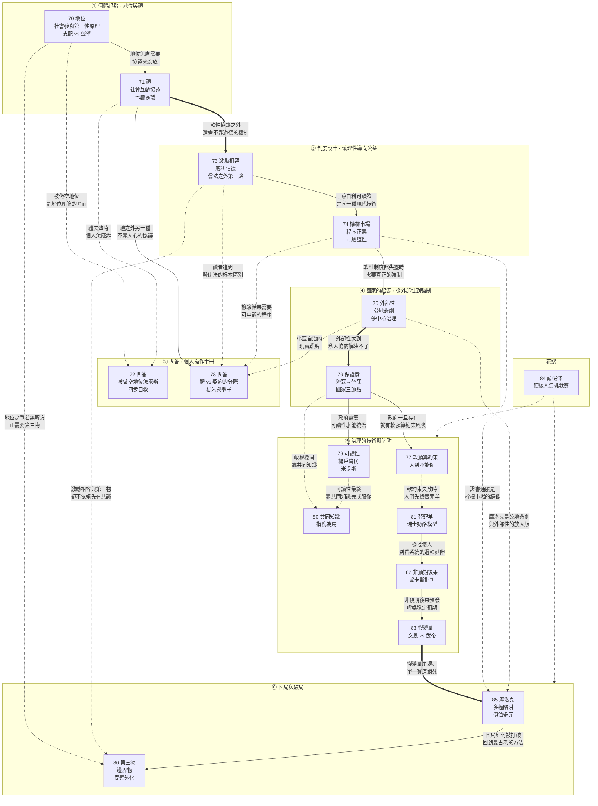

# E06 模組五：參與者（第 070～086 講）

> 來源：《現代思維工具課》模組五「社會參與 / 制度與賽局」
> 涵蓋：070地位、071禮、072問答（被做空地位）、073激勵相容、074檸檬市場、075外部性、076保護費和公共契約、077軟預算約束、078問答（禮與契約）、079可讀性、080共同知識、081替罪羊、082非預期後果、083慢變量、084請假條（硬核人類挑戰賽）、085摩洛克、086第三物

070 講開篇點明「這一講開始咱們進入『社會與經濟』模塊。但我們不是宏觀視角，我們設想你是一個參與者」；086 講收官則回望整個模塊：「我們這個社會系列講了這麼多，其實一直在研究一個既古老又現代的問題：人與人的地位、利益、身份、信念各不相同，怎麼還能和平共處、有效合作呢？」所以 070～086 這十七講（含 084 一篇插曲式的請假通知）構成一個完整模塊——回答「作為一個要跟人協作、組隊、交易、競爭甚至爭鬥的參與者，該如何理解地位、禮俗、制度、國家與困局，並找到讓合作發生的操作方法」。

本模塊的整體骨架可以概括為六層：

1. **個體起點**（070、071）：地位是社會參與的第一性原理，禮是把地位焦慮工程化為可操作協議的技術；
2. **問答補強**（072、078）：把地位與禮的理論落回個人操作手冊——被做空地位怎麼辦、禮與契約各自的適用邊界；
3. **制度設計的邏輯**（073、074）：激勵相容讓個體理性自動導向集體利益，檸檬市場理論則說明現代制度的天才之處是「把善惡變得可驗證」而非直接揚善懲惡；
4. **國家的起源與強制**（075、076）：外部性證明自由社會也需要強制，政府的真實起源是保護費而非社會契約的理性設計；
5. **治理的技術與陷阱**（077、079、080、081、082、083）：軟預算約束、可讀性、共同知識、替罪羊、非預期後果、慢變量——六個角度分別回答政府如何失靈、如何統治、如何服眾、如何面對失敗、如何被馴服；
6. **困局與破局**（085、086）：摩洛克揭示東亞內卷的多極陷阱結構，第三物則給出一個古老卻常被忽視的答案——合作不必先有共識。

（084 是一篇插曲式的請假通知與挑戰賽公告，不含實質思維工具，但恰好標記了模塊內部「070～083 為前半、085～086 收官」這條敘事分割線，故仍完整收錄。）

值得注意的是，這六層並非彼此孤立的知識點堆疊，而是一次由近及遠、再收攏回近處的視角切換：070、071 從「一個人如何被別人看待」出發，073、074 切換到「一套規則如何讓陌生人自動合作」，075、076 再切換到「暴力與強制從何而來」，077～083 停留在「已經存在的國家如何避免自我毀滅」，最後 085、086 把鏡頭重新拉回到每一個個體都會遇到的兩種局面——被鎖死在單一賽道里，以及該如何在缺乏共識時仍然行動。這條由個體到國家、再由國家回到個體的弧線，正是本模塊區別於單純政治學或經濟學教材的地方：它始終沒有忘記開篇那句「設想你是一個參與者」。

貫穿全模塊的一條主線是：**現代文明的核心技藝，是把「要求人做好人」的道德工程，替換成「讓好壞可驗證、讓理性可對齊」的制度工程。** 從禮的協議化、激勵相容的機制設計，到檸檬市場的程序正義、慢變量的穩定預期，萬維鋼反覆示範同一個動作——不去追問「這個人好不好」，而去追問「這個系統行不行」。

---

## 一、逐講重點摘要

### 070 地位：社會參與的第一性原理（模塊開篇）

- 開篇點題：這一講開始進入「社會與經濟」模塊，但採取的是參與者視角而非宏觀視角。萬維鋼提出一個「隱秘卻極其重要」的觀察社會的指標，稱之為「社會參與的第一性原理」——**地位（Social Status）**。「一群人聚在一起聊天互動，如果你不能在五分鐘之內分辨出在場誰地位高、誰地位低，你恐怕不是一個合格的靈長類動物。」
- 兩個生活案例揭示地位之爭的隱蔽性：夫妻為半杯牛奶、兩隻襪子吵架，爭的其實不是家務分擔而是「家庭主導權」；職場周會上產品經理與主管爭論該不該接入大模型，爭的其實是「團隊的認知解釋權」。**「表面上的觀點之爭、品味之爭、效率之爭，甚至利益之爭、正義之爭，背後往往是地位之爭。」**
- 定義：地位是「社會對你的主觀估值」，是「別人願意在多大程度上把你的話當真，進而把你的利益納入共同體考量」。學術共識（Anderson, Hildreth & Howland 2015）認為追求地位是一種極其基礎的人類動機，關鍵詞是「他人」和「自願」——**「不管你怎麼追求，你的地位都不是由你——而是由他人決定的。」**
- 馬克·利里（Mark Leary）「社會計量器理論（sociometer theory）」：自尊其實是大腦裡監測地位的雷達儀表盤。羞恥＝「我在別人心中的價格暴跌」；驕傲＝「我的社會估值得到了確認」；憤怒常常是「你憑什麼調低我的評級？！」低社會排名感與抑鬱症狀、自殺意念、自傷風險之間存在系統性強關聯。
- 「本地階梯效應（local-ladder effect）」：地位是排行榜，不是溫度計，只在乎面對面小群體裡的相對位置。2020 年「班級第一的重要性」論文發現：數學絕對實力 90 分但常年校排第一的學生，比絕對實力 95 分卻在天才班排中下游的學生，更可能未來從事數學相關領域——真正起作用的是「同輩排名（Ordinal Rank）」而非絕對水平。**「平台給你資源，但地位敘事給你動力。」**
- 約瑟夫·亨里奇（Joseph Henrich）等人的經典理論：爭取地位有兩條途徑——「支配（dominance）」靠權力、資源和恐懼；「聲望（prestige）」靠能力、知識和慷慨。**「聲望是一片引力場，支配是一口高壓鍋。」**支配是一種戰時模式，局勢危急混亂時人們才本能呼喚強人。
- 二維模型「能力（competence）×溫暖（warmth）」（Fiske, Cuddy & Glick 2007）：能力高溫暖高＝聲望型地位；能力高溫暖低＝或多或少的支配型地位，人們羨慕但警惕；能力低溫暖高＝好人但不被信任能做成事；能力低溫暖低＝被邊緣化。「能力高、溫暖低」是最該提醒的象限——奢侈品的溫暖也很低，是一種在自己和他人之間建立屏障的地位展示。**「記住，既要展示能力，更要展示善意。否則你收獲的只是防禦而不是聲望。」**
- 「二階效應」與核心心法：一階效應是每個人都想追求地位，二階效應是接收方不喜歡支配型操作。約翰·戈特曼（John Gottman）研究發現，預測夫妻離婚最危險的信號不是批評、防禦或冷戰，而是「蔑視（contempt）」——**「蔑視是對對方地位的公開處刑。」**核心心法只有一句：**「永遠不要無故做空別人的地位。」**不但不要蔑視，而且也不要讓人難堪——想糾錯最好私下交流，不要當眾指出他人的錯誤。
- 「地位飢餓」的警示：**「地位飢餓的人是醜陋的。別人提個不同意見他就覺得被冒犯；他不放過任何一個打壓新人的機會；他把任何動作都變成了一場表演。」**這是一種極度的不安全感，但悖論在於「地位飢餓只會讓人更沒有地位」。你能直接追求的是能耐和貢獻，而不是地位本身。
- 收束：地位是能耐和貢獻的副產品，你無法直接抓住地位，但可以成為一個值得擁有地位的人。萬維鋼特別提到中國作為熟人社會，「面子和地位的權重可能就更大」，即便面對如霍金那樣的世界級學者，人依然得尊重別人的地位——「這不是市儈，這是慈悲。」

### 071 禮：社會互動協議

- 承接上一講：地位焦慮若每次互動都要靠猜測應付，會太內耗、太危險。人類早在幾千年前就找到工程化解法——中國人說的「禮」。**「禮的本質，是一套『社會互動協議』」**，而不是飯桌座次、魚頭朝向那套「中年男子團建玄學」。
- 司馬光《資治通鑑》開篇「天子之職莫大於禮，禮莫大於分，分莫大於名」被重新解讀：司馬光真正想要的不是維護天子權威，而是秩序。**「禮的根本目的，就是給社會提供確定性秩序。」**其存在的根本原因不是身份等級（早已過時），而是人心的地位本能。
- 王煜全的洞見：中國熟人社會的科技產業鏈上，多家企業能形成超越法律合同的長期信任關係，高效深層協作——這個機制就是禮。經濟學家布倫南與政治哲學家佩蒂特（Geoffrey Brennan & Philip Pettit）提出「尊重經濟（the economy of esteem）」：市場的看不見的手、法律的鐵拳之外，還有第三隻手——人人追逐他人尊重與好名聲構成的獨立社會激勵機制。**「禮，就是價值觀的可執行文件，是『尊重經濟』的交易協議。」**
- 禮拆解為七層協議：身份確認（孔子「必也正名乎！名不正則言不順」）、地位確認（安排次序降低衝突）、握手程序（互聯網「握手 handshake」的類比）、語義協議（裸信息容易引發歧義，必須用禮包裹）、錯誤修復協議（道歉不是證明我無罪，而是修復對方受損的地位）、情緒協議（儀式讓情緒被組織成公共事實）、共同預期（最本質的一層，不必說破大家也知道該怎麼做）。
- 托馬斯·謝林（Thomas Schelling）「聚焦點（Focal Point）」理論：陌生人約好某天在紐約見面卻沒約時間地點，多數人答案驚人集中——「中午，中央車站問詢處的大鐘下」。**「禮的終極作用就是提供了社會焦點。」**只要大家都按禮的流程走，衝突就能最小化，合作就能最大化。
- 東西方之別只在打包方式：中國把禮做成一個總操作系統，西方拆成禮儀規範、舉止教養、公民性、正式禮典、職業操守、人身界域等模塊。戈夫曼（Erving Goffman）提出「臉面（face）」概念，對應中國人講的「給面子」；山岸俊男（Toshio Yamagishi）指出：強關係網絡的禮提供「安心」，開放社會的禮提供「信任」。
- 禮按可靠性厚度分四層：行為層（稱謂寒暄座次語氣，防誤傷）、關係層（好朋友可省掉客套，低形式感反而是親密信號）、情感層（醫生說話衝但意圖真心為你好）、制度層（制度足夠確定就不需要先找關係打招呼）。
- 錯誤修復協議的現實反例：**「今天的社交媒體為什麼戾氣這麼重？因為那裡只有截圖、圍攻、翻舊賬，沒有一套體面的錯誤修復協議。沒有禮的社會，一次冒犯會被永久記賬；有禮，關係才有一個重啟按鈕。」**這解釋了為何線上衝突比線下更難降溫——不是人變壞了，而是協議缺失了。
- 現代禮的重新分配：從跪拜請安轉向隱私、知情同意、準時、透明、程序正義——「未經同意轉發聊天記錄是失禮，開會遲到十五分鐘不解釋是失禮」。收束小詩：**「幸有一層禮，先把人安放。桥窄心须宽，相逢不必防。」**「禮不是牆，是橋上的欄杆。」

### 072 問答：處於被領導做空地位的狀態怎麼辦？

- 本篇是往期問答集錦，涉及多個舊主題的讀者回覆，最貼合本模塊的是對 070 地位講的回覆。
- 開篇回覆《傑文斯悖論》關於 AI 取代放射科醫生的討論：AI 不是全知的，它不能自動知道患者為什麼來醫院、怕什麼、能不能承受檢查；臨床這門業務的核心難點是「定題」而非「答題」——「有了 AI，臨床里最難的就不是答題，而是『定題』」。杰文斯悖論指效率提高會釋放其他需求（AI 模型審計、醫療責任保險、數據治理、患者解釋、過度檢查控制都會變成新工作）。
- 回覆《平台》討論 AI Agent 能否繞過平台：平台之所以必要，是因為它替社會解決發現、信任、支付、糾紛四個麻煩；即便機制開源，也還有入口問題——**「這就是新的平台位置：不是誰擁有商家，而是誰擁有用戶的默認 agent。」**「平台最強的地方，是陌生人大市場；平台最弱的地方，是熟人小市場。」
- 回覆《托付》關於畢業生建議：學歷貶值局面下必須先表現出可托付性——**「你需要拿『作品集』。」**哪怕是幾段短視頻、一個上架的 APP，最好是真實解決過並完成交付的東西。企業家在乎的是動手能力，特別是「手要快」。
- 核心段落——回覆 070 地位講：分析被領導「做空」地位的機制。**「老實人遇到挫折總愛先找自己的原因……但現實很可能是系統有問題。如果你的領導已經決定做空你，那這就不是心態問題，這是定價權問題。」**領導做空下屬地位會做三件事：減少信用、切斷資源、降低可見性——不正面否定但讓你干最難的事而成果變成「團隊共同努力」；讓你承擔責任但不給相應權限。
- 提出四步驟自救方案：第一，**保留證據**（沒有證據的功勞等於沒有發生）；第二，**建立繞開領導的更大可見性**（讓協作部門、上級的上級、客戶都能看見你的價值）；第三，**積累可遷移資產**（技能、作品、客戶理解、行業判斷、項目經驗、人脈要長在自己身上，不能只長在當前崗位）；第四，**設定止損線**（給自己一個期限，資源評價機會若無改善就不再向系統乞討認可）。**「一個壞系統最怕你變得可移動。」**「知道自己在積累證據、擴大可見性、建設可遷移資產、準備退出選項，你的情緒自然就變好了。」

### 073 激勵相容：好的制度不應該指望人「畏威懷德」

- 破題案例：一位中國企業家在非洲開廠，起初待遇優厚講平等尊重，結果工人遲到曠工偷竊；改用凶狠監工手段後，工廠反而走上正軌。這種「畏威而不懷德」的困境引出傳統中國兩千年的兩套解決方案——儒家的「教化」（懷德）與法家的「賞罰」（畏威）。
- 但現代世界靠的是第三種東西——**「激勵相容（Incentive Compatibility）」**：波蘭裔美國經濟學家列奧尼德·赫維茨（Leonid Hurwicz）1972 年系統提出，因「機制設計（mechanism design）」的開創性工作獲 2007 年諾貝爾經濟學獎。機制設計問的是「逆問題」：我想要一個什麼結果，能否反推一套規則讓大家自願玩出這個結果。
- 定義：**「好的制度既不應該要求人是好人，也不應該像對待壞人一樣去控制人——而應該讓普通人，在追求自身利益的同時，順手就能完成制度想要的事情。」**「制度的最高境界不是戰勝人性，而是讓人性為秩序打工。」
- 案例對照：企業軟件公司銷售虛假承諾產品功能的問題——儒家方案（價值觀工作坊）銷售聽得熱淚盈眶回去照舊忽悠；法家方案（虛假承諾扣半年獎金/開除）導致銷售玩文字遊戲、刪錄音；激勵相容方案是重新設計提成結構：簽約時、使用三個月後、續約時分階段發放佣金，客戶因「承諾不符」流失則追回已發佣金——**「銷售們自己就會採取對公司最有利的做法。」**
- 區分「參與約束（participation constraint）」與「激勵約束（incentive constraint）」：條件好只解決「值不值得來」，機制才確保「來了以後為什麼要認真幹」。經濟史學家西德尼·波拉德（Sidney Pollard）研究英國工業革命早期工廠：現代工人是被制度訓練出來的，並非天然適應紀律。
- 一套激勵相容的工廠制度：**「威、利、信、德」**四步驟——威是規則確定性而非棍棒（遲到質量事故處理事前寫清、過程可記錄、一視同仁）；利是可測量任務用計件工資（人事經濟學家愛德華·拉齊爾 Edward Lazear 研究：汽車玻璃安裝工改計件工資後生產率提高 44%，一半來自變努力、一半來自懶散者被篩走）；信是短周期甚至日結（發展中國家工人不是不懂激勵而是不信激勵）；德是晉升階梯與小隊制（服裝廠從個人計件轉團隊計件，生產率平均提高 14%）。
- 強激勵 vs 弱激勵的區分：「算法性（algorithmic）任務」（結果單一、過程清晰、易測量，如送外賣、流水線裝配）適合強激勵；「啟發性（heuristic）任務」（多維度、看判斷、講長期、靠協作，如科學家、官員、醫生）用強激勵反而異化整個工作——**「你強激勵什麼，人們就會拼命地優化什麼」**，按論文發表篇數給科學家發獎金，科學家就會拼命發表毫無意義的論文，這觸發了「多任務委托代理問題」與「古德哈特定律（Goodhart's Law）」。啟發性任務最好自我驅動、講究內在動機，根據「自我決定理論」，適合弱激勵（高底薪、長期合約、自主權、身份榮譽、成長通道）。丹尼爾·平克（Daniel Pink）《Drive》一書系統論證了這一點。
- 思想源流：老子「法令滋彰，盜賊多有」；大衛·休謨（David Hume）1741 年「應當假定每個人都是無賴」；詹姆斯·麥迪遜（James Madison）《聯邦黨人文集》第 51 篇「如果人人都是天使，就不需要政府了」「必須用野心來對抗野心」；羅傑·邁爾森（Roger Myerson）1979 年「顯示原理（revelation principle）」證明可設計出讓「說真話」成為最優策略的直接機制，獲 2007 年諾貝爾經濟學獎；鄧小平 1980 年「制度好可以使壞人無法任意橫行，制度不好可以使好人無法充分做好事，甚至會走向反面」——**「他這句話顛倒了傳統中國『先選好人，再辦好事』的思路，其實說的就是激勵相容。」**

### 074 檸檬市場：不要直接揚善懲惡，要讓好壞可驗證

- 破題現象：「第一學歷崇拜」——碩博學歷嚴重貶值，論文查重制度荒謬（默認查重率不超標就算沒問題），AI 加劇了整條裝模作樣的鏈條（學生用 AI 寫論文、老師用 AI 審稿、學校用 AI 查重、學生再用 AI 降重）。學位證書和學術發表正在變成一個「檸檬市場」。
- 喬治·阿克洛夫（George A. Akerlof）1970 年提出「檸檬市場（market for lemons）」，2001 年諾貝爾經濟學獎。二手車信息不對稱推演：買家因分不清好壞而壓低出價 → 好車車主退出（不願跟劣車平均價賣）→ 壞車車主留下 → 壞車比例升高，買家更不信任 → 價格進一步下降 → 更多好車退出——這是一個「死亡螺旋（death spiral）」，劣幣驅逐良幣直到良幣消失。
- **「柠檬市場最可怕的並不是這裡有壞貨，而是好貨無法被識別出來，所以只能離開。」**案例：截至 2022 年 6 月被撤稿的論文工廠論文共 1,182 篇，幾乎全部作者來自中國機構，超四分之三第一作者單位是醫院——因為職稱評價體系要求發論文，「醫生的首要任務不是治病救人嗎？」全體中國醫生寫的論文因此都被降級了信任度。
- 現代文明避免柠檬化的機制：主動發昂貴信號（保修、允許退貨）、第三方認證（同行評議、行業標準）、聲譽機制（交易記錄與評分）、糾紛解決與申訴機制。現實中的二手車市場也比阿克洛夫描述的原始狀態好得多——車輛識別碼、事故記錄、維修記錄、保修制度、問題車退換法（Lemon Law）和車輛歷史報告，都是治理柠檬市場的具體工程。淘寶案例：擔保交易（買家先付第三方，確認收貨後錢再給賣家）+店鋪評分+聊天記錄+物流記錄+平台仲裁，讓陌生人建立最低限度信任——**「假貨並沒有把好貨驅逐出去。」**你花 139.9 元包郵買一雙「名牌同款」鞋，心裡知道它大概率是什麼東西，下次要買正品照樣回這個平台只是換去旗艦店，只要真假不混淆，有假貨不等於柠檬市場。
- 更深層機制名字是「程序正義（procedural justice）」：不先問誰該贏誰該輸，而是把規則說清、證據擺開、過程公開、給錯誤留可申訴通道。耶魯社會心理學家湯姆·泰勒（Tom R. Tyler）《人為什麼服從法律》：1984 年對芝加哥 1,575 名居民電話訪談，一年後回訪 804 人，發現人服從法律不只因怕懲罰，更因相信程序公正、中立、可解釋、尊重人。**「放過一個壞人對系統的傷害遠遠小於錯殺一個好人。」**
- 應用延伸到公司晉升與學術評議：「我們獎勵真正有貢獻的人」若無可操作標準（誰評價？如何平衡短期長期？被評價者能否申訴？），就會變成柠檬化——「獎勵貢獻者」實際上變成「獎勵會表現貢獻的人」。高考被信任正因程序正義（題目封存、統一時間標準、匿名閱卷、成績公開可查）。
- 法學界「布萊克斯通比率（Blackstone's ratio）」作為程序正義的古典表達：「寧可放過十個有罪的人，也不可冤枉一個無辜的人」——這也是耶魯社會心理學家湯姆·泰勒研究的司法程序為何寧可讓人不爽（要求證據、聽辯護、仍要審）也要堅守的原因：**「放過一個壞人對系統的傷害遠遠小於錯殺一個好人。」**
- 收束：**「現代社會變好，靠的不是要求大家做好人，而是要求大家有一個好制度。」「成熟制度不是『揚善懲惡』的機器，而是『把善惡變得可驗證』的機器。」「揚善懲惡是前現代社會的願望；可驗證性是現代制度的技術。」「現代人不說『相信我』。現代人說：『這是你檢查我的方法。』」**

### 075 外部性：為什麼自由社會也需要強制

- 承上啟下：禮、激勵相容、程序正義都是「軟性制度」——沒有強制，靠自願。但這一講要說：**自由社會也需要強制**，這一切的起源叫做「外部性」。阿瑟·庇古（A. C. Pigou）1920 年《福利經濟學》系統化這一概念。
- 定義與案例：**「外部性就是做一件事的人不完整承擔他這件事的後果。」**宿舍室友自己炒菜產生油煙，是「負外部性（negative externality）」；鄰居小孩受教育讓整個社會犯罪率降低、稅收提高，是「正外部性（positive externality）」。**「負外部性是我得利、別人付費；正外部性是我付出、別人受益。」**結果是壞事過量、好事不足——私人賬本和社會賬本對不上。
- 保羅·薩繆爾森（Paul Samuelson）1954 年嚴格論證「公共品（public goods）」概念：非排他性（很難因一人沒交錢就不讓他用）+非競爭性（一人用不影響別人用）。曼瑟·奧爾森（Mancur Olson）1965 年《集體行動的邏輯》提出「搭便車（free riding）」：老舊小區裝電梯案例——反正建好後大家隨便用，理性選擇就是不交錢，「群體越大，搭便車就越容易」。
- 羅納德·科斯（Ronald Coase）1960 年《社會成本問題》，1991 年諾貝爾經濟學獎：養牛人與種麥農民案例——只要產權清晰、交易成本為零，雙方協商就能自動解決外部性，不需要政府干預。但現實中「產權本身就是一種公共品」——一個能保護產權的社會秩序，本身需要被建設、被維護、被強制執行，問題又甩回了強制層面。**「科斯真正的遺產不是『產權萬能』，而是：選擇制度之前，先計算交易成本。」**
- 加勒特·哈丁（Garrett Hardin）1968 年《公地悲劇》：公共草地每個牧民多放一頭牛收益歸己、損失均攤，結果是每個人都拼命加牛直到草場毀掉。主流經濟學界從此相信二分法：政府接管，或私有化，沒有第三條路。
- 埃莉諾·奧斯特羅姆（Elinor Ostrom）走遍全球考察小型社區如何在無政府強制也無私有化的情況下管理公共資源，2009 年諾貝爾經濟學獎。瑞士山村特爾貝爾（Törbel）案例：十五世紀起的集體契約規定「**冬天養不起的牛，夏天就不能趕到公共牧場上去**」——把難監督的「夏天誰家牛吃多少草」轉化為易監督的「冬天數一數各家有幾頭牛」，數百年無公地悲劇。
- 奧斯特羅姆「多中心治理（polycentric governance）」8 條自治原則：邊界清晰、規則從下往上長、受約束者可改規則、監督內生、懲罰分級、糾紛解決便宜、上級政府承認自治、複雜問題嵌套治理——可對應費孝通《鄉土中國》「無訟」傳統，也能直接套用到小區裝電梯的實操方案（哪個單元裝哪個單元負責、樓層高多出錢、業主共同監督賬目、分級懲罰搭便車者）。
- 奧斯特羅姆這套思想被稱為「多中心治理（polycentric governance）」，萬維鋼特別提醒可與費孝通《鄉土中國》「無訟」傳統對照——本鄉本土的矛盾盡量在本鄉本土協商解決，而不折騰到官府那裡去，這與瑞士山村的邏輯異曲同工。8 條原則裡最關鍵的是「沒有一條說實在不行就請求政府介入」，說明自治的核心不是抗拒政府，而是把能自己解決的問題留在最貼近現場的那一層解決。
- 收束：**「奧斯特羅姆告訴我們小社區可以自治，但是這並不意味著社會就不再需要強制。當一個群體太大、成員變得匿名、外部性跨越地域、衝突有可能升級為暴力的時候，我們終究還是需要一個擁有最終強制力的組織出面管理。」**這個組織，就是政府。

### 076 保護費和公共契約：政府的演化

- 開篇反轉常識：政府不是讀書人坐下來理性設計出的產物——**「歷史的真相更接近於……政府起源於強盜。」「政府的歷史，就是把保護費改造成稅收，把統治者改造成代理人，把臣民改造成公民的歷史。」**
- 曼瑟·奧爾森（Mancur Olson）「流動強盜（roving bandit，流寇）」演化為「定居強盜（stationary bandit，坐寇）」的邏輯：抢光了明年沒得抢，不如占村征收三成，讓村民休養生息——長期主義思維的一次觀念躍遷讓「寇」變成了「統治者」。現實案例：黎巴嫩真主黨、西西里黑手黨、墨西哥毒販集團都一邊犯罪一邊提供治安、判案、修學校等秩序服務。
- 大衛·格雷伯與大衛·溫格羅《人類新史》：許多先民社會有複雜自治能力，但那是因為沒進入規模化農業，沒有太多可搶的東西。一旦值得搶，就會陷入霍布斯《利維坦》「一切人對一切人的戰爭」，人們就會盼望利維坦出現、簽個契約交保護費。馬克斯·韋伯（Max Weber）定義：國家是在一定疆域內成功主張「合法物理暴力壟斷（monopoly of legitimate violence）」的人類共同體。
- 政府與其他組織的根本區別：**「公司可以開除你，但不能關押你。平台可以收費，但不能徵稅。學校可以教課，但不能規定哪個學說是正統。」**——不在於服務更好或更仁慈，而在於擁有最終強制權。
- 查爾斯·蒂利（Charles Tilly）1985 年論文《作為有組織犯罪的戰爭製造和國家製造》：「戰爭製造國家，國家製造戰爭」——坐寇之間打仗逼著建軍隊、多收稅、養官僚，輸的被吞併贏的變強。萬維鋼舉張作霖為例：從「趙家廟保險隊隊長」一路演化成「東三省保安總司令」，正是流寇到坐寇、坐寇到國家機器的縮影版演化。詹姆斯·斯科特（James C. Scott）洞見：**谷物是理想的徵稅對象**——可估算、有固定收獲季、高度可量化、可儲存、農民被綁定在土地上（對比游牧民族難以徵稅或抓壯丁）。這解釋了為何農業核心區（中國、兩河流域、印度、埃及）走向大一統帝國，而歐洲因缺乏單一農業心臟而長期破碎。
- 前現代國家＝「家產制（patrimonialism）」：老百姓被視為汲取資源，《商君書》直接主張「弱民」，《韓非子》「君上之於民也，有難則用其死，安平則盡其力」。歷史作家張宏杰統計：中國歷史上 611 位皇帝，死於疾病衰老僅 339 人，自殺他殺 272 人，非正常死亡率高達 44%，平均壽命僅 39.2 歲——家產制把不受外部約束的巨大權力交給普通肉身，形成猜忌→依賴私人忠誠→制度更壞的死循環。秦暉總結「黃宗羲定律」：輕徭薄賦→官僚自我擴張→加稅→改革者並稅→再生新雜稅的循環，最終流民增多、民變、王朝崩潰、新王朝重建、再來一遍。
- 現代國家演化的三個節點——都不是思想家推動，而是力量對比逼出的制度：**1215 年英格蘭《大憲章》**（國王約翰對外打仗連續失敗被迫加稅，貴族武力逼簽，第 61 條允許貴族選 25 人監督國王履約）；**1688 年光榮革命**（英國上層精英為保權財，換掉不受約束的國王，《權利法案》規定國王未經議會同意不能徵稅、不能停止法律施行、不能維持常備軍）；**1787 年美國制憲**（分權制衡，麥迪遜「用野心對抗野心」；華盛頓不稱帝既因思想先進，也因權力本就有限）。愛德華·科克（Edward Coke）與約翰·洛克（John Locke）更多是把歷史變局合法化，而非直接推動。
- 收束：**「限制權力不是寫在紙上，而是寫在權力分佈裡。」「人民需要政府建立秩序，但政府的出身是坐寇。而現代化，就是哪怕你是個坐寇，也要把你工程化。」**現代政府雖提供正外部性，但也是最大的負外部性製造者——引出下一講。
### 077 軟預算約束：有人兜底，責任就會變形

- 開篇兩組平行案例：父母不斷幫已成年、熱衷高消費欠債的孩子還信用卡/花呗/借呗；公司超預算項目一千萬花到一半再追加五百萬又五百萬，最後沒錢也沒成，報告卻寫「探索了路徑，積累了經驗」。**「這兩件事背後是同一個機制：拍板花錢的人，不是最後買單的人。」**
- 匈牙利經濟學家雅諾什·科爾奈（János Kornai）上世紀七八十年代提出「軟預算約束（soft budget constraint）」，研究匈牙利、南斯拉夫國營企業長期虧損卻不倒閉的怪現象——因為國家會免稅、給低息貸款、發補貼填窟窿。2003 年綜述論文進一步指出，軟預算約束不只屬於社會主義經濟，本質是一個「動態承諾問題（dynamic commitment problem）」：**「哪怕你事先發狠話說『絕不兜底』，事到臨頭，往往也會發現還是得救，於是食言。」**
- 2008 年金融危機「大到不能倒（too big to fail）」：雷曼兄弟倒閉引發恐慌後，美聯儲和國會對 AIG 大規模注資；監管者吸取教訓——救援不能救得太舒服（不能連股東管理層債權人都一併保護）。2023 年硅谷銀行（Silicon Valley Bank）案例更精細：啟用「系統性風險例外」保護全部儲戶存款，但銀行股東血本無歸、高管被撤換、部分無擔保債權人不受保護——「我救的是系統，不是獎勵你們亂來」。
- 兩個諾貝爾獎級別的理論支撐：芬恩·基德蘭德（Finn Kydland）與愛德華·普雷斯科特（Edward Prescott，2004 年諾貝爾獎）——時間上的動態不一致，事前應承諾「誰出事我都不救」，但站在事後那個時間點，救援往往比放任崩盤更理性，於是市場早就預見政府會改主意，「事後最理性的救援，恰恰製造了事前最大膽的冒險」。埃馬紐埃爾·法爾希（Emmanuel Farhi）與讓·梯若爾（Jean Tirole，2014 年諾貝爾獎）——空間上的集體道德風險：金融機構最聰明的做法未必是降低自家風險，而是把風險搞得跟大家一樣（期限錯配），「法不責眾」的金融版。
- 邁克爾·詹森（Michael Jensen）「帝國建造（empire building）」：經理人有動力做大組織規模，這與股東利益背道而馳。威廉·尼斯坎南（William Niskanen）「預算最大化官僚（budget-maximizing bureaucrat）」：官僚追求的是掌管的預算規模。中國「晉升錦標賽（promotion tournament）」（李宏彬、周黎安研究）：省級官員升遷概率與當地經濟增長率顯著正相關，這推動了地方融資平台與城投債的擴張——「曾經的政績變成了債務和過剩的產能」。日本 1991-2001「失去的十年」僵屍企業（Caballero, Hoshi & Kashyap 研究）：銀行為不讓壞賬暴露反而給最該破產的企業續命。
- 米爾頓·弗里德曼（Milton Friedman）「花錢四象限」：花自己的錢辦自己的事最省最講效果，花別人的錢辦別人的事最浪費。「貝內特假說（Bennett Hypothesis）」：美國教育部長威廉·貝內特 1987 年提出，聯邦助學貸款越慷慨大學學費漲得越凶；2019 年論文量化：聯邦補貼貸款每多 1 美元，大學學費就往上抬約 60 美分。
- 醫療領域的軟預算約束：醫療保險本質上也是軟預算約束——看病花的是保險公司和政府給的錢，醫生和病人都沒那麼在乎藥品價格，這是「現代化的潮流是物越來越便宜，人越來越貴，可是美國醫療器械和藥品的價格可沒有變便宜」的部分原因。
- 兩種「敘事能力」讓人盡情花別人的錢：**「鬧」**（把自己的失敗說成所有人的麻煩，「按鬧分配」，「會哭的孩子有奶吃，不是因為他更餓，而是因為他讓全屋人都聽見了他的餓」）與**「包裝」**（把自己的利益說成大局的安全，如「這不是產能過剩，這是保障供應鏈安全的戰略儲備」）。收束小詩：**「預算本是尺，人情把尺彎。今日救一寸，明日債成山。」「愛要有邊界，救助得有附加條件，支持不是兜底，容錯不是免責，權力跟責任應該對等。」**

### 078 問答：什麼時候用禮，什麼時候用契約？

- 本篇是往期問答集錦，覆蓋 071 禮、073 激勵相容、074 檸檬市場、075 外部性、076 保護費多講的讀者回覆，以及對新一代大模型 Fable 5 的體感分享。
- 回覆 071 禮：禮的信任來自關係（把關係搞「好」以便辦事），契約的信任來自制度（相信制度、不必深度信任個人）。**「禮適用於身份會反覆相遇、關係會持續的場景」**（小縣城）；契約適合大城市陌生人社會的一次性標準化交易。**「契約是讓你不必深度信任也能合作。」**要建立深度關係，必須在同一場域之外多次重逢——「這一切都是由互動模式決定的，而不是由『人的本質』決定的」。
- 禮的最大壞處是等級的確認，走到極致就是「封建禮教」——把利益索取說成情分、把權力壓迫說成規矩。但高端中國文化的禮要求「對等的義務」：**「君君臣臣，父父子子」**是不對稱的互惠，孟子最硬核：「君之視臣如手足，則臣視君如腹心；君之視臣如土芥，則臣視君如寇仇。」若對方不尊重你的地位，孟子的答案是「那太好辦了！你都不尊重我的地位了，我怎麼還能尊重你的地位呢？當然翻臉啊。」
- 回覆 073 激勵相容：澄清這不是「儒家法家的中間值」，而是儒法之外承認人有權為自身利益打算的現代思想。中國古代苗頭：**楊朱**「人人不損一毫，人人不利天下，天下治矣」——已有激勵相容的味道，但因要求約束包括制定規則的君主而與君主制不兼容；**墨子**「兼愛」是絕對平等的集體主義，卻與家庭關係不兼容（「你把父親往哪兒放？」）。孟子「楊氏為我，是無君也；墨氏兼愛，是無父也」精準解釋了兩者為何最終失敗。
- 回覆 074 檸檬市場：發出昂貴信號的具體辦法是「交付一個小成品」——不必花哨，但必須親手做出且拿來就能用。**「你交付的是一個結果，而不是態度。」**
- 回覆 075 外部性：小區自治最大難點是小區並非大多數人的真實共同體（白天在公司、社交在別處）。解方是專業化（交給物業）加上有時間有意願的熱心參與者（長期業主、退休老人、社區商戶）挨家挨戶敲門，「這是最根本的公民義務，既符合中國古代的鄉賢傳統，也符合公民參與的現代民主精神」。
- 回覆 076 保護費：對新一代大模型 Fable 5 的體感——思想深度上與 GPT 5.5 Pro 各有勝負，但更直指人心；2026 年大模型比拼的是 Agent 能力，你只需定義交付標準；Fable 的驚喜是自動安排若干「子智能體（sub-agents）」協作分工，如同「孫悟空拔出一把毫毛，化作若干個分身跟他一起干活兒」。

### 079 可讀性：編戶齊民中的米提斯

- 破題現象：商業街統一招牌、出版社統一封面設計——大系統的原始衝動，追求的不是美觀而是「可讀性（legibility）」。美國政治學家詹姆斯·斯科特（James C. Scott）《國家的視角》（Seeing Like a State, 1998）提出這個概念：即便掌握絕對武力，統治者也必須先「讓社會可讀」才能有效徵稅徵兵。人類最早的文字記錄最多的不是詩歌情書，而是糧食、稅收和勞役。
- 中國古代版本叫「編戶齊民」：秦制中央管郡縣、郡縣管戶籍、地方什伍連坐；朱元璋時代登峰造極——用「黃冊」登記每個人、用「魚鱗圖冊」丈量每寸地，各家被設為軍戶、匠戶、灶戶、民戶、站戶、鋪戶、船戶、樂戶，世世代代不許改行。**「問題不是國家讀社會。問題是國家為了讀社會，反而把社會讀薄。」**
- 斯科特的經典案例：十八、十九世紀德國「科學林」——單一樹種、行距相等、橫平豎直的人工林一開始迎來林業大豐收；一個世紀後，被清走的真菌、昆蟲、鳥雀、枯枝、腐殖質（森林的免疫系統和營養循環）不再存在，地力枯竭、蟲害肆虐，整片林子死了，最終不得不把野性請回森林。**「國家看見的其實不是森林，而是木材。木猶如此，人何以堪。」**
- 張宏杰的河流比喻：中國人精神氣質從春秋（清澈剛健）到漢唐（泥沙俱下仍有雄大氣象）再到明清（水勢衰敗、麻木順從）的收縮——蒙學讀物從《千字文》「天地玄黃，宇宙洪荒」（格局宏大），到《三字經》「人之初，性本善」（伦理秩序），再到《弟子規》「父母呼，應勿緩」（服從細則），一層比一層細密的統治技術。「李約瑟難題」由此有了新解：明清聰明人都在考科舉，鏟平了長出創新突破的「野生地」。
- 過度可讀性讓治理機器自身變蠢變脆：秦制王朝統治力最強盛時都在前期（土地丈量戶口登記剛完成之際），但賬本謄清之日正是失真開始之日——人口流動、土地易主、地方胥吏造假，晚明晚清政府汲取能力反而下降，只會欺負農民。
- 核心概念「**米提斯（mētis）**」：斯科特借用的古希臘詞，指在不斷變化、從不重複的現場裡臨機應變、把事情做成的活智慧，「狡智」「權變智慧」。與「默會知識」不同的是：默會知識是「知道但說不出來」，米提斯是「只有在本地現場才知道」。案例：老鉗工摸機床斷定它今晚要出事，日誌里卻無一條報警；老編輯讀稿子直覺「這口氣不對」。
- 真正撐著系統運轉的是那些讀不到的人：清代紹興師爺靠師徒口傳、同鄉結網掌握律例的精確操作；山西票號靠同鄉宗族信用網絡把銀子變成可匯兌的信用，連朝廷和地方政府都得靠票號完成跨省調款；蘇聯計劃經濟靠萬能修理工與「tolkach（推手）」撐著運轉。**「編戶齊民喜歡培養可替換的人，但真正維持系統運轉的，是這些不可替換的人。他們不是體制的成就，甚至不是體制的恩賜。他們是體制的幸存者。」**
- 溫養米提斯的六個動作：**到場**（米提斯只能從有後果的現場長出，坐在辦公室裡長不出對教育的判斷）、**變式**（米提斯很難刻意練習，因為做的不是同一類型的題，必須見過一千個相似卻不相同的局面才能練出「差一點就完全不同」的辨別力）、**複盤**（沒有複盤的經驗只會制造疲憊油滑和偏見，感悟來自事後誠實的追問：我當時以為會發生什麼？實際發生了什麼？我漏掉了哪個信號？）、**結網**（米提斯的學習是一種「情境學習（situated learning）」，新人透過「合法邊緣參與（legitimate peripheral participation）」進入實踐共同體——Jean Lave 與 Etienne Wenger 的理論——訣竅不在 PPT 裡，而在「我跟你說，上次有個案子……」這種私下聊天中傳承）、**留痕**（建一份「厚檔案」：不為留分數和職級，而是留下你處理過的關鍵案例、作品的迭代、當時的判斷依據，以及那些幾乎就要出事卻被你攔下的「差一點就失敗」）、**轉譯**（把手感翻譯成制度能承認的「公開文本」，同時把真判斷放在指標看不見的「隱藏文本」裡）。斯科特提出「無政府主義柔體操」：偶爾違反無傷大雅的小規矩，不是為了破壞秩序而是為了提醒自己仍有判斷規則是否合理的能力——這源自他 1990 年在原東德十字路口，觀察到明明沒有一輛車、幾十個行人卻依然規規矩矩等紅燈的震撼。收束：**「身處編戶齊民之中，你能跟系統最好的關係，是『入格』，但不『入籠』。」**

### 080 共同知識：讓眾人服從的神器

- 破題現象：明明不喜歡某明星的作品，卻還是會關注他的票價、被他帶貨、在他面前莫名敬畏——**「你敬畏的到底是啥呢？不是他這個人，而是他聚集的目光——是『所有人都承認他很重要』這個事實。」**這個機制的名字是「**共同知識（common knowledge）**」，美國哲學家大衛·劉易斯（David K. Lewis）1969 年首先提出，以色列裔美國經濟學家羅伯特·奧曼（Robert Aumann）1976 年給出博弈論的嚴格形式化表達，並於 2005 年獲諾貝爾經濟學獎。
- 三層知識深淺：**私人知識**（我知道，但不知道你知不知道）、**共有知識**（我知道你也知道，但沒人挑明）、**共同知識**（我知道你知道而且我知道你知道你知道……層層嵌套直到無窮）。兩軍夾擊敵人的信使悖論：每多送一封確認信只是把確定性往前推一層，卻永遠留有下一層不確定，唯有面對面同時看見（如烽火）才能徹底解決。**「私人知識也許能讓你看見真相，共同知識才讓你敢於行動。」**
- 最經典案例：《皇帝的新衣》——每個人私下都認為皇帝光著身子，直到一個小孩喊出來，第一個人喊，第二個人跟著喊，共有知識瞬間升級為共同知識，眾人協調立即改變。
- 崔碩庸（Michael Suk-Young Chwe）《理性的儀式》（2001，扎克伯格曾推薦）：羅馬圓形劇場、麥加克爾白、方陣廣場等「向內的圈子（inward-facing circle）」讓每個人都能看見每個人在看，也看見他們也看見自己在看——**「儀式的作用就是把一條意義變成共同知識。」**超級碗廣告案例：2026 年 30 秒廣告約 800 萬美元、黃金位置約 1000 萬美元，商品早已家喻戶曉，花這筆錢買的不是信息而是製造共同知識——「讓你知道所有人都知道這個品牌還在場」。
- 應用於中國史：趙高「指鹿為馬」不只是忠誠度測驗，更是製造服從的儀式——讓每個大臣當眾親眼看見其他大臣都不敢反對，把私房心事澆築成共同知識；明清皇帝地位穩固（相較漢唐頻繁換帝），是因為門閥士族被清除後理學強化君臣名分，**「皇位是唯一的合法聚焦點」**成為所有勢力最大的共同知識。
- 「複雜大系統的失敗很難成為共同知識」：足球有終場哨和比分牌，但政治沒有——普京可以把俄烏戰爭失敗包裝成「另一種說法」，創業公司連續虧損可以用「戰略投入期」「市場教育期」層層改名。**「只要沒有一個公開的、共同承認的結算時刻，失敗就可以被改名、被延期、被包裝成下一輪融資的理由。」**
- 個人應用：把「我是真喜歡」和「大家都說好」拆開——「你會發現，很多所謂熱愛，不過是在向一個聚焦點鞠躬」；服從共同知識本身是理性的，「看破不一定說破」，重點是清醒地從眾而非盲目從眾。主動製造共同知識的方法是把 100 個人拉進一間屋子開全員大會，讓每個人的點頭被其他所有人當場看見，而非發 100 封郵件——「誰總能把混亂討論整理成一句大家都懂的話，誰就在製造共同知識；誰總能把私下的猶豫變成公開的承諾，誰就在製造共同知識。」收束：**「共同知識一旦建立起來，就絕難崩塌……但是會有一個臨界點……它不是被事實擊穿的，而是被事實變成共同知識擊穿的。」**

### 081 替罪羊：從「找壞人」到「看系統」

- 開篇區分「戲曲思維」與「系統思維」：老百姓問好人壞人，學者琢磨系統。明朝滅亡案例：崇禎殫精竭慮、吳三桂原本不想賣國——他們都是正常人，真正該問的是為什麼一群正常人理性行事卻把系統搞崩潰了。
- C. 賴特·米爾斯（C. Wright Mills）《社會學的想像力》（1959）：區分「**個人困擾（personal troubles）**」與「**公共議題（public issues）**」——十萬人城市裡一人失業是個人困擾，五千萬勞動力國家裡一千五百萬人失業就是公共議題，需要看經濟制度、產業結構、政策周期。馬克思《路易·波拿巴的霧月十八日》：「人們創造自己的歷史，但不是在他們自己選擇的條件下創造。」
- 李·羅斯（Lee Ross）1977 年提出「**基本歸因謬誤（fundamental attribution error）**」：解釋他人行為時高估性格品質意圖、低估處境和結構——別人遲到我們先想「沒時間觀念」而非堵車，基層員工犯錯先想「責任心差」而非工作量超載或流程有問題。
- 借鑑安全工程：詹姆斯·瑞森（James Reason）區分「人因視角（person approach）」與「系統視角（system approach）」，「顯性失誤（active failures）」與「潛在條件（latent conditions）」，提出**「瑞士奶酪模型（Swiss Cheese Model）」**——複雜系統的多層防線各有漏洞，平時洞是錯開的，某個時刻各層的洞排成一條線，事故就貫穿而出。**「我們無法改變人的本性，但可以改變人們工作的條件。」**
- 個體歸因的心理根源：草叢突然動了一下，把它理解成豹子（而非風吹）在原始環境中更有生存優勢——寧可誤判也別漏報他人惡意，這是遇到瘟疫、股災、事故時大腦難以接受「複雜系統在臨界點涌現」而執意要問「是誰幹的」的演化根源。馬克思在《路易·波拿巴的霧月十八日》裡也提到拿破侖發動政變是悲劇，其侄子路易·波拿巴發動政變則是鬧劇——但侄子偏偏當上了長久的皇帝，說明「人有選擇，但選擇發生在結構裡」。
- 兩個真實案例：**波音 737 MAX**——2018 年印尼獅航 610 航班（189 人遇難）+2019 年埃塞俄比亞航空 302 航班（157 人遇難）；真正原因是四層洞排成一線——MCAS 軟件誤判、培訓手冊淡化 MCAS 存在、為對抗空客競爭壓力倉促改造氣動特性、FAA 授權委任機制讓波音自我監管。**德州寒潮停電**（2021）——右翼輿論歸咎風力發電機，但調查顯示天然氣機組占故障機組 58%，真正問題是為躲避聯邦監管而孤立、未強制防凍改造的電網結構。
- 勒內·吉拉爾（René Girard）「**替罪羊機制（scapegoat mechanism）**」：共同體矛盾越大衝突快要失控時，人們無意識地把分散敵意集中到具體對象上，通過共同迫害恢復團結。**「替罪羊不是被找出來的原因，而是被選出來的出口。」**最熱衷維護替罪羊解釋的恰恰是系統裡最弱勢的群體——因為「有個壞人害了我」至少還是個有希望的故事。
- 戴維·馬克思（David Marx）「**公正文化算法（the Just Culture algorithm）**」三分法：**人人都可能有的差錯（human error）**——無心之失，不罰而改系統；**冒險行為（at-risk behavior）**——非有意作惡但冒了不該冒的險，重在訓練消除錯誤激勵；**魯莽違規行為（reckless behavior）**——明知重大風險仍為私利硬做，必須嚴厲追責。收束小詩：「莫向戲台尋白臉，且從制度問興亡。」**「找替罪羊是人的本能，但質疑系統也是現代人的本分。」**

### 082 非預期後果：好意圖怎麼會帶來壞結果？

- 系列反直覺案例：1994 年舊金山房租管制導致出租房供給減少約 15%、租金反漲 5%；1973 年美國《瀕危物種法》導致土地所有者提前砍林防範棲息地認定；2014 年加州禁塑令導致更厚「可重複使用」塑料袋被當一次性用，2022 年填埋塑料袋垃圾從 15.7 萬噸暴漲到 23.1 萬噸；2009 年「舊車換現金」計劃只是把消費決策提前，補貼一停銷量原地跌落。社會學家羅伯特·默頓（Robert K. Merton）1936 年提出「**非預期後果（Unanticipated Consequences）**」。
- 核心原理：**「人們響應的是激勵（incentives），而不是意圖（intentions）。」**以色列幼兒園罰款實驗（Gneezy & Rustichini 2000）：遲到罰款把道德義務變成明碼標價的服務，愧疚感被價格擠掉，遲到率不降反升；取消罰款後遲到率也回不去了。真實傳導鏈是：**「政策 → 激勵變化 + 預期變化 + 執行變形 → 人的行為再優化 → 系統反應 → 非預期結果。」**
- 羅伯特·盧卡斯（Robert Lucas）「**盧卡斯批判（Lucas critique）**」：不能拿舊制度下觀察到的行為關係去預測新政策效果，因為新政策本身會改變人的預期和行為。**「有權力，你可以選擇你的政策，但你不能選擇你政策的後果。」**
- 王安石青苗法案例（引羅振宇《文明之旅》分析）：本意是用 40% 低利率取代 70% 高利率的民間高利貸，但設計層面官府本就不比鄉紳更了解本地農民信用風險；為確保政策落地，把「青苗錢放出去多少」定為政績考核，逼得地方官把貸款硬攤到每家每戶。邁克爾·利普斯基（Michael Lipsky）「**街頭官僚（street-level bureaucracy）**」：政策真正是什麼樣，看一線人員怎麼辦，不是看文件怎麼寫——「上級要政績，地方要交差，官吏要免責，百姓要活命，沒有一個人覺得自己在作惡」。
- 當代案例：2021 年「能耗雙控」政策逼企業自買柴油機發電（比集中電廠更髒，柴油發電機概念股竟然涨停）；中國醫院論文工廠現象——1986 年衛生職稱制度要求論文，臨床醫生無暇科研只能買論文催生「論文工廠」。**「系統本想選拔最卓越的醫生。結果系統獎勵的，卻是偽裝卓越的本事——會拿手術刀的不如會拿課題的。」**
- 對策：切斯特頓的籬笆（Chesterton's Fence）——英國作家吉爾伯特·切斯特頓（G. K. Chesterton）提出的比喻：看見一道莫名其妙的籬笆就想拆，更高明的做法是「先回去想明白它當初為什麼立在這兒，想通了再來」，**「你要是不理解一個系統，就別假裝自己能優化它」**；歷史作家谌旭彬「司馬光困境」——秦制下的改革者知道舊制度對百姓不利，卻也知道只要改革措施仍來自不受制約的權力，就很難給百姓帶來真正福利，「甚至會將百姓推向更惡劣的境遇」；政策出台前應做紅隊推演，看政策傳導到下面會變形到什麼程度，並提供補償機制；改革開放時代先做小步試點、跟蹤反饋、允許糾錯的做法值得借鑑，而非「先拍腦袋後拍桌子，設定指標層層加碼」。
- 呼應漢娜·阿伦特（Hannah Arendt）「**平庸之惡（the banality of evil）**」：街頭官僚不能把道德責任上移說「這是上頭定的」。現代系統很善於把一整個巨大的惡果拆成許多看上去完全正常、甚至完全盡職的小動作——一個人只管完成放貸指標，一個人只管把報表填好看，語言上把人改名為「案例」「指標」「對象」，良心就少了一層摩擦，每個人都能理直氣壯地說「我只是做好我的本職工作」。但「你的本職工作難道不是那個造福百姓的實際意圖嗎？」一個普通人至少可以看見異常、記錄它、反饋它，給政策對象留一點解釋的餘地，提供 079 講的米提斯，回頭問一句：這根鏈條，拖著的是個什麼怪物？引《V 字仇殺隊》台詞收束：**「我不是為你想做什麼而來，我是為你做了什麼而來。」「意圖屬於你自己，可是後果屬於世界。你不是你的意圖，你是你的後果。」**

### 083 慢變量：政府的使命是建立穩定預期

- 思想實驗：設想一個最理想的政府該是什麼樣。電商開店類比：投錢擴產能後平台老板突然改推薦算法親自下場賣同款，你連申訴的門都找不到——**「你不能沒有政府，正如電商不能沒有平台。」**政府能給社會最貴的禮物不是補貼或工程，而是朴素到沒人當政績的東西——「**穩定預期**」，思維工具叫「**慢變量（slow variables）**」。
- 市場優於官辦經濟的三概念：哈耶克「**價格信號**」（分散知識壓縮成可行動的信號）、熊彼特「**創造性破壞**」（允許新人挑戰舊人）、科爾奈「**軟預算約束**」（市場是硬約束，失敗真的是失敗）。破除「香槟集市」自發市場秩序的迷思（Edwards & Ogilvie 研究）：繁榮背後有香檳伯爵提供的安全通行、糾紛裁判、契約執行——**「自由市場不是憑空長出來的野草，而是一套高度精密的公共基礎設施。」**
- 若把整個國家想象成一個平台，政府就是這個平台的運營者，必須維護四層規則：**身份層**（誰能參與）、**交易層**（產權契約貨幣稅制價格信號）、**裁判層**（衝突如何解決）、**結算層**（貨幣財政執法信用算不算數）——這些規則就是平台的慢變量。
- 加拿大生態學家克勞福德·霍林（C. S. Holling）快變量/慢變量理論：湖泊案例——水面藻類多寡是快變量，流域植被、物種結構、底泥磷含量是慢變量。**「維護好慢變量，那些快變量指標自動就會慢慢變好。但如果為了追求快變量而任意擺弄系統，就可能會傷害慢變量。」**「有的政府吃慢變量的利息，有的政府消耗慢變量的本金。」
- 歷史案例對照：西漢**文景之治**「與民休息」，輕徭薄賦、減少擾動，幾十年下來戶口增加、稅基擴大、國庫充實；**漢武帝**接手文景家底後，貨幣（白鹿皮幣、白金幣反復折騰）、稅收（算緡告緡打穿商人產權預期）、產業（鹽鐵官營）、價格（均輸平準）四線全面消耗慢變量——《漢書·食貨志》「功費愈甚，天下虛耗，人復相食」，《漢書·昭帝紀》「海內虛耗，戶口減半」。
- 西方教訓：301 年羅馬戴克里先《最高限價敕令》商品轉入黑市；1557-1596 年西班牙腓力二世多次暫停償債重組國債，王室信用被反覆打折；1971 年尼克松工資價格凍結導致短缺和後續通脹反彈；2022 年英國特拉斯政府「迷你預算」引發英鎊和國債市場劇烈震盪。王安石變法留下「征利」「桑弘羊」的政治標籤，此後張居正也被拿來與王安石類比——「桑弘羊」一詞成為後世改革者洗不清的標籤。大清吸取教訓，貨幣直接白銀本位，康熙「盛世滋生人丁，永不加賦」，力求做個小政府。
- 反直覺規律：受限制的政府反而更強大。1688 年光榮革命後英國國王被關進籠子，卻能以更低利率借到更多錢（North & Weingast 研究），打開公共信貸這條大動脈；區別的關鍵在於，債主們是否相信這個政府會遵守財產和債務契約——如果政府的辦法是強徵或濫發貨幣，就傷害了慢變量，人們會停止投資，經濟就毀了；如果是借債，創造財富的活動就會繼續，打完仗大家還可以好好過日子。**「一個受限制、不能賴帳的政府，反而是一個更有力量的政府。」**還有學者主張政府可以「塑造和創造市場」（Mariana Mazzucato「企業型國家」：互聯網、GPS、觸摸屏最早由國家科研軍工鋪路），也有學者認為後發國家單靠市場實現工業化較難，政府應親自下場搞投資甚至辦工廠作為冷啟動（Gerschenkron 研究），但關鍵前提不變——不管怎麼搞，政府首先必須是慢變量的建設者，而不能是破壞者。老子「我無為而民自化」「夫唯不爭，故天下莫能與之爭」「非以其無私邪？故能成其私」被重新詮釋為：**「無為而治」的本意，不是政府什麼都不做，而是政府守住自己的層級——不與民爭利，不與商爭業，不以裁判身份下場經營，不用權力改寫價格信號，不把社會的試錯空間和自我演化能力收歸自己。**「政府不應該是舞台上的主角。它應該是劇場里的燈光、消防、秩序、聲學和安全出口。沒有它戲就演不下去。但觀眾不會天天注意它。」

### 084 請假條 以及「硬核人類挑戰賽」（模塊內插曲）

- 這是一篇特殊的過渡性文檔，非常規思維工具講次：萬維鋼於 2026 年 6 月 18 日發布請假通知——因《現代思維工具課》研發難度超出預期，每一講都要消化大量學術論文，趁端午假期宣布 6 月 19 日至 27 日暫停更新九天，鼓勵讀者也「放個假……吃個粽子，陪陪家人」，並建議趁空檔回頭複習前面的工具——**「很多工具，用過一次再回來看，感受是不同的。」**6 月 28 日晚 10 點 43 分恢復更新。
- 同期上線《萬維鋼·現代思維工具 100 講》「硬核人類挑戰賽」：規則是每天學習 2 講即完成當天挑戰，發起挑戰後 11 天內累計 9 天完成即可獲得「硬核人類」電子勳章；累計 3、6、9 天完成當日挑戰還有積分獎勵；完成挑戰可獲 1 次抽獎機會（有機會獲得「得到貝」）。挑戰賽時間為 2026 年 6 月 18 日至 6 月 28 日 22:43:00。
- 這一篇雖不含實質思維工具內容，卻在模塊敘事上標記了一個明確的分割點：070～083（地位、禮、制度設計、國家演化與治理技術）構成模塊的前半段主體，085～086（摩洛克、第三物）則是假期結束後的收官兩講。其提示「回頭複習」的態度，也恰好呼應了整個課程一貫的學習方法論——工具不是看一遍就結束，而是要在不同情境下反覆調用、反覆體會。

### 085 摩洛克：東亞為什麼這麼卷？

- 破題反直覺對照：韓國是人均 GDP 達 3.5 萬美元、有選舉有自由、文化產業橫掃全球的發達國家，**卻比中國還卷**。2024 年韓國校外補習參與率高達 80%，參加者平均每人每月補習費 59.2 萬韓元（約合人民幣 3000 元）；韓國高考日全國推遲上班、股市推遲開盤、軍隊停止演習、警車待命護送考生，英語聽力考試 35 分鐘內全國機場暫停航班起降。10-39 歲人群死因排名第一是自殺，自殺率位居 OECD 國家第一。
- 但如此全民內卷得到的是什麼？韓國 25-34 歲青年中 71% 上過大學，大學文憑早已不值錢——大學畢業生平均只比高中畢業生多掙 31%，高學歷青年就業率僅 80%（低於 OECD 平均 87%）。日本表面「不卷」了（內閣府統計 146 萬人蟄居在家），但**「今天日本人的躺平，只是卷完之後的樣子」**——今天日本補習班依然滿員運轉；「日本不是東亞的例外。日本是東亞的預告片。」
- 造成東亞內卷的共同東西叫「**摩洛克（Moloch）**」——希伯來聖經裡用親生孩子獻祭的邪神，美國精神科醫生斯科特·亞歷山大（Scott Alexander）2014 年《沉思摩洛克》正式概念化為「**多極陷阱（multipolar trap）**」：多人競爭，一個單一指標決定輸贏，有人發現犧牲不計入指標的價值能換取指標提升，其他人被迫跟進，最終每個人相對位置不變但絕對生活變糟。**「注意這裡沒有壞人……但是沒有人敢先停下。這就是摩洛克最可怕的地方。」**經濟學「錦標賽理論（tournament theory）」（Lazear & Rosen）：獎勵按相對排名而非絕對產出時，努力只是為了爭奪位置。韓國補習班十點強制關門政策失效——大班課變成更貴的一對一，補習支出照樣年年創新高。
- 東亞內卷的兩個歷史因素：**科舉**（「天下英雄，入吾彀中」「萬般皆下品，惟有讀書高」是制度說明書而非詩意誇張，士農工商唯有士通向權力財富體面）；**二十世紀中葉的社會「大推平（leveling）」**（中國靠革命土改和公私合營、日本因戰敗財閥解體農地改革、韓國因亡國和朝鮮戰爭炸平世襲差距）——起跑線平了但跑道只剩一條，學歷成為全社會通用的身份資產。**反直覺洞見：「卷，不是因為社會不公平；卷恰恰是『公平』的產物。」「種姓鎖死的社會不卷，農奴制的社會也不卷，他們絕望但是他們不卷。」**
- 「**內卷（involution）**」由歷史學家黃宗智引入中文世界，本形容明清小農經濟「沒有發展的增長」（地就那麼些，人口越來越多，回報卻更薄）。內卷的四張賬單：**學歷通脹**（蘭德爾·柯林斯 Randall Collins「證書通脹」理論——印得越多越不值錢，卻誰也不敢停止印）；**人才錯配**（中國 31 省份 385 萬項專利研究：社會規範越「緊」的省份，增量式創新占比越多、激進式創新越少——這解釋了「從 1 到 N」強而「從 0 到 1」弱）；**躺平**（不是不在乎，而是太在乎又確信贏不了，「躺，是一個朝向賽道的姿勢」）；**孩子**（吃童年、吃青春、吃睡眠——「四當五落」，也吃下一代，韓國 2024 年總和生育率僅 0.75 全球墊底，「每 200 個韓國年輕人，只生下 75 個孩子」）。
- 根本解藥是「**價值多元（value pluralism）**」——不是政治正確的客套，而是一個社會的免疫系統，「不是所有人擠向同一個成功」。歐美不像東亞這麼卷正因為未被推平成單一跑道（教會、行會、工會、移民、貴族並存）。但單一賽道也能長出多元：1876 年明治維新廢除武士特權、1905 年清廷廢科舉、瑞士三分之二青年初中畢業讀職業教育（德國高級技工資格與大學學歷平起平坐，關鍵是行業間收入差距小）。
- 收束：限制競爭是揚湯止沸，價值多元是另起爐灶，人口下降則是釜底抽薪——2025、2026 年中國高考報名人數已連續兩年下降（2026 年約 1290 萬人，較上年減少 45 萬）；隨著學歷溢價逐年走低，已出現大學生「返鄉創業」甚至成為「全職兒女」的現象，賽道的吸引力已經不如從前。收束小詩：「戰鼓千年徹五更，獨橋萬馬競輸贏。」**「每一個拒絕摩洛克的人，都是在給社會找出路。一個偉大文明，不可能說只有一種人生值得贏。」**

### 086 第三物：合作不必先有共識（模塊收官）

- 收官回望：模塊講了禮、激勵相容、共同知識（促成合作），也講了柠檬市場、外部性、摩洛克（讓合作失靈），還講了可讀性和非預期後果（合作的代價）。最後一講給出一個簡單有效的方法——「屬於百姓日用而不知的智慧」。孩子搶地盤爭執一觸即發時，一個孩子拿出球說「踢嗎？」——**分歧沒有解決，非常有序的合作卻直接開始了。**
- 這個球，就是「**第三物（third object）**」：能被雙方共同看見、共同操作，從而把「人對人」的直接僵局，改造成「人圍物」的共同局面的東西。發展心理學「**共同注意（joint attention）**」：不會說話的嬰兒已能理解媽媽指向一朵花的意圖——**「人類不是先有了共識才合作，而是先能夠一起盯住同一個東西——一個『第三物』——才慢慢長出共識的。」**
- 蘇珊·斯塔（Susan Leigh Star）與詹姆斯·格里斯默（James R. Griesemer）1989 年論文，研究加州大學伯克利脊椎動物博物館：科學家（證據）、業餘收藏者（愛好）、贊助人（面子）、行政（檔案）對標本的理解完全不同卻能協作良好，提出「**邊界物（boundary object）**」概念——只要能拿它來做自己的事，就可以指著它跟人協作。擴大理解為「第三物」：**「共同理解是奢侈品，共同對象才是日用品。」**中國人講的「和而不同」正是此意。
- 案例延伸：**價格**是市場中的第三物（哈耶克「知識分散」機制——錫短缺時無需開全球供應鏈大會，一個數字讓陌生人自動調整行動）；**《巴黎協定》「控制在 2 度以內」的數字**是全球氣候治理的第三物，把近兩百個利益相反的國家的乱麻壓到一個可談判的坐標上。**「第三物讓問題變得可比較、可談判、可追蹤。」**
- 「**問題外化（externalizing the problem）**」機制：敘事療法（narrative therapy）代表人物邁克爾·懷特（Michael White）名言——**「人不是問題，問題才是問題。」**案例：孩子磨蹭不睡覺，若說「你怎麼天天這麼拖拉」孩子就成了被告只能自衛；換成「咱倆研究研究這個『晚睡怪』幾點鐘冒出來」，孩子就變成並肩作戰的偵探。談判學經典原則「把人和問題分開」（Fisher & Ury《Getting to Yes》）同理：**「人一旦被定義為問題，他只能防禦；問題一旦被外化，人就可以行動。」**
- 中國傳統的「樂」是第三物的古老範例：《禮記》「**樂者為同，禮者為異。同則相親，異則相敬。**」禮管「分」（分得清清楚楚，卻讓人端著隔著），樂管「合」（一起奏樂唱和，暫時忘掉高低分歧，融成一個「我們」）。
- 個人應用心法：**「你想在一個局面裡爭取主動，就別空著手進場，先拿出一個『球』來。」**只會抱怨的人在請求別人改變，只會講道理的人在請求別人承認自己對，拿得出第三物的人（哪怕只是一頁 memo、一張流程圖、一張日曆分工表）直接改變場上的動作。兩個實用建議：**創造「共享物」**（一起養花、記賬、一起旅行，關係就有了著落）；**「超級目標（superordinate goal）」**——社會心理學家穆扎費爾·謝里夫（Muzafer Sherif）經典實驗證明，讓兩撥敵對的人多接觸未必化解敵意，真正管用的是丟給他們一件非合力不能辦成的事（一起把卡車推出泥地）。「共同的敵人凝聚得快，共同的目標凝聚得久。」
- 警告黑暗面：球可以組織比賽也可以組織狂熱，價格可以促進交易也可以吞掉不可標價之物，KPI 可以讓目標可見也可以讓人為指標犧牲真實價值，共同目標可以把人變成隊友，共同敵人也可以把人變成暴民——「一個東西可以是『大家圍著它一起行動』，可一旦變成『大家眼裡只剩下它』，麻煩就來了」。替罪羊（081）、編戶齊民（079）、共同知識（080）、摩洛克（085），都可以從第三物的角度重新理解其失控的一面：替罪羊是被選出來承擔敵意的第三物，可讀性把人本身異化成統計對象這個第三物，共同知識是被集體注視放大的第三物，摩洛克則是所有人被迫圍繞同一個單一指標爭奪的畸形第三物。收束偈語：**「各執一念，對面成牆；中置一物，並肩成行。不必同心，先求同望；一球落地，舊怨暫藏。」「文明不是沒有衝突。很多時候，文明是給衝突一個球。」**
---

## 二、十七講亮點提煉

- **最凝練的開篇框架**：070 用「支配 vs 聲望」「能力 × 溫暖」兩套二維模型，把日常最容易被忽略的地位之爭講清楚——夫妻吵半杯牛奶、職場爭 AI 路線，「表面上的觀點之爭……背後往往是地位之爭」。核心心法**「永遠不要無故做空別人的地位」**與戈特曼「蔑視是對對方地位的公開處刑」，構成整個模塊最先立起的一塊行為準則。

- **最像「操作系統」的一講**：071 把「禮」從飯桌座次的中年男子玄學，升格為可拆解的七層協議（身份確認、地位確認、握手程序、語義協議、錯誤修復協議、情緒協議、共同預期），並嫁接謝林的「聚焦點」理論——**「禮的終極作用就是提供了社會焦點。」**把一個模糊的文化概念工程化到可以逐層分析的程度，是全模塊「工程化」精神最早的示範。

- **最具個人賦能價值的問答**：072 面對「被領導做空地位」給出四步驟自救方案——保留證據、建立繞開領導的可見性、積累可遷移資產、設定止損線。**「一個壞系統最怕你變得可移動。」**這是全模塊唯一一講把宏觀制度分析直接翻譯成個人職場操作手冊的內容，且與 070 的地位理論、079 的米提斯「留痕」動作形成呼應。

- **最具「降維打擊」意義的概念**：073 激勵相容指出儒家（教化/懷德）與法家（賞罰/畏威）之外還有第三條路——**「好的制度既不應該要求人是好人，也不應該像對待壞人一樣去控制人。」**「威、利、信、德」四步驟把一個抽象的機制設計理論落到非洲工廠、企業銷售提成的具體操作上，是全模塊最具「可以直接拿去用」的一講。

- **最反直覺的制度洞見**：074 檸檬市場指出現代制度的天才之處不是「揚善懲惡」，而是**「把善惡變得可驗證」**。這一講精準命名了第一學歷崇拜、論文工廠、莆田系醫院背後的同一種機制——信息不對稱下的死亡螺旋，也給出了程序正義、聲譽機制、第三方認證等現實解法。**「現代人不說『相信我』。現代人說：『這是你檢查我的方法。』」**是全模塊被引用價值最高的一句話。

- **最優雅的思想史接力**：075 外部性在一講之內串起庇古稅、薩繆爾森公共品、奧爾森搭便車、科斯定理、哈丁公地悲劇、奧斯特羅姆多中心治理——六位思想家、三次諾貝爾獎級別的理論交鋒，最終落地到瑞士山村「冬天養不起的牛，夏天就不能趕到公共牧場上去」這樣一句可操作的規則，以及中國城市小區裝電梯的具體方案。這是全模塊思想密度最高的一講。

- **最震撼的歷史敘事**：076 保護費用「政府起源於強盜」徹底顛覆了社會契約論的浪漫想象——流動強盜演化為定居強盜，大憲章、光榮革命、美國制憲三大節點都不是思想家推動而是力量對比逼出的制度。**「限制權力不是寫在紙上，而是寫在權力分佈裡。」**這一講與 083 慢變量首尾呼應，構成模塊裡最有歷史縱深的政治哲學論述。

- **最能自我修正的問答**：078 用讀者追問把 073 激勵相容的邊界說得比正文更清楚——「不是儒家法家的中間值」，而是承認人有權為自身利益打算的現代思想；並用楊朱「人人不損一毫，人人不利天下」與墨子「兼愛」兩個中國本土的失敗嘗試，補上了 073 沒展開的思想史支線，還順帶示範了孟子式的「對等義務」如何為「禮」劃出止損線——**「你都不尊重我的地位了，我怎麼還能尊重你的地位呢？當然翻臉啊。」**

- **最貼近生活的警世恆言**：077 軟預算約束把「拍板花錢的人不是最後買單的人」這一件事，從父母幫子女還債、公司超預算項目，一路延伸到 2008 年金融危機大到不能倒、大學學費飛漲、地方城投債——**「花錢四象限」**（弗里德曼）是全模塊最容易被日常直接驗證的一條經濟學常識。

- **最必要的思維校正**：081 替罪羊用瑞士奶酪模型、波音 737 MAX 和德州寒潮兩個真實案例，示範了如何從「戲曲思維」（找壞人）切換到「系統思維」（看潛在條件）。**「我們無法改變人的本性，但可以改變人們工作的條件。」**戴維·馬克思的「公正文化算法」三分法（人人都可能有的差錯 / 冒險行為 / 魯莽違規行為）給出了一把精確的追責標尺，避免了「一律歸咎個人」與「一律歸咎系統」兩種幼稚病。

- **最扎心的政策警示**：082 非預期後果用王安石青苗法、以色列幼兒園罰款實驗、中國醫院論文工廠三個跨越古今中西的案例，證明**「人們響應的是激勵，而不是意圖」**這條規律的普適性。收束句「你不是你的意圖，你是你的後果」，把整個模塊對「制度工程」的執念，濃縮成一句可以刻在任何決策者辦公桌上的箴言。

- **最有格局的政府哲學**：083 慢變量用漢武帝與文景之治的對照、光榮革命後「受限制的政府反而更強大」的反直覺規律，重新定義了政府的成功標準——不是做了什麼，而是**「穩定預期」**這一項朴素到沒人當政績的東西。「政府不應該是舞台上的主角……沒有它戲就演不下去。但觀眾不會天天注意它」，是全模塊治理哲學的最高總結。

- **最詩意也最實用的社會學概念**：079 可讀性引入「米提斯」——不是默會知識而是「不在現場就學不會」的活智慧，並給出溫養米提斯的六個具體動作（到場、變式、複盤、結網、留痕、轉譯）。「編戶齊民喜歡培養可替換的人，但真正維持系統運轉的，是這些不可替換的人」精準命中了每一個身處大系統中的個體最該珍惜的東西。

- **最顛覆認知的機制**：080 共同知識用《皇帝的新衣》和趙高「指鹿為馬」兩個一輕一重的案例，講清楚私人知識、共有知識、共同知識三層之間的躍遷門檻——**「私人知識也許能讓你看見真相，共同知識才讓你敢於行動。」**超級碗天價廣告的解釋（買的不是信息而是共同知識）是全模塊最具「恍然大悟」感的商業洞察。

- **最具當代焦慮共鳴的一講**：085 摩洛克直面東亞內卷這個幾乎每個中文讀者都身處其中的困局，並給出反直覺的病理診斷——**「卷，不是因為社會不公平；卷恰恰是『公平』的產物。」**四張賬單（學歷通脹、人才錯配、躺平、孩子）把抽象的多極陷阱翻譯成每個家庭都能感受到的具體代價，收束於韓國 2024 年 0.75 的生育率——「低生育率是東亞年輕人對摩洛克最後的抵抗」。

- **最溫暖也最實用的收官**：086 第三物用一群孩子搶地盤到一個孩子拿出球「踢嗎」的畫面，把整個模塊對「合作為何可能」的追問收束成一句反常識的洞見——**「合作不必先有共識」**「共同理解是奢侈品，共同對象才是日用品」。「問題外化」和「超級目標」兩個工具兼具家庭教養和團隊管理的實操價值，是全模塊落地性最強的一講。

- **貫穿全模塊的四條暗線**：
  1. **「工程化」是全模塊的隱藏主題**——070 的地位副產品論、073 的激勵相容、074 的可驗證性、083 的慢變量，反覆示範同一個動作：不去問「這個人好不好」，而去問「這個系統行不行」。**「現代人不說『相信我』。現代人說：『這是你檢查我的方法。』」**（074）幾乎可以當作整個模塊的題眼。
  2. **「看不見的東西決定看得見的結果」**——079 的米提斯、080 的共同知識、083 的慢變量、077 的軟預算約束，都在講系統背後有一層人看不到、卻決定成敗的東西：米提斯決定系統會不會崩潰而不被察覺，共同知識決定服從何時被擊穿，慢變量決定快變量的走向，軟約束決定誰真正在為結果買單。
  3. **「個體理性加總未必集體理性」**——075 的公地悲劇、077 的軟預算約束、082 的非預期後果、085 的摩洛克多極陷阱，構成一條從「多人共享一片草地」到「多人擠上一條賽道」的完整脈絡：每個人的選擇都合乎自身利益，加總的結果卻是所有人都不想要的。
  4. **「找人 vs 找系統」的認知升級**——070（地位之爭爭的其實不是事情本身）、081（戲曲思維 vs 系統思維）、086（問題外化，人不是問題）在不同層面反覆演練同一個動作：把矛頭從「這個人怎麼樣」移開，移到「這件事/這個系統可以怎麼被觀察和調整」上。

---

## 三、第 70～86 講關聯圖

**關係解讀（一句話版）**：
本模塊回答「作為一個參與者，如何理解並參與這個由地位、制度、國家和困局編織而成的社會」。**起點是 070**——地位確立了個體最原始的行動動機，**071** 隨即給出把地位焦慮工程化為可操作協議的第一個答案：禮。兩講問答（**072、078**）分別把地位與禮翻譯成個人職場操作手冊和禮契約邊界的追問，是這一層的補強。但軟性協議終究有邊界，**073** 的激勵相容示範了一種不依賴道德的制度設計——讓自私的個體順手做對系統有利的事；**074** 的檸檬市場把這個邏輯推進一步——現代制度的天才不是要求人做好人，而是讓好壞可驗證。這一切軟性機制仍有失靈的時候，**075** 外部性證明自由社會也需要真正的強制，**076** 則揭穿政府並非契約論式的理性設計，而是脫胎於保護費的流寇/坐寇演化。政府一旦存在，就進入第五層——治理的技術與陷阱：**077** 軟預算約束揭示「有人兜底、責任就會變形」的普遍規律，**079** 可讀性說明國家統治的第一步是讓社會可被讀取（也因此讀薄了米提斯），**080** 共同知識解釋了大規模服從何以可能，**081** 替罪羊提供了看穿失敗歸因的系統思維，**082** 非預期後果證明善意常常事與願違，**083** 慢變量則收束整個治理層——政府真正的使命是維護穩定預期而非追逐政績。這條治理主線一路推演到極致，就撞上了第六層的困局：**085** 摩洛克揭示東亞內卷是一種單一賽道鎖死全社會的多極陷阱，其病理與 074 的證書通脹、075 的公地悲劇同構放大；而模塊最終在 **086** 第三物收官——它不再從制度設計、而是從人類最古老的協調本能出發，證明合作不必先有共識，只需要一個共同的球。**084** 的請假通知則像一次呼吸間隙，恰好把模塊切成「地位/禮/制度/國家/治理」的前半段與「困局/破局」的後半段。全模塊由此完成一次完整的閉環：**從個體最原始的地位焦慮出發，途經軟性協議、機制設計、國家強制、治理技術，最終在摩洛克式的集體困局面前，回到人類最古老、也最簡單的合作起點——一起看向同一個東西。**

---

## 四、延伸思考（可選）

1. **070～074 這五講可以合併理解成一套「從個體心理到制度設計」的完整升級鏈。**地位（070）是動機層，禮（071）是協議層，激勵相容（073）是機制層，檸檬市場（074）是驗證層——四者疊在一起，恰好回答了「一群自利的人如何能不靠道德說教就合作」這個全模塊真正的元問題。值得注意的是，四講用的是完全不同的學術詞彙（社會心理學、人類學、機制設計經濟學、信息經濟學），卻在解同一道題——這也是為什麼萬維鋼能把它們無縫串成一條敘事線。**這套升級鏈也可以直接套用到任何一個團隊或家庭的日常摩擦上：先問清楚在爭地位還是在爭事情本身（070），再問有沒有共同的互動協議（071），再問激勵是否對齊（073），最後問結果是否可驗證（074）。**

2. **075～077 三講其實是同一枚硬幣的三面，都在回答「誰為結果買單」這個問題。**外部性（075）問的是「做事的人是否承擔了全部後果」，保護費（076）問的是「誰有權強制別人承擔後果」，軟預算約束（077）問的是「當有人替你兜底時，後果去哪兒了」。三者合起來，構成一套完整的「責任追蹤」框架：先看有沒有外部性，再看誰能強制內部化，最後看這個強制者本身會不會被反向俘獲成軟約束的施予者（076 的坐寇和 077 的官僚系統其實是同一批人）。**這也解釋了為什麼 083 慢變量要專門強調「受限制的政府反而更有力量」——因為一個不受限的強制者，遲早會把自己變成軟預算約束的源頭。**

3. **079 可讀性與 080 共同知識，是理解「大系統如何統治」的一對互補概念，值得合起來記。**可讀性回答的是統治者如何「看見」被統治者（把社會簡化成可統計的信息），共同知識回答的是被統治者如何「看見彼此」（從而知道該不該服從）。兩者疊加起來就是完整的統治技術：先讓你可被讀取（編戶齊民），再讓你們彼此看見對方在服從（指鹿為馬、皇帝的新衣）。**而 079 講的米提斯和 086 講的第三物，恰恰是這套統治技術的兩個「解藥」——米提斯是個體在被讀薄之後仍然保留的活智慧，第三物則是在共同知識的服從邏輯之外，另一條不靠層級也能協調眾人的路徑。**

4. **081 替罪羊、082 非預期後果、085 摩洛克三講，構成一套完整的「壞結果診斷手冊」，適用範圍遠超政府治理。**遇到任何一個讓人失望的結果，可以依次追問：這是不是我在用戲曲思維找替罪羊而不是看系統（081）？這是不是一個好意圖撞上了錯誤的激勵結構（082）？這是不是一個所有人都在理性競爭、卻把大家一起拖下水的多極陷阱（085）？**三層問題各自對應不同的解方——081 要你切換視角看潛在條件，082 要你在設計政策前先做紅隊推演，085 要你去尋找價值多元的出口——合在一起就是一份可以直接用在公司、家庭、社群任何一次「怎麼又出事了」場景下的診斷清單。**

5. **086 第三物值得和模組四（學習教育）的「橋接」概念（057）放在一起參照，二者是同一種思維動作在不同場域的應用。**橋接是把抽象的知識放回具體的現場以觸發遷移，第三物是把抽象的分歧放到具體的對象上以觸發合作——**兩者共享同一個底層邏輯：人與人、人與知識之間最有效的連接，往往不是靠直接的說服或灌輸，而是靠找到一個雙方都能一起盯著、一起操作的中介物。**這也提示了一個更普遍的方法論：無論是想教會別人一件事，還是想化解一場衝突，第一步都不是講道理，而是先找到那個可以放在桌面上的「東西」。

6. **073 激勵相容與 086 第三物看似分屬模塊兩端，其實是「不依賴共識也能促成合作」這同一個母題的兩種解法，值得對照著讀。**激勵相容是制度設計者站在系統之外，預先把規則搭好，讓每個參與者的自利選擇自動對齊集體利益；第三物則是參與者之間自發地引入一個中介對象，讓彼此不必先統一價值觀就能協調行動。**前者是自上而下的「結構解」，後者是自下而上的「界面解」**——一個公司如果既能把提成結構設計成激勵相容（073），又能讓團隊成員習慣「先拿出一份 memo 再討論」而不是空口爭論（086），那麼「不必人人是好人、也不必人人有共識」就能構成一套完整的合作免疫系統。這也回應了 070 開篇的疑問：地位之爭之所以消耗人，很大程度上正是因為爭論雙方手裡都沒有一個「第三物」可以移情。

7. **把 076（政府起源於保護費）、083（政府應維護慢變量）與 085（摩洛克的多極陷阱）三講並排，可以讀出一條「國家能力」的完整弧線。**076 說明國家最初的存在理由就是提供他人不能提供的強制與秩序；083 說明一個好政府的標誌是懂得在提供秩序之後及時退場、只守住慢變量；085 則揭示了即便政府什麼都沒做錯，社會也可能因為單一賽道鎖死而陷入誰也走不出的困局——**這時候問題已經不是政府失靈，而是價值系統本身需要被重新設計。**三講合起來提示一個容易被忽略的分寸：政府的責任邊界不僅是「別越界搜刮」（076、083 的教訓），也包括「該不該、能不能主動去鬆動一個鎖死的單一賽道」（085 的教訓）——後者恰恰是最考驗一個現代國家治理智慧的地方，也是萬維鋼在 085 結尾只給出「人終究是活的」這種審慎樂觀、而不給出具體政策藥方的原因。
