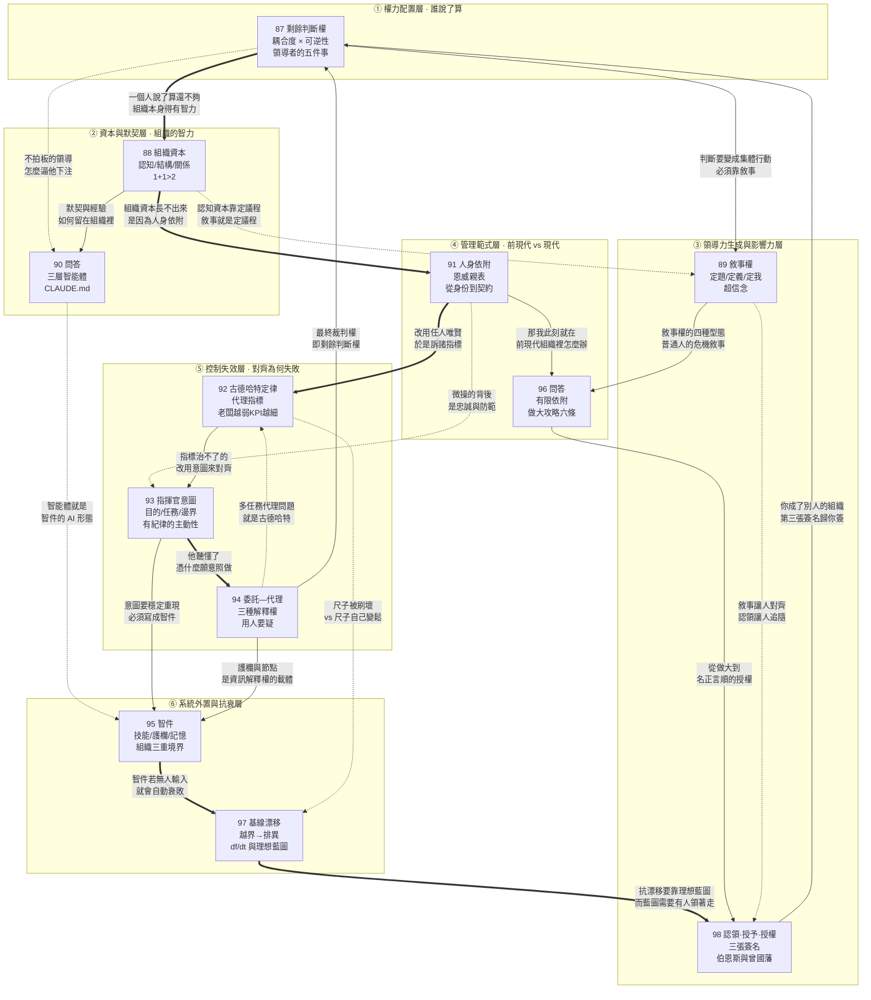

# E07 模組六：領導者（第 087～098 講）

> 來源：《現代思維工具課》模組六「公司與領導力」
> 涵蓋：087剩餘判斷權、088組織資本、089敘事權、090問答（人來人走怎麼留下默契）、091人身依附和角色責任、092古德哈特定律、093指揮官意圖、094委託—代理問題、095流程清單和經驗庫、096問答（在前現代組織裡做成事）、097基線漂移、098認領授予和授權

087 講開篇宣告「這一講咱們進入『公司與領導力』模組。我們先不談具體怎麼領導，先來考慮一個更根本的問題：一家公司也好，一個組織也好，為什麼非得有領導？」；098 講則明言「這是我們『領導者』系列的最後一講」，並回答了與開篇完全對稱的另一個問題——**不是「組織為什麼需要領導」，而是「一個人怎麼才能成為領導」**。所以 087～098 這十二講構成一個閉合的模組：從「權力為什麼必須落在一個具體的人身上」出發，一路推演組織如何積累能力、如何被施法、如何從人身依附走向角色責任、如何在指標與代理問題中不失真、如何把聰明外置成系統、如何抵抗衰敗，最後回到「你憑什麼拿到那個位置」。

本模組的整體骨架可以概括為五層：

1. **權力配置層**（087）：從第一性原理推導出組織終究必須有一個人說了算，但「剩餘判斷權」的關鍵字是「剩餘」——老闆只該管高耦合、低可逆性的那一小塊；
2. **資本與默契層**（088、089、090）：組織資本長在人與人之間而非人身上，敘事權則是領導者把私人判斷變成集體行動的施法技術，090 問答補上「人來人走時怎麼把默契與經驗留下來」的 AI 時代解法；
3. **管理範式層**（091、096）：從「人身依附」到「角色責任」是現代管理的根本一跳，096 問答則誠實面對一個現實——如果你此刻正身處前現代組織，該怎麼做成事；
4. **控制失效層**（092、093、094）：古德哈特定律揭示指標治理的必然宿命，指揮官意圖給出「把控制從動作細節挪到目的、任務、邊界」的解方，委託—代理問題則進一步追問「他聽懂之後憑什麼願意照做」；
5. **系統外置與領導力生成層**（095、097、098）：智件（流程、清單、經驗庫）把聰明外置成系統，基線漂移警告系統若無人輸入就會自動衰敗，098 收官則講清楚領導力如何透過「認領→授予→授權」三張簽名轉化為真正的權力。

值得注意的是，這五層不是平行的知識點，而是一條有方向的推演線：087 先證明「必須有人說了算」，088～090 說明「一個人說了算還不夠，組織本身得有智力」，091、096 揭示「這個智力靠人身依附建不起來」，092～094 診斷「現代管理自己也會失靈的三種方式」，095～098 則給出「讓組織的聰明可積累、不漂移、能生成下一代領導者」的完整工程方案。整個模組始終沒有離開 087 開篇那個追問——領導到底是幹什麼的。

貫穿全模組的一條主線是：**領導不是「當那個最聰明的人」，而是「建一套讓聰明可以積累、可以外置、可以傳承的系統」，並且親自守住那個系統自己守不住的東西——判斷、意圖與責任。** 從 088 的「領導力是創造一個場，讓許多大腦組合成一個更大的大腦」、093 的「低級的控制是遙控手腳，高級的控制是統一判斷標準」，到 095 的「人治組織的聰明長在人身上；流程組織把聰明寫進規定動作；學習型組織的聰明被現實持續改寫」，萬維鋼反覆示範同一個動作：把領導者從「超級執行者」的幻想裡拽出來，放回「系統設計者與最終責任人」的位置上。

---

## 一、逐講重點摘要

### 087 剩餘判斷權：為什麼組織總得有人說了算（模組開篇）

- 開篇先破題：老百姓覺得「家有千口，主事一人」天經地義，讀書人卻要問——都什麼時代了，為什麼不是市場配置資源、資料提供答案、AI 分析方案？拿不定主意時為什麼不民主投票，非得服從一個人？萬維鋼宣告要「從第一性原理出發，推導出組織為什麼終究必須由一個人——一個具體的個人——說了算」，答案就是**「剩餘判斷權（residual judgment right）」**。
- 四位學者接力完成的完整推導鏈：**科斯發現交易成本 → 西蒙發現接受區間 → 格羅斯曼和哈特發現剩餘控制權 → 奈特發現不確定性下的判斷。**羅納德·科斯（Ronald H. Coase）1937 年《企業的性質》給出「為什麼需要公司」的答案是「交易成本（transaction costs）」——參與市場要找價格、談判、簽合約、監督履約，成立公司就能在內部方便分工而不必每次重新議價。
- 赫伯特·西蒙（Herbert A. Simon）1951 年解釋公司內部為何有權威：「公司今天招一個工程師，不可能在合約中寫明未來三年他要改哪一行程式碼」，所以僱傭合約與普通買賣合約不同——**「老闆買的不是一張寫死的任務清單，而是在邊界之內的調度權。」**員工簽約就等於事先同意，在一個「接受區間（area of acceptance）」內讓雇主決定他具體做什麼。
- 桑福德·格羅斯曼（Sanford J. Grossman）與奧利弗·哈特（Oliver D. Hart）1986 年的「不完備合約（incomplete contracts）」理論：未來無法被窮盡地寫進合約，所以資產所有權真正重要的部分，恰恰是對合約沒規定事項的「剩餘控制權（residual control rights）」。**「老闆不是坐享分紅的人，老闆是說了算的人。」**
- 法蘭克·奈特（Frank H. Knight）補上最後一塊：老闆的決定就是怎麼應對「不確定性」。風險可用機率量化、可對沖（買保險），不確定性則連機率分布都沒有，「那個事很可能今天所有人都沒想到」，只能是某種硬著頭皮的一搏——用課程前面的說法就是「歸納偏置」、「主觀先驗」。**奈特說，老闆的利潤，就是對承擔這種不確定性的補償。**
- 為什麼非得是「一個人」？三重否定：法律規則只能劃定範圍不能給答案——**「這就如同物理定律可以排除蓋不起來的房子，卻不能從所有可能的建築中，自動生成一座值得蓋的房子。」**；委員會投票會拼出「縫合怪」——定位高端、技術簡單、定價親民、品牌奢侈，四個要求根本互不相容，背後是肯尼斯·阿羅（Kenneth J. Arrow）的**「阿羅不可能定理」**：只要選項超過兩個，就沒有一種萬能投票法能把所有人的偏好拼成始終一致的集體選擇，**「戰略不是拼牌拼出來的」**；自組織只適合模組化高、試錯成本低、錯誤能局部隔離的事——**「草原可以自然生長，橋樑兩端卻不能靠『湧現』在河中央自動合攏。」**；AI 也不行，因為「它能告訴你各種選擇可能付出什麼代價，卻不能替你決定什麼值得付出代價」。
- 陪審團的比喻極為精準：關上門吵得天翻地覆都可以，但走出來時只能給一個判斷——有罪或無罪，不能交一份「百分之六十的人覺得有罪」的報告。**「一個組織，最後不能交付『大家怎麼看』，只能交付『現在做什麼』。」「領導力，就是把『許多可能』壓縮成『一個共同承諾』的制度。」**
- 關鍵字是「剩餘」：老闆不能什麼事都管。判斷歸誰管的兩個維度是**「耦合度（coupling）」與「可逆性（reversibility）」**，切出四象限——低耦合高可逆交給現場的人（客服免運費、按鈕換顏色，「千萬別搞什麼審批」）；低耦合低可逆交給專家與明確責任人（會計處理、安全規範、加密方案，「老闆並不能讓它更靠譜」）；高耦合高可逆授權給部門負責人自行探索但老闆統覽全局；高耦合低可逆必須老闆親自拍板（公司定位、核心架構、重大併購、建廠選址、關鍵人事、是否自我顛覆）。
- 呼應貝佐斯的「雙向門/單向門」：可逆決策是雙向門，重大難撤回的是單向門，**老闆最該做的就是單向門決策**；而貝佐斯的警告是「大公司最常見的病，是用單向門的重型流程處理大量雙向門決策，於是組織越來越慢，試驗越來越少」。「微觀管理（micromanagement）」則是把本該由現場依局部知識作出的判斷收回自己手裡，**「看上去是負責，實際上是在削弱組織的判斷能力」**。
- 負面清單式的授權原則：**「凡是能寫成流程的，就交給流程；凡是能由價格決定的，就交給市場；凡是能靠專業知識定的，就交給專家；凡是能快速試錯、錯了也無所謂的，就放給一線……能交出去的都交出去，最後剩下來的那一小塊……才是老闆真正該管的。」**而「老百姓最愛幻想的各種霸道總裁劇情，恰恰卻是把權力用在了太小的事情上」。
- 領導者該親自拍板的**五件事**：**定題**（組織究竟在解決什麼問題——銷售下滑是人不努力還是產品失去價值？「你得找到那個正確的敘事」）、**立尺**（設定目標函數，決定利潤/增長/品質/速度/韌性/客戶利益/員工發展的優先級、硬約束與評價的時間尺度）、**下注**（戰略取捨，「戰略不只是你想要什麼，更重要的是你願意為之放棄什麼」）、**授權**（決定哪些事不再由自己決定，誰有提案權、批准權、執行權、否決權，「壞消息怎樣繞過層層美化抵達權力中心」）、**改判**（事先想好哪些訊號證明戰略有效/無效——**「真正的堅定是為了目標放棄自己的舊答案；虛假的堅定是為了保護舊答案犧牲目標。」**）。
- 領導者的日常工作流被濃縮成一條迴路：聽取各方資訊與建議 → 選擇一個未來、確定戰略 → 敘事，讓人理解為什麼選這個未來 → 設計一個激勵相容的系統 → 聽取回饋、讓團隊有心理安全感 → 糾錯。萬維鋼特別點出：**「我感到這一切非常像 harness 一群 AI 智能體做專案。現在就算你不是領導，你也需要領導力，你最起碼需要領導 AI。」**
- 收束偈語：**「謀可集眾智，斷須歸一肩；規矩劃邊界，歧路擇其先。百策憑機演，成敗由人擔；非誇一己智，只因責有端。」**

### 088 組織資本：怎樣讓 1 + 1 > 2

- 破題案例極具時效性：2025 年夏天 Meta 自家大模型表現不及預期、面臨掉隊，祖克柏導演了一齣昂貴的人才版《復仇者聯盟》——花 143 億美元投資 Scale AI，把創辦人亞歷山大·王（Alexandr Wang）請來執掌新成立的「超級智慧實驗室（Superintelligence Labs）」，又從 OpenAI、Google DeepMind、Anthropic 重金挖來幾十個研發主力，**待遇據說高到四年三億美元，比 NBA 當紅球星都高**。
- 結果呢？**「這個全明星團隊成立才兩個月，就走了八個人，有人甚至不到一個月就掉頭回了 OpenAI」**，一年後好不容易發布一個模型，仍排不進與 GPT、Claude 同台的第一梯隊。而且這不是特例——寫作當時（2026 年 6 月）Google 的模型也比 OpenAI 和 Anthropic 落後半個到一個身位，蘋果、亞馬遜、微軟早已脫離第一集團。**「開公司不是自動的化學反應，不是說你把人、錢、GPU 堆在一起，就能變出最好的產品。1 + 1 不一定等於 2，它可以大於 2，也很容易小於 2。」**
- 核心定義：**「人力資本長在人身上，組織資本長在人與人之間。」**「組織資本（organization capital）」由愛德華·普雷斯科特（Edward C. Prescott）與麥可·維舍爾（Michael Visscher）1980 年提出——一家公司只要能好好運轉，就會自動攢下一筆別處買不來的資產：**關於誰擅長什麼、誰跟誰搭配最順、什麼任務交給誰最靠譜的資訊**。它不是哪個人帶進來的，而是大家在一起幹活、一年一年長出來的，**只屬於公司而不記在任何個人名下**。
- 加州法律禁止競業協議，技術骨幹可以隨便跳槽——「你可以帶走理論知識、研究品味、聲望甚至人脈，但是你帶不走原公司的協作慣例、評測體系、失敗檔案、用戶回饋、內部工具，更帶不走一群人磨出來的默契。」
- 兩個關鍵實證：2006 年一篇研究心臟外科醫師的論文發現，那些在原醫院手術非常成功、病人存活率很高的醫師，**一旦跳槽到另一家醫院，手術存活率就會下降**——**「醫生帶走的是自己的雙手，卻帶不走手術室的配合。」**2008 年另一篇論文發現，華爾街的明星證券分析師一旦跳槽，業績往往立刻下滑且連著好幾年緩不過來；**但要是他帶著原班人馬一起走，或跳進一家組織能力更強的公司，下滑就輕得多**。
- 組織資本的三個維度來自珍妮·納哈皮特（Janine Nahapiet）與蘇曼特拉·戈沙爾（Sumantra Ghoshal）1998 年論文——關鍵在於「你這個公司是怎麼讓知識流動的」：**「認知資本（cognitive capital）」**（分散的知識能否被共同語言、共同標準、共同問題意識接住）、**「結構資本（structural capital）」**（正確的人有沒有被正確地連接起來）、**「關係資本（relational capital）」**（關係是否安全到讓大家敢說真話）。比喻精準：**「老闆就好像球隊的主教練一樣：你經營的不只是一張先發名單，更是人才與人才之間的乘法關係。」**
- **認知資本的關鍵是協調多樣性。**控制論的「好調節器定理」說系統的好調節器必須是這個系統的一個模型；其提出者之一 W·羅斯·艾許比（W. Ross Ashby）另有**「必要多樣性定律（law of requisite variety）」**——要對付複雜多變的外部世界，內部就得有足夠匹配的多樣性。**「你不能說市場上有 100 種情況，你的管理團隊卻只知道『加人』和『加班』這兩招。」**
- 但多樣性不協調就是噪音：「研究員關心模型能力，工程師關心系統穩定，產品經理關心用戶體驗，銷售關心實際訂單，安全團隊關心別出事上新聞……大家都是對的，可是如果彼此聽不懂對方在說什麼，多樣性就成了噪音，組織就成了菜市場。」最著名的災難案例是 **1999 年 NASA 火星氣候探測器任務失敗**——洛克希德團隊算推進器點火衝量用的是英制，NASA 這邊還以為是公制，**結果探測器在火星大氣層中解體焚毀**。
- 老闆最重要的權力是定議程。必須要求團隊在三個問題上達成共識：**1. 我們究竟在解決什麼問題？2. 什麼才算好產品？3. 當品質、速度、成本和風險衝突時，哪個優先？**經營認知資本的有效方法是把抽象的詞具體化——「你說『用戶第一』，那就得在一次趕工發布裡說清楚：為了用戶，到底是該延遲上線，還是先上線再補救」。**「具體怎麼幹，各位高手可以有各自的看法……但是幹什麼、幹到什麼程度，為了幹這件事我們寧可犧牲什麼，則是必須達成一致的。」**
- **結構資本的關鍵是任何人有問題都知道該找誰。**你需要一套「專長地圖」，學術上叫**「交易記憶系統（transactive memory system）」**，用來儲存知識的「地址」——它可能存在於飛書、釘釘、知識庫和專案文件裡，但更多的是存在於人的腦子裡與人際互動習慣裡。
- 2005 年研究醫院關節置換手術團隊的論文把「經驗」拆成三份分開算：主刀醫師個人做過多少台、整個醫院做過多少台、**還有這一組人「湊在一起」做過多少台**。結果發現，哪怕醫師本人是老手、醫院也是大醫院，只要這一組人沒在一起配合夠，開刀照樣磕磕絆絆。萬維鋼的描寫堪稱全講最動人的段落：**「我知道你擅長開路、卻容易忽略收尾，收尾我替你盯著；你知道我嘴上說『問題不大』、其實心裡在掂量風險有多大；而我手還沒伸出去，你已經把下一件器械遞到了我掌心。」**
- **關係資本的關鍵是團隊心理安全。**概念提出者是艾美·艾德蒙森（Amy C. Edmondson）。她 1990 年代在哈佛讀博時研究醫院護理師給錯藥、發錯劑量這類差錯，原本設想管理得當、氛圍好、護理長有領導力的小組犯錯應該更少，**結果發現「關係越好、領導越強的小組，差錯記錄不是更少，而是更多」**。她沒有停在統計表面，雇人下到病房蹲點、逐一訪談，才挖出真相：**好團隊的護理師不是手更笨，而是更敢把錯誤說出來**；氣氛壓抑的小組裡出錯就要挨訓追責，護理師的本能就是趕緊把錯誤蓋住，根本不會留下記錄。
- **「所以如果你聽不到壞消息，那你就要感到危險了。你的團隊正在向你隱瞞真相。其實壞消息是系統的日常，一個健康的團隊怎麼能沒有壞消息呢？」**
- 第一手觀察佐證理論：萬維鋼與 OpenAI、Anthropic 幾位一線研發人員私下交流，問「你們公司的護城河是什麼？」——**他們不約而同地說是研究氛圍**。最能說明問題的是，哪怕是很年輕的新人，只要在研究中發現一個有意思的點，也可以被吸收到公司的大模型產品之中；而在 Google 這幾乎不可能，「你得層層上報，很有可能根本就到不了一線」。這兩家公司的日常業務幾乎都發生在 Slack 上——領導發布任務、員工認領任務、交付任務和各種內部通訊全在上面，**「從 Slack 上每個人都可以知道其他人在做什麼，也都知道有問題該找誰」**。對比之下，在 Google 想給團隊外的工程師安排任務，得跟他和他的直屬主管約時間開正式會議走各種程序。有個工程師甚至說：**比起跟 Google L5 以下的工程師對接，他寧可直接把任務交給 AI**。
- 提升組織資本的有效方法不是思想教育或團建，而是共同作戰、特別是要有**複盤**——有研究發現設計得當的複盤平均能把團隊績效提高約四分之一。但複盤不是領導點評手下，而是大家一起問四個問題：**原本準備發生什麼？實際發生了什麼？為什麼有差異？下一輪改什麼？**——**「複盤不是為失敗找替罪羊，而是把一次經歷，變成整個組織的記憶。」**
- 一個重要的張力：好組織需要穩定的核心班子不能頻繁變動；但拉爾夫·卡茨（Ralph Katz）1982 年的研究發現，**一支隊伍共事太久，成員就會越來越和內外部的關鍵資訊源隔絕，技術績效也跟著往下掉**。所以**「你需要一個穩定的骨架，還需要一個流動的前沿」**。
- 收束金句：**「領導力不是親自去當公司裡那個最強大腦；領導力是創造一個場，讓許多大腦，組合成一個更大的大腦。」「組織有它自己的智力。1 + 1 > 2，是人類文明的基礎。」**

### 089 敘事權：怎樣對眾人施法

- 破題人物是 OpenAI CEO 山姆·奧特曼（Sam Altman）。萬維鋼不諱言他「私下的名聲並不怎麼樣」——AI 圈流傳很多關於他愛說謊、出爾反爾的故事，有的工程師之所以加入 Anthropic 就是因為不喜歡奧特曼，他一度被董事會以「溝通不夠坦誠」為由罷免。但**「你不能不服的是，奧特曼的公共形象十分迷人」**：訪談既靈動又坦誠，彷彿就是 AI 的代言人、彷彿在傳達神諭，在 X 上隨口幾句話不用任何大詞、沒有複雜邏輯，就能讓人琢磨很久。**「他讓人自動相信他的事業，並且為了這份相信而原諒他所有的缺點。奧特曼是一個施法者。」**
- 這不是「形象代言人」或「老闆 IP」，而是賈伯斯那種「現實扭曲力場」——更具體地說，是**「敘事權（narrative power）」**。本講直接回扣課程第 001 講：**「我們這個課程一開篇就講了，敘事是這個宇宙的第一性原理。這一講咱們說說敘事到底該怎麼用——對領導者來說，就是怎麼把你的判斷變成一個組織的集體行動。」**
- 駁斥「敘事＝講故事、畫大餅、做思想工作的軟技能」這種輕視：公司剛成立一沒成型產品二沒確定市場，你能說服人投資、說服優秀人才跟你走嗎？你想像了一個既有美感又用戶友好還價格合理的偉大產品，工程師卻告訴你根本做不出來、**很多零組件現在都不存在**，你能讓團隊相信他們一定能在短時間內做出來嗎？**賈伯斯就能。**其效果之好，「以至於人們不但在聽他講的那一刻相信他，而且持續相信他」——人們會主動想各種辦法實現他的願景，把「不可能」拆成一個個可以攻克的問題，把缺失的條件一點點補出來。**「那絕不是靠合約和獎金能達到的效果。」**
- 全講最凝練的一句：**「命令只能讓一個人做一件事，敘事卻能讓一千個人，自己補完那一千條沒下達的命令。」**其機制是共同知識——**「敘事能把你的願景變成組織的共同知識，以至於不但每個人都相信你，而且每個人都知道別人也將依據同一個未來行動。」**
- 三個敘事心法：**定題、定義、定我**，對應行使三件事的敘事權——哪個問題最重要、這件事是什麼意思、我們是誰。
- **心法一「定題」＝「議程設置（agenda setting）」。**設置會議議程是一個領導者最重要的權力。**「定題不是給答案，你完全可以發揚民主，讓大家討論出一個答案來。但只要議程是你設置的，你就搶到了答案的上游——是你決定『哪個問題值得全公司投入注意力』。」**理論來自傳播學者麥庫姆斯（Maxwell McCombs）與蕭（Donald Shaw）的經典發現：**媒體左右不了你「怎麼想」，卻能強有力地左右你「想什麼」**。他們研究 1968 年美國總統大選，在北卡羅來納州教堂山訪問一批尚未決定投給誰的選民，同時分析他們接觸的報紙、電視和雜誌，結果很清楚：媒體反覆擺在前台的競選議題，正是這些選民認為「這次選舉最重要」的議題。後續的電視新聞實驗做了更乾淨的驗證——反覆看到國防新聞、通膨新聞或污染新聞的三組受試者，判斷「國家最重要的問題」時都會把自己剛剛反覆看到的那個議題排到前面。
- **「人的判斷不是從所有事實裡平均抽樣，而是先被一個問題召喚出來。你問『誰該負責』，大家就去找責任人；你問『用戶為什麼離開』，大家就去分析體驗和價格；你問『我們如何在三年後還活著』，大家才會談戰略。」**一個極有診斷價值的反例：**「如果公司的價值觀說『我們要重視創新』，可每週開會老闆只問銷售額和成本，那你就知道他真正想要的根本不是創新，而是短期業績。」**
- 定題的企業案例：一家做企業軟體的公司，管理層長期爭論要不要降價——銷售說競品降價不跟就丟單，產品說降了就沒資源迭代，售後說很多客戶不是嫌貴而是買了沒用起來。終於有一天老闆說：**我們爭錯了。客戶真正買的不是一個 SaaS 帳號，而是少雇兩個人、少出一次錯、少等三天審批。所以真正的問題不是「價格能不能降」，而是「我們能不能把產品做成客戶看得見、算得清的節省」。**題目一換，銷售不再只問最低能打幾折而要拿回客戶的流程資料，產品不再只排功能而要排能減少真實工時的環節，客服不再只盯續約和投訴而要追蹤客戶到底在哪些地方省了時間。
- 定題的通用句式：**「過去我們一直在爭論 A。可世界已經變成了 B。所以真正的問題不再是 A，而是 C。從今往後，每一個方案都得先回答 C。」**
- **心法二「定義」＝「框架塑造（framing）」。**事實還是這些事實，換一個框架，人們的感覺和判斷就完全不同（參考史考特·亞當斯 Scott Adams《重構你的大腦》）。同樣是一次失敗，可以框成「我不行」也可以框成「我收到一條回饋」；同樣是客戶流失，可以框成「客戶嫌貴」也可以框成「客戶沒有看見節省」——**前一種框架導致防禦、抱怨、降價和追責；後一種框架調動實驗、改進、換指標和重新分工**。**「定題決定大家看哪兒，定義決定大家看見什麼和怎麼看。框架不是『換個說法』，而是換一套因果模型。」**用政治傳播學者羅伯特·恩特曼（Robert M. Entman）的話說，框架會推動一套特定的「問題定義、因果解釋、道德評價和處理建議」。
- 框架塑造的頂級示範：一屋子 GPU 堆出來的 AI 算力，你要是把它叫「資料中心」，在 CFO 眼裡這就是成本——採購貴、折舊快、電費高，應該能省則省。可是輝達 CEO 黃仁勳把它重新命名為**「AI 工廠（AI Factory）」**，整張損益表就翻過來了：**GPU 成了生產設備，資料是原料，模型是生產線，算出來的 token 是產品**——「這叫『生產資料』好嗎？這是賺錢的機器！這哪能省呢？」
- 定義的通用句式：**「這不是 X，而是 Y。所以衡量它，不該看 A，而該看 B；因此，我們要做的第一件事就不是 C，而是 D。」**
- **心法三「定我」＝身份認同。**「定題改的是你往哪兒看，定義改的是你怎麼理解，而定我，改的是你的目標函數。」目標函數就是你在一堆選擇裡預設要最大化的東西——獎金、職位、安全感、面子，還是某種「我們不能這麼幹」的底線。**「大多數成年人不會事事計算獎懲利弊，都是直接從身份認同出發，努力扮演好自己的社會角色。」**一個人一旦接受「我是醫生」「我是工程師」「我是這家公司的人」，就會把一些行為視為「配得上我」，另一些視為「不像我們這種人」——**「只要你能設定別人的身份，你就可以繞過一條條命令，直接給人裝上一套自動生成行為的程式。」**
- 定我的案例是 NASA 的**「阿提米絲計畫（Artemis Program）」**：希臘神話中阿提米絲是阿波羅的孿生姐妹，「你一聽就知道這是接力敘事」。這不是再發射一次登月飛船，而是一整套「重返月球、長期駐留、再以月球為跳板走向火星」的任務體系。為了讓敘事更宏大，NASA 造了一個身份——**「阿提米絲世代（Artemis Generation）」**：阿波羅是上一代人的故事，阿提米絲是這一代人的故事，於是太空人、工程師、承包商、國際夥伴，包括學生和普通公眾，就都被放進同一個時代共同體。
- **「高水平的身份敘事不是站上台喊『我宣布你們是英雄！所以你們給我衝！』——而是『你們本來就是這種人，我只不過替你們把它說出來了。』」**定我的通用句式：**「我們不是 X，我們是 Y。別人遇到 Z 時會選擇 A，但像我們這樣的人會選擇 B。我們這麼做不是因為誰的要求，而是因為我們要共同成為 C；是這個身份要求我們願意付出 D。」**
- 三個心法疊加的效果是把私人信念變成協調訊號：**「每個人不只是自己相信這個方向，而且知道別人也會按同一個未來配置時間、預算和風險，於是觀望的人敢下場，分散的動作開始同步。」**
- 敘事權的最高境界是讓組織形成一個**「超信念（hyperstition）」**——英國哲學家尼克·蘭德（Nick Land）提出，字面意思是「超級迷信（hyper superstition）」，原意是**「虛構經文化回饋迴路使自身現實化」**，是一種「能讓自己成真的有效文化元素」，其虛構性**「像一台時間旅行裝置一樣運作」**。機制是：**超信念不是從過去解釋現在，而是讓一個未來的幽靈闖進現在，讓眾人形成公共預期，從而改變今天的行動——等這些行動累積出結果，就會強化那個原本虛構的未來；然後未來預期再強化今天的行動——在這個正回饋循環之下，未來就真的實現了，就如同是未來從一開始就在召喚它自己。**
- 超信念的實例橫跨古今：賈伯斯說 Macintosh 開機時間還可以再減少 10 秒、說「蘋果要重新發明手機」；馬斯克說「要讓人類成為多行星物種」、說可重複使用火箭是通往這個未來的必經之路——**「這些就如同陳勝吳廣搞『魚腹丹書、篝火狐鳴』——放在當時現場都是不合理的，本來不應該有人相信。然而他們就能讓足夠多的人先按那個未來行動，把信念變成了『自我實現的預言』。」「超信念是人對天命的改寫。」**
- 誠實面對黑暗面：超強的敘事可能讓人狂熱地相信某項事業以至於不顧現實、撞上南牆也不回頭；只許唱讚歌、聽不進壞消息、甚至黨同伐異；也有人用敘事畫大餅讓人只講奉獻不計回報。**「人必須用現實平衡敘事。你必須既能入戲，又能出戲。但我要說的是，入戲比出戲高級，敘事比現實高明。」**
- 終極理由來自赫拉利（Yuval Harari）：智人爬到食物鏈頂端靠的不是力氣也不是個體智商，而是**能編也能信一個共同的虛構故事**。其他靈長類只能跟熟悉的、數目有限的個體有效合作——黑猩猩的熟人最多五十來個，人是大約 150 個（**鄧巴數**）——而人卻能突破熟人限制跟大規模陌生人合作。收束極具份量：**「能聽懂敘事，也是一種超能力。那麼當一群人把敘事的權力交給你的時候，你想想，這是一個多麼大的特權。他們等於是允許你對他們施法。」**

### 090 問答：組織「人來人走」，怎樣把默契和經驗留下來？

- 本篇是往期問答集錦，回覆橫跨 080 共同知識、085 摩洛克、087 剩餘判斷權、088 組織資本四講，其中後兩則與本模組直接咬合，最後一則更是全課程關於「AI 時代組織記憶」最具操作價值的一段。
- **回覆 080 共同知識（泡沫為何不破）**：讀者的猜想暗合一個著名金融模型——2003 年普林斯頓經濟學家阿布魯（Dilip Abreu）與布倫納邁爾（Markus Brunnermeier）發表於《計量經濟學》的《泡沫與崩盤》。核心命題是：**「泡沫能撐住，不是因為沒人知道它是泡沫，恰恰是因為『人人都知道』還沒有變成『人人都知道人人都知道』。」**我知道是泡沫不等於我賣——泡沫要破得有足夠多的人同時賣，可我不知道別人打算什麼時候賣，要是我先撤而泡沫又漲一年，豈不遺憾？
- 兩個歷史註腳：2007 年 7 月金融危機前夜，花旗集團 CEO 查克·普林斯（Chuck Prince）留下名言**「只要音樂還在響，你就得起來跳舞。我們還在跳。」**——三個月後音樂才停。而 1996 年 12 月，諾貝爾獎得主、《敘事經濟學》作者羅伯特·席勒（Robert Shiller）就曾向聯準會主席葛林斯潘陳述市場處於「非理性繁榮」，葛林斯潘也承認了，**但泡沫接著又漲了三年多，到 2000 年才崩盤**。
- 這個模型的兩個實用推論：第一，**「刺破泡沫的新聞很可能是一個很尋常、沒有什麼資訊量的東西。崩盤那天回頭查基本面，往往什麼也沒變——變的是『大家知道大家知道』。」**第二，它摧毀了一個常見論點——「要真是泡沫，聰明錢早就糾正了；一直沒崩，說明價格是對的」。**「現在我們知道了：可以所有聰明錢都看出泡沫，泡沫照樣撐住。沒破，不等於沒有泡沫。」「存在的不等於合理。」**
- **回覆 085 摩洛克（該不該換賽道）**：對人生道路的選擇往往不是理性權衡利弊，而是出於各自的生態位。聰明好學又努力、在主流賽道有好前途的人沒理由去探索其他賽道；而那些在主流賽道已經墊底甚至絕望的人自動有意願另謀出路，但問題在於**「探索多元賽道需要比留在主流賽道更多的資源和更好的見識」**——「並不是說我學習不好，我就應該去練體育」。
- 因此**最適合換賽道的，是那些位於主流賽道中上游、但不在最頂端的人**：他們也很聰明有能力，但在這條道上已經望得見自己的天花板，處於患得患失的狀態。萬維鋼的建議是換個賽道搏一把，並引蘇秦**「寧為雞口，無為牛後」**——「同樣的才能，投在擠滿天才的賽道上注定平庸，為什麼不去新領域闖一闖呢？」而且這未必是開弓沒有回頭箭：**如果不追求頭部名次，在主賽道裡保留一個中上的位置還是相對容易的**，這正是貝佐斯說的「雙向門」。
- 收束一段極具畫面感：電視劇《主角》裡的人一旦失意、確定當不上主角、卷不動了，都沒有躺平，而是都會想到去「南方」，最終都混得很好。**「以世界之大，永遠都存在一個『南方』。」**
- **回覆 087 剩餘判斷權（遇到不拍板的領導怎麼辦）**：先診斷病理——這樣的領導不取捨、不授權，是**「既怕擔責任，又不信任手下，還想甩鍋」**：他只定個題讓手下去辦，辦成了功勞算他的，辦不成那是你們無能，辦壞了責任歸屬於你們。**「給這樣的領導辦事，就算你僥倖把事兒辦成了，但只要在爭搶資源的過程中得罪了人，他也不會給你撐腰，將來有一天還得把你賣了。」**
- 具體對策堪稱職場操作手冊：如果領導指定非你不可，**你必須逼他表態，但不能直接問「您說怎麼辦」——你得體現你做了工作，所以你要給方案**。把取捨做成兩三個方案，每個標明代價和風險：**「方案 A 快，但要吃掉預算的 60%；方案 B 穩，但趕不上競品發布。我們傾向 A，您定。」**——**「領導可以不答問答題，但你把話說得這麼明白，他很難不做選擇題。他一選，『下注』這個動作就是他做的了，賴不掉。」**
- 如果領導死皮賴臉就是不表態，就給他一個最後期限：**「如果週五前沒有新的意見，我就按甲方案推進；超過預算、改變合約、對外承諾這三類事項，我會再請您確認。」**而且**確保書面留痕**。至於領導不認可這種工作方式怎麼辦——**「你要知道他本來就不信任你。而且他的信任一文不值。跟著這種沒有擔當的領導是沒有前途的。現在你的首要課題是自保。」**
- **回覆 088 組織資本（怎麼把默契和經驗留下來）**：完全可以把一部分組織資本做成制度和知識庫，現成例子就是《得到品控手冊》——這不是給外人看的公關文件，新員工入職或老員工遇到問題都能從手冊上找到公司的預設打法、建議做法和案例。但這類手冊有**兩個缺點**：一是員工很少主動提修改建議（「你寫內部文件是寫給公司，用於培訓別的員工，這對你個人來說純屬浪費時間」）；二是不可能寫得全面（「沒有人有精力深入公司的方方面面」）。
- **AI 讓這兩個問題都有了解法。**萬維鋼給出的最佳做法是：**「每個員工都有自己的智能體，每個專案都有該專案的智能體，整個公司有一個總的智能體。這些智能體不是一次性寫出來的，妙處在於迭代。」**做法是讓公司所有人幹的活、所有的對話都給 AI 留痕——**「注意留痕只是給 AI 看，不是用來監控人」**——無論用 Slack、飛書還是企業微信，讓工作中每一個動作都能讓 AI 看見。
- 個人層面的迭代方法：經常把工作中遇到的問題（包括給同事的回覆）交給 AI 先出一個方案，你再搞一個實際的方案並告訴 AI 你實際是怎麼做的，讓它迭代一次——**「你越用它，它就會越像你。」**最終 AI 不會取代你（「現場總是變化多端，總會面臨更新的事情，只有你在場才行，更何況你還要承擔責任」），但因為它越來越像你，它就能越來越幫你節省時間。一位矽谷大廠經理層的人告訴他，**AI 給他草擬的方案已經幾乎跟他想的一樣了**。
- 一個極具操作性的內部慣例：**Anthropic 給每一個專案都放一個叫 `CLAUDE.md` 的檔案——這是一個給 AI 看的「入職手冊」，說明這個團隊對這個專案有哪些約束、有哪些平時的術語、以及踩過哪些坑。**關鍵在於每次遇到問題就讓 AI 自動往這個文件裡補充，形成習慣之後員工會樹立一個直覺：**「如果 AI 答錯了，這不是 AI 能力不行，而是我們給它寫的文件不夠好。」**
- 推到極致，公司的總智能體會對上上下下的大事小情有全面了解，**「它會比公司任何一個人都更能看出來：公司什麼任務適合交給誰、公司當前最需要解決的最大問題是什麼、公司的瓶頸在哪裡」**，甚至能對「公司下一步應該主攻哪裡」這種主觀題給出參考意見。萬維鋼自陳常直接問 ChatGPT「以你對我的了解，你對我有什麼建議？」——「它有時候確實能想到我想不到的東西。我認為每個公司也都應該這麼幹。」
- 但他保留了邊界：智能體不會取代人，因為有很多**默會知識**你自己都沒意識到、不會寫下來教給 AI，特別是**人的意圖會經常變，是 AI 所不能預測的**。收束金句：**「在『取代』和『有用』之間，有一個巨大的空間。」**

### 091 人身依附和角色責任：從前現代到現代管理

- 破題是一道極其扎心的中文世界職場考題：你是個收入不高但精通某項技術的年輕人，一位不太熟的大哥介紹了一個私活，你把活幹得漂漂亮亮，對方公司給了 20 萬，這 20 萬你跟大哥怎麼分？直覺是你拿大頭、分大哥一筆介紹費；**但網上一邊倒的答案是把 20 萬全拿上當面交給大哥，看他怎麼分——哪怕他留下 18 萬只給你 2 萬，你也樂呵呵地認下來。這才叫「懂事兒」。**
- 為什麼不是事先商量好分成比例？**「那不只是利益輸送，更是一次表態，是一份投名狀：我承認你是上游，我不會繞過你，我不會自作主張，我是你的人。」「如果權責利歸屬於一個具體的個人，這個個人就會要求忠誠和可控。」**這解釋了為什麼家族企業裡管財務的往往是老闆一個能力平平的親戚，也解釋了為什麼都 21 世紀了郭德綱還能跟徒弟搞「逐出師門」那一套。這些現象都可以用一個詞概括：**「前現代」**。
- 核心命題：**「前現代管理的靈魂是『人身依附』；而現代管理講究的是『角色責任』。」**
- 前現代管理的運行方式是四個字：**恩、威、親、表**。**「恩」**是用個人恩惠製造依附——「你不是跟一家公司簽了平等互惠合約，你是『蒙老闆賞識』」，老闆說「我對你不薄吧？」意思就是你欠我的；**「威」**是用恐懼壓出服從，馬基維利說**「被畏懼比被愛戴更安全」**；**「親」**是重用親信——「開什麼玩笑！一朝天子一朝臣，不任人唯親，難道任人唯疏嗎？」皇帝有官僚集團卻常愛依靠內廷、近侍甚至宦官，文官有正式品級和職掌但座師、門生、同年往往比單純上下級更能決定信任，武將在正規編制之外也都經營親兵家丁；**「表」**是表忠心——「列隊鼓掌、喊口號、寫心得、層層傳達統一思想」，**「忠心不但要體現在行動上，而且要體現在語言和表情上」**。
- 後果診斷極其精準：**「在這種恩威並重、又用親信、又看態度的管理方式之下，組織得到的必定是忠誠壓倒能力、恐懼壓倒真話、親信壓倒專業、表態壓倒結果。」**對比之下，現代管理必須讓一群彼此不熟、也不必互相喜歡的人可靠協作，所以它必須把組織從「一串私人關係」改造成**「一組可替換的角色接口」**——用職位規定權限，用流程傳遞資訊，用指標回饋結果，用稽核追索責任。**「人可以流動，角色還在；感情會變，接口還在；老闆不必認識每一個人，組織照樣能運轉。」「前現代管理是人對人負責，現代管理則是人對角色負責。」**
- 但萬維鋼誠實地為前現代管理辯護了一整節。**前現代管理不是中國的特產**：今天申請美國大學教職或研究所都要用「推薦信」，這個形式早在古羅馬就已是傳統——西塞羅（Cicero）的書信集裡收錄大量推薦信，寫得都快成固定格式了：**「我把此人當作自己家裡人、最親近的人推薦給你；你要這麼照顧他，讓他明白，我這封推薦信對他真管用。」羅馬人是古代世界中最講法律的人，但羅馬社會運轉的底層邏輯也是恩主（patron）與門客（client）。**今天的美國一樣講人情：推薦信、熟人內推（referral）、熟人和校友圈。
- 三條合理性：**「個人關係是最基礎的社會信任。而且人格化的信任比制度化的信任便宜得多。」**現代企業制度需要合約、會計、稽核、績效評價和申訴機制，需要能執行的商業法和可信的專業經理人市場——**「如果你只是領幾十個工人在本鄉做個土方生意，你真的需要這些嗎？你要的只不過是服從和可靠而已。」**其次，前現代管理依託的人際關係網是現成的、你不可能脫離、所以不會輕易背叛。第三，**馬克斯·韋伯（Max Weber）早就指出傳統社會的權威是「家產制（patrimonialism）」：整個組織就是統治者家庭的放大版，官員效忠的是統治者本人，而不是某個抽象的職位。**
- 還有兩個更隱蔽的動機。其一是前現代的分配邏輯會塑造認知：**「如果一個老闆拿到訂單不是因為公開競爭中效率最高、品質最好，而是因為他和某個上位者關係更近，那麼他學到的就不是『能力創造收益』，而是『關係決定收益』。這個活的能力貢獻明明只值 2 萬，我現在靠關係拿到了 20 萬，那你憑什麼指望我分給你 10 萬呢？」**其二是情緒價值：**「前現代管理能給你即時的控制感。你一句話，全場照辦，群裡齊刷刷地回『收到』，會場上一致鼓掌……這是現代制度給不了的快感。」**
- 最犀利的一句洞見：**「現代管理會讓權力變透明。權責一旦寫清楚，很多原來靠模糊授權、口頭傳話、揣摩上意形成的非正式權力，就會被制度折價。混亂並不總是管理失敗，它有時候是一種利益結構：越說不清，某些人越有空間。」**
- 前現代管理的天花板就是**鄧巴數**。牛津演化心理學家鄧巴（Robin Dunbar）發現人腦能穩定維持的熟人關係最多 150 人，這是大腦新皮質的硬約束——**「你能罩住、能鎮住，還能賞能罰的私人關係，只會更少。」**再加上「兵為將有，兵隨將轉」的湘軍式部門會讓公司其他人寒心，**「如果一條業務線只跟著一個領導走，團隊只認他這一個人而不認公司，那公司還敢把重要業務交給他嗎？」**這就叫**「不可規模化（not scalable）」**。
- 強行規模化的必然結果是被中層蒙蔽。**「中層是資訊的關口。上面不知道下面的真實情況，下面摸不透上面的真實想法，中層就有了生存空間。」**於是他們把資訊加工成對自己最有利的版本：對上報喜不報憂，對下製造領導的神秘感，對平級封鎖資源，對異見者扣帽子，對失敗找替罪羊。嚴加管教也沒用——**管理學大師戴明（W. Edwards Deming）的「驅逐恐懼（drive out fear）」原則說得好：人只有不害怕，才能真正為公司好好幹活。**「一個被嚇住的組織會非常安靜，可安靜不等於秩序。**很多時候安靜只是失明。**」
- 全講最鋒利的兩句：**「前現代管理只要想做大，就會陷入一個悖論：它拚了命地尋找忠誠，最後獎勵的，卻是最會表演忠誠的人。」「你以為自己掌控了組織，殊不知掌控的只是組織的表情。」**專注幹活的人被視為「白專」，敢於反映真實情況的人被視為麻煩和叛逆，**「與其說老闆是被自己蠢死的，不如說是被中層慣壞的」**。
- 現代管理首先是一項**規模技術**。要突破鄧巴數，必須從「個人相信個人」變成「大家相信一個共同的敘事，看向同一個第三物」——**對組織來說，這個敘事和第三物就是制度。**（此處直接回扣模組五 086 講的「第三物」概念。）
- 理論支撐來自 1993 年諾貝爾經濟學獎得主道格拉斯·諾斯（Douglass North）。他在諾獎演講中說：**複雜分工要擴展，社會就必須從人格化交換（personal exchange）走向匿名的、非人格化交換（anonymous, impersonal exchange）。**「前現代的信任是綁在具體人身上的；現代制度的厲害之處，就是讓信任離開具體的人，進入角色、合約、稽核、司法、崗位責任和可執行流程。那正是從『人身依附』到『角色責任』的一跳。」而且**「權責清晰不是束縛而是解放。你只有有限的權力，所以你也只需要承擔有限的責任。你清楚自己能決定什麼、對什麼負責，你才敢放開手腳去幹。」**
- 硬數據登場。2018 年一篇研究 **1,284 家中國民營家族企業**的論文發現，其中 **57.09%** 的企業中層裡至少坐著一個自家人，這些「自己人」扎堆於財務、採購這類管錢的崗位，而在研發崗上特別少。效果如何？**「中層越家族化，企業的人均產出越低。具體說來，家族成員在中層的參與度每上升一個標準差，企業一年的人均產出大約就要少掉 10,200 元。」**而且如果最高經營者本身也是家族成員而非外部專業經理人，這個拖累還會進一步放大。另一組研究發現家族經理人往往拿更高薪水、坐更高位置、有更大決策權，**「可真到了獎懲的時候，他們卻不像外部經理人那樣強烈地受業績約束」**——外人把事情做砸了獎金、職位、權限都可能受影響；自家人做砸了，組織往往更願意替他解釋、給他兜底。**「管理的好壞是能換算成錢的。」**
- 史丹佛經濟學家尼可拉斯·布魯姆（Nicholas Bloom）與倫敦政經學院約翰·范里南（John Van Reenen）主持的**「世界管理調查（World Management Survey）」**，派訓練有素的訪員給世界各國成千上萬家工廠的管理實踐逐項打分——怎麼追蹤績效？目標怎麼定？出了問題多久能被發現？提拔人靠業績還是靠資歷？**結果發現企業的管理水平得分和生產率、利潤強相關。**中美兩國的管理規律一樣（管理分更高的公司更可能出口、出口產品更多、目的地更多、收入和利潤也更高），而差別在於**「中國樣本裡，管理水平的差異對企業效率和產品品質的影響更大」**——說白了就是中國企業比美國企業更需要提高管理水平。
- 家族企業的死循環：**「因為不信任制度，所以依賴親人；因為依賴親人，所以制度長不出來；因為制度長不出來，所以更不敢信任外人。」**（呼應福山《信任》）而且「只信任自己人，可是自己人不但不一定能給你幹好，而且不一定願意給你幹」——在布魯姆與范里南的調查中，**實行長子繼承制（primogeniture）的家族企業是全世界管理得最差的一類**；資誠 2021 年調查則顯示，**中國大陸的家族企業裡只有 19% 有一份成形的、寫下來的接班計畫**。中山大學管理學院教授李新春的話被引為結論：**「一個企業做個三五年，可以靠人、靠機會；但要做三十年、五十年，甚至要做百年老店，就必須靠制度。」**
- 收束拉到文明史高度。十九世紀英國法律史學家亨利·梅因（Henry Maine）的名言：**「一切進步社會的運動，到目前為止，都是一場『從身份到契約（from status to contract）』的運動。」**萬維鋼的詮釋極有溫度也極有分寸：**「身份，在你出生前，就已經把你定死在了人身關係網裡……依附是有溫情的。你不只是被人支配，你也得到了保護和確定性，甚至得到一個不必自己擔責的位置：你只要懂事，就有人罩著你。而走向現代，意味著你得交出這份安穩，去爭取更難、卻也更值錢的東西：權利和尊嚴。」**
- 最後那句宣言堪稱全模組最擲地有聲的一句：別人問「你是誰的人」，**「我誰的人也不是。我是幹這件事的人。」**偈語：**「恩威砌畫堂，近侍踞中央。目力周遭盡，邦圖豈可量。憑文施號令，立制定綱常。莫問誰家子，吾為任事郎。」**

### 092 古德哈特定律：指標的暴政

- 破題場景緊接上一講：你是個有理想的現代人，特別反感前現代管理那一套，願意相信陌生人，決心搞一個公平合理、任人唯賢的制度。可公司幾百號人，怎麼知道該提拔誰、獎勵誰呢？於是你給工程師團隊設定了一個數字考核指標：**看誰修的 bug 多。**
- 幾個月後就出事了：HR 建議把**老張**優化掉——他技術最好、公司最難啃的核心架構是他當年搭的，但他修復的 bug 數最少，因為**「人家老張負責的那塊根本就不怎麼出 bug，讓他咋修呢？」**升上來當主管的是**小李**，因為他修的 bug 最多——可仔細研究發現，**小李是專挑好修的小 bug，一天能結掉好幾個；他還經常把一個大任務拆成五個小工單分開報；碰上難啃的硬骨頭，他就標一個「暫不處理」晾在那兒。**「你這個指標考核要是繼續搞下去，全公司都會去學小李，沒人願意當老張了。」
- 定義：**「古德哈特定律是『非預期後果』的一個特例，意思是指標扭曲了初衷——一個指標，本來是用來觀察現實的；可一旦它變成獎懲的目標，人們就會開始最佳化這個指標，而不再去最佳化現實。」**
- 來源考據：查爾斯·古德哈特（Charles Goodhart）是英國經濟學家，1975 年討論英國貨幣政策時對央行說了一番拗口的話，大意是「任何一個統計規律，一旦你拿它來當調控目標、往上使勁，它就會塌掉」。這個意思後來被人類學家瑪麗蓮·史崔森（Marilyn Strathern）1997 年提煉成一句膾炙人口的金句——**「當一種度量變成了目標，它就不再是一個好的度量。」**
- 完整機制鏈：你有一個**「真實目標（true objective）」**（健康、學問、服務品質、公司的真實業績），但它複雜而難以量化，於是你提出一個**「代理指標（proxy）」**（體重、考分、論文數、bug 修復數、按讚數）。你無法直接考核真實目標，所以專門考核代理指標，於是被考核者承受**「最佳化壓力（optimization pressure）」**，開始為了讓指標好看而努力——**「最終，你的真實目標已經沒有人在意了。」**
- 兩個近親概念：**「盧卡斯批判」**（專用於經濟政策，人們會自動針對新政策最佳化自己的行為，所以不能拿過去的老關係預測新政策的效果）與**「坎貝爾定律（Campbell's Law）」**（一個社會指標越是被用來做重大決策，就越容易被腐蝕）。與 079 講「可讀性」的對照極為精妙：**「可讀性是國家為了方便管理而對社會進行的扭曲；古德哈特定律則是社會為了迎合管理，而主動進行的自我扭曲。」**
- 案例四連發：**網路平台**的真實目標也許是提供良好服務，但把「停留時長」「按讚轉發」當成「喜歡」的代理指標，結果**「最讓你停不下來的，往往不是對你最好的，而是最讓你上頭、最能挑動情緒的」**，有研究指出越是按互動訊號排序推薦，越會放大錯誤資訊和極端對立；**英國國民保健署（NHS）**想縮短急診等待，定了「4 小時之內必須處理」的硬指標，結果**醫院學會了把病人堵在救護車裡、晾在走廊上——你人還沒「正式到達」計時器就先不開始；快到 4 小時了就趕緊辦住院手續把表掐停**；警察按破案率考核就專挑容易破的小案；政府部門按「預算執行率」考核就到年底突擊花錢。**「古德哈特定律是對複雜系統搞數字治理的必然宿命。」**
- **連訓練 AI 都逃不掉。**訓練大模型的一個辦法是先搞一個「機器人裁判」模仿人類好惡去自動給模型表現打分，於是模型會自發地拚命討好這個裁判。可這個裁判只是人類偏好的不完美代理——**研究發現，如果大模型把從「機器人裁判」那裡得到的分數刷得太高，它真實的、對人有用的本事反而會往下掉**，研究者在論文裡直接寫道：這「正符合古德哈特定律」。**「你只要有考核，連 AI 都能學會刷題。」**
- 被扭曲得最厲害的地方是學術界，而且有硬數據：有研究統計了 **100 所中國高校的 168 份文件**，發現在 1999–2016 年那個「SCI 崇拜」最盛的時代，這些高校對被 Web of Science 收錄的論文提供直接現金獎勵，**獎金從折合 30 美元一直開到 16.5 萬美元，最高約為教授年薪的 20 倍**。結果是**中國的論文產量早已是世界第一，但被撤稿數量也是世界第一，甚至占到全球的一半以上**。
- 2020 年教育部與科技部聯合發文，承認在科研評價中 SCI 論文相關指標被**「片面、過度、扭曲使用」**，出現了「以發表 SCI 論文數量、高影響因子論文、高被引論文為根本目標的異化現象」，要求取消直接按 SCI 指標向個人和院系發放的獎勵。但萬維鋼斷言這樣的文件不會有太大作用，**因為指標可以演化**：最初看 SCI 論文數 → 發現數量不等於品質就看引用數 → 再進化到 h-index → 發現水論文互相引用沒意思，各單位又開始追逐更硬的「頂刊指標」CNS（Cell、Nature、Science）發文數或 Nature Index 排名。**「現在中國研究者在 Nature Index 的排行榜上也刷到了世界第一……可是中國改革開放至今，仍然沒有做出一項配得上諾貝爾獎的科學發現。」**
- **「只要你定個指標，人們就會刷它。而只要人們開始刷它，它就不再是一個好的指標。」**
- 那為什麼非得搞指標治理？萬維鋼的回答是本講最反直覺的部分：**「其實水平並不是什麼神秘的東西……人說懷才就像懷孕，不可能看不出來。千萬不要低估人的判斷力。人知道好壞。為什麼諾貝爾獎沒法刷？因為諾貝爾獎是人的判斷，不是指標，沒有標準答案。」**人的判斷高級就高級在靠的是難以量化的**默會知識**——「你今天做出來這樣的研究，就是石破天驚；明年再發一篇類似的論文，就不值錢了」。
- 病根診斷來自美國科學史家西奧多·波特（Theodore Porter）1995 年的《對數字的信任（Trust in Numbers）》：**最迷信量化的，往往恰恰是那些權威不足的機構。**一個有充分權威的專家可以直接拍板「我認為他行」沒人敢質疑；可一個底氣不足、怕人不服、怕擔責任的官僚不敢這麼幹，於是訴諸數字——**「量化，是一種『做了決定、卻裝得好像沒有人在做決定』的辦法；而客觀性，恰恰能給那些本身權威不足的官員，憑空借來一層權威。」**
- 由此導出本講最具穿透力的三連擊：**「古德哈特定律的病根不是權力太強，而是權力太弱；不是管得太狠，而是沒本事、沒權威去管。」「指標崇拜不是理性的勝利，而是判斷力的缺失。」「老闆越弱，KPI 越細。」**
- 但萬維鋼隨即自我平衡：全靠人的判斷也不一定靠譜，學術界完全可能搞山頭主義、近親繁殖、互相抬轎——**「『學霸』這個詞的本意說的就是那些把持學術資源、壟斷話語權壓制異己的人。」「指標暴政和黑箱人治只是一條光譜的兩端：判斷必須有標準，否則就是任性；可標準一旦固定，它就會變成被人最佳化和鑽空子的對象。」「世界上不存在完美的選拔和評審制度。但這並不是說世界上不存在稍微好一點的選拔和評審制度。」**
- **「古德哈特定律反對的從來不是量化，而是幼稚的量化。數字指標完全可以作為判斷的依據之一，但不應該作為判斷本身。」**好的評價制度應該像一個法庭：**「它一定講究程序正義，但它不會規定『有三個證人就判刑』或者『哪方證據數量多哪方勝訴』——它重視證據和程序，但是會給人留下一定的自由裁量權。」**
- 現實中的改革方向高度一致：2015 年幾位國際科研計量學者在《自然》發表**《萊頓宣言（Leiden Manifesto）》**，開宗明義第一條就是**「定量評估只能支持、不能取代專家的定性判斷」**；英國的**研究卓越框架（Research Excellence Framework, REF）**則明令禁止用期刊影響因子代替對論文品質的判斷，轉而看有限的代表作、真實的社會影響案例和研究環境說明。另有一項研究發現，**如果讓管理者真正參與「戰略選擇」——親自參與判斷公司到底要追求什麼，而不只是拿到一張指標表去執行——他們就更不容易錯把指標當成目的。**
- 反古德哈特化的**三條原則**：第一，**指標只做素材，不做判決書**——「指標是證人，不是法官」；第二，**用「代表作」評價，而且必須配一份書面理由**——「別去數一個人總共發了多少篇，而要看他最好的那三五件東西，而且要逼著評委白紙黑字寫清楚：這個人的核心貢獻到底是什麼，他解決了哪個問題，反對的意見又是什麼。**數論文，數的是數量；讀代表作，看的是分量。**」；第三，**評價按角色分類**——「大學老師、臨床醫生、工程師，本來就是三種不同的工作，不該被一個標準壓平」。之上再加幾道程序保險：評審標準公開、利益相關者迴避、落選的人得有地方申訴，還要每隔幾年回頭**「反稽核」**一次，查一查這套指標是否誘導出了什麼壞行為。**「人需要制度管理，但制度是死的，人是活的，人可以修改制度。管理不是安裝系統，管理是照看系統。」**
- 接受現實：**「只要你想要客觀公正，賞罰就得有標準 → 別人就會適應這個標準 → 這個標準就會被玩壞 → 就需要你修改標準。古德哈特和反古德哈特的過程永遠都不會結束。」**
- 最後那一擊是對每個讀者的：**「最可怕的是，就算沒有老闆管，沒有人用指標框定你，你也會古德哈特你自己。你難道沒有在不知不覺裡，把『坐了幾個小時』當成學習，把『體重計上的數字』當成健康，把『下班晚』當成功勞，把『今天寫了幾千字』當成創造，把『對方有沒有秒回』當成了愛嗎？」**相親活動蛻化成對年齡、收入、身高、學歷、彩禮的比拼，旅遊變成景點打卡照片和步數，連孝順都被量化成轉了多少錢和回家幾次——**「人們把日子過成一場對數字的追逐，把自己活成了一份報表——根本沒人逼你，是你自己主動把判斷權交了出去。到那一步，指標已經成了你的主人。」**
- 收束詩：**「尺欲量天天豈尺，圖能指路路非圖。盤雖轉綠機猶朽，秤縱報輕體早枯。權弱最耽千細則，判怯偏求一紙符。須知指標原為僕，莫使身為數字奴。」**

### 093 指揮官意圖：把控制從「動作細節」挪到「目的、任務、邊界」上

- 破題角度極其當代：過去短短幾年間人們使用 AI 的方式至少發生了兩次典範轉移——最初大家學**「提示工程（prompt engineering）」**（設定角色、給示範、要求一步一步想）；後來 AI 變聰明了，人們意識到比話術更要緊的是背景資訊，行話升級成**「情境工程（context engineering）」**；今天智能體全面普及，工作方式已經變成**「循環工程（loop engineering）」**，或叫「駕馭工程（harness engineering）」、「智能體編排（agent orchestration）」。
- 核心思想是你可以託付給它一個顆粒度很粗的任務、設置好完成條件、讓它自己去跑循環——**智能體自己拆解、自己查資料、自己動手、自己檢查，不達標準不收工。**讓 AI 修一個網頁 bug 只需要交代三句話：「我這有個什麼問題，你的任務是修復它，程式碼隨便你讀，測試隨便你跑；做到我規定的這個程度，就算完成；但是不許改對外接口，不許繞過安全校驗。」——**「他沒有交代具體的操作步驟，甚至沒有討論任何技術細節，他說話就好像領導一樣。他只告訴 AI 三件事：為什麼，什麼算完成，什麼不能碰。」**
- 由此導出一個振聾發聵的反問：**「如果這就是給 AI 交代任務最高效的方式，如果連一個 AI 都不必被人盯著一行一行地遙控，那一個人類成年員工，憑什麼就該被事無鉅細地命令與控制呢？」「如果你對員工管得太細，可能你們公司的業務太簡單。」**
- **「指揮官意圖（commander's intent）」**是一個來自軍隊的概念，源頭可追溯到 1806 年普魯士慘敗後的軍事改革；到 19 世紀中後期老毛奇（Helmuth von Moltke）執掌總參謀部時，這套思想逐漸成熟為**「任務式戰術（Auftragstaktik）」**。毛奇的名言：**「沒有任何作戰計畫，能在與敵軍主力接觸之後還繼續管用。」**這套思想後來被美軍接過去寫進陸軍條令，稱之為**「任務式指揮（mission command）」**。
- 企業版的問題診斷來自英國管理顧問、歷史學家史蒂芬·邦蓋（Stephen Bungay），他把組織失靈概括為**「三重落差（three gaps）」**：**認知落差（knowledge gap）**，你知道的趕不上現實；**對齊落差（alignment gap）**，下面做的偏離你想的；**效果落差（effects gap）**，做出來的結果又不如預期。**「說白了就是計畫沒有變化快。要彌補落差，就得把判斷權交給離現實最近的人。」**
- 中國人也早就知道：《孫子兵法·謀攻篇》**「將能而君不御者勝」**；任正非的**「讓聽得見砲聲的人來決策」**——而且這不是巧合，他在相關講話裡明說華為「借用了美軍參謀長聯席會議的組織模式」。
- 關鍵澄清：**任務式指揮不是無為而治。**美軍聯合參謀部有份文件專門糾正這個誤解——**「任務式指揮不是更少的控制——在複雜環境裡，讓所有人共同理解指揮官的意圖，本身就是一種更強的控制。」「低級的控制是遙控手腳，高級的控制是統一判斷標準。」**一句話總結：**「任務式指揮就是上級集中定義意圖，下級分散選擇手段。」**
- 經典教學場景：你是個營長，接到命令「今晚奪取東橋」。你率部趕到，發現橋已經被敵人炸了。你怎麼辦？難道原地待命嗎？**「所以命令不能這麼寫。」**
- 指揮官意圖必須包含**三個元素**：**「目的（purpose）」**——為什麼打這一仗，例如「奪橋是為了給難民撤離和主力渡河打開通道，而主力必須在天亮前渡河北上」，**知道這個 why，你看見橋炸了就該去找渡口、架浮橋**；**「關鍵任務（key tasks）」**——必須做成的幾件事，例如「控制兩岸高地，壓制敵方砲兵觀察點，保持橋體完整」，「這些不是動作清單，你怎麼完成的我不管，這些是你的目標」；**「終態條件（conditions that define the end state）」**——事成之後局面必須呈現哪些看得見的狀態，例如「難民已過河，橋可通行，敵軍火力夠不著渡口，我方後續部隊具備繼續北進的條件」，**「這是一組可驗收的條件，而不是一句簡單的『奪取勝利』。仗打到什麼樣算打完了，白紙黑字，咱得能對照。」**
- 美軍條令還有一個極具實務價值的要求：**這份意圖必須短到讓下面兩級指揮員都能背下來。**
- 隱藏的第四個東西是**「邊界（constraints）」**——什麼不能幹。它包括法律與道德紅線、軍隊紀律與交戰規則，也包括任務本身的硬約束。**「邊界規定了哪些代價不能用來換取勝利。」**
- 公司版公式：**指揮官意圖 = 為什麼（目的）+ 成功長什麼樣（任務）+ 哪些東西不能犧牲（邊界）。「目的給方向，任務給驗收，邊界給護欄。」**
- 具體對照範例極有實操性。**壞命令**：老闆突然在群裡發話「第三季的日活必須提升 20%，各部門盡快拿方案。」——「是只要能提升日活就行嗎？我用簽到紅包、買流量、發彈窗也行嗎？給流失用戶發簡訊召回算不算騷擾？」**「手下如果不了解老闆的真實意圖，擅自行動，就是在賭老闆的心思。賭對了叫執行力強，賭錯了叫沒有大局觀，沒準還得背鍋。」「好命令」則是：為什麼——為了增加日活，我們必須改善新用戶的第一印象，讓他能實實在在完成一件以前做不成的事；成功長什麼樣——新用戶次週留存、首次任務完成率、退款投訴率，有目標數字；哪些東西不能犧牲——響應速度和用戶隱私一寸不讓，衝短期數字的花招（彈窗轟炸、誘導簽到、買殭屍流量）一律不要，除此之外引導流程、文案、預設路徑隨便動，預算多少以內不用報批。**關鍵好處是：**「尤其是如果現實發生一個變化，比如說競品突然宣布免費，你的員工也能自主應對——因為他們理解你真正想要的是什麼。」**
- 執行指揮官意圖的**五個條件**：**1. 勝任力（competence）**，下級真有本事；**2. 互信（mutual trust）**，上級相信下級會判斷，下級相信上級會支持；**3. 共同理解（shared understanding）**，大家共享同一張局勢圖；**4. 風險接受（risk acceptance）**，上級承認不確定性、願意承擔合理冒險的代價；**5. 有紀律的主動性（disciplined initiative）**。歷史反例：**「崇禎皇帝跟大明官員和將領就沒有基本的互信：如果上級出了事就甩鍋，下級怎麼敢去做一些可能取勝但是有風險的事呢？」**
- 「有紀律的主動性」被特別展開，因為它不是我們平常說的「發揮主觀能動性」，而是一條非常硬的要求——條令說得清楚：**當原命令不再適合現實的時候，下級「有責任」在指揮官意圖範圍內調整行動，並在可能時報告——不是「可以」調整行動，而是「有責任」。**
- 工程師版例證：接到任務把某模組響應時間降到 200 毫秒以內，原計畫是改快取，但他查了半天發現真正的問題不是快取，而是上游接口在高峰期返回了大量重複資料。**「如果他只是聽話，就只能把快取改得很漂亮，系統照樣慢——而如果他理解意圖，就應該治理上游重複返回的問題，或設計請求合併機制，同時向上報告：原計畫不適合現實，我建議改方向。」**結論句：**「所謂有紀律的主動性，就是你可以違背原計畫，但不能違背上級意圖。」**
- 這當然需要上級有容人之量：**「低水平組織獎勵『不犯錯』，培養一大堆聽話型人才，他們行事的邏輯是你說什麼我做什麼，反正做錯了也不是我的責任。高水平組織則應該獎勵在不確定性中做出好判斷。」**1866 年普奧戰爭期間，普魯士的腓特烈·卡爾親王訓斥一位少校，少校辯解說自己是奉命行事、軍令即王命，親王回了一句從此進入軍事教科書的話：**「陛下讓你當少校，就是相信你知道什麼時候不該執行命令。」**——**「將在外君命有所不受，忠誠不是抱著一張已經失效的計畫表不放，而是在計畫失效的那一刻，仍然守住它背後的目的。」**
- 應用面極廣。**貨幣政策**：國會給聯準會設定的法定目標本質上就兩條——最大就業、物價穩定；至於什麼時候升息、用什麼工具那是央行的專業決定。**「政治系統定義意圖，專業機構選擇手段——所謂央行獨立性，不是『專家想幹嘛就幹嘛』，而是有紀律的主動性。」公共治理**也都應該如此：統一目標，劃定紅線，資訊快速回流，現場臨機處置——**「往大了說，中國的改革開放就是一場超大型的意圖式治理：中央給意圖和邊界，具體怎麼搞，地方可以先試。『摸著石頭過河』是有方向的，大家都知道河對岸在哪兒。」帶研究生**：「差的指導教授說『你去跑這個模型、畫這個圖』，學生跑完了也不知道為什麼；好的指導教授交代的是：我們要檢驗哪個機制，什麼樣的結果會推翻我們的假設，哪些定義不能動。」——**「科研訓練的核心，不是教學生執行動作，而是讓他們學會識別問題、提出假設、驗證理論。」教養**：對孩子事無鉅細地微操（幾點寫作業、先寫哪一科、鉛筆放哪兒、書包怎麼收），**「他們以為這是負責，其實這是在剝奪孩子練習判斷的機會」**；正確做法是交代意圖——「出去玩可以，但要安全、守時，遇到危險立刻聯繫我；作業你自己安排，但今晚睡覺前必須完成，字跡要能看，錯題要訂正」。**「你把路線全畫死，孩子學會的是服從；你把意圖講清楚，孩子發展出有紀律的主動性。」**
- 對老闆的當頭棒喝：**「按照任務式指揮的標準，恐怕世間大多數老闆根本就不懂怎麼交代活。他們之所以還在繼續當老闆，一是靠員工『懂事』，會看臉色，會腦補出老闆沒說出口的意圖，自動把活幹圓；二則是靠向下甩鍋。但是 AI 不慣著你：你沒交代的為什麼，它就自己編一個；你沒給的取捨，它就亂選；你含糊的驗收，它就糊弄。同樣的模型在人家手裡被駕馭到飛起，在你手裡啥也幹不出來，你就知道自己到底會不會當領導了。」「表達意圖正在變成一項越來越值錢、有可能是最重要的技能。」**
- 一個帶哲學意味的洞見：**「只有人有意圖。AI 對這個世界沒有什麼不滿意的，你給什麼意圖，它們就執行什麼意圖。是我們認為眼前的現實還不夠好，才需要把一個模糊願望翻譯成可執行的意圖。」**而且**「我覺得人類最有希望的一點，就是『意圖是可以被理解的』。這個世界有可讀性問題，有古德哈特問題，有非預期後果，有平庸之惡——但是，如果你能越過官僚體系，跟人面對面坐下來聊一聊，別人其實能理解你那個意圖。只要理解了意圖，他們就可以超越一切指標。」「指標、流程、制度都是人為的手段，都可以編輯，意圖是更根本的東西。」**
- 收束的歷史故事是宋太宗的**「陣圖」**：宋朝吸取前朝天下大亂的教訓最怕武將在外自作主張，太宗趙光義發明了一個辦法——對外敵作戰時朝廷多次把陣圖畫好、快馬送往前線，將軍必須照圖布陣。**「可是現場局面千變萬化，哪能遙控微操呢？但是將軍們明知陣圖不合戰場實際，也都照著陣圖打——照圖打輸了，那是天意；不照圖打贏了，那是抗旨！」**諫官田錫實在看不下去上疏說既然任命了將帥，就請**「委任責成」**，不必賜陣圖、不必授方略，但皇上不聽，**結果北宋對遼作戰屢遭敗績**。
- 直刺當代：**「今天沒有皇帝賜陣圖了，可是你見過第 17 版的需求文件、精確到小時的甘特圖和連話術都寫死的銷售 SOP。微操的背後是忠誠和防範，是前現代管理。」**（此處與 091 講嚴絲合縫地扣上。）
- 最高處的收束把「忠誠」重新定義了一遍：**「忠誠於命令，往往是在給自己免責；忠誠於意圖，才是在承擔判斷。」**而且意圖還可以繼續往上追——這個意圖服務於什麼更大的意圖？更大的意圖又服務於什麼理念？**「追到盡頭，忠誠就不再是忠誠於某個人，而是忠誠於那套值得被維護的理念。如果有一天你發現給你下命令的上級已經腐敗了，你還要繼續忠誠於他嗎？現代人真正的忠誠，不是忠於命令，也不是忠於人，而是忠於理念。」**

### 094 委託—代理問題：不懂這一條，看組織永遠像看宮鬥劇

- 破題的觀察極貼近生活：有一種人可以說是「易受騙體質」——裝修會被哄著多花錢，修個手機會被說成主機板壞了，當上領導更是被下屬糊弄得團團轉，事後感言「我這個人，就是把別人想得太好了」；另一種人面對同樣一堆人和一攤子事，不但從不上當而且井井有條、雷厲風行，沒人敢糊弄他們。差別在哪？**「老百姓總愛訴諸道德和性格，你學了這麼多思維工具必定有超越戲曲思維的見識——與其考察道德人心，不如考察責、權、利和資訊結構。」**
- 定義：**「委託—代理問題就是『因為替你做事的人不是你而導致的問題』。」**你是**委託人（principal）**，也就是想把事情做成的人；實際替你做事的是**代理人（agent）**。**「代理人不是你，所以他想要的跟你想要的不完全一致：你要品質，他要利潤；你要長期，他要這個月的獎金。可是他在現場，你只能聽匯報，所以他知道的比你多。利益有分歧，資訊不對稱，問題就來了。」**
- 三組經典錯位：你作為股民是委託人、CEO 作為代理人替你經營公司——你更關心股價，他更關心自己的工資和套現；你是病人、醫生替你做判斷——他多開一項檢查就多一份收入；**「你是選民，官員替你治理公共事務——你這個名義上的委託人，恰恰是距離權力最遠、資訊最少的人。」**關鍵提醒：**「注意這跟好人壞人沒關係。你們之間的問題純粹是『委託—代理』這個位置結構所決定的。」**
- 韓非子兩千多年前就看明白了：**「上下一日百戰」**——君臣之間哪有什麼一家人，一天之中都要暗中較量一百回；**「君臣之利異，故人臣莫忠」**——利益不一樣，忠誠怎麼能靠得住呢？韓非開出的藥方是**「術」**，說白了就是一套後台控制技術：君主要深藏不露，要用親信互相監視，要放出假消息試探臣下。**「術不是制度化的信任，而是人格化的防騙，也可以說就是宮鬥。我們現代人必須有更好的解法。」**
- 委託—代理問題的**三個產生機制**，都與本課程前面的工具直接咬合：
  1. 發生在委託**之前**——**「你看不清打算請的這個代理人是個什麼人。」**這就是**「檸檬市場」**（074 講），好的壞的看起來都差不多，你被忽悠之下選的常常是最不靠譜的人，這叫**「逆向選擇（adverse selection）」**。
  2. 發生在委託**之後**——**「你看不清他幹了些什麼。」**你看不清就難以追責，難以追責他就肆意妄為，這叫**「道德風險（moral hazard）」**（呼應 077 講軟預算約束）。用韓非的話說就是「下匿其私，用試其上」——**「他一次藏私你沒看出來，後面就會越來越大膽。」**
  3. 由兩位諾貝爾經濟學獎得主本特·霍姆斯壯（Bengt Holmström）與保羅·米爾格羅姆（Paul Milgrom）提出的**「多任務委託—代理問題（multitask principal–agent problem）」**：你的委託通常不是一件事而是一組任務，其中有的容易度量、有的極難度量；**你很自然地獎勵容易度量的任務，那麼代理人就會把力氣從難度量的任務上抽走，去專攻容易度量的任務。**
- 多任務問題的裝修案例極其生動：你跟老闆說「工期越快越好，提前完工有紅包」，那麼他就會拚命趕工期，**「在你看不見的地方，像什麼防水塗料刷幾遍、水泥養護夠不夠天數，他就會對付。三年後衛浴滲水，你罵裝修隊沒良心，可當初的獎勵函數不是你定的嗎？」**這也是古德哈特定律的一種表現——**「如果教育局只考核升學率，那麼學校就會搞應試教育，而不會在乎學生的什麼好奇心——雖然教育局也認為好奇心很重要。」「代理人不是聖賢。有這三個機制，恐怕出問題才是正常的。」**
- 三個機制背後有個更深的原因，萬維鋼稱之為**「目標翻譯」問題**：**「委託不是把任務丟出去，而是把你的目標，翻譯成別人能執行的結構。而翻譯，必然丟東西。」**裝修你本來要的是「一個安全、舒服、住二十年不鬧心的家」，可合約裡寫的是「二十萬元，九十天，包含這些項目」，然後裝修隊老闆還得再往下翻譯一層才能到師傅手裡。**整個鏈條是：價值目標 → 合約條款 → 考核指標 → 獎懲 → 代理人的動作，「目標每翻譯一次就變窄一格。託付每轉包一層，決策權、責任承擔、真實資訊和獎懲就會發生一次錯位。」**
- 四種錯位的精煉概括：**「有權無責就會拍腦袋決策，有責無權就是背鍋俠，有知無權，一線的資訊就不能避免組織犯蠢，有利無責就有人搭便車、刷指標、撈一把就走。」**與上一講的接榫也寫得很清楚：**「『指揮官意圖』就是要讓下級充分理解上級的真實目標。而解決委託—代理問題，就是在這個基礎上再追問一句：他聽懂之後，憑什麼願意按這個目標做，又憑什麼不能把目標偷換掉？」**
- 對「用人不疑，疑人不用」的直接反駁：那是戲曲思維，也是崇禎皇帝的辦法——**「我跟你賭人品！我要信任你就充分信任你，我什麼都聽你的！可是我只要有一次發現你騙了我，我就殺之而後快。」**現代委託的精髓恰恰是**「用人要疑」——但是疑心別用來盯人，要用來修結構。**
- 委託人有**三樣東西絕不能交出去**：第一是**「目標解釋權」**——「代理替你做事，但不能由他單方面定義什麼叫『為你好』」；第二是**「資訊解釋權」**——「代理向你匯報，但不能讓他成為你唯一的資訊來源和現實解釋者」；第三是**「最終裁判權」**——**「代理作為執行者，不能自己驗收自己。」「成為委託人，你不必凡事親自下場幹活，但必須學會提要求、看過程、問證據、驗結果。」**
- 三項權力各自的操作方法：**目標解釋權**要求你想清楚自己到底想要什麼——直接調用指揮官意圖的三要素（為什麼、什麼算完成、什麼不能犧牲）。**資訊解釋權**要求你跳出匯報核對事實，霍姆斯壯提出過一個**「資訊量原則（informativeness principle）」**：**「值得看的訊號只有一種，那就是能幫你把『他幹得怎麼樣』從『他說得怎麼樣』裡分離出來的訊號。」**為此你需要擁有不經過代理人的資訊通道——可以是原始記錄（票據、照片、系統日誌），可以是中途檢查（別等最後一天才驗收），可以是第三方驗證（稽核、驗屋師、同行評審）。**「監督不是不信任，監督是信任的基礎設施。」最終裁判權**要求你把「什麼算做成」寫在開工之前，把錢分在節點之後；還要保留**剩餘判斷權**（直接調用 087 講）——超出預算多少必須你批准，改核心方案必須你批准，**「同時還要永遠保留換人的能力。一個代理人如果知道你離不開他，他會慢慢變成你的控制者。」**
- **「『用人不疑』聽著大氣，實則是失職。」**但萬維鋼隨即說明這不是要你事無鉅細地管人：**「你要把目標、資訊和裁判權擺正；結構順了，你不用天天疑神疑鬼，他也不用天天猜你的臉色，雙方反而都踏實輕鬆。」**
- 與韓非之「術」的根本區別是**明與暗**。韓非原話說得明白：**「法莫如顯，而術不欲見」**——術的要訣是暗，把尺子藏起來讓人猜。**「你不但猜不透我的心思，而且猜不透我的賞罰標準，所以你就只能怕我。」**唐代孔穎達的表述更直白：**「刑不可知，威不可測，則民畏上也。」**
- 大清把「術」玩到登峰造極的發明是**秘密奏摺**：康熙允許大約 **100 個**親信繞過所有衙門直接給皇帝寫信，**雍正把這個名單擴大到 1,100 餘人**，連一些州縣的中下級官員都拿到了直達御前的密摺權。**「這個術的妙處在於誰有密摺權，本身就是機密——每個總督身邊都可能有皇帝的另一雙眼睛。你在奏摺裡報祥瑞，按察使的密摺裡可能正寫著災情。這就叫不讓任何人成為唯一的資訊來源。」**但代價是：**「結果是幾萬件密摺全部匯到一個人的書案上，等於全帝國只有一雙眼睛做稽核。雍正在位十三年每天要批幾十件，把自己批成了史上最勞累的皇帝。」**
- 現代解法的規模優勢：**「而我們現代人有合約、仲裁和法院。現代稽核是一個行業、一套準則，是千萬雙受過訓練的眼睛。現代的密摺是幾萬個陌生人給裝修公司公開打的分。」**
- 但這套明處的制度**有一個雍正永遠不肯接受的要求：它不但約束代理人，也約束委託人。**「如果你可以隨時改規則、壓尾款、事後加碼、翻臉不認帳，代理人一定會提前反制——他會提高報價，保留資訊，給自己留幾分精力去找後路。」**「現代委託不講『忠誠』，講的是合作空間：你得讓他相信，按規則把事做好，比提前防你、繞你、耗你更划算。」**
- 委託人要在**三件事上綁住自己**：**其一是給公平報酬**——「你把價壓到代理人沒有正經利潤，他就一定會去掙『隱性補償』，偷工減料」；**其二，允許代理人說『不可能』**——**「如果你說『又要快，又要便宜，又要品質好，還不能有風險』，還不許人說做不到，你就是在逼人說謊」**；**其三是不把運氣當罪責**——「結果裡既有努力也有運氣，你把所有壞結果都算成代理人的罪，他就只會去做安全但平庸的事，順便學會瞞報」，**「成熟的委託人不懲罰壞消息——他懲罰隱瞞壞消息。」**
- 好的委託不可能是免費的。麥可·詹森（Michael Jensen）與威廉·梅克林（William Meckling）早就把帳算清楚了——解決委託—代理問題必須支付三筆**「代理成本（agency costs）」**：**監督成本**（你防他的錢：看進度、查記錄、請第三方）、**擔保成本**（他自證清白的錢：交押金、給保固、接受稽核，這筆錢多半會被他算進報價裡最後還是你出）、**剩餘損失**（就算前兩筆都花了，他的行為和你的利益之間仍然對不齊的那部分）。**「理論上，把偏差監督到零的成本是無窮大，所以偏差永遠存在。所以世界上哪有『用人不疑』那麼好的事兒呢？那本質上是拒絕支付託付成本。」**
- 一個重要的平衡：代理理論有個對頭叫**「管家理論（stewardship theory）」**，提醒我們**代理人也會被職業榮譽、使命感和你對他的尊重驅動**。萬維鋼的總結極其漂亮：**「你能在制度上防小人，就可以在關係上把人當君子。」**
- 兩個應用場景寫得像可直接複製的範本。**裝修**——差的委託是一句話：「預算二十萬，幫我弄好點。」**「目標沒解釋，資訊全在對方手裡，驗收全憑最後看一眼。這不叫託付，這叫許願。」**好的委託是：「預算二十萬以內。水電、防水、環保材料是不可犧牲項。每個階段拍照留檔，材料進場核對品牌型號。付款分四期，防水閉水試驗通過才付下一筆。主材變更必須我簽字確認。留 10% 尾款，入住一個月無重大問題再結清。」——**頭兩句是目標解釋權，中間是資訊解釋權（「把看不見的工程變成看得見的節點」），後面是最終裁判權。「注意這份委託書裡沒有一句是在道德鞭策，沒有一處在猜心。它不需要代理人是聖人，它只需要代理人是個正常人：在這個結構裡，好好幹活就是他最划算的選擇。這就是我們講過的『激勵相容』。」**
- **招聘核心員工**——差的委託很豪邁：「你負責增長，用結果說話，我用人不疑！」那麼代理人衝數字最快的路當然是買量、補貼、透支品牌，**「兩年後他可能帶著資料和通路跳槽了」**。好的委託是：「你負責增長，但用戶留存、品牌聲譽、合規風險是不可犧牲項。獎金由新增收入、留存率、投訴率和團隊協作共同決定，一部分當年發，一部分看第二年的留存。大額投放必須複盤。所有重要資料必須進公司系統，不能只在你個人的表格裡。」
- **「一個招聘的小秘密是真正的高手不會被這樣的委託嚇跑。他反而會鬆一口氣。規則清楚，意味著他不用猜你的心思，不用防你事後翻臉，他的功勞算得清、拿得走。」**由此導出全講最凝練的一句：**「含糊的委託嚇走的是君子，吸引來的是賭徒。」**
- 收束的歷史比較極有份量：**「韓非比誰都早看見委託—代理問題，但韓非生活在一個只有一個委託人的世界：普天之下，只有君主一個甲方，他必須防所有人。所以韓非的答案只能是術。術是長在一個人身上的東西，不可推廣也不可繼承：雍正的子孫後代可不一定有他那麼強的精力和那麼多的心眼。而現代社會人人都是委託人。所以現代的答案必須是可推廣的，得靠一套誰都學得會的設計。」**
- 最後的提醒是：**「但『相信制度』不是說『出了事反正有法律』——制度是要你親手操作的東西：一份寫清楚的合約，一個中途的節點，一筆沒付的尾款，一條不經他手的資訊通道。」「這個世界不是真心對真心就能好的，但也遠沒有壞到處處爾虞我詐——它總可以被設計成更好。」**偈語：**「上下相攻百戰深，朱批熬盡帝王心。修得三權欄杆穩，月下託付不猜人。」**

### 095 流程、清單和經驗庫：把聰明外置成系統

- 承上開篇：領導者模組已經講了很多制度建設的內容，但公司並不只是由「人」和「制度」組成的。**「制度解決的是權責利和激勵約束：讓一群人願意協作，不造假，不亂來，把個人努力導向公司利益。但具體做什麼，則是另一回事。」**一家公司要成為一台高效率的做事機器，除了制度之外還必須有另一個**第三物**。
- 流程、SOP、清單、best practices、Playbook 乃至組織智能體，被統稱為**「智件（cogware）」**——**「如同硬體和軟體長在機器身上，智件是長在組織身上的聰明。」**
- 智件的三分法極為好記：**「如果你把公司想像成一台用人運行的智能體，方法就是『技能（skill）』，標準就是『護欄（guardrail）』，經驗就是『記憶（memory）』：它們合起來，讓組織會做、做對、越做越會。」「制度保證組織不亂，智件保證組織不笨。」**理想情況下**「不是讓智件遷就人，而是人為公司的智件系統服務：服從、維護、完善並升級這套系統。人可以來，可以走，系統永遠在成長。」**
- **「技能」就是事情來了大家應該怎麼做。**流程、SOP、Playbook、操作指南都是技能，**只是顆粒度粗細不同**：流程規定一件事如何在部門之間流轉，SOP 規定一個崗位具體怎樣操作，Playbook 是一類場景的打法。關鍵字是「穩定」——**「一個技能就是一個腳本，或者可以說是一個劇本，它本質上是一個組織的因果假說：如果我們按這個順序、由這些角色、在這些檢查點執行這些動作，就能穩定地拿到想要的結果。」**經濟學家納爾遜（Richard Nelson）與溫特（Sidney Winter）研究企業演化，把組織的**「慣例（routine）」比作企業的基因**：「公司不是每天早上從零開始想怎麼幹活的，公司靠一套可重複的技能保存自己的能力。」
- 華為案例的數字極具說服力：**1999 年的華為已經是明星企業，可它的訂單準時交付率只有大約 50%，而國際同行是 94%；庫存一年周轉 3.6 次，人家是 9.4 次；華為的研發投資報酬率只有 IBM 的六分之一。**「不是華為人不聰明——恰恰相反，當時的華為全靠聰明人拚命，靠英雄四處救火。**可是英雄扛不動規模，公司做大了，就不能再靠少數個人的聰明才智了。」**
- 任正非的診斷是「公司缺的不是人才，而是技能」，於是重金請 IBM 教華為做**「整合產品開發（IPD）」**——從需求、立項、研發到交付，誰在什麼時候做什麼、跟誰對齊、按什麼標準過關，都寫成可重複調用的方法。為了確保華為從骨子裡變成一家有技能的公司，任正非定下著名方針**「先僵化，後優化，再固化」**：僵化就是原樣照搬，頭幾年不許擅自改良——**「我們是要先買一雙美國鞋，不合腳，就削足適履。」**為什麼要這麼極端？**「就是因為任正非看明白了，企業大到一定程度，個人的聰明必須被翻譯成技能，否則聰明就會被規模吞噬。小團隊靠默契，大組織靠接口。」**
- 缺技能的公司有幾個標誌性症狀：**什麼事都得老闆催著才動；客戶資訊反覆遺失；同一件事每個人有每個人的做法；部門之間互相甩鍋；新人不知道下一步該找誰。**「你以為是人不行，說我們是一個草台班子，其實不是人不行，是沒有建立屬於公司的技能。」但技能只管把事情做下去，不管做得對不對——**「沒有護欄的流程就是一條『不管對錯都往前送』的輸送帶。」**
- **「護欄」回答的是：怎麼知道做對了？哪些地方絕對不能錯？**清單、品質標準、驗收條件、風險紅線、評審門檻都是護欄。一個關鍵澄清——**清單不是 SOP**：**「清單的作用不是讓你知道該怎麼做，而是防止你做錯：你本來就知道這個任務有以下 18 個步驟，但是你經常會漏掉一兩步。」**
- 硬證據：2009 年發表於《新英格蘭醫學雜誌》的研究顯示，世界衛生組織在 **8 個國家的 8 家醫院推行一份 19 項的手術安全清單，使手術死亡率從 1.5% 降到 0.8%，併發症從 11% 降到 7%**。而那個清單上的項目**「簡單得近乎侮辱人：確認病人身份，確認手術部位，確認過敏史，清點紗布和器械」**——**「可知全世界最訓練有素的外科團隊，就是會在這些地方翻車。錯誤往往不是來自無知，而是來自疲勞、打斷、趕時間，和『我以為你查過了』。」**
- 執行清單要有儀式感：手術清單裡最要緊的一項就是**切皮之前全體暫停、一起大聲核對**——**「從那一刻開始，主刀、麻醉師、護理師進入了同一個任務世界。很多事故不是沒人知道，而是 A 以為 B 知道，B 以為 C 會查。」「任何不可逆的動作之前都要有護欄。合約簽署前，打款前，上線前，刪資料前，對外發聲前，一定要先停下來，再觀察和確認一次。清單是組織在懸崖邊上的深呼吸。」**
- 護欄的寫法要求：**要短，要硬，要每一項都可觀察、可確認。「『是否認真檢查』不叫清單，『合約金額是否與報價單一致』才叫清單。」**清單不是取消判斷力，而是提供**「認知卸載（cognitive offloading）」**——用外部動作降低認知負荷。**「壞清單說：『你別想，照做。』好清單說：『這幾樣別忘，剩下的，請你判斷。』」**缺護欄的公司景象是：**「合約簽完了才發現有坑，產品上線了才發現測試沒跑，員工離職半年了權限還沒收回。」**
- **「記憶」是組織學習的根本。**這裡說的記憶不是動詞是名詞，不是個人回憶，而是**前人經驗的壓縮**——最佳實踐、失敗案例庫、複盤、實驗記錄、知識庫。**「高手讀經驗庫不只是為了照著做，更是為了站上前人的肩膀舉一反三。」**
- 關於「最佳實踐」的重要澄清：它不是最優解、不能抄過來就用。**最佳實踐是「在某個情境下被驗證過的打法」，它嵌在人家的團隊、文化、客戶和激勵結構裡。**管理學家加布里埃爾·蘇蘭斯基（Gabriel Szulanski）的著名研究指出：**別說抄別的公司，就是同一家公司內部，一個團隊的好做法搬到另一個團隊都經常失靈**——他稱之為知識的**「內部黏性（internal stickiness）」**。這就是很多公司的**「器官移植病」**：**「看別人 OKR 成功，自己也上 OKR；看人家開站立會議，自己也開站立會議……殊不知器官是好器官，可你的身體會排異。」**
- 正確用法是把最佳實踐當作**一段可遷移的因果結構**：提取人家的機制和前提，再做本地改寫——**「它為什麼有效？它依賴什麼條件？到了我這兒，哪些要保留，哪些必須變形？」**
- **失敗的經驗是更寶貴的記憶**，示範案例是中國航天。1996 年 2 月 15 日凌晨，長征三號乙火箭在西昌首飛，**點火起飛兩秒姿態就失控，22 秒後一頭撞在山坡上爆炸**；從 1992 年起長征火箭接連失利，在國際商業發射市場上的信譽跌到谷底。航天系統在絕境中立下一條規矩叫**「歸零（closed-loop problem solving）」**：任何一個品質問題，無論多小，必須歸零之後才能放行。
- **歸零的五個要求：定位準確、機理清楚、問題復現、措施有效、舉一反三。**前四條是把這一個問題辦成鐵案——找到確切位置，查清發生機理，**「讓故障當著大家的面重演一遍」**，再證明改進措施真的有效；**第五條「舉一反三」是靈魂**：解決一個問題不算完，必須全系統排查，凡同類設計、同類工藝、同類環節一律照此更新。**「用現在的話說，這就是迭代。一次事故必須變成一次系統升級。」**成果是長征火箭後來那一長串連續成功的紀錄，而且 **2015 年國際標準化組織把這套方法頒布為國際標準 ISO 18238**——**「等於是中國航天把自己的傷疤寫成了全世界的教科書。」**
- 沒有記憶的公司長什麼樣：**「如果一家公司能把同樣的錯誤犯好幾遍，如果好不容易遇到一個能人就能幹得好一點，能人一走他 20 年的經驗跟著一起走……這家公司就是沒有記憶。」**
- 三者不是三個平行的抽屜，而是首尾相連、相互回寫的迴路。**「一個好方法的一生」**的五步極具操作價值：某個銷售發現了一個新打法——面對大客戶先別急著演示產品，**先花半個小時幫客戶算一筆帳**（你們現在這套老系統一年白白損失多少錢，用上我們的系統能省多少錢），先算帳再演示，成交率明顯更高。「在大多數公司裡，它的命運跟著這位銷售走：**這哥們兒升職，打法變成傳說；這哥們兒離職，打法就消失了。**」而好公司會讓好打法走完一生——**第一步，實驗**（小範圍試：是打法好，還是銷售本來就是高手？換個人還靈不靈？什麼樣的客戶靈？）；**第二步，寫入記憶**（機制、前提、邊界，一樣不能少，**「不然又是一張祖傳偏方」**）；**第三步，固化成技能**（編碼成 SOP：話術、算帳模板、培訓課件，**「新銷售入職一週就能上手老銷售八成的功力」**——**「最佳實踐是被驗證的經驗，SOP 是被編碼的經驗。」**）；**第四步，立護欄**；**第五步，回寫**（每一單的結果回來，贏在哪兒、丟在哪兒，更新記憶，記憶再修訂技能和護欄，閉環了）。
- 用演化的話說：**「創新是變異，實驗是選擇，流程是保留。所以創新和流程根本不是敵人，它們是同一個演化循環的不同階段——創新產生技能，流程固化技能，清單提供護欄，最佳實踐沉澱記憶。」**
- 往大了說，**科學革命就是這麼來的**：**「科學方法不是一套具體的知識，而是一套讓聰明可以積累的智件：實驗要寫到別人能夠復現的程度，這是技能；同行評審是護欄；學術期刊是記憶。一個天才的發現不會隨他的死亡而消失，而是變成下一個天才的地板。科學方法讓知識產生複利。」**
- 對比之下的反例扎心：宋應星在明朝末年蒐集最頂級的農工技術寫成三卷十八篇的**《天工開物》**，這可謂當時的 best practice——**「可是這本書從來都沒有形成組織記憶。它沒有被《四庫全書》收錄，無人再刊刻，到清朝中期在中國就已經無人知曉了。反倒是日本在 1771 年出了和刻本，代代研讀，我們今天才有機會看到它。」「中國從來不缺個體的天才，但是前現代文明沒有一套讓天才不白活的智件。」**
- 老闆管公司更重要的一面是**管價值流**：客戶從哪裡進來 → 誰診斷需求 → 誰報價 → 誰交付 → 誰驗收 → 誰收款 → 誰續約。**「這條鏈是公司的脊柱，部門只是附著在脊柱上的肌肉。」**三句可直接拿去自檢的診斷：**「如果你一休假公司就停擺，那就是技能沒寫出來；如果你們總在出事後賠錢補救，那就是缺少護欄；如果新人會把老員工踩過的坑挨個再踩一遍，那就是沒建立記憶。」**
- **組織的三重境界**：第一重是**「人治組織」**——一切以老闆的意圖為先，老闆不發話事情就停在原地，全靠老師傅的手藝、老銷售的關係和老板腦子裡的全局，**「業務跟人走也是一種『人身依附』，規模一大必然亂」**（再次回扣 091）。第二重是**「流程組織」**——有技能有護欄，人人按規定動作幹活，穩定、可複製、可規模化，**「絕大多數公司畢生的追求，就是從第一重爬到第二重」**；但若只到這一重，流程一旦神聖化組織就會僵化，**「一切都走流程求免責，工作就變成合規表演」**。第三重是**「學習型組織」**——**「流程不是最終答案，而是當前版本；清單不是儀式，而是活的風險感知；複盤不是追悼會，而是版本更新。整套智件永遠在被使用，也永遠在被修改。在這樣的公司裡，繞開流程不是違規，而是訊號——例外會被看見、被解釋，然後寫進下一版。」**
- 三重境界的一句話對照極為精煉：**「人治組織的聰明長在人身上；流程組織把聰明寫進規定動作；學習型組織的聰明被現實持續改寫。」**
- 最後把人放回正確的位置：**「我們說人要為系統服務，不是說把人降格為工具。你服務的內容恰恰是系統自己幹不了的事兒：判斷例外，發現異常，處理價值衝突，把今天的教訓寫成明天的記憶——以及，為結果負責。」「我們把公司想像成一個智能體，這個智能體並不會自動演化，它需要你不斷地輸入。」**偈語：**「錯處煉成技，崖前一息停。傷疤成記憶，人去燈長明。」**

### 096 問答：怎樣在「前現代組織」裡做成事兒？

- 本篇問答回覆 089 敘事權與 091 人身依附兩講，前半補上了「敘事權的四種類型」這個正文沒展開的分類，後半則是全模組最具現實張力的一段——它不假設你身處現代組織，而是誠實地回答「如果你此刻就在一個前現代組織裡，該怎麼辦」。
- **回覆 089（普通人有沒有敘事權）**：**「確實不是誰會講故事、說話好聽誰就擁有敘事權。解釋現實，得有資格才行。老闆和領導掌握資源和評價標準，這就決定了他們自動有解釋現實的資格；但普通人也有一種機會。」**089 正文講的是「戰略敘事」，日常生活中還有三種常見的敘事：
- **「資源敘事」**——掌握資源的人能決定錢給誰、機會給誰、誰被提拔、誰被邊緣化。**「他敘事不是為了鼓舞人心，而是要給分配製造合法性。」**「如果老闆只說『因為我決定了』，組織就會充滿怨氣。敘事對資源分配的作用就是把『我偏向誰』包裝成『我們相信什麼』。」具體對照極其犀利：**「他說『我們要長期主義』，其實是在解釋為什麼短期賺錢的專案可以少拿資源；他說『我們要狼性』，其實是在解釋為什麼溫和穩定的人不被提拔；他說『我們要創新』，其實是在解釋為什麼有些失敗可以被保護。」**而且萬維鋼留了一層極誠實的但書：**「也許他真正的目的就是想要長期主義、狼性和創新，但也許不是。也許他只是更喜歡把資源給這幾個人。也許他自己都不知道。我們大腦的特點就是我們都是在已經做出決定之後，才用敘事去對這個決定做出解釋，有時候解釋得連自己都信了。」**
- **「評價敘事」**——這是一種獎懲權，作用是把偏好翻譯成道德語言。**「領導說『我們要有主人翁精神』，這句話表面上是在講責任感，實際上是在定義評價標準：不計較邊界的人叫有擔當，按流程辦事的人叫格局不夠。他說『我們要擁抱變化』，表面上是在講適應力，實際上可能是在定義：能承受混亂的人叫成長，要求穩定預期的人叫跟不上時代。」**萬維鋼認為這無可厚非——「領導需要給公司定義價值函數」。
- **「危機敘事」——這是普通人最有可能掌握敘事權、甚至藉此上位的機會。「當組織遭遇危機、局面晦暗不明、人心惶惶的時候，人們就特別盼望有一個人能站出來，把混亂說成秩序。人們渴望聽到敘事。誰能告訴大家『我們為什麼失敗、敵人是誰、下一步怎麼辦』，誰就會臨時獲得敘事權——進而獲得真正的權力。戰爭、創業、組織轉型、家庭衝突，都是這樣。」**（這一段與 098 講的「認領」幾乎是同一個動作的兩種說法。）
- 三種敘事的層級判定：**「這三種敘事在日常都很有用，但在我看來它們都不如戰略敘事高級。它們只是讓人服從，而不是讓人對齊。」**
- **回覆 091（小公司要不要搞制度）**：小公司確實不應該搞一大堆制度——**「組織規模小，人和人之間的資訊頻寬就高，大家互相都很熟悉……如果照搬大公司的審批匯報流程，豈不是官僚主義。」**但小公司也需要制度，**「最起碼跟錢有關係的事兒，工資、獎金、報銷都得由制度明確下來。責任總是需要制度保障。」**舉例：兩個人怎麼配合一個客戶可以先靠默契，但**給客戶的承諾誰說了算、合約怎麼簽，這就必須有制度**；新員工試用期怎麼過、離職交接怎麼做也要制度化——**「這些地方最容易把關係變成人情債，最後變成怨氣。」**
- 關鍵概念是**「輕制度」**：**「小公司的好制度，不是大公司制度的縮小版，而是『輕制度』。它不是為了審批每個動作，而是為了固定幾個關鍵接口：誰有權決定，誰負責交付，什麼情況必須升級，出了問題怎麼複盤，利益和責任怎麼分。」**收束金句：**「好的制度不是替代信任，而是保護信任。也許比較理想的是日常靠關係保持速度，關鍵處靠制度防止翻臉。」**
- **回覆 091（在前現代組織裡怎麼做成事）**：先分岔——**「你有兩個選擇，看你是要幹小事還是幹大事，小事穩當，大事得冒險。」**
- **幹小事的策略是「有限依附」。**你必須承認權力是人格化的、規則隨關係變化、責任按親疏分配，所以你很可能需要給自己找個「保護者」——**「他得是個能拍板的人——最重要的是，這個人得有點擔當。」**如何識別不該跟的領導，萬維鋼給了一條極清晰的判準：**「如果一個領導只要你的忠誠，卻不給你清楚授權；只讓你承擔風險，卻不讓你擁有資源；只要求你『懂我意思』，卻不允許你留下記錄，那不是培養你，那是在把你變成可犧牲的私人零件。良禽得擇木而棲。」**
- 但即便得遇「明主」也不能把自己整個人交出去——**「完全投靠於一個人，把自己變成家臣，就太危險了。」有限依附的操作要領是：把這段關係盡量綁定在一件具體的事、一個明確的專案上。**領導說「你跟著我幹，我不會虧待你」，你可以先用話接住，但**必須拿到明確的授權**：哪些資源可以調，哪些部門您幫我協調，遇到阻力我可以直接匯報到哪一級；然後承諾一定交代一個結果。**「這個本事是用關係啟動事情，用記錄保障安全，用結果擴大自己的角色。人情帳和角色帳都要算。理想情況下，你需要藉助人的信任去做成事；再藉做成的事，把自己從人身依附裡一點點贖出來。」**
- **要幹大事就得「躬身入局」。**首要的底線是：**「首先別學人家拍領導、整同事、搶功勞——那不是做大，那是做髒。做髒的人最多一時得勢，遲早被更髒的人幹掉。你看像趙匡胤、朱元璋這樣的英雄豪傑，做大的路上都是被人交口稱讚、是特別講義氣、有原則的人。」**核心定義：**「做大，不是爬上一個什麼高級職位，而是把自己變成一個小型秩序中心。」**
- 萬維鋼與 GPT 討論後總結的**「前現代做大攻略」六條**：
  1. **拿到地盤。**現代世界裡前現代組織中的「地盤」不是頭銜（「正式職位不一定真有用」），而是**「那個所有人都頭疼、但沒人願意負責的關鍵問題：客戶投訴沒人收口，跨部門專案沒人推進，一線資料沒人整理，老闆的戰略沒人翻譯成動作。你把這個問題拿下來，以至於大家公認這個事兒離不開你，就等於拿到一塊地盤。」**
  2. **要有自己的人馬。**你仍然需要找個恩公抱大腿，但不能只是人家的門客。**「養人靠的是給別人機會、保護、資訊、信用和成長。你手下、同事、合作方跟你做事，能拿到功勞，能少背黑鍋，能學到本事，能被上面看見。他們就會自然圍到你身邊。你要成為別人值得抱的大腿，讓他們把自己的前途押在你身上。」**
  3. **控制關鍵資源。「任何勢力都得有糧道。現代組織裡的糧道不一定是錢，可能是客戶入口、關鍵資料、流程權限、專家知識、老闆注意力、外部關係、招聘通路。你必須掌握一種別人需要、而你能穩定提供的東西。」**
  4. **明確組織的真正權力結構。「有職不一定有權」**——公開說的一定都是辦事（為了客戶、為了交付、為了效率），但辦事過程中你需要算結構：**「誰依賴誰，誰能保護誰，誰掌握資源，誰承擔風險，誰有名無實，誰有實無名。不然你辦事兒都找不著人。」**
  5. **功勞往上送，利益往下分，責任自己先扛。**這是前現代環境裡的擴張三原則：**功勞往上送是讓上面不害怕你**——「你要讓領導覺得你做大不是造反，而是在擴大他自己的影響力」；**利益往下分是讓下面願意跟你**——「你要讓別人覺得：『這人上去了，我也有路。』」；**責任自己先扛是建立信用**——**「關鍵時刻你不能只會切割下屬。你要能說：『這件事我負責。』這句話說多了，人們就會認你。」**
  6. **永遠不要把勢力建成黑箱。**這是最重要的底線：**「你可以有班底，有地盤，有影響力，但不能靠違法、造假、栽贓、威脅、羞辱、製造恐懼來維持。黑箱勢力的致命弱點就是它見不得光。它看起來很強，其實很脆。只要風向一變，所有人都會反咬你。」**
- 最理想的「做大」是把私人勢力逐步升級成公共能力：**「你的人能打硬仗，你的流程能複用，你的判斷能被驗證，你的地盤能產出結果。到那個時候，你就不只是『某人的人』，你已經變成組織裡的一套基礎設施。你不是一手遮天，是有你在，大家相信天塌下來也有人收拾。」**壓縮成一句話：**「先拿事，後養人；先立功，後立規；先成為別人的保護傘，再成為組織離不開的秩序中心。」**
- 最後不忘潑一盆冷水：**「那你說這一切不都很好嗎？有啥危險的？這可太危險了朋友。不管你是怎麼做大的，不管你是否合法，前現代組織裡，做大本身就會吸引很多危險。」**（此處正好預埋了 098 講曾國藩「越能幹、掌權者越怕你」的悖論。）

### 097 基線漂移：不正常會慢慢變得正常

- 承上啟下寫得極漂亮：**「上一講咱們說到公司是一台用人運行的智能體，需要你不斷地輸入。這一講咱們說說要是你不輸入，會發生什麼。它不會原地踏步。它會衰敗。」**
- 破題是一個三幕式的假想場景，時間跨度二十年。**2005 年冬天**，一家做電暖器的公司發現一批產品開關有毛病、故障率 0.1%，創辦人陳總下令**發出去的貨全部追回，連夜**。經銷商都說犯不上，說行業平均故障率是 2%、你這已經是優等生了，陳總卻說：**「行業是行業，我們是我們。我們的東西是放在人家臥室裡的，不能有起火隱患！」那次召回花掉了公司當年一半的利潤。2015 年**，同一家公司故障率 0.8%，PPT 配的標題卻是「品質指標持續優於行業均值」，台下一個老員工嘟囔「擱十年前這得炸鍋」，年輕同事笑他「那時候公司小，折騰得起」。**2025 年**，故障率 2.4%，**沒有人討論它，因為內部標準是 3%**；有個新來的品質工程師問了一句「為什麼是 3%？」主管想了想說：**一直都是這樣。**
- 陳總偶然聽到這個對話，想起二十年前的召回，**「有一種恍如隔世之感。以前連 0.1% 的故障率都忍不了，現在怎麼就自動定成 3% 了呢？是公司出了壞人嗎？還是我們做出過哪項重大錯誤決定？一切都是潛移默化的改變。」**很多人管這叫組織的「熵增」，學術界有個更精確的說法叫**「基線漂移（shifting baseline）」**。
- 詞源出自漁業管理。1995 年漁業科學家丹尼爾·保利（Daniel Pauly）發現漁業管理有個大盲點：評估魚群衰退要有固定基準，**可是每一代漁業科學家都不自覺地把自己入行時見到的魚群規模當作基準——「每一代科學家都只看見自己職業生涯裡那一小段下跌，誰也沒看見三代人加起來跌掉了多少。」**
- 三代漁民的白描極具文學性：祖父年輕時出海，大魚要幾個人一起抬，回村像過節；父親年輕時魚小了些但夠賣夠吃，他聽老人吹「以前魚多得嚇人」只當是老人愛誇張；孫子放假跟船出海釣上來幾條小魚，大家開心合影發朋友圈：**今天收穫不錯！**——「殊不知那只是他所理解的『不錯』。」
- 硬數據佐證：有研究者翻出美國佛羅里達 Key West 碼頭**從 1956 年以來的遊客釣魚留影**——**半個世紀裡，照片上「戰利品魚」的平均個頭從 19.9 公斤縮水到 2.3 公斤，縮了將近九成，可是照片上漁民的姿勢和笑容一模一樣。「他們面前的魚越來越小，可他們都以為那條魚代表著海洋。」**
- 定義句是全講題眼：**「基線漂移的要害不是世界變差，而是評價世界的尺子也跟著一起變差。這是連溫度計都跟著換了的溫水煮青蛙。」**
- 組織版的歷史案例是大清八旗。剛入關時號稱滿萬不可敵，可 **1784 年乾隆南巡在杭州檢閱駐防八旗，士兵已經射箭脫靶、馳馬墜地**；十五年後嘉慶趕上白蓮教起義想讓八旗出兵，**竟然連一支隊伍都拉不出來，只能靠地方招募的鄉勇**。嘉慶回想那年隨乾隆檢閱八旗「射箭箭虛發、馳馬人墮地」的往事，在上諭裡說了一句特別扎心的話：**「當時以為笑談」**。萬維鋼的註腳極有份量：**「一代人的笑話可能是下一代人的天花板。基線漂移讓人失去的不只是魚，更是比較，甚至是想像。」**
- 三個心理學機制：其一是**「前景理論」**——人對得失的感受不取決於絕對水平而取決於跟「參照點」相比的變化（月薪兩萬幸不幸福，取決於你之前是一萬還是五萬），**「基線漂移是趁你不注意把參照點往下挪」**；其二是心理學家哈里·赫爾森（Harry Helson）的**「適應水平理論」**——人的感官判斷依賴過去刺激的平均水平，搬進臨街房子頭一週被車流吵得睡不著、三個月就適應了甚至注意不到，**「適應讓我們能夠跟惡劣現實共處，但往往只是學會了不再喊疼」**；其三是社會學家黛安·沃恩（Diane Vaughan）研究挑戰者號事故時提出的**「偏差正常化（normalization of deviance）」**——一個違反規範的做法只要沒有立刻出事，組織就會逐漸把它接受為正常操作。
- 三者合成一台可怕的儀器：**「參照點會挪，感官會鈍，偏差會轉正——這三個機制組成了一台自動調節標準的儀器：環境變得多爛，它就把『正常』調到多爛。在短期，它能讓我們暫時度過難關……但是在長期，它導致衰敗。」**
- **組織基線漂移的六步鏈條**堪稱本模組最具診斷價值的清單：**第一步，壓力之下的一次小越界**——「這個月交付實在來不及了，檢驗環節不得不簡化一次：就這一次，下不為例！」**而且「說這話的不但不是壞人，而且可能是全公司最負責的人」**；**第二步，沒出事**——**「這是整個鏈條上最危險的一環，因為『沒出事』會被當成證據：你看，簡化了也沒事，也許老流程本來就冗餘。幸存被當成了安全。」**；**第三步，破例有了判例**——「下次壓力再來，連會都不用開了——『上次就是這麼幹的。』」；**第四步，主客易位**——「簡化版成了預設動作，想走老流程反而要特批、要被質問你為什麼耽誤進度」；**第五步，代際失憶**——**「新人入職，學的就是簡化版。他不知道存在過老版本——他認為流程本來就是、本該就是這樣的。」**；**第六步，免疫反應**——「如果這時候有人對現狀不滿、拿歷史說事兒，他會遭到全體白眼——你這是不信任領導和兄弟部門，你這是不顧大局！**到這一步，系統不但已經不在乎原來的錯誤，反而對糾偏長出了抗體。」**
- 六步口訣與判詞：**「越界，無事，判例，預設，失憶，排異。每一步都合理，每一步都只挪一點點，每一步都不值得大驚小怪。但是每一步都在堅定地變壞。」**
- 管理學界找到的四個辦法：**把底線寫硬**（哪些事故必須停線，哪些風險必須上報，誰都可以喊停）；**給壞消息留一條專線**（不懲罰報告壞消息的人，只懲罰隱瞞壞消息的人，而且有越級通道）；**拿外部的尺子量自己**（客戶的回饋，對手的產品，**新員工的大驚小怪**）；還有**基線稽核**——**「每年正式地問一遍全公司：我們現在習以為常的事情裡，有哪些在五年前會被認為不可接受？」**但萬維鋼隨即說：**「這些方法無疑都是有用的，但是我高度懷疑它們的有效性。」**
- 反證一是明朝宦官史。洪武十七年朱元璋在宮門立了一塊三尺鐵牌，上鑄十一個字：**「內臣不得干預政事，預者斬」**——「這底線寫得夠硬吧？但是漂移很快就開始了。」朱棣起兵靖難時太監在軍情上立過功於是委以大事（**鄭和下西洋的鄭和就是太監**），「人家辦個特殊任務而已，不能叫干政」；宣德年間皇帝發現奏章批不完，設**「內書堂」**請翰林學士教小太監讀書識字幫皇帝「代筆」批紅，「太監只是秘書，這似乎……也不叫干政吧？**可你別忘了，太祖定的規矩裡太監原本是不許識字的。**」；正統年間皇帝九歲登基，從小教他讀書的太監王振順勢輔政，太皇太后去世後**王振不但直接總攬政務，而且把宮門口那塊鐵牌給搬走了**。然後成化有汪直，正德有劉瑾，一直到天啟年間終於迎來魏忠賢——天啟六年浙江巡撫潘汝楨上疏請求給魏忠賢建「生祠」，各地督撫如夢初醒，**一年之內生祠遍布天下**，國子監監生陸萬齡還上書要求**讓魏忠賢配享孔子**。
- 萬維鋼的計算令人悚然：**「從『內臣不得干預政事，預者斬』，到『請以內臣配享孔子』，二百四十多年。中間每一步都有當時的道理，也未嘗沒有人表達過不滿（壞消息專線），但是漂移從未回轉。」**
- 反證二發生在有合約有法律的現代商業世界：中國製造業的供應商付款週期。2020 年公布施行的《保障中小企業款項支付條例》口徑是 **60 天**。但作為汽車零組件供應商，主廠說這批貨款 90 天結——你不能丟單只能接受；**第二年 120 天；後年不但更長，付的還不是現金，是商業匯票，到期還能再滾一滾。**2024 年按車企財報口徑，**比亞迪和吉利的平均付款週期是 127 天，長城 163 天，上汽 164 天**。心理變化的三段式描寫極為精準：**「供應商第一年覺得是屈辱，第二年覺得是行情，第三年招新會計的時候，直接把 180 天寫進了現金流模型。」**
- 2025 年國家發布《條例》修訂版，把 60 日硬期限壓到「大型企業向中小企業付款」上並堵住商業匯票的口子，**一汽、東風、廣汽、吉利、長城、小米、理想等 17 家車企集體發布聲明承諾帳期不超過 60 天**，一時間舉國刷屏、媒體稱之為行業里程碑。結果呢？根據《金融時報》2026 年 5 月的報導，比亞迪確實在從「迪鏈」這類供應鏈金融工具轉向更正規票據和現金支付（說明監管有作用），**但比亞迪的付款週期仍然高達 123 天，只比一年前短 4 天**；一些小供應商的收款狀況開始改善，但兩家較大的供應商稱付款節奏沒有變化。**「基線只是稍有停滯，然後繼續漂移。」**
- 病理診斷是本講最深刻的轉折：**「這些辦法之所以效果有限，是因為它們都是在防守。底線是靜態的，壓力是動態的。規矩立在那裡不動，繞過規矩的理由每天都在生長。你堵住一百個口子，第一百零一個口子還會找上門。防守是被動的，長期的防守是絕望的。如果你治理基線漂移的方法是回到過去，你注定失敗。」**
- 商業案例是星巴克。它曾號稱是人們在家庭和工作之外的**「第三空間」**，現在則越來越像一個外送取餐台，而且漲價越來越勤、隊伍越來越長、體驗越來越差。2024 年 9 月布萊恩·尼科爾（Brian Niccol）空降出任 CEO，宣布啟動改革，口號就叫**「回到星巴克（Back to Starbucks）」**——**把菜單砍掉 30% 提高效率，承諾點單四分鐘出品，門市恢復陶瓷杯和舒服的椅子，咖啡師重新在杯子上手寫顧客的名字**。「每一條都在把漂掉的體驗往回拉，**堪稱教科書級的反基線漂移**。」
- 但結果是：這套改革在美國暫時效果尚可，在中國卻無法阻止星巴克輸給瑞幸。**2025 年 11 月星巴克出售了中國零售業務 60% 的權益，而當時瑞幸總門市數已經是星巴克中國門市數的三倍以上。**原因的分析極為鋒利：**「尼科爾的改革是防守，可人家瑞幸是進攻的。瑞幸把中國市場上『一杯咖啡』的參照點，從三十多塊改寫成了 9.9 元。消費者不覺得瑞幸便宜，只覺得星巴克貴。瑞幸正在重新定義什麼是正常，星巴克怎麼能靠回到過去抗衡呢？」「其實『回』字一出來，基線就已經漂移了。」**
- 更深一層的論證直指「復古」的邏輯謬誤：尼科爾想回去的那個九十年代的星巴克，**「是一家不停發明東西的公司」**——它把社會學家雷·歐登伯格（Ray Oldenburg）的「第三空間（third place）」概念搬進商業，把星冰樂做成全球產品，又把義式濃縮咖啡賣給喝慣了滴濾咖啡的美國人。**「九十年代的星巴克之所以偉大，不是因為它保持了什麼，而是因為它在進攻。就算你把 2025 年的星巴克精確恢復成 1995 年的樣子，你得到的也不是 1995 年的星巴克，而只是它的屍體。」**
- 用微積分語言給出的洞見堪稱全講最精彩的一擊：**「真正的過去不但有狀態 f，還有變化率 df/dt。今天的制度、流程、打法、商業模式，都是過去持續探索的結果——如果你只保存這些結果，卻停止了探索，那你不是繼承過去，你是背叛。」「公司大了都愛說要保持創始時代的『優良傳統』——那請問你要保持的，到底是當年的那些做法，還是當年產生那些做法的勁頭？」**並補上一句誅心之論：**「如果一個二代只繼承了父親的家業而沒有繼承創造精神，最後被一個有創造精神的對手打敗了，那我們大約可以說，那個對手比二代更像二代的父親。」**
- 正解：**「基線漂移是一個不進則退的過程：別光想著不退，你應該想怎麼進。」**公司固然要堅守安全、品質和誠信的底線、要跟上當今世界最佳實踐的前沿，**「但作為領導，心中一定還要有一個理想藍圖：它在世界上還不存在，是你想把公司帶到的地方。」**自檢清單：如果一切按照你的心意，這家公司應該是什麼樣？你們應該提供什麼樣的產品和服務？資訊應該怎樣流動？人應該怎樣激勵？客戶應該被怎樣對待？**「如果你沒有這麼一個藍圖，只想著公司原來是什麼樣就還讓它是什麼樣，你就只能眼睜睜地看著基線往衰敗的方向漂移。」**
- 從組織延伸到個人：**「當你試圖保住現狀的時候，你其實早已經在漂移了。年輕有衝勁的人從來不想保持身材，更不想『養生』，他們只關心 df/dt。如果你發現 df/dt < 0，你正確的做法不是祈禱它等於 0，而是去找個新的成長點對抗漂移。」**
- 收束是全模組最有溫度、也最有鋒芒的一段**理想主義者宣言**：**「理想主義者就是心裡裝著一幅『事情本來應該是什麼樣』的圖景、因此看什麼都不順眼的人。普通人到哪都先學規矩，越學越認同；理想主義者卻是總拿現實跟他的理想對比——然後滿眼都是差距：這不對，那也不對，這個明明可以更好。」「我們讀書不是為了看得慣，而是為了看不慣。書裡存著人類到過的最高處和可以到的更高處：最好的制度，最高級的思想，最聰明的打法，最有尊嚴的生活。因為你知道好的，所以你不能容忍壞的。」**最後兩句幾乎是定義式的：**「領導領導，別人不知道該去哪兒，你領著走，才叫領導。」「心裡沒有理想圖景的人不應該當領導。他應該被領導。」**

### 098 認領、授予和授權：怎樣從「能領導」變成「是領導」

- 開篇即點明這是「領導者」系列的最後一講，並提出一個與 087 完全對稱的問題：**「我學了這麼多領導力技能，我心中也有一個遠大的圖景，可是人家沒讓我當領導，我怎麼辦呢？」「有些人因為有錢當老闆而獲得權力，有些人因為裙帶關係獲得權力，那些是你不能指望的。你只能指望自己的能力。」**
- 破題故事發生在大約 1990 年的一架飛機上。全錄（Xerox）兩個人出差都坐在經濟艙——一個是高管韋蘭·希克斯（Wayland Hicks），一個是給他當特別助理的年輕工程師厄蘇拉·伯恩斯（Ursula Burns）。聊起公司另一位高管，伯恩斯來了一句：**「那個人的工作我閉著眼睛都能幹，可我掙的錢只有他的四分之一——你乾脆把他的職位給我算了。」**希克斯說：不行。**不是能力不行**——**「你有知識有本事，可是你還沒有『可信度（credibility）』——人們得願意跟著你走，你必須『創造追隨（create followship，原話如此）』，才算行。」**伯恩斯後來做到了：**她在 2009 年成為全錄 CEO，是《財富》五百強歷史上第一位黑人女性 CEO。**
- 這個回答的核心是：**「不是有能力就應該當領導。」**萬維鋼點破很多人的誤解——「可能你也曾經像伯恩斯那樣，以為只要好好幹活，做出成績，被上面看見，就會獲得提拔……或者至少*應該*獲得提拔。**你把權力想像成一種獎品。那你可就想錯了。」**
- 硬數據推翻「讓業績最好的人當領導」這個直覺：2019 年來自明尼蘇達大學、MIT 和耶魯的三位經濟學家分析了**美國 131 家公司 38,843 名銷售員**的資料，發現公司確實比較偏愛把銷售冠軍提拔成經理——**「但是，這些銷售員晉升後給團隊帶來的增值，和他們晉升前的銷售業績，是負相關的。」**（此即著名的「彼得原理」實證版。）**「簡單說就是銷冠的帶隊水平往往還不如普通銷售。最好的個人貢獻者不一定是最好的領導者，因為會做事和能讓一群人共同做成事，是兩種本事。」**
- 兩個概念的嚴格區分：**「『領導力（leadership）』，是發現共同目標、作出判斷、協調多人行動並對結果負責的能力。『權力（power）』，則是對資源、崗位和判斷權的不對稱控制。」「你說自己有領導力，群眾也不一定真跟你走；就算群眾相信你，組織也不一定願意對你下注。」**
- 心法來自密西根大學兩位組織行為學者史考特·德魯（D. Scott DeRue）與蘇珊·阿什福德（Susan J. Ashford）2010 年提出的**「領導身份建構（leadership identity construction）」模型**。他們問的問題是：如果領導不是空降任命的，而是要在一群人之中選拔，那這個選拔是怎麼選的？他們沿著個人、關係和集體三個層次提出 **11 條可檢驗的命題**，最終答案是：**領導身份由你和人群在互動中共同建構**——首先你要用言語和行動去**「認領（claiming）」**領導者身份，然後別人接受了你的帶領、以追隨者的姿態回應，也就是**「授予（granting）」**，你這個身份才能成立。這個機制有實驗證明：**同樣一次領導認領，如果有同伴接受（授予），旁觀者就更把認領者視為領導；如果遭到拒絕，領導身份就立不住。**
- 萬維鋼把模型擴充一步，加上第三步**「授權（authorization）」**——要想名正言順地調動資源、行使權限，還需要組織把這個地位正式化、升級成「共有知識」。整套心法就是**要獲得正式權力需要前後收集三張簽名**：
  - **第一張叫認領，你自己簽，是向眾人表明你有領導力**：「面對危機或者一個晦暗不明的局面、一個棘手的問題，大家都不知道怎麼辦，你站出來說，**這個問題我來負責，後果我來承擔。**」
  - **第二張叫授予，同事簽，是你用領導力贏得地位**：「我們願意聽你的判斷，讓你代表我們。」
  - **第三張叫授權，組織簽，你因為有地位而得到權力**：「組織給你相稱的職位、資源和權限。」
- 關鍵排序：**「可能很多人認為第三張簽名最有權威……但組織的授權往往只是把前兩張簽名正式化；真正的領導關係早在任命之前已經形成。」**最戲劇性的證據是 **2023 年 11 月 OpenAI 董事會解雇 CEO 山姆·奧特曼**——這個決定合法合規、乾淨俐落，**結果公司大約 770 名員工裡有超過 700 人聯名要求奧特曼回來**；幾天之後奧特曼回歸，**董事會反倒幾乎全體改組**。**「什麼叫權威？這才叫權威。」**
- 獲得權力通常是漸進的，比喻極為傳神：**「職位不是畢業證，它更像銀行授信：先給你一小圈額度，看你能不能把它變成集體的結果；變成了，再加一圈。每加一圈，責任半徑變大，難題換了，利益方多了，舊日的追隨者未必跟得過來，於是再來一輪簽名。」**從組織角度看，**三張簽名每一張都在消除一種風險**：第一張證明出了事你兜得住（你敢承擔下行風險）；第二張證明不靠強制手段你也能讓人協調行動（你的影響力是真的）；第三張是組織願意下注（再給你一圈資源和判斷權，相信你能把集體成果放大）。
- **認領這一步「最簡單也最難」**：簡單是因為它不需要任何人批准，**只要權力真空出現你就可以填補**；難是因為**「需要你擔的那個事兒往往沒有授權、沒有資源、沒有免責條款」**。
- 歷史範例是劉邦。在沛縣起事時，論辦事本領和資歷，蕭何、曹參都是縣政府的老吏、業務熟人頭也熟，怎麼排也排不到劉邦這個亭長。**「問題就在於蕭、曹等皆文吏，『自愛，恐事不就，後秦種族其家，盡讓劉季』——他們太愛惜自己了，怕事情辦砸被滅族，紛紛把頭把交椅讓給劉邦。而劉邦真敢接。」**由此導出關鍵句：**「你認領的首先是後果而不是任務。」**
- 但**不要什麼活都往身上攬**。2017 年一項研究指出有一類活叫**「低晉升性任務（low-promotability tasks）」**——**張羅聚餐、寫會議紀要、給新人答疑、填各種表格**——**「這些事兒價值又小又消耗時間，做得再好大家也只覺得一切正常，不能證明你厲害。」**研究還發現**女性被要求幹這些活的次數更多，她們答應得也更多，可是得到的只是感謝。**
- 值得認領的事的四個判準：**必須影響公司的關鍵結果，最好橫跨部門、沒人能獨自搞定，需要判斷和取捨而不是堆工時，並且最後拿得出看得見的成果。**一句話：**「別做組織的免費保姆，要做關鍵問題的主人。」**層級判定則極為精煉：**「普通專家只能解決單個任務；事實上的領導者解決任務與任務之間的衝突；正式領導者為這些衝突承擔最終後果。你認領的問題在哪一層，你的簽名就值多少錢。」**
- **怎麼贏得「授予」？**回扣 070 講的地位理論：獲得地位有兩種方式——**支配**（讓人怕你，用威懾和懲罰換服從）與**聲望**（讓人需要你，用能力和貢獻換自願的追隨）。2022 年一項研究追蹤了 **548 名 MBA 學生的 104 個專案組**四個星期，發現**兩條路線都能讓人爬到高位——但只有聲望路線換來的敬意和追隨是成員自願給的**。**「不是支配路線不能讓你上位，而是支配首先證明的是別人不敢反對你；聲望證明的則是別人願意聽你的判斷，讓你代表他們——後者才是我們想要的第二張簽名。」**
- 一項 2026 年發表的新研究給出了極具操作性的竅門。**一家大型金融機構大幅取消管理崗位、讓各團隊自己管理自己、人人平等**，這給了研究者絕佳的觀察機會——他們考察幾百個自組織團隊，緊盯其中 **585 名員工看了六個月**，看誰說話分量越來越重、地位越來越高。結論是：**要提升地位，你的發言必須是「促進性建言（promotive voice）」，也就是遇事兒給方案——「這裡我們應該這麼、這麼、這麼做。」提方案的人地位上升，地位上升又讓他更敢提方案，正回饋循環。**對比之下，**「抑制性建言（prohibitive voice）」**（指出問題、揭示風險）就沒有這個效果。
- 萬維鋼在此處做了一個誠實的平衡，避免與前面幾講矛盾：**「我們一直說壞消息很重要，組織需要吹哨人。但是如果你想獲得聲望，你希望讓大家想到你的時候想到的是出路，而不是麻煩。」**
- **授權為何難拿？**在前現代組織裡有一個悖論：**「你越能幹，掌權者越需要你——但也越怕你。」**範例是曾國藩：太平天國戰爭危急時刻他自己認領難題，**湘軍由他練，軍餉由他籌，仗也由他打，朝廷都允許，但就是不給他地方實權**——要錢要人都得看各省督撫的臉色，所謂**「客寄虛懸」**。1857 年父親去世後他上疏陳述困境、請求督撫權限，**咸豐不但沒給，而且准他開缺守制**；直到 1860 年江南大營崩潰朝廷沒辦法，才任命他為兩江總督兼欽差大臣。
- 原因剖析：**「恐怕恰恰就是因為曾國藩太能幹。皇權時代『上下一日百戰』，給曾國藩的權力越大皇帝感到自己的安全越少，他越不可替代就越像威脅。」**更深一層是湘軍將領和士兵的關係帶有強烈私人色彩，**「朝廷給曾國藩授權不只是增強了他的辦事能力，而且等於是供養了一個能脫離官僚體系自行運轉的個人權力中心」**。
- 現代組織的解法是**把權力裝進角色**：**「你可以使用預算、調動人員、接觸客戶和資料，但這些資產屬於公司；你的決策要留下記錄，你的權限受到流程和稽核約束，董事會可以撤回權限、替換你。最重要的是，你的下屬也都是『角色的人』，而不是『你的人』。他們給你聲望，但他們並不依附於你。」**結論極為重要：**「這反而讓組織更敢用你。如果對你的授權能讓組織變得更有能力，那其實是一個正和交易。」**
- 伯恩斯的完整履歷正是一系列**逐層授信**的實例：她因為在一次員工大會上的大膽發言進入希克斯視野，不到一年後希克斯請她做自己的特別助理，這個位置使她可以旁聽高層決策、觀察一家大公司到底怎麼運轉——**「這是第一圈授信：不給兵權，先給視野。」**後來 CEO 保羅·阿萊爾（Paul Allaire）把她調到身邊參加公司重組，然後交給她一塊**沒人想要的業務：傳真機**，當時**一年虧損 3,000 萬美元**，CEO 的要求只有一句話：**「看看你能不能把它做到損益兩平，不行就關掉。」**伯恩斯接了——**「這才是她第一次認領地盤。」**
- 結果她做得很好：把銷售、製造、供應鏈的上百號人擰到一起，**十二個月達到損益兩平，再過六個月盈利 500 萬美元**。**「那上百號人成了伯恩斯的第一撥追隨者——這正是當年希克斯在經濟艙裡說她缺少的東西。」**帶過隊伍有了人馬，局面立即打開：更大的業務、製造、供應鏈、全球客戶，2007 年擔任總裁，2009 年成為 CEO。
- 一個誠實而重要的但書：**現代組織的授權能不能完全超越人際關係？不能。**「就連伯恩斯都不能。伯恩斯背後站著希克斯和阿萊爾，正如曾國藩終於等來的那道任命也是因為肅順在御前出了大力。」**「要想獲得權力，你總是必須下面有追隨者，上面有擔保人——也就是在你不在場的高層會議上，拿自己的信用為你作保的人。」**（此處引傑佛瑞·菲佛《權力七規則》：權力永遠是人跟人之間的遊戲，它必須得講關係。）但現代與前現代的分界極其清晰：**「現代組織中關係最多能決定誰暫時坐上那個位置，而前現代組織中的關係卻能把那個位置變成私人領地。」**
- 與「賺錢」模組最後一講**「託付」**的閉環被明確點出——那是一個成為高薪人才的循環：**處理小不確定性 → 贏得小信任 → 獲得小槓桿 → 處理更大不確定性 → 贏得更大信任 → 獲得更大槓桿……「其實意思是一樣的。高薪和高位本質上都是信用的槓桿：你先用行動證明自己值得託付，別人才願意追隨，組織才敢把更大的不確定性連同更多的錢、人和權力一起交給你。」「不要直接追逐槓桿——你要主動擴大的，是自己值得被託付的半徑。」**並引《論語》：**「不患無位，患所以立。」**
- 全模組的收官極其漂亮，把讀者從「求權者」翻轉成「授權者」：**「如果你不但進入了信任槓桿循環，而且拿到了第三張簽名，有了名正言順的權力，我對你表示恭喜。但我要提醒你的是，現在你變成了別人的『組織』。你的團隊裡，此刻正有人在簽他的第一張簽名——認領了沒人要的問題，幫你解決了不確定性，獲得了同事的認可。他在等的那第三張簽名，歸你簽。你怎麼簽，決定你的組織能不能長出下一個你。」**
- 偈語：**「一諾先擔險，人從德自成。朱符非上賜，待汝署新名。」**

---

## 二、十二講亮點提煉

- **最嚴謹的第一性原理推導**：087 用四位經濟學家的接力（科斯的交易成本 → 西蒙的接受區間 → 格羅斯曼與哈特的剩餘控制權 → 奈特的不確定性判斷）把「組織為什麼非得有人說了算」推導成一個結構性結論而非道德主張，再用阿羅不可能定理、自組織的邊界與 AI 的能力天花板三重否定堵死所有替代方案。**「一個組織，最後不能交付『大家怎麼看』，只能交付『現在做什麼』。」**陪審團「不能交一份百分之六十的人覺得有罪的報告」這個比喻，是全模組最乾淨俐落的論證。

- **最具管理實操價值的一講**：087 的「耦合度 × 可逆性」四象限加上貝佐斯的「單向門/雙向門」，把「老闆該管什麼」這個永恆難題變成一張可以現場對照的表。更關鍵的是那份負面清單——**「凡是能寫成流程的，就交給流程；凡是能由價格決定的，就交給市場；凡是能靠專業知識定的，就交給專家；凡是能快速試錯、錯了也無所謂的，就放給一線……最後剩下來的那一小塊……才是老闆真正該管的。」**並直指霸道總裁幻想的病根：**「恰恰卻是把權力用在了太小的事情上。」**

- **最具當代說服力的反例**：088 用 2025 年 Meta 花 143 億美元投資 Scale AI、開出四年三億美元待遇組建「超級智慧實驗室」，結果**兩個月走了八個人、一年後模型仍排不進第一梯隊**這個正在上演的故事，證明了「把人、錢、GPU 堆在一起不等於能變出最好的產品」。再配上心臟外科醫師跳槽後存活率下降、華爾街明星分析師跳槽後業績連跌數年的兩篇實證——**「醫生帶走的是自己的雙手，卻帶不走手術室的配合。」**

- **最反直覺的實證發現**：088 引艾德蒙森的護理差錯研究——**關係越好、領導越強的小組，差錯記錄不是更少，而是更多**。她沒有停在統計表面，雇人下病房蹲點訪談才挖出真相：好團隊不是手更笨，而是**更敢把錯誤說出來**。由此導出全模組最該貼在辦公室牆上的一句自檢：**「如果你聽不到壞消息，那你就要感到危險了。你的團隊正在向你隱瞞真相。」**

- **最具魔法感也最危險的一講**：089 把「敘事」從軟技能升格為領導者的核心權力，三個心法（定題＝議程設置、定義＝框架塑造、定我＝身份認同）各配一個可直接套用的句式，黃仁勳把「資料中心」重新命名為「AI 工廠」是框架塑造的頂級示範。全講題眼是那句**「命令只能讓一個人做一件事，敘事卻能讓一千個人，自己補完那一千條沒下達的命令」**；而尼克·蘭德的「超信念（hyperstition）」——**「讓一個未來的幽靈闖進現在」**——則把敘事推到了「人對天命的改寫」的高度。萬維鋼同時坦承其黑暗面，並下了一個罕見鮮明的判斷：**「入戲比出戲高級，敘事比現實高明。」**

- **最具 AI 時代操作價值的問答**：090 回應「組織人來人走怎麼留下默契」，給出的不是「寫手冊」這種老答案，而是一套具體到可以明天就開始做的方案——**每個員工一個智能體、每個專案一個智能體、公司一個總智能體，妙處在於迭代**；所有工作都給 AI 留痕（**「留痕只是給 AI 看，不是用來監控人」**）；以及 Anthropic 的 `CLAUDE.md` 慣例與那個關鍵直覺：**「如果 AI 答錯了，這不是 AI 能力不行，而是我們給它寫的文件不夠好。」**收束句**「在『取代』和『有用』之間，有一個巨大的空間」**是全課程對 AI 焦慮最從容的回應。

- **最具文明史縱深的一講**：091 從「20 萬介紹費怎麼分」這道中文世界的職場考題出發，一路推到梅因的**「從身份到契約」**，中間穿插西塞羅的推薦信、韋伯的家產制、諾斯的「非人格化交換」、鄧巴數的硬約束，並且極難得地**誠實為前現代管理辯護**（「人格化的信任比制度化的信任便宜得多」「前現代管理能給你即時的控制感」）。最鋒利的洞見是**「混亂並不總是管理失敗，它有時候是一種利益結構：越說不清，某些人越有空間」**，最扎心的是**「它拚了命地尋找忠誠，最後獎勵的，卻是最會表演忠誠的人」「你以為自己掌控了組織，殊不知掌控的只是組織的表情。」**

- **最具數據份量的管理論證**：091 用三組硬數據把「管理的好壞是能換算成錢的」坐實——1,284 家中國家族企業中 **57.09%** 的中層裡至少有一個自家人，而**家族成員在中層的參與度每上升一個標準差，企業一年的人均產出就少掉約 10,200 元**；布魯姆與范里南的「世界管理調查」證明管理分與生產率、利潤強相關，且**中國企業比美國企業更需要提高管理水平**；長子繼承制的家族企業是全世界管理得最差的一類，而**中國大陸家族企業只有 19% 有成形的接班計畫**。

- **最具普遍性的失效機制**：092 古德哈特定律從「修 bug 數」這個微型寓言（老張 vs 小李）出發，一路證明到 NHS 的四小時急診指標、中國高校 **30 美元到 16.5 萬美元**的 SCI 論文現金獎勵、甚至**訓練 AI 時獎勵模型被過度最佳化反而降低真實有用性**。而它最反直覺的病理診斷是——**「古德哈特定律的病根不是權力太強，而是權力太弱；不是管得太狠，而是沒本事、沒權威去管。」「指標崇拜不是理性的勝利，而是判斷力的缺失。」「老闆越弱，KPI 越細。」**收尾那記回馬槍更是直指讀者自己：**「就算沒有老闆管……你也會古德哈特你自己。」**

- **最符合 AI 時代精神、也最具操作性的領導技術**：093 指揮官意圖給出的公式**「為什麼（目的）+ 成功長什麼樣（任務）+ 哪些東西不能犧牲（邊界）」**，配上「日活提升 20%」的好壞命令對照，是全模組最可以逐字照抄去用的模板。最關鍵的澄清是**「任務式指揮不是更少的控制——讓所有人共同理解指揮官的意圖，本身就是一種更強的控制」「低級的控制是遙控手腳，高級的控制是統一判斷標準」**；而「有紀律的主動性」是**責任**而非權利（當原命令不再適合現實，下級**有責任**在意圖範圍內調整行動），配上普魯士親王那句**「陛下讓你當少校，就是相信你知道什麼時候不該執行命令」**，重新定義了忠誠：**「忠誠於命令，往往是在給自己免責；忠誠於意圖，才是在承擔判斷。」**

- **最能破除「宮鬥劇思維」的一講**：094 委託—代理問題把「上當受騙」「管理失敗」「官員腐敗」歸結為同一個位置結構，**「注意這跟好人壞人沒關係」**。三樣絕不能交出去的東西（目標解釋權、資訊解釋權、最終裁判權）、委託人要綁住自己的三件事（給公平報酬、允許代理人說「不可能」、不把運氣當罪責）、以及裝修與招聘兩份可直接複製的委託範本，構成全模組最完整的「託付工程」。與韓非「術」的對照（**「法莫如顯，而術不欲見」**、雍正把密摺名單從康熙的 100 人擴到 1,100 餘人而**「把自己批成了史上最勞累的皇帝」**）則從反面證明了現代制度的規模優勢。最凝練的一句：**「含糊的委託嚇走的是君子，吸引來的是賭徒。」**

- **最具系統工程氣質的一講**：095 用「智件（cogware）」統攝流程、SOP、清單、最佳實踐與經驗庫，並把它們拆成**技能（會做）、護欄（做對）、記憶（越做越會）**三環互相回寫的閉環。華為 1999 年交付準時率 50%（同行 94%）與任正非**「先僵化，後優化，再固化」「我們是要先買一雙美國鞋，不合腳，就削足適履」**；WHO 的 19 項手術清單把死亡率從 1.5% 降到 0.8%；中國航天的**歸零五要求（定位準確、機理清楚、問題復現、措施有效、舉一反三）**最終被頒布為國際標準 ISO 18238——三個案例分屬企業、醫療與航天，卻共用同一套邏輯。組織的三重境界那句對照堪稱全模組最好的自我定位工具：**「人治組織的聰明長在人身上；流程組織把聰明寫進規定動作；學習型組織的聰明被現實持續改寫。」**

- **最誠實、最不迴避現實的一講**：096 問答沒有假裝讀者都在現代組織裡，而是直面「你此刻就在前現代組織裡」這個真實處境，給出**「有限依附」**（把關係綁定在一件具體的事上，**「用關係啟動事情，用記錄保障安全，用結果擴大自己的角色」**）與**「前現代做大攻略」六條**兩套策略。其中識別壞領導的判準極其鋒利：**「如果一個領導只要你的忠誠，卻不給你清楚授權；只讓你承擔風險，卻不讓你擁有資源；只要求你『懂我意思』，卻不允許你留下記錄，那不是培養你，那是在把你變成可犧牲的私人零件。」**而那條不可逾越的底線**「永遠不要把勢力建成黑箱」**，則守住了這套攻略與權謀術的分界。

- **最令人悚然的衰敗診斷**：097 基線漂移的六步鏈條（**越界、無事、判例、預設、失憶、排異**）把「組織怎麼一步步爛掉」寫成了可以逐條對照的病歷，其中**「沒出事」是整條鏈上最危險的一環——「幸存被當成了安全」**。佛羅里達 Key West 碼頭半世紀的釣魚照片（戰利品魚從 19.9 公斤縮到 2.3 公斤，**而漁民的姿勢和笑容一模一樣**）、明朝從「內臣不得干預政事，預者斬」到「請以內臣配享孔子」的二百四十年、以及汽車供應商帳期**「第一年覺得是屈辱，第二年覺得是行情，第三年直接把 180 天寫進現金流模型」**——三個案例跨越生態、王朝與當代產業，指向同一句題眼：**「基線漂移的要害不是世界變差，而是評價世界的尺子也跟著一起變差。」**

- **最有哲學高度的解方**：097 用星巴克「回到星巴克」改革敗給瑞幸的案例，推翻了所有防守型反漂移工具的有效性上限——**「防守是被動的，長期的防守是絕望的。如果你治理基線漂移的方法是回到過去，你注定失敗。」**而那個用微積分表達的洞見**「真正的過去不但有狀態 f，還有變化率 df/dt」**，把「繼承傳統」這件事翻了個面：**「你要保持的，到底是當年的那些做法，還是當年產生那些做法的勁頭？」**收束的理想主義者宣言（**「我們讀書不是為了看得慣，而是為了看不慣」「心裡沒有理想圖景的人不應該當領導。他應該被領導。」**）是全模組情感濃度最高的一段。

- **最具逆襲指南價值的收官**：098 把「怎麼從能領導變成是領導」拆成**認領 → 授予 → 授權**三張簽名，並用 2019 年 **38,843 名銷售員**的研究證明「銷冠晉升後給團隊帶來的增值與晉升前業績負相關」，推翻了「業績最好的人該當領導」這個普遍直覺。最具操作性的是三組判準：**值得認領的事**（影響關鍵結果、橫跨部門、需要判斷而非堆工時、拿得出成果）vs **低晉升性任務**（張羅聚餐、寫紀要、填表格——**「別做組織的免費保姆，要做關鍵問題的主人」**）；**促進性建言**（給方案）勝過**抑制性建言**（指問題）；以及那句層級判定：**「普通專家只能解決單個任務；事實上的領導者解決任務與任務之間的衝突；正式領導者為這些衝突承擔最終後果。你認領的問題在哪一層，你的簽名就值多少錢。」**

- **貫穿全模組的四條暗線**：
  1. **「不要問人好不好，要問結構對不對」是全模組的隱藏主題。**087 說剩餘判斷權「純粹由位置結構決定」，091 說前現代管理的病不在老闆而在人身依附這個結構，092 說指標崇拜的病根是權威不足而非管得太狠，094 更是直接點名**「注意這跟好人壞人沒關係。你們之間的問題純粹是『委託—代理』這個位置結構所決定的」**。這條線把模組五「制度工程替代道德工程」的主張，從社會層面推進到了組織內部。
  2. **「控制的層級越高，控制力越強」是全模組最反直覺的一條共識。**093 明說「低級的控制是遙控手腳，高級的控制是統一判斷標準」；087 的微觀管理批判（「看上去是負責，實際上是在削弱組織的判斷能力」）、088 的「老闆最重要的權力就是定議程」、089 的議程設置（「你就搶到了答案的上游」）、095 的「護欄要短要硬」——四講從四個角度演練同一個動作：**把控制從動作細節，往上挪到目的、標準、議程與邊界。**
  3. **「聰明必須被外置，否則會被規模吞噬」貫穿 088、090、095 三講。**088 說組織資本長在人與人之間而非人身上，090 給出 AI 時代的外置方案（個人／專案／公司三層智能體＋`CLAUDE.md`），095 則給出完整的智件架構（技能、護欄、記憶）與「一個好方法的一生」五步。三講的共同敵人都是那句華為式的診斷——**「英雄扛不動規模」**；共同的正面範例則都是複盤、歸零與回寫這類把一次經歷變成組織記憶的動作。
  4. **「系統不輸入就會衰敗，而衰敗的第一個徵兆是尺子變了」串起 092、097 兩講的暗合。**092 的古德哈特定律是尺子被人主動刷壞，097 的基線漂移是尺子在無人察覺中自動變鬆——一個是「大家開始最佳化指標而不是現實」，一個是「大家開始把不正常當成正常」。兩者共用同一個解方方向：不能只靠把標準寫死（092 的「指標可以演化」、097 的「底線是靜態的，壓力是動態的」），而必須保留**活的判斷**（092 的「管理不是安裝系統，管理是照看系統」）與**向前的理想藍圖**（097 的「別光想著不退，你應該想怎麼進」）。

---

## 三、第 87～98 講關聯圖

**關係解讀（一句話版）**：
本模組回答「一個人該如何理解、建設並最終獲得組織中的領導位置」。**起點是 087**——它用科斯到奈特的四段接力證明組織終究必須有一個具體的人承擔剩餘判斷權，同時用「耦合度 × 可逆性」四象限劃出老闆該管的那一小塊，為整個模組立下「領導不是管得多，而是管得準」的基調。但一個人說了算還遠遠不夠，**088** 隨即指出組織能力不等於個體能力之和——Meta 的全明星團隊、跳槽後失靈的外科醫師與分析師，都證明真正值錢的是長在人與人之間的組織資本；**090** 則補上 AI 時代的具體解法，用三層智能體與 `CLAUDE.md` 回答「人來人走時怎麼把默契和經驗留下來」。而把一個人的判斷變成一千個人的自發行動，靠的是 **089** 的敘事權——定題、定義、定我三個心法直接回扣課程開篇 001 講的「敘事是宇宙的第一性原理」，並在 **096** 的問答中被拆成資源敘事、評價敘事與危機敘事三種日常形態。

組織資本為什麼在很多地方長不出來？**091** 給出根本診斷：前現代管理的靈魂是人身依附，恩、威、親、表四字訣必然導致「忠誠壓倒能力、恐懼壓倒真話」，而它的天花板就是鄧巴數；現代管理則是一項規模技術，本質是從「人身依附」跳到「角色責任」，從人格化交換走向非人格化交換。**096** 誠實地接住了讀者的現實處境——如果你此刻就在前現代組織裡，那就用「有限依附」幹小事、用「做大攻略」六條把自己變成小型秩序中心，但永遠不要把勢力建成黑箱。

然而現代管理自己也會失靈，這就是第五層。**092** 揭示了第一種失靈：放棄人身依附、改用任人唯賢的老闆會訴諸指標，而指標一旦變成目標就不再是好指標——而且病根不是權力太強而是權力太弱。**093** 給出第二層解法：既然指標治不了複雜任務，就把控制從動作細節挪到目的、任務、邊界上，靠共同理解的意圖實現比遙控更強的控制。**094** 再追問一句：他聽懂了，憑什麼願意照做、憑什麼不能把目標偷換掉？答案是委託人必須守住目標解釋權、資訊解釋權與最終裁判權——**而最終裁判權正是 087 剩餘判斷權在委託關係中的化身，模組在此完成第一次內部閉合。**

最後一層講系統本身。**095** 把意圖、護欄與經驗外置成「智件」，用技能、護欄、記憶三環回寫的閉環，讓組織從人治爬到流程、再爬到學習型；**097** 則警告這台智能體若無人輸入不會原地踏步而會衰敗——基線漂移的六步鏈條（越界、無事、判例、預設、失憶、排異）加上星巴克敗給瑞幸的案例，證明所有防守型工具的上限，並給出唯一的正解：領導心中必須有一幅世界上還不存在的理想藍圖。而藍圖需要有人領著走，於是模組收束於 **098**——認領、授予、授權三張簽名，講清楚領導力如何轉化為權力，並在最後一段把讀者從求權者翻轉成授權者：**「你的團隊裡，此刻正有人在簽他的第一張簽名……他在等的那第三張簽名，歸你簽。」**這一句把整個模組拉回 087 的起點，完成一次完整的循環：**從「組織為什麼必須有一個人承擔判斷」開始，到「你成為那個人之後，如何讓組織長出下一個你」結束。**

---

## 四、延伸思考（可選）

1. **087、093、094 三講其實是同一件事的三個切面——「判斷權該放在哪一層」——合起來就是一套完整的授權工程學。**087 從所有權出發回答「哪些判斷不能下放」（高耦合、低可逆性的那一格）；093 從指揮的角度回答「下放的時候該交代什麼」（目的、任務、邊界，而且要短到下面兩級都能背下來）；094 從託付的角度回答「下放之後怎麼確保不走樣」（守住目標、資訊、最終裁判三種解釋權）。**這三講疊起來可以當成一張授權檢查表使用：先問這件事屬不屬於我必須親自拍板的那一格（087）；如果不是，我有沒有把 why、什麼算完成、什麼不能碰講清楚（093）；講清楚之後，我有沒有一條不經過他的資訊通道，以及一個寫在開工之前的驗收標準（094）。**值得注意的是，三講都在反對同一種常見的管理姿態——既不交代意圖、又事無鉅細地微操、最後還用「我用人不疑」來掩飾沒有建立結構，而這恰恰是 091 所說的前現代管理在現代公司裡的偽裝形態。

2. **092 古德哈特定律與 097 基線漂移，是「尺子出問題」的兩種相反機制，應該合起來當作一對診斷工具。**古德哈特是尺子被人**主動**刷壞（大家開始最佳化指標而不是現實），基線漂移是尺子在無人察覺中**被動**變鬆（大家開始把不正常當成正常）。兩者的共同啟示是：**任何組織都必須定期回答一個問題——「我們現在用來判斷好壞的那把尺，還是不是當初那把？」**092 給出的答案是「反稽核」（每隔幾年查一查這套指標是否誘導出了壞行為），097 給出的答案是「基線稽核」（每年問一遍：我們現在習以為常的事情裡，有哪些在五年前會被認為不可接受）。這兩個動作其實可以合併成同一場年度會議。更深一層的連結是：**092 說「老闆越弱，KPI 越細」，097 說「防守是被動的，長期的防守是絕望的」——兩者指向同一個結論，即尺子的問題最終不是尺子的問題，而是判斷力與方向感的問題。**

3. **本模組與模組五（參與者）在多處嚴絲合縫地接榫，合起來才是完整的「組織—社會」框架。**091 明確引用 086 的「第三物」來解釋制度（「從個人相信個人，變成大家相信一個共同的敘事，看向同一個第三物——對組織來說，這個敘事和第三物就是制度」）；094 的逆向選擇直接調用 074 的**檸檬市場**、道德風險直接調用 077 的**軟預算約束**、激勵相容則直接調用 073；089 的「敘事變成組織的共同知識」是 080 **共同知識**在公司內部的應用；092 與 079 **可讀性**的對照更是精妙——**「可讀性是國家為了方便管理而對社會進行的扭曲；古德哈特定律則是社會為了迎合管理，而主動進行的自我扭曲。」**098 的聲望 vs 支配則完全承接 070 **地位**講的二分法。**這意味著模組六不是一個獨立的管理學單元，而是把模組五的社會學工具向下縮放到組織尺度的一次系統應用——同一套工具，換了一個場域。**

4. **098 的「認領 → 授予 → 授權」與模組四（賺錢邏輯）的「託付」循環、以及 096 的「做大攻略」，構成一條完整的個人上升路徑，值得合併成一張個人成長地圖。**萬維鋼在 098 中已經親自點出了與「託付」的同構性（處理小不確定性 → 贏得小信任 → 獲得小槓桿 → 處理更大的不確定性……）。而 096 提供的是同一條路徑在**前現代環境下**的變體：先拿事，後養人；先立功，後立規。三者的共同機制是**「你要主動擴大的，是自己值得被託付的半徑」**，而非直接追逐職位或槓桿。**一個可操作的推論是：無論身處什麼樣的組織，下一步的動作都是同一個——找到那個「所有人都頭疼、但沒人願意負責」的關鍵問題（096 的「地盤」、098 的「認領」），把它變成看得見的成果，並且確保這個成果有記錄、可驗證、被上面看見。**與之對稱的警示也一致：096 說別做「可犧牲的私人零件」，098 說別做「組織的免費保姆」——兩者指的是同一類陷阱。

5. **089 敘事權與 092 古德哈特定律，構成領導者影響組織的兩條路徑，而且是此消彼長的關係，值得對照著讀。**指標是把意圖**編碼**成數字後下發，敘事是把意圖**解釋**成意義後下發。092 證明了編碼路徑的必然損耗（真實目標 → 代理指標 → 最佳化壓力 → 真實目標被遺忘），而 093 那句**「只要理解了意圖，他們就可以超越一切指標」**恰恰說明解釋路徑可以修復編碼路徑的損耗。**這給出一個實用判準：當你發現團隊在鑽指標的空子時，第一反應不該是去補一個更細的指標（那只會讓你更像 092 裡那個「權威不足的官僚」），而應該是去補一次敘事——重新說清楚我們究竟在解決什麼問題、什麼才算好、為了這個我們寧可犧牲什麼。**換句話說，古德哈特化的解藥不在指標體系內部，而在 088 的三個共識問題與 089 的三個敘事心法裡。

6. **095 的「智件」與 097 的「基線漂移」合起來，揭示了一個組織治理上的根本張力：流程既是抗衰敗的工具，也可能是衰敗本身的載體。**095 說得很清楚，流程組織若停在第二重，「流程一旦神聖化，組織就會僵化，一切都走流程求免責，工作就變成合規表演」；而 097 的六步鏈條裡，**第四步「主客易位」與第五步「代際失憶」恰恰是流程本身被漂移之後的樣子——簡化版成了預設動作，新人根本不知道存在過老版本。**兩講的交集給出一個重要提醒：**把經驗寫成流程只是第一步，真正的關鍵是 095 所說的第三重境界——「繞開流程不是違規，而是訊號：例外會被看見、被解釋，然後寫進下一版。」**一個組織如果只有寫入機制而沒有回寫與重審機制，它的智件會從資產變成負債；而判斷一個組織處於哪一重境界，最快的方法就是看它如何對待一次「有人繞開了流程」的事件——是當違規處理，還是當訊號處理。

7. **把 091（人身依附）、094（委託—代理）與 098（授權悖論）三講並排，可以讀出一條關於「信任」的完整光譜，而且它顛覆了直覺。**091 說前現代管理靠人格化信任，便宜但不可規模化；094 說現代委託不講忠誠而講結構，並且必須支付三筆代理成本（監督、擔保、剩餘損失）——**「世界上哪有『用人不疑』那麼好的事兒呢？那本質上是拒絕支付託付成本」**；098 則指出即便在現代組織裡，授權也永遠需要「上面有擔保人」，**「權力總是任命給一個具體的人，而對具體的信任總是……具體的」**。三講合起來否定了兩種幼稚病：既不能幻想「真心換真心」（091 的溫情、094 的用人不疑），也不能幻想「純靠制度就不需要人際關係」（098 的誠實但書）。**真正的分界不在於有沒有關係，而在於 098 那句話：「現代組織中關係最多能決定誰暫時坐上那個位置，而前現代組織中的關係卻能把那個位置變成私人領地。」**這條判準對於評估自己所處的組織、乃至評估一個潛在的僱主，可能比任何企業文化宣言都更管用。
