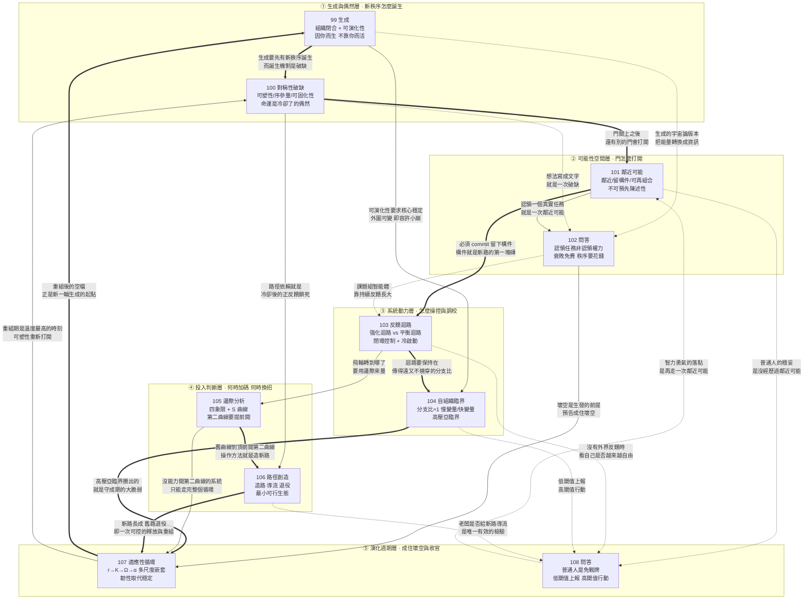

# E08 模組七：演化者（第 099～108 講）

> 來源：《現代思維工具課》模組七「複雜性與探索生發」
> 涵蓋：099生成、100對稱性破缺、101鄰近可能、102問答、103反饋迴路、104自組織臨界、105邊際分析、106路徑創造、107適應性循環、108問答

099 講開篇宣告「這一講咱們進入一個新板塊，主題是『複雜性』」，107 講則明言「這是演化者板塊的最後一講」。所以 099～108 這十講構成全課程最後一個、也是收口的模組。它要回答的核心問題只有一個——**當你面對的不再是一台可以被設計、被控制、被最佳化的機器，而是一個會自己長大、自己定型、自己衰敗、自己重生的複雜系統時，你該怎麼行動？**

前面六個模組講的大多是「怎麼把事情做對」：怎麼判斷、怎麼預測、怎麼學習、怎麼合作、怎麼組織、怎麼領導。模組七把姿勢整個換掉了。萬維鋼在 099 講開宗明義地說：**「普通的創造希望結果符合自己的設計，把『非預期後果』當作麻煩。然而最高級的創造，卻要故意給『你沒設計過的結果』留出位置，享受驚喜。我們學複雜系統不是為了讓它聽話，而是追求親手造出一方天地，然後放手讓它演化。」**這一句話定下了整個模組的基調：**從「控制者」轉為「演化者」。**

本模組的整體骨架可以概括為五層：

1. **生成與偶然層**（099、100）：099 立下總綱——生成就是「讓一個東西因你而生，卻不靠你而活，不照你而變」，並給出組織閉合與可演化性兩門功夫；100 則把鏡頭拉到宇宙尺度，用對稱性破缺說明新秩序是怎麼從一點偶然裡被選中、被放大、被永久保存的，並給出「可塑性—序參量—可固化性」三心法；
2. **可能性空間層**（101、102）：101 的鄰近可能把創新從「以人為本」翻轉成「以可能性為本」——你必須先進入那個房間，才能打開那扇新門；102 問答則補上「怎麼在沒有正式授權時認領難題」「怎麼把課題組的默契外置成智能體」「為什麼衰敗是免費的、秩序是要花錢的」三個落地問題；
3. **系統動力層**（103、104）：103 給出理解一切複雜系統的最小工具組——強化迴路與平衡迴路，並由此推出閉環控制與冷啟動兩項大事；104 則指出系統最好的狀態不是穩定，而是「差點就亂、將崩未崩」的自組織臨界；
4. **投入判斷層**（105、106）：105 用邊際分析回答「值不值得繼續投入」，給出 S 曲線與第二曲線；106 用路徑創造回答「既然舊路已經鎖死，怎麼換」，給出造路、導流、退役三步；
5. **演化週期層**（107、108）：107 用適應性循環把成、住、壞、空四階段補成一個完整的圈，指出「穩定蘊藏著不穩定，敗壞蘊藏著生機」，並用韌性取代穩定作為新的目標函數；108 收官問答則把整套複雜性視角砸回個人——所謂「普通人的穩妥」其實是一種認知貧乏造成的錯誤風險配置。

值得注意的是，這五層不是平行的知識點，而是一條有方向的推演線：**099 先立下「生成」這個最終目的，100 說明新秩序誕生的物理機制（偶然被冷卻成命運），101 說明可能性空間本身如何逐步展開（門後又有門），103～104 給出操控與調校這台機器的兩組旋鈕（迴路與臨界），105～106 給出「什麼時候該換招、怎麼換」的判斷與工法，107 則把前面所有的增長、破缺、臨界、換棒全部收進一個更大的循環裡——成住壞空。**而 102 與 108 兩篇問答，恰好像兩根釘子，把這條推演線分別釘回個人處境與組織現實。

貫穿全模組的一條主線是：**你不可能控制一個複雜系統，你只能參與它的演化——而參與的方式，是在正確的時刻、往正確的位置，放進一個能自己長大的東西。**從 099 的「凡是你一離開就停下來的事，都還只是你的能力；只有你離開之後還能繼續發生的事，才是系統的能力」、100 的「可塑性不是權力的函數，而是溫度的函數」、101 的「你所處的位置，比你是個什麼人，要重要得多」，到 103 的「失去負反饋，失去很多；失去正反饋，失去一切」、106 的「新的先來，舊的才能去」、107 的「與其追求穩定，不如追求韌性」，萬維鋼反覆示範同一個動作：**把人從「系統的主人」的幻想裡拽出來，放回「系統的播種者與節奏感應者」的位置上。**

而這個模組作為全課程的收尾，也在不斷回扣前面六個模組。001 講的敘事、006 講的不確定性、025 講的探索與利用、035 講的反脆弱、037 講的期權、046 講的效果推理、083 講的慢變量、087 講的剩餘判斷權、095 講的智件、097 講的基線漂移、098 講的認領授予授權，都在這十講裡被重新拿出來，安放進「複雜系統會自己演化」這個更大的框架中。**如果說前六個模組是在教你怎麼下好每一手棋，模組七是在告訴你：棋盤本身也是活的。**

---

## 一、逐講重點摘要

### 099 生成：最高級的創造（模組開篇）

- 破題極有意思：萬維鋼從修仙小說切入，說現在的修仙小說已經不滿足於比法寶、浮誇戰鬥力和像遊戲一樣的打怪升級了——**「高級的修煉法，是在自己心裡養出一個世界。」**煙雨江南《龍藏》裡主人公衛淵修出一個叫「人間煙火」的「心相世界」，存在於他的「識海」之中，裡面原本都是虛擬人物，後來真人也可以進出，成千上萬個虛擬人物越來越真實，逐漸跟真實世界連接成一體。萬維鋼點出這感覺「有點像你在我們這個現實中擁有一系列 AI 智能體，只不過這些智能體組成了自己的社會」——他們會越來越自主，分成不同的人群和門派，乃至最終不依賴你而存在。**「高手要比，應該比咱倆誰的心相世界大。」**
- 現實中的心相世界就是你開辦的公司、學校，甚至生的幾個孩子。**「看著你創造的事物發展壯大，變得越來越複雜，以至於後來你都理解不了……這種成就感，不比自己發幾篇論文、獲得一個什麼職務高級多了嗎？」**
- 核心定義，全講最重要的一句：**「生成就是讓一個東西因你而生，卻不靠你而活，不照你而變。」**萬維鋼強調**「這是給心胸最大的人準備的學問」**，其中有**一種情懷和兩門功夫**。
- **一種情懷是「生成感（generativity）」**，由發展心理學家艾瑞克·艾瑞克森（Erik Erikson）1950 年在《童年與社會》中提出。他認為人到了中年會撞上一道坎，稱為**「生成對停滯（generativity versus stagnation）」**：你是只顧維持和滿足自己、守著自己這一畝三分地過完算了，還是願意去培養後來的人、造點能進入未來的東西？前者是停滯，後者是生成。
- 1992 年，美國西北大學心理學家丹·麥克亞當斯（Dan McAdams）等人把它發展成一套可測量的理論模型——他們定義的生成包括**生孩子、帶徒弟、傳手藝、立制度、寫能影響後人的作品**。2021 年，荷蘭組織心理學家弗里德里克·多爾瓦爾德（Friederike Doerwald）與同事彙總 **48 項研究、涉及一萬五千多人**，結果顯示生成動機較強的人往往有更強的工作幹勁、更高的職業效能感和工作滿意度，以及更好的導師關係。
- 快樂的四種層級被分得極清楚：**有些快樂來自獲得**（錢、地位、作品、榮譽）；**有些來自體驗**（我看過、愛過、吃過、玩過）；**有些來自關係**（我被人理解，也理解別人）。這些都很好，但生成提供的是另一種東西——**「因為你曾經來過，世界上多了一個新的因果起點。」**
- 這句話的三個具體形象極為動人：**「一個學生沿著你指出的方向走到了你沒去過的地方；一個孩子形成了與你不同、卻更適合他自己的判斷；一項事業在你退休以後更加興盛。」**接著是本講最具哲學份量的一組對照：**「你的控制半徑很小，而且從某個時刻開始變得越來越小。可是你的因果半徑卻越來越大，大到你無法想像。」**
- 生成不等於「三不朽」：**「不朽是一種副產品。一個人能不能留下名字取決於很多偶然的因素，不可以直接追求。但生成則是一個非常實在的行為，它只在乎有沒有一樣東西因為你而獲得了繼續生長的能力。」**
- **第一門功夫叫「組織閉合（organizational closure）」**，出自理論生物學。它回扣課程前面講過的「自由能原理」：生命的特點是既開放（每時每刻都要從環境中獲取物質和能量）又獨立（能維持自己）。學者稱之為**「自創生（autopoiesis）」**（馬圖拉納與瓦雷拉 1980），更新的說法叫**「約束閉合（closure of constraints）」**（蒙泰維爾與莫西奧 2015）。
- 定義：**「所謂組織閉合，就是系統賴以存活的每一個關鍵環節，都能在系統內部找到供養它的另一個環節。」**心臟泵血，血液反過來供養心肌，心肌才有能力繼續泵血；基因造蛋白質，蛋白質反過來讀取、複製基因。**「閉合的意思不是封閉，而是完成閉環：不需要你從外部控制，這幾個東西在內部就能完成循環。」**
- 完成組織閉合要解決**三個問題**：**第一，它的成果能不能換來下一輪資源？**（產品帶來客戶和收入，收入養得起下一輪研發和招人；學校教出好學生，好學生變成聲譽，聲譽又招來新的學生、老師和捐助。**「要是每一輪都還得靠創始人重新去化緣、去求人，那就是還沒斷奶。」**）**第二，現在這批人能不能帶出下一批人？**（**「不能指望每隔二十年從天上掉下來一個蓋世英雄。」**）**第三，離開創始人，關鍵決定還作不作得出來？**（不能一直都是大客戶必須他談，高管吵架必須他斷。）
- 一條極具實操價值的自檢：**「每當你不得不親自去補位的時候，就應該問一句：為什麼這事只能我來？這次補位能不能變成『下次不再需要我補位』的安排？你救火不能說明你能幹，只能說明這個組織還沒閉合。」**
- **正反案例一：清末民初實業家張謇。**大清 1894 年的狀元，響應時代召喚把人生主業從做官轉向辦實業，結果是辦啥成啥——先在家鄉南通創辦大生紗廠，又以它為根基辦學校、博物館、圖書館、醫院和劇場，**「幾乎生成了一整座近代城市」**。但為什麼很少有人知道張謇這個名字？因為紗廠失敗了：1922 年一戰結束後外國商品重新湧入，棉貴紗賤，大生廠不但虧損更有巨額負債；1926 年張謇去世時，大生各廠的管理權已先一步轉到債權人手裡。連鎖反應隨之而來——伶工學社 1926 年停辦，南通博物苑失去依恃、財力拮据，1938 年又在日軍侵占中遭到毀壞。
- 用組織閉合三問對照張謇：**資源方面**，許多項目長期依賴紗廠輸血，沒有獨立財務能力；**人才方面**，學校和醫院形成了專業隊伍、知識傳統和社會聲譽，所以有條件找到新的供養者；**決策方面**，大生的信用與決策只繫於張謇一人，後來企業便只能由債權人接管。**「那些把管理權交給公共機構的事業反而活了下來」**——三所高等學校 1928 年合併成私立南通大學，通州醫院延續成為今天南通大學附屬醫院的源頭。
- **正反案例二：范仲淹的范氏義莊，前後延續了整整 901 年。**1050 年范仲淹在蘇州捐出一千多畝田設義莊，拿田租接濟范氏族人的吃穿、婚喪、趕考。**「這番操作的了不起之處是范仲淹不只是捐出了一筆財產，而且給了一套治理結構。」**具體條款極其完整：田產變成不得由子孫分割、典賣的范氏公產；由全族公舉的「主奉」總領，掌管人負責日常事務，各房另有「管勾」代表本房；族人按人頭、按月領米，要造冊核對；豐年留出兩年存糧防災；**連族裡輩分最高的長輩也不許插手多占**；收租發米等常務照成文規矩辦，規矩沒寫到的例外由掌管人與各房共同商議、**利害相關者還得迴避**；管理者若有侵占欺瞞，族人可以查帳、彈劾，最後還可以告到官府。
- **「有能生錢而不能私分的田產，有由族人公舉產生的管理者，有照章辦事和共同議事，有族內監督和官府最後執行，組織閉合的條件全都滿足。」**范仲淹 1052 年就去世了，義莊卻一直延續到 1950 年土地改革時，**「比宋元明清每個朝代的命都長。誰說中國人沒有信託精神？」**
- 段落收束金句：**「凡是你一離開就停下來的事，都還只是你的能力；只有你離開之後還能繼續發生的事，才是系統的能力，是你的生成。」**而要做到這一步，**「你必須先交出自己的『不可替代感』。小世界這才有了自己的新陳代謝，不必你天天餵靈氣了。」**
- **第二門功夫叫「可演化性（evolvability）」**，直接回扣 097 講的基線漂移：任何系統都一定會變化，但你想讓它有好的變化、新穎的變化。1996 年演化生物學家京特·瓦格納（Günter Wagner）與李·阿爾滕貝格（Lee Altenberg）提出：**變異加選擇並不自動帶來進步；真正決定成敗的是系統的結構能不能讓一處局部的改動，產生一點局部的改進，而不是一動就全盤垮掉。**2007 年格哈特（John Gerhart）與基爾希納（Marc Kirschner）提出**「促進變異（facilitated variation）」**再補一層：生物創新很少從零造起，而是**留住一批穩定的核心零件，靠重新組合它們，長出新形態**。
- 一句話總結：**「可演化的系統必須核心穩定，外圍可變。」「這就如同房子的承重結構越牢，才越敢重新裝修其中的房間。」**
- 可演化性的**三條心法**：**第一，給邊界，不給劇本。**值得定死的東西並不多——這個事業為什麼存在、它為誰服務、什麼絕對不能做，這些構成系統的**「慢變量」**（回扣 083 講）；具體的產品、方法、結構都應該允許後人改。**「最危險的『文化傳承』就是把創始人的時代局限也當成祖宗供起來。」第二，把試錯切小。**每次讓一個局部先試，失敗了不拖垮整體，成了別處能學過去。**「不能每次創新都得全體轉向。」第三，接受現實的篩選。「你不能光說『鼓勵創新』，讓大家提一大堆新點子，卻沒人擔後果，更沒有一個項目真正死掉。」**
- **反面案例：朱元璋。**要飯出身、靠暴力取得天下，偏偏認為自己的思想就是先進的。洪武二十八年（1395）頒布《皇明祖訓》，序言中規定：**「凡我子孫，欽承朕命，無作聰明，亂我已成之法，一字不可改易」**；同年九月又敕諭禮部：後世誰敢提出改變祖法，**「即以奸臣論無赦」**。
- 後果極其慘重：海禁長期壓制私人海外貿易，使大明錯過把繁榮海貿變成穩定稅源和海防力量的機會；世襲衛所制度因軍戶大量逃亡而日漸空心化，逼得朝廷另花錢募兵。**「可是大海就在那裡，朝廷總得用兵。」**海貿需求禁不掉就轉入走私，後世鬧出倭寇；明中葉以後**軍費吞掉中央政府支出的六成到九成**，成為國家財政最沉重的負擔。而隆慶開海已經證明，**政策只要鬆一道縫，中國海商很快就能接入全球貿易**。
- 最深刻的診斷：**「正因為朱元璋不讓改，後世又不得不改，人們就只能搞各種權宜之計繞過祖訓。結果是舊制度名義上還在，新辦法只能作為例外和臨時措施生長。於是權責不清、規則打架、尋租叢生、財政成本越來越高，任何一次改革都要先背上過去所有補丁的包袱。」**收束一擊：**「一個死了兩百年的創始人，靠一塊『祖制』的牌位，繼續對後來的決定行使否決權。這不荒唐嗎？這都是被權力慣壞了，自大成狂，妄想永不退場的結果。」**
- **會演化的東西長什麼樣？四個範例，每個都是「守住的不是形式，而是內核」：任天堂**原本是賣花札紙牌的公司，卻成了創造瑪利歐、薩爾達和 Switch 的遊戲公司——**「它守住的不是紙牌，而是讓人玩得開心。」哈佛**原本是殖民地裡培養牧師的小學院——**「它守住的不是神學課程，而是傳遞知識。」《西遊記》**從取經戲曲評話變成章回小說、連環畫、動畫、電視劇和遊戲——**「它守住的不是九九八十一難的細節，而是那個任何一代人都能重新出發的取經母題。」美國**從大西洋沿岸 13 個州的農業共和國變成 50 個州的現代國家——憲法正文仍是 1787 年的七條，**二百五十年只增加了 27 條修正案**，**「憲法在理論上可以被改寫，但是在實際操作中又很難被改寫」**。
- 對創造者的想像極為溫柔：**「這些事業最初的創造者如果來到今天肯定認不出來它們的樣子，但他們大概會感到欣慰而不是憤怒：感謝你們沒有忠實執行我的第一版，也感謝你們把我最初那點值得保留的東西堅持下來，做得遠遠更大。」**要做到這一步，**「你就必須交出自己的『最終解釋權』。至此小世界才算脫離了你的識海：你不再是它的主人，只是它最初的開天者。」**
- 兩門功夫的分工與張力講得極清楚：**「組織閉合能防止死亡，可演化性能防止衰老。前者讓系統不必靠你才能活，後者讓它不至於活成一塊化石。」**但二者之間有張力——**組織閉合靠標準、複製和傳承，要系統記得住；可演化性靠異議、偏離和試錯，要系統改得動。**范仲淹的規矩可以修訂，後世子孫多次修改補充；朱元璋的規矩不許修訂。那到底哪些是創始人不可改變的初心？萬維鋼的答案很豁達：**「其實只要這個事業能夠履行承諾、守住底線，只要能延續、能夠興旺發達，就都是好的。」**
- 用老子收束：**「我無為而民自化。」**又說**「太上，不知有之；其次，親而譽之；其次，畏之；其次，侮之。」**於是給出生成者的三重境界——**「普通的生成者要求保留對這個東西的所有權，為此需要讓人怕他。優秀的生成者不再要求所有權，只要人們感謝他就可以了。偉大的生成者甚至不要求別人記得他。」**而且**「其實成為一個偉大的生成者並沒有那麼難。要知道世界上沒有多少人記得自己太爺爺的名字。」**
- 收束偈語：**「攬物盈懷終是占，放身入世始為生。枝繁不必循吾令，人去春深自滿城。」**

### 100 對稱性破缺：命運不過是冷卻了的偶然

- 開篇就給了極高的定位：**「這一講的思想工具可能是複雜性科學送給我們最強大的一個武器。」**
- 破題畫面是太空望遠鏡拍攝的星空照片：無數星星密密麻麻鋪滿畫面，位置看上去完全隨機，你可能覺得隨便挪動幾顆也看不出區別。**但事實是你挪不動**——照片上每一個小光點不是一顆星星而是一個星系，**照片上一毫米的距離就是幾億光年**，把一個星系「稍微挪一挪」需要的能量是大自然根本不允許的。**「你面對的是一個堅不可摧的既成事實。」**
- 可那些星系的位置為什麼是這樣？**答案是來自偶然。**早期宇宙的物質—能量密度近乎均勻，只疊加著極其微小的量子漲落——這裡稍微密一點點，那裡稍微稀一點點，**這個「一點點」是十萬分之一**。就是那一點點差異，讓物質在重力作用下慢慢變成星系。**「今天這些星系的分布格局，哪裡星光成團、哪裡一片空曠，不過是那陣隨機抖動的放大。」**
- **定義**：這個從「什麼都可能」變成「只有一種可能、而且堅不可摧」的過程，物理學叫**「對稱性破缺（symmetry breaking）」**。經典比喻是把一支鉛筆筆尖朝下立在桌上——周圍四面八方完全等價，物理方程沒有偏愛任何一個方向，這就是對稱；可鉛筆不能永遠立著，可能因為空氣瞬間的擾動、桌面細微的紋理，因為一些小到不能再小的偶然，它會倒下，而**一旦倒下就只能倒向某一個方向，再也回不來了**。
- 三句極凝練的排比：**「方程是對稱的，結果是破缺的。混沌是對稱的，混沌初開是破缺的。萬事萬物就由此展開。」**
- 1972 年貝爾實驗室物理學家菲利普·安德森（Philip Anderson，後來得諾貝爾物理學獎）在《科學》雜誌發表《多者異也（More Is Different）》，感慨宏觀世界的規律不能從微觀方程簡單推出來，而**「破缺的對稱性（broken symmetry）」正是理解世界為什麼一層一層長出新秩序的鑰匙**。萬維鋼接著說：**「這把鑰匙不但能解釋星空，還能解釋你的處境。簡單說——命運不過是冷卻了的偶然。」**
- **宇宙的歷史是一部降溫史，每一次降溫都逼著宇宙做一次選擇。**第一次：根據阿蘭·古斯（Alan Guth）1981 年提出的**暴脹理論**，宇宙誕生後遠遠不到一秒鐘經歷過一次暴脹——空間本身的超級爆炸式膨脹——把微觀世界裡本來轉瞬即逝的量子漲落一口氣拉伸到宏觀尺度，**「凍結」成宇宙密度分布的底稿**。**「後來的一百多億年裡重力只是在按這份底稿施工。」**
- 第二次：大約在誕生後**萬億分之一秒**，溫度降到千萬億度的量級，破缺輪到了力和質量。在那之前電磁和弱交互作用還是同一種力，傳力的粒子和組成物質的粒子全都沒有質量；在那之後，瀰漫在整個宇宙的希格斯場撐不住了，**如同桌上的鉛筆隨機倒向了一個方向**，電磁力和弱力從此分家，電子、夸克有了質量。這叫**「電弱對稱性破缺（electroweak symmetry breaking）」**。
- 第三次：正反物質的不對稱。按理說大爆炸應該產出嚴格等量的正物質和反物質，相遇就會湮滅化為光，**「如果宇宙堅決執行這個對稱性，它的結局就是一片純粹的光」**。可當年的帳目裡有一個微小的零頭：**大約每十億個反物質粒子，對應十億零一個正物質粒子**。湮滅如期而至，十億對十億同歸於盡之後，總會剩下一個。**「這個十億分之一的零頭，就構成了今天宇宙裡所有的普通物質——包括你。」**（這個零頭從哪來？物理學家找到一些線索——沙卡洛夫 1967 年的條件、1964 年克羅寧與菲奇的 CP 破壞實驗——但**還沒有完全解決**。）
- 三次破缺全部發生在大爆炸後的第一秒之內。哲學性的收束極漂亮：**「我們很慶幸，宇宙是『不完美』的產物。完美的東西應該絕對對稱，可絕對對稱就意味著什麼都沒有。不偏心的湮滅留不下物質，不站隊的希格斯場給不出質量，完全均勻的宇宙長不出星系。所以破缺不是世界的瑕疵。破缺是世界的生成機制。」**
- 三種物理過程（漲落凍結、希格斯站隊、正反物質湮滅）很不一樣，但**「它們都是讓一點偶然的差異被選中，被放大，然後被永久保存。大自然如此，人世間也是如此。」**
- **社會的高溫態**：幾股力量暫時達成均衡，幾個陣營都可能贏，幾個標準都合理，幾個未來都說得過去，一切皆有可能，微小的擾動就能帶來巨大的變化。**「那時的社會就像一塊剛出爐的玻璃，柔軟可塑，你吹一口氣就能讓它彎個弧度……但它很快就會冷卻定型。到時候你就算用鐵錘砸，結果也只有兩種：要麼它紋絲不動，要麼粉身碎骨——反正你想要的那個形狀是得不到的。」**
- **歷史案例一：1947 年印巴分治。**英國終於決定撤出印度，國大黨打算統一全印度，穆斯林聯盟堅持另建巴基斯坦，於是英國給了個分治方案。**可是分界線應該畫在哪？**兩邊爭執不下，英國政府乾脆把這項任務交給一名倫敦律師**西里爾·拉德克利夫（Cyril Radcliffe）**。拉德克利夫接到任務才第一次前往印度，**卻並沒有去需要劃邊界的地方**，只是參加委員會的工作——身在德里，根據地圖、人口普查報告和一些聽證材料做出裁決。
- **「如果當時有個明白人請拉德克利夫吃頓飯，給他講一講兩邊的宗教信仰和歷史情況，想必今天的局面會好得多……可結果恰恰是這麼一個對那片土地完全陌生的人，隨手畫了一條線，就給印度和巴基斯坦完成了地理手術。」**隨後上千萬人從國界的一邊逃向另一邊，然後是大仇殺，然後是延續至今的印巴對抗。**「拉德克利夫那條線明顯沒畫好，可你現在想重新畫，卻是幾乎沒可能。」**
- 核心命題：**「改變同一件事，趁熱的時候不費吹灰之力，冷卻了就像移動星系一樣難。」**
- **歷史案例二：李斯「書同文」。「以中國之大，從南到北從西到東，距離那麼遙遠的人都使用同一種文字，你難道不覺得這是一個奇蹟嗎？」**那是秦始皇剛統一天下、戰亂剛把舊秩序熔了個乾淨，李斯抓住這個時刻，以秦篆為標準完成的。**「縱觀中國歷史，要做成這件事可能就只有這一個窗口。」**
- 為什麼只有這一個窗口？本來各國文字都出自商周傳統但早已分叉（《說文解字·敘》：「言語異聲，文字異形」），**所幸各國還沒有各自養出幾百年的經典、成熟公文和大批讀書人，所以對文字的認同感不深**，李斯一道政令就能壓平。**「如果李斯當年不做，讓各地的語言文字繼續獨立演化下去，中國就會像歐洲一樣——有拉丁文也不好使，最終法語、義大利語、西班牙語等羅曼語族語言從拉丁語中分化出來，英語、德語等日耳曼語族語言則另有源流，全都發展出成熟的文化，後人再想統一可就難了。」**
- 全講最精準的一句公式：**「可塑性不是權力的函數，而是溫度的函數。」**接著是**「只要系統還熱，你就可以把自己的選擇變成後人的預設值」**，並列舉四個奠定時刻：
  - **華盛頓**：美國總統這個職位還是一張白紙時，他做滿兩屆便主動退場，從此「總統不是國王」就是慣例。此後一百四十多年的所有總統都把任期控制在兩屆以內，直到小羅斯福打破先例——**但最後這條慣例還是被寫進了憲法**。
  - **比爾·蓋茲**：個人電腦作業系統還沒定型時，他**沒有把 DOS 一次性賣給 IBM，而是保留了向其他廠商授權的權利**。此後相容機、軟體和使用者都圍著 MS-DOS 聚攏，微軟佔住了整個 PC 世界的收費站。
  - **CERN**：全球資訊網還只是歐洲核子研究中心內部的一個資訊共享專案時，CERN 在 **1993 年把核心軟體置於公共領域**，於是瀏覽器、伺服器和網頁得以圍繞開放協定共同生長。
  - **賈伯斯**：1997 年蘋果瀕臨破產，他**趁整個組織都快垮了，一口氣砍掉 70% 的產品路線圖**、重新集中資源。**「後來 iMac、iPod 和 iPhone 的道路就是從這次幾週內完成的重鑄中打開的。」**
- 對歷史敘事的一記重擊：**「破缺之前，局面像一枚豎立的硬幣；破缺之後，歷史學家開始解釋它『為什麼必然』倒向這一面——而複雜性科學提醒我們那可能不過是偶然的一倒。」**而局面只要開始一邊倒，正反饋就會把這個偶然越鎖越死：越多人接受它，接受它的理由就越充分——經濟學家稱之為**「路徑依賴（path dependence）」**（W. Brian Arthur, 1989）。這一句直接埋下 106 講的伏筆。
- 一句紮心的觀察：**「開創者怎麼幹都有理。絕大多數人卻是在玻璃冷透之後，才想起自己對它的形狀有意見。」**
- **三條操作心法**（出自「臨界現象」的相關研究，Scheffer 等人 2009 年《Nature》論文〈Early-Warning Signals for Critical Transitions〉）：
- **心法一：觀察系統的「可塑性（plasticity）」——熱系統必須有不止一個未來活著。**一個領域如果只剩一個公認的贏家、一套公認的做法，它已經冷了。而**如果三四種說法都講得通，誰也不敢說哪個是標準，技術路線還沒定型，行業還沒有職稱體系，組織還沒有流程，平台還沒有公認的「爆款公式」，它就還在窗口裡。**而「將冷未冷」的一個特徵是**大家不再各自判斷，而是互相打聽「別人怎麼選」**：「再等等，看大廠怎麼動」「看領導怎麼表態」——**人們在期待「共同知識」**（回扣 080 講）。
- **心法二：尋找「序參量（order parameter）」——能把無數局部選擇壓縮成一個宏觀方向的那個量。**磁鐵看淨磁化方向，行業看有多少人採用同一標準，圈子看有多少關鍵人物公開承認同一個名分。操作方法極具體：**兩條技術路線競爭，用採用 A 的比例減去採用 B 的比例——如果差值接近零，系統還沒選邊；差值持續偏向一側，則破缺正在發生。「序參量一旦穩定偏轉，系統裡大量原本各自獨立的選擇，就開始圍著它重新排列。」**
- **心法三：尋求「可固化性（lock-in potential）」——你要確保你這一小步能被系統記住。**小動作原本沒啥用，因為穩定系統消化能力強，小事故、小文章、小爭論很快無聲無息。**但是臨近對稱性破缺的系統，小事會反覆迴響不死**——**「一篇文章轉了又轉，一個小 demo 讓全行業焦慮，一次普通會議被私下議論好幾個星期。這一切說明，系統正在尋找一個出口……」**
- **六個生活應用場景**：
  - **新工具剛進公司時**：老闆宣布「全面擁抱 AI」，可是沒有流程、沒有模板、沒人知道怎麼用，大家都在觀望打聽——**這就是可塑性**；而「哪套用法正在成為標準動作」就是**序參量**。**「你不聲不響做出一套可複製的 Skill 分給同事，乃至於進入內部教程，破缺就已經發生。等大家開始問『這事兒是不是得按你那個方法來』，你就是制度的鑄模者。」**
  - **剛入職的頭三個月**：這時候沒人知道你是誰，**你可以決定別人怎麼給你定型**。第一印象會持續很久很久，所以**頭三個月要挑一兩件能見度高的小事做漂亮**，讓人第一次想起你就想到一個清晰的標籤，比如「這人能把複雜問題講明白」。
  - **談判的第一輪**：第一輪表達的價格、職責和邊界會成為錨點。**「別等對方出題，你要先打破對稱。比如一上來就給一頁紙：目標、分工、交付、時限、什麼不包括在內，請對方回覆、確認和引用它。」**
  - **一段關係剛開始時**：夫妻倆誰管錢、怎麼吵架、各自父母的邊界在哪兒——**這些規則會在相處的頭一兩年悄悄凝固。「過了這個時機，模式成為預設，再想改可就只能靠鬧了。」**
  - **對孩子**：**「每個孩子剛出生都是對稱的，每貼一張標籤就發生一次破缺。」「我是數學不好的人」「我是能上台的人」——「這些身份一旦凍結，會反過來指揮他此後幾十年的行為。」**
  - **危機**：失業、生病、專案崩盤、關係破裂，這些是壞消息，**但也是局面重歸對稱的時刻**。**「平時你想改都改不動的那些結構——住在哪兒、跟誰來往、怎麼工作、怎麼生活——此刻全都鬆動了。危機暫時把改變的成本打了折。趁一切還是碎的，重新拼一個更好的。」**
- **四步操作流程**：**命名 → 樣板 → 公開 → 固化。「給還沒名字的東西一個名字，給還沒標準的事一個能抄的樣板，把它公開出去讓大家知道『別人也知道了』，然後寫進日程、模板、合約、手冊。」**萬維鋼明確回扣上一講：**「用上一講『生成』的話說，這就是讓新秩序因你而生、不靠你而活。」**
- 關於「無限可能」的祛魅：**「人們常說未來有無限種可能。其實只有年輕人的未來有無限種可能。你的每一次成長都是一次選擇，每一次選擇都是一次破缺，每一次破缺都是一次定型。你的身份會固定，你的路徑會鎖死，你的社會關係會固化，你的生活會冷卻。那可太沒意思了，這就是為什麼文藝作品的主人公幾乎都是年輕人。」**
- 對「選擇大於努力」的修正：**「『選擇大於努力』沒錯，可我們並不是任何時候都有得選。窗口開著的時候，一個小動作能改寫後面很多年；窗口關了，你以為的選擇不過是擺姿勢而已。」**
- **歷史收尾：曹參。**漢初的曹參接了蕭何的班，整天喝酒一事不改。惠帝責問他怎麼這樣當丞相呢？曹參反問：論才能，您比得上高帝、我比得上蕭何嗎？**「潛台詞是人家那時候的系統是熱的，到咱手裡已經冷了。」**
- 全講最具份量的收束，也是對「認命」二字的重新定義：**「命運不是不可改變的，但也不是隨時可以改變的。認命，是認清哪些事已經冷了；不認命，是盯住那些還熱著的。」**
- 收束偈語：**「萬古星河起一塵，劫灰算盡剩斯人。休言天地成形久，猶有琉璃帶火溫。」**

### 101 鄰近可能：如何實現無法事先想像的事情？

- 與上一講的接續極明確：**「上一講咱們說了偶然怎樣冷卻成命運——對稱性破缺，講的是門怎麼關上。那聽起來有點令人沮喪。但是，即便年齡增長，在有些情況下，有些你從未想到的門會為你打開。這一講咱們就說說門是怎麼打開的。」**
- 破題是一個「最普通的好學生劇本」：有個少年原本一心想當作家，可是 **17 歲**這年父親告訴他當作家會餓肚子，他只好改學理工；**18 歲**幸運地獲得赴美讀書的機會；**24 歲**在麻省理工學院兩次博士資格考試中落榜，深感受挫，心想算了吧找工作。他拿到兩個機會：**福特汽車月薪 479 美元，一家叫希凡尼亞的電子公司 480 美元**。他本想去福特，**打電話讓對方多給 1 美元，竟然被拒絕了**，於是去了希凡尼亞。
- **「你看，作家不能當，科學家當不成，大廠也沒進，最後去了個不那麼知名的小公司。有人說人生大部分事情是三十歲以前決定的……但此人是張忠謀。只不過他那時候還不知道自己會成為今天這樣的張忠謀。」**
- 後續劇本繼續跌宕：1958 年跳槽加入德州儀器——**恰好在同一年，傑克·基爾比（Jack Kilby）就在德州儀器造出了世界上第一塊可工作的積體電路**。張忠謀展現管理才能，從生產線工程師一路做到統管全球半導體業務的資深副總裁，**是公司第三號人物**。然後急轉直下：進入七〇年代德州儀器把寶押在計算機、電子錶這些消費電子上，張忠謀並不認同，**竟被一步步挪出權力中心**，在 **52 歲**這一年辭職，轉投的下一家公司也只幹了一年上下，不歡而散。
- **「三十年美國職場，他終究沒能成為任何一家公司的一號人物。」54 歲**去台灣出任工研院院長，本想搞搞改革，可是沒啥根基，也是裡外不討好。**「按一般認知，這個歲數的人混幾年退休算了。」可就在 55 歲這年，張忠謀創辦了台積電……剩下的就是歷史了。**
- 張忠謀自傳裡的原話：**「如要我挑選我的黃金時代，我毫不猶豫挑選六十至八十五歲那兩個半單位」**。萬維鋼追問：**「60 歲才迎來黃金時代，而且長達 25 年，你能想像嗎？人們常說要『做自己』，要找到真正的熱愛，要實現自我——可是 17 歲的張忠謀以為真我是作家；52 歲的他也不知道此生最重要的事業還沒開始。『專業晶圓代工』這個行業，那時候根本不存在……那是後來他發明的行業。」**
- **定義**：本講的思想工具叫**「鄰近可能（the adjacent possible）」**，由理論生物學家斯圖爾特·考夫曼（Stuart Kauffman）提出並發展——他是複雜性科學重鎮**聖塔菲研究所（Santa Fe Institute）**的元老，2000 年在《調查》（*Investigations*）一書裡系統展開這個概念。
- 考夫曼的說法：**「任何系統在任何時刻，周圍都存在一圈『只差一步就能實現』的新狀態——用現有的零件，做一次組合、一次改動就夠得著的東西。這一圈，就是這個系統此刻的鄰近可能。」**
- 生命起源就是不斷把鄰近可能變成現實一步步走出來的：**原始地球的化學湯裡本來沒有 DNA 的位置，只有一些簡單分子。可是簡單分子能組合成稍複雜的分子，而每一種新分子一旦出現，又讓一批此前根本不可能發生的化學反應變成了可能……「可能性的邊界，會隨著每一次對之前可能的『實現』，向外擴張。」**
- 2010 年科普作家史蒂文·強森（Steven Johnson）在《偉大創意的誕生》裡用一個比喻把它講給大眾：**「你身處一棟魔法房子，推開一扇門，走進一個新房間——而這個房間的牆上，又長著幾扇你在上一個房間裡根本看不見的新門。」**
- 萬維鋼自己的提煉，是全講的樞紐：**「鄰近可能這個學說的根本，是把創新從『以人為本』變成了『以可能性為本』——關鍵不在於你聰明不聰明，你必須先實現一種可能性，才能打開新的可能性。你必須先進入那個房間，才能打開那扇新門。」**
- **鄰近可能立即解釋科學史上的一個懸案：重大發明為什麼總是「撞車」。**牛頓和萊布尼茲各自發明微積分；達爾文和華萊士幾乎同時想到天擇；**貝爾和格雷乾脆在 1876 年 2 月 14 日同一天為電話遞交了專利文件**。1961 年哥倫比亞大學社會學家羅伯特·莫頓（Robert K. Merton）系統考察科學史後得出結論：**多人獨立、幾乎同時做出同一個重大發現，不是例外，是常態。**
- **「如果靈感真是天才頭腦裡的神來之筆，怎麼會這麼巧，靈感同時進入兩個天才的頭腦呢？」**答案：**「我們只要把創新看成推門，一切就都合理了：大家住在同一棟房子裡，走廊盡頭那扇新門是房子自己長出來的——那幾個人恰好同時站在門口，同時發現了那扇門，這不是很正常嗎？」**
- 2009 年聖塔菲研究所經濟學家布萊恩·亞瑟（W. Brian Arthur）在《技術的本質》中把這個邏輯推廣到一切技術，叫**「組合演化（combinatorial evolution）」**：**新技術全都是已有技術的組合，而每一項新技術一出生，立刻變成下一項新技術的零件——於是工具箱越大，創造新工具就越快，這就是技術加速的根源。**
- 連國家的命運也是如此。2007 年物理學家出身的塞薩爾·伊達爾戈（César Hidalgo）與哈佛經濟學家里卡多·豪斯曼（Ricardo Hausmann）等人在《科學》發表**「產品空間（product space）」**研究：把全球貿易畫成一張網路，發現**國家的產業升級通常不是憑空跳躍，而是先做成跟現有能力「相鄰」的產品，再從新位置去夠下一個**——中國從紡織服裝、家電製造，到手機、電子零組件和新能源汽車，也是沿著相鄰能力一步步擴展過來的。
- 一個順帶的推論極有趣：**「這你就明白那些所謂『美國利用外星人技術搞出 iPhone』之類的陰謀論是站不住腳的了。如果是外星人技術，你根本找不到它的演化圖譜！」「哪有什麼天降神蹟？我們無非是因為去到某個房間，才能打開某一扇門罷了。」**
- **與課程前面三個工具的對照**（這一段是模組七回扣前面模組最密集的地方之一）：**「效果推理」**說創業不是先想好一個產品再去找資源，而是先看自己手裡有什麼，再看這些東西能組合出什麼；**「狀態槓桿」**說做任何事都別做完就算了，要為下一步預留狀態；**「能耐尋求定理」**說最優策略不是追求一時回報，而是前往能給下一步打開更多可能性的地方。**「它們視角不同，但都有『走一步看一步』的意思——而鄰近可能，還有一層更激進的意思：這一步走完，打開新的可能性，你心中的世界就不是原來那個世界了。」**
- **更強的主張：「不可預先陳述性（unprestatability）」。**2012 年考夫曼與巴黎高等師範學院數學家朱塞佩·隆戈（Giuseppe Longo）、生物學家馬埃爾·蒙泰維爾（Maël Montévil）提出：**在生物演化中，不僅未來的狀態不可預測，連未來可能空間裡會出現哪些變數、哪些功能、哪些生態位，都無法預先完整列舉。**用課程前面的概念說，這是一種**「奈特不確定性」**——未來的可能性，你想像都想像不出來。用他們自己的話說：**「我們無法為演化中的生物圈寫出運動方程（We cannot write equations of motion for the evolving biosphere）。」**
- 考夫曼最愛舉的例子：**請你列出一把螺絲起子的全部用途。**你能想到很多——擰螺絲、撬油漆罐、抵門、當兇器、做雕塑、削鉛筆……**但是你絕對列不完。「這是因為『用途』不是螺絲起子的內在屬性——它是螺絲起子跟所有場景的組合，而未來的場景還沒長出來。」**
- **雷射的例子**：1960 年雷射剛被發明出來時，研發人員都不知道這東西有什麼用，**還自嘲說這是「一個尋找問題的解決方案」**。當時沒有人能列出超市條碼、光纖通訊和近視手術，**可後來撐起雷射產業的恰恰是這些用途。**
- 用在人身上：**「你學會一項新本領、拿出一件新作品、到達一個新身份，或者認識一群新人之前，不可能提前預測到時候你會得到什麼。因為你那個新構件會跟別的東西，也許也是新東西，發生組合。」**當下的例子是「電競選手」「帶貨主播」「智能體工程師」這些崗位，**「就是上一代的人連想都想不到的」**。
- 回到台積電：**「張忠謀 55 歲創辦台積電的時候，純晶圓代工商業模式還不存在。當時只有幾家小設計公司感興趣。輝達要到六年之後，也就是 1993 年才成立。」**因為不可預先陳述性，張忠謀不可能預先算出台積電能有多大生意，**「他等於是給一個還沒出生的產業先修了一座工廠。」**
- 但這正是關鍵：**「可是如果你不把這個工廠建起來，那個行業就不會出現。」**事實上張忠謀賭對了——**台積電一旦真實存在，設計者從此不需要幾億美元建廠，一張圖紙就能開公司，「無廠晶片公司」這個物種才得以大規模繁殖。**高通、輝達、聯發科、蘋果的晶片部門都在這個生態位上。張忠謀不可能預見到智慧型手機和 AI 晶片，**「那些是鄰近可能的鄰近可能……的鄰近可能——但是你不實現第一個可能，後面就都沒可能。」**
- 對「找到真我」這套話術的最強反駁：**「不可預先陳述性說，你無法提前忠於一個還不存在的自我，你只能走過去，把它走出來。」**
- **打開鄰近可能的三個條件**：
- **第一，它必須是鄰近的。「它不是一步登天，而是用你現有的知識、資源、關係，再加一次夠得著的伸展，就能做成的事。你希望它足夠新，才打得開新門；但它也必須足夠近，才能被實現。」**
- **第二，它必須留下一個現實的構件。「你一次行動結束之後，這個世界上應該多出一樣東西：一篇文章，一個原型，一項經過實戰檢驗的能力，一段共同做成過事的關係，一小群真實的用戶。反過來說，僅僅『學過』『想過』『認識過』『計劃過』，世界不會有任何變化。」**
- **第三，它必須能參與下一次組合。「評價一件事，別只問『它現在給我什麼回報』，要問『它做完之後，還能長出什麼』。」**
- 三條的結構被點破：**「第一條說的是『探索』，後兩條說的是『利用』，或者說得直白一點：你得 commit。你得真投入進去，真下本錢，真做出個什麼東西來才行。」**
- **全講最反直覺、也最重要的一句，直接對沖了 037 講的期權思維：「鄰近可能不是一個關於『期權』的學問。保留所有選項不會給你帶來新的選項。你必須 commit 到一個選項上去，為此不惜放棄別的選項，才能打開下一扇門。」**
- **甲與乙的寓言**：甲的收藏夾裡存著一百個絕妙的點子，他誰也不告訴怕被抄，也遲遲不動手因為一旦做了這個就等於放棄了別的。乙只有一個不怎麼樣的點子，**他花兩個月把它做成一個粗糙的小工具，發布了**。那個工具招來一堆吐槽，**但吐槽裡藏著真需求**；乙照著改了三版，有了第一批用戶；用戶裡冒出一個懂行的，拉他合作；合作做出的第二個東西被一家公司看中……**「結果三年間，乙變成了他自己原來根本想不到的樣子。他現在擁有很多新的可能——以前不可能的可能。可是甲，仍然抱著之前那一百個可能。」**
- 收束一擊：**「世界不會對你的潛力作出回饋，它只對你已經做出來的東西作出回饋。而回饋，會改變你。」**
- **三個應用場景**：
  - **學習**：**「最好的學習單位不是『一門課』，而是『一個略高於當前能力、幾週內能做出作品的專案』」**——這句話裡的三層限定正好對應上面三個條件。**「上完課，世界裡只多了一張描述你的證書；做完專案，世界裡多了一個會替你說話的東西。」**
  - **職業**：比較兩個 offer，大多數人比薪水、頭銜、公司名氣——這些衡量的都是「這一步本身值多少」。**「你應該再加一個維度：幹滿三年，我手裡會多出什麼？」**有的工作光鮮但內容高度封閉，三年下來除了薪資單什麼都沒留下；有的工作看似平平，卻讓你攢下幾個能搬走的構件。**「中年轉行最可靠的方式不是拋棄過去重新投胎，而是把過去攢下的模組搬進一個新組合。」**
  - **AI**：AI 讓所有人面前突然多出一批變便宜的零件——程式設計、翻譯、設計、寫作、調研。很多人問「AI 會不會取代我」，**「這其實是一個錯誤的問題，你問的是過去的可能性。正確的問題是搜尋鄰近可能：我已有的哪樣本領，加上這些新零件，能組合出一個上個月還不存在的動作？你的鄰近可能剛剛被 AI 擴了一整圈知道嗎？！你得關注新出來的領地才對啊。」**
- **對傳統智慧的重新審視**：什麼叫好高騖遠？什麼叫腳踏實地？**「只要你想做的那件事在你的鄰近可能範圍之內，哪怕聽起來特別高級，它也是合理的。而如果這件事不在你的鄰近可能範圍內，哪怕是去工地搬磚，也不能叫腳踏實地。」**
- 最後把「位置」提到「身份」之上：**「你所處的位置，比你是個什麼人，要重要得多。不同地理位置對應的是不同的可能性空間。而你的能力、你的關係、你的經歷，本質上也是可能性空間中的一個位置。」「你要做的不是追問『我是誰』，不是去發現什麼真我，也不要問我的性格是什麼、我的愛好是什麼，那些只不過是一個暫時的位置而已。前往下一個位置，你會發現現在的你想像不到的可能。」**
- 兩首收束詩：**「天下新芽近處萌，門開門後又門生。莫將此身先畫定，走到無名處自成。」**又化用蘇軾《和子由澠池懷舊》：**「鴻飛那復計東西，且把爪痕印雪泥。回首來時無路處，點點相連已成蹊。」**

### 102 問答：怎樣在沒有正式授權的時候主動認領難題？

- 本篇是往期問答集錦，橫跨 095 智件、097 基線漂移、098 認領授予授權、099 生成、100 對稱性破缺五講。其中**認領難題**那一則是全課程關於「無授權影響力」最具操作價值的一段，而**熵增**那一則則為 107 講的成住壞空提前鋪好了物理基礎。
- **回覆 095（課題組的外置系統）**：讀者問學術課題組能不能也做「把聰明外置成系統」。萬維鋼指出課題組有個比公司更嚴重的問題——**人員周轉太快**：**「公司的員工一般都會至少幹上三五年，骨幹連續幹十年也很常見。可是課題組，學生進來，頭兩年什麼都不會，第三年勉強上手，第四年在你的辛苦培養之下，也正好趕上這孩子聰明，他終於成了這個方向上最懂行的人……然後第五年他必須走。」**
- 傳統做法是口耳相傳，讓新人上手做事、旁邊有師兄師姐指點一二。問題在於**讓實驗成功的那些真正的參數——「哪一批試劑、室溫多少、離心到第幾分鐘手要停、那個不起眼的洗滌步驟為什麼不能省」——都全憑手感，沒有一個準數。「按企業標準的話，這一套根本就不行。」**
- 分層的解法：**最起碼要有一套實驗室手冊**，或最簡單的、你們實驗室最經典實驗的完整記錄，**新人對照著手冊和記錄就能複現你們課題組看家的實驗**；**再進一步，全課題組每個人的實驗記錄、尤其是各種失敗的嘗試，應該共享**；**最方便的是課題組有一個自己的智能體**，或者直接像企業那樣用上 Slack 或飛書——今天誰在哪個方向、做了哪個實驗、參數是什麼、結果如何，這些歸檔都可以讓 AI 幫你記錄上傳，老闆也可以讓 AI 隨時整理本組本週的各項進展。
- 理想情況：**把手冊、實驗操作流程、組會記錄、失敗庫、自己發的論文和本領域別人發的所有論文全都餵給智能體，新生有問題先問它，問不出來再問師兄，師兄答不了再問老闆，然後把每一次問答記錄再回饋給這個智能體。**最終這個智能體不但能帶新生，而且能對課題組的研究發表意見、提出新科研方向的建議、自動追蹤同行的工作進展、監督每個學生的科研進度——**「它未嘗就不能在這些工作上替代老闆。」**
- 全篇最具顛覆性的一句：**「也許理想的局面不是學生為老闆工作，而是老闆領著學生一起為本課題組的智能體工作。」**而且**「這個智能體不是從天上掉下來的，也不是用兩週時間就能搭建起來的。它是在每一次跟你們互動的過程中不斷成長的。」**要點就是不停地給它回饋。
- 一個極有價值的戰略判斷：**「因為 AI 只生存在虛擬空間之中，它唯一沒有的資料就是真實世界的實驗資料。你們每做一次真實的實驗，提供給這個智能體，都是世界上絕無僅有的東西。如果全世界所有課題組的智能體都聯網，也許這個方法能夠極大地加速科研進程。」**
- **回覆 097（不進則退是不是宿命）**：是的，因為這是**熱力學第二定律**——熵增是整個宇宙無法避免的趨勢。**但請注意，熱力學第二定律說的是「孤立系統」**，也就是一個跟外界不交換能量、不交換物質的封閉盒子。**「而生命，恰恰不是一個孤立系統。生命是靠不斷地從環境裡汲取秩序、把混亂排放出去，才讓自己那一小塊地方逆著熵增活著。」**
- 於是給出一個極漂亮的重新表述：**「真相不是『衰敗 vs 不衰敗』。真相是：衰敗是免費的，秩序是要花錢的。」「你什麼都不做，系統自動滑向混亂；你想維持哪怕一點點秩序，就必須持續地往裡輸入能量。這就是為什麼打掃過的房間會重新變亂，而變亂的房間不會自己整理好——這兩個方向的『價錢』根本不對等。結局不是注定的——但是結局是有價的。」**
- 好消息是**宇宙裡可以利用的能量和資源近乎無窮**，所以我們只要有辦法、只要有心，總可以花費一些代價維持一個秩序，甚至生長一個秩序。
- 那衰敗不需要代價、生發卻需要代價，是否可悲？萬維鋼引龍樹菩薩《中論》：**「以有空義故，一切法得成」**——正因為一切都是空的、都會壞、都不固定，所以一切才能夠生成。**「你想想，假如什麼都不壞、什麼都固定死了，舊的不去，新的就不能來，那才是真正的可悲！恰恰因為組織會壞、人會死，才能騰出地方讓新的長出來。」**
- 關鍵金句，直接預告 107 講：**「成住壞空，壞空不是生發的敵人，壞空是生發的前提。」**以及一個極有力的態度選擇：**「如果你想做個積極樂觀的人，你就不要站在壞空這邊，你要站在生發這邊。如果一個組織注定老去，那就讓它老去好了。你手裡有資源，為什麼不用來建一個新的呢？」**
- **回覆 098（沒有授權時怎麼認領難題）**——本篇最具操作價值的一則。第一刀先切開概念：**「首先你要明確，你到底是在認領權力，還是認領一個任務？」**
- **「認領權力，就是你站出來要做決定、定方向、給人家安排活，就如同在扮演領導——這會立即招致眾人的反感和領導的忌憚。但如果你是在認領一個任務——這個事兒沒人管，而且真的很需要有個人來管，你把它扛過來，說『出了問題算我的』，這才是你可以做的。」**接著一句極重要的提醒：**「聲望是一個副產品，只能別人給你，不能你自己去要。」**
- **怎麼判斷這個事是不是真的需要一個人來管？**萬維鋼借用經濟學家那個典故：**看見路邊有一張百元大鈔，你撿還是不撿？表面上看應該撿，其實不應該撿——因為這麼顯眼的東西，如果值得撿的話，早就被別人撿走了，哪會輪到你呢？**
- 於是提出一個**漏洞的四重診斷**：設想你發現組織有個漏洞，按理說應該填補，但這麼長時間都沒有人填補，這是為什麼？
  - **也許它是一個垃圾**：這是一種低晉升任務，**「幹了沒功，不幹有過」**，你認領它就等於成了一個免費保姆；
  - **也許它是一個雷區**：別人也曾經試圖填補那個漏洞，但最後都受傷了，**這個事根本幹不成**；
  - **也許它是故意留下的模糊空白地帶**：兩個部門邊界不清，**恰恰是上面用這個東西來制衡這兩個部門**；
  - **也許它是某些人的利益所在**：**「人家領導就靠這個漏洞弄錢呢，你非要上去說要填補，就必定會得罪人。」**
- 還有第五重風險，極為犀利：**「而且就算它是一個真實的漏洞，是需要被補上的，你當眾宣布『這兒有個洞，我給你補上』，那也等於在宣布原來該管的人失職。」**
- **正確的認領對象**：**「真正適合你去認領的那個漏洞，一定且必須是它已經長期存在，而且大家都為此感到疼痛——這是一個公共的痛點。比如專案總在這個環節卡住，開會總有人反覆抱怨，幾個部門互相踢皮球，大家都知道該管，但是誰也管不了。」**在這種情況下，**「你勉為其難地說：『不行我試試吧。』你一伸手把它解決了，所有人就只能感謝你。」**
- 最後還有一道保險：**「即便如此，你也最好先走一道手續才行：先找到你的直屬領導，說『領導，這一塊我好像有個辦法，你看要不我先頂上？』領導點頭了，你再上，這樣做就絕對安全。」**
- **回覆 099（人類的第三個長期目標）**：萬維鋼把「生成」推到宇宙尺度——**第三個長期目標就是探索新的可能性，把能量轉換成資訊。**首先我們在生存和繁榮方面並不會遇到什麼資源天花板：**「宇宙中的財富創造是無限的，因為一切都只不過是各種原子的排列組合而已。你並沒有因為消費而幹掉任何一個原子，你只是把能量轉換成資訊而已。」**
- **「而把能量轉換成資訊這件事本身，是值得做的。我們要探索各種不一樣的可能、不一樣的現實，要做出來以前的人根本就沒有想像過的東西，創造出他們沒有想像過的環境……我懷疑，這就是宇宙存在的目的。」**
- 論證用的是課程講過的**「計算不可約性」**：**哪怕你掌握了一個系統所有的生成規則，只要它稍微複雜，你就無法預知它會長出什麼東西來——你只能看著它實際跑一遍才行。**於是有一個大膽的神學推論：**「如果這個宇宙有一個創造者，不管他是上帝也好，還是宇宙本身也好，當他寫下方程的時候，他並不能預知這個方程將來會得到什麼。有些人認為上帝是全知全能的，我不相信——數學定理不允許他全知全能。」**
- **「所以他會很期待系統在演化中展現出來各種各樣的可能性，他作為生成者會在旁邊讚嘆：『原來我這個方程還能做這個，還能做那個！』那麼，人類作為一種智能生物的使命，就是去把那些可能性做出來給他看。」**——這一段其實是 099 講「生成」在宇宙論層面的終極版本。
- **回覆 100（想法一旦說出口就破缺了）**：**「是的，話一出口，覆水難收。」**當你在構思一件事的時候，腦子裡有各種衝突的想法，可以打比方說它們處在一種**「量子疊加態」**；但你一旦把它寫成文章發表出來，**「那就等於你已經為某一個想法做了背書，你就有義務在接下來為這個想法辯護，等於是殺死了其他的想法，對稱性破缺。」**
- 更細膩的觀察：**「不過破缺也許不是發生在文章發表的時候，而是發生在寫文章的時候，甚至發生在當你把一個非常模糊的想法——一個你自己都不知道是什麼的感覺——在頭腦裡第一次組織成語言的時候。這個想法一旦變成語言，你就很可能會忘記它之前的那種感覺。你甚至會自己主動地為那個語言而辯護，甚至認為你最初的想法就是這個語言。」**
- 回扣課程講過的「大腦是多元政體」：**「大腦本來是個多元政體，各種聲音都在，最後是新聞發言人接管了敘事的工作。而殊不知，新聞發言人是在做決定之後才出面的。」**
- 但萬維鋼隨即給出對沖，不讓讀者滑向虛無：**「這提醒我們，人不應該過分執著於自己的想法。但是從另一方面來說，如果只讓想法模糊地存在於頭腦之中，從來不敢把它寫出來，不敢說話，不敢表態，遇事總是做出一副高深莫測的樣子，這樣你固然不必承擔任何做錯的責任，但是你也不會對世界產生有效的干預。」**——這一句與 101 講「你必須 commit」完全同構。

### 103 反饋迴路：怎樣操控複雜系統

- 破題畫面極具共鳴：**「複雜系統看上去都很……複雜。你眼前就像擺著一塊有上千個按鈕的控制面板，你根本不知道它們都是幹什麼用的，甚至都不知道自己該往哪兒看。大部分人一生只為面板上的一兩個按鈕服務，很少考慮整個系統是怎麼運行的。」**接著是一段對「上位者崇拜」的祛魅：**「領導說你這個工作很重要絕對大意不得，你連連稱是，心想連我這個工作都這麼重要，那些掌控全局的人，恐怕都是神人吧？他們不是神人。」**
- 核心主張：**「任何一個複雜系統，不管它是一個公司也好，一個核電站也罷，乃至於是一個國家，其中真正起決定性作用的因果關係通常就只有那麼幾條。抓住這幾條，你就能理解它、操控它、預測它的命運。」**這幾條叫**「反饋迴路（feedback loop）」**。
- **第一步是把系統看成活的**：不要把它看成一台靜止的機器，要想像成一個有「輸入」、有「輸出」的活東西。**「比如一家工廠，它會輸入原材料，輸出產品——但原材料是用錢買的，產品會賣成錢，所以這個工廠本質上輸入的是錢，輸出的也是錢。輸入跟輸出之間的差價，系統留下的東西，就是它賺到的錢。」**
- **反饋迴路的定義**：從輸入到輸出會經過一連串因果關係，A 導致 B，B 導致 C……**「所謂反饋迴路，就是因果繞了一個圈，又回來了：A 導致 B，B 導致 C，C 又反過來作用於 A。」**
- **正反饋（positive feedback）**：比如你把產品降價，銷量就增加；銷量增加，固定成本就攤薄；成本攤薄，你就還能進一步降價。生活中的例子——**一個孩子表現好，得到鼓勵 → 鼓勵提高信心 → 信心又讓他表現得更好；股價越漲，越多人買 → 越多人買，股價越漲。**
- **極重要的澄清**：**「正反饋的意思可不一定就是『正增長』。股市暴跌也是正反饋：恐慌引發拋售，拋售製造更大的恐慌——這是在放大『恐慌』這個東西。正反饋是一種放大的力量，不管放大的是好東西還是壞東西。」**
- **負反饋（negative feedback）**：反饋會把最初的那個動作往反方向拉。**「比如你家的空調，室溫一旦高過設定值，它就開機製冷；等溫度降回設定值附近，它就停止。最初的作用是製冷，反饋回來的動作是停止製冷。負反饋是一種糾正偏差、尋求平衡的力量。」**
- 因為「正」「負」兩個字太容易讓人聯想好壞，系統動力學家（約翰·斯特曼《商業動態學》）乾脆換了名字：**正反饋叫「強化迴路（reinforcing loop）」，負反饋叫「平衡迴路（balancing loop）」**。**「強化迴路製造增長——不管是好東西的增長還是壞東西的增長：複利、病毒傳播、債務滾雪球等等。平衡迴路製造穩定：恆溫器、超市補貨、家庭預算控制、身體的體溫調節等等。」**
- 中西對照極妙：**「中國人說『天之道，損有餘而補不足』——這其實就是平衡迴路。『人之道，損不足以奉有餘』——這就是強化迴路。《聖經·馬太福音》裡有句話叫『凡有的，還要加給他，叫他有餘』，說的是一樣的意思，以至於現在我們一提到什麼機制是正反饋，就說那是『馬太效應』。」**
- **操作總綱，全講最實用的一句：「一個強化迴路，一個平衡迴路。想要控制好系統，你只需要抓住這兩個東西：你想讓它增長，就得啟動它的強化迴路；你想讓它穩定，就必須建立負反饋。」**
- **應用一：為什麼減肥難？「因為你的身體裡裝著一條平衡迴路，而它保衛的是你當前的體重：你一少吃，它就降低消耗、放大食慾，千方百計把缺口給你找補回來。你不是在跟脂肪作戰，而是在跟負反饋作戰。」**（Hall & Guo, 2017）而當初是怎麼胖的？一條常見的強化迴路：**吃得多，脂肪增加 → 身體越沉，活動越費勁 → 於是人越少動 → 越少動，熱量盈餘越大，脂肪就繼續增加。「到這一步，脂肪已經不只是變胖的結果，它還成了下一輪變胖的原因。」**
- **應用二：吵架。「你要不想讓什麼事情失控，就必須把正反饋改成負反饋。」「一句重話招來一句更重的話，衝突就會自我放大，後果不堪設想。所以有經驗的夫妻會讓升級的信號自動觸發降溫動作：只要有人提高音量，雙方就暫停；情緒越高，反而越少說話。」**
- **應用三（本講最重要的機制）：快迴路擠壓慢迴路。**公司專案進度落後，老闆要求全員加班，進度追回來了——**「進度慢 → 加班 → 進度跟上，這是一條很有效的平衡迴路，但這是一條『快』迴路。」**可是改善進度還有一條慢迴路：**進度慢 → 改進流程、培訓員工、推進自動化 → 進度加快，「這才是更根本的解決方案啊！」「如果加班不斷占用原本用於複盤、培訓和流程改進的資源，快迴路就會擠壓慢迴路。」**
- 2001 年，麻省理工史隆管理學院兩位管理學家**尼爾森·雷彭寧（Nelson Repenning）與約翰·斯特曼（John Sterman）**研究企業的流程改進，發現一個普遍的陷阱——論文標題本身就是金句：**〈Nobody Ever Gets Credit for Fixing Problems That Never Happened〉（沒有人會因為修好了從未發生的問題而獲得功勞）**。核心發現：**「壓力越大，『更努力地工作』這條快迴路，就越是擠壓『更聰明地工作』這條慢迴路。」**
- 惡性循環的終局描寫極具畫面感：**「這樣的組織會越來越不聰明，於是他們會出越來越多的毛病，到處著火。於是他們就會越來越依賴於救火，等於說是進入了一個惡性正反饋循環，最終公司就會變成一片只能靠救火維持的森林。」**同樣道理，**情緒化減肥也是快迴路擠壓慢迴路**：今天重一斤就絕食，明天輕半斤就獎勵自己，每天都在糾正數字，卻沒有建立長期的飲食和運動習慣——**「快迴路越忙，慢迴路越轉不起來。」**
- **有了迴路眼光，你能幹兩件大事。第一件叫「閉環控制（closed-loop control）」。**比喻極清楚：**給你一把你從來沒用過的槍，讓你打一百公尺外的靶子。你不懂彈道學，不知道風速風向，這把槍的準星說不定還是歪的。你怎麼辦呢？你先打一槍。**打完看彈著點：偏左，下一槍往右瞄一點；偏上，就往下壓一點。**「幾槍之內你就能上靶。你用一個平衡迴路就找準了靶心。你不需要任何細節知識，你只需要有效的反饋。」**
- **治國也是這樣。**中國的改革開放——大國怎麼轉型搞市場經濟，沒有人知道。**「鄧小平的智慧就是搞閉環控制，這打一槍那打一槍看看反饋。今天給個政策，明天弄個特區，後天開個股市。效果行，就繼續；不行，再調回來。」**老子說**「治大國若烹小鮮」**也是這個意思：治國沒有那麼複雜，操控複雜度跟做飯差不多。**「當然這句話更重要的一層意思是國家經濟就如同小魚一樣脆弱，不能來回胡亂翻動——這裡需要的是慢迴路而不是快迴路——治大國不能像烙大餅。」**
- **與之相對的是「開環控制（open-loop control）」**：事先做好各種測算，預判行動的後果，然後找一個最佳的力度，發出命令、執行——**但不會根據反饋結果對行動進行微調**。**「系統這麼複雜，你怎麼可能做好精確的計算呢？」**
- 然而生活中大量的事情恰恰就是開環控制：有的部門發布政策，有的顧問提交方案，有的品牌製作廣告，**都不看任何反饋**。最尖銳的例子是醫療：**「包括現在絕大多數醫院給病人治病，都是開了藥、出了院，病人就回家了——極少有醫生會在幾個月之後回訪，看看這個病人是好了，還是沒好去別的醫院了，還是已經去世了。這麼重要的工作竟然沒有一個正式的反饋機制，你不覺得很荒唐嗎？」**
- 段落金句：**「開環依賴聖明，閉環依賴糾錯——有反饋，你才不必無所不知。」**
- **第二件大事是「冷啟動（cold start）」**（安德魯·陳《冷啟動問題》）。**「任何一個事業發展壯大都需要經歷正反饋的過程，創業者稱之為『增長飛輪』。可是正反饋只能把『有』放大，不能把『無』變成『有』。」**比如你想靠寫作成名，需要有人幫你轉發文章——**可是你沒有讀者，所以沒人轉發 → 沒人轉發，你就更沒有讀者。**
- **「冷啟動就是要提供最初的那個從 0 到 1：請個大佬推薦也好，花錢做廣告也好，你都需要第一波無中生有的種子。」**關鍵區分：**「啟動機制不同於運行機制。一家成熟的公司會相當自動化：用戶自發傳播它的產品，各路商家自動找上門合作——但它的啟動階段，完全可以是手工的、低效的、被補貼的、創始人一個一個求人的。」**
- **冷啟動四條心法**：
  - **第一，別照著終點做起點。「用戶、名氣和資本都是大迴路轉起來以後的產物，不是第一圈的燃料。第一圈真正的產物是一個說得通的原型，是拿得出手的作品。用作品換來證明，用證明換來信用。」**
  - **第二，啟動可以不好看，但結果必須是真的。「第一批用戶不能是假流量數字，而是對你感興趣的真人；第一份成功哪怕很小，也得給你留下證據、方法和信用。否則再大的聲勢也只是在給一個死系統化妝。」**
  - **第三，集中火力。「十個種子散在全國，只是十個孤點；壓進一個科室、一個社群、一個時刻，才可能成為爆點。」**
  - **第四，第一輪必須生產第二輪。「一次交付要留下案例，一次服務要留下推薦，一次交易要留下資料、關係或現金。否則每一輪都得重新花錢求人，那不叫飛輪，叫人工呼吸。」**
- **案例：2014 年微信支付的冷啟動。**最大的障礙是沒人綁銀行卡——**「綁卡這件事支付寶做了十年，你怎麼追得上呢？」**微信的冷啟動是**「過年發紅包」**：**「它沒有拿『推廣支付』這個終點當起點，它把火力集中到了春節這個高密度時刻。結果從除夕到大年初一下午，五百多萬人參與搶紅包。搶到的錢想提現，就得綁卡。紅包搶完，銀行卡卻留下來。」**
- 雙迴路咬合的描寫極精彩：**「在社交迴路裡，春節的人情關係是輸入，幾百萬人搶紅包是輸出；到了支付迴路，這些完成綁卡的人又成了第一批輸入……環就這樣閉合。」馬雲事後把騰訊此番操作稱為「珍珠港偷襲」。**
- 但萬維鋼立刻做了兩條誠實的補充：**第一，「騰訊這把冷啟動之所以這麼有效，關鍵還是因為微信本來就是一個社交工具，這是他們已有的先發優勢」；第二，「即便如此，也得用真金白銀點火」**——微信支付真正進入全民級規模，是等到第二年春晚「搖一搖」之後：**騰訊光是買央視春晚獨家新媒體互動資格就花了 5303 萬元，「搖一搖」的現金紅包池更是超過 5 億元**，由多家企業贊助商提供，才換來全國觀眾**十分鐘搖出一億兩千萬個紅包**。
- **冷啟動成本高、用力大，而且還不一定能成功。所以人們每一次都會問：值得嗎？**——於是引出本講最有份量的一段辯論：**為什麼不等別人做好了從 0 到 1，我們直接做從 1 到 N？**
- **反面教材是銥星計畫**：上世紀 90 年代摩托羅拉燒了**五十多億美元**建成全球衛星電話網，結果終端設備太重、通話費太高，用戶根本負擔不起，**最終在 1999 年申請破產保護**。那我們何不等著有人已經證明了這條路走得通，再以更低的成本、更高的效率去執行計畫，搶占他的市場呢？
- **「後發優勢」vs「後發劣勢」**：很多人認為過去四十年中國製造的發展就是「後發優勢」的成功學——家電、高鐵、手機、光伏、電動汽車，都是引進消化吸收再創新，別人開路、我們提速。**經濟學家林毅夫對「後發優勢」大唱讚歌，但經濟學家楊小凱先生曾經專門警告過「後發劣勢」。**
- 楊小凱的道理被講得極透：**「人家先發冷啟動，的確有很大的風險，會遭遇到各種困難，不得不首先解決各種難題——但在解決這些難題的過程中，他們會學到一些寶貴的東西——包括制度、投資環境和原創精神——這些東西會讓他們有能力解決新的難題，所以他們有可能繼續保持領先。而你跟在後面抄作業，固然成本低，可是你沒有獨自解決過那些難題，你就學不到解決難題的能力，就只能繼續跟在後面……」**
- 關鍵提煉：**「從冷啟動 → 先發優勢 → 有能力做下一次冷啟動，這本身也是一個強化迴路。」**
- 對「機會窗口」理論的精細修正（回扣 100 講的「將冷未冷」）：**「真正的先發優勢不是第一個衝進無人區，而是在路線剛被證明、位置還沒被佔滿的時候，率先閉合自己的迴路。你可以不做第一個試錯的人，但不能等別人把標準、用戶、人才和渠道都變成他的存量之後再進場。」**
- 一個殘酷的產業診斷：**「為什麼中國製造能佔領人家那麼大的市場，卻只能要一個很低的利潤？因為你沒有先發優勢就沒有定價權，你只能靠對外壓價格對內壓成本生存。」「哪有放著大好江山不搶的道理？先發優勢才是真正的優勢，後發是沒有辦法的辦法。」**
- **最後一段是全講的靈魂——替正反饋說幾句話。「正反饋是不穩定的，可能會失控，預示著危險和麻煩，總跟泡沫、擠兌之類的詞聯繫在一起。對比之下，負反饋是調控機制，它穩定、理性、懂得糾錯，管理者愛它，養生的人也愛它。但只有正反饋才能帶來增長。正反饋是生發的機制。你調控是調控不出什麼新東西的。先有強化迴路，才值得搭建一個平衡迴路。」**
- **「不是說我們不應該養生，但是人要想蓬勃向上，就得至少有一條強化迴路：永遠有下一件想幹的事，並且讓幹成的這一件，變成下一件的燃料。」**
- 收束金句（套用「失去平常心失去很多」的句式）：**「失去負反饋，失去很多；失去正反饋，失去一切。你需要『活』，而不只是『活著』。」**

### 104 自組織臨界：恰到好處的活潑

- 破題是一個看似不成問題的問題：**「一個組織，或者隨便一群人，或者一個人，最好的狀態應該是什麼樣的？」**萬維鋼先用三組畫面讓你自己感受：**「一潭死水，和一鍋沸水。一個開會時沒人發言、領導說什麼是什麼的單位，和一個天天內鬥、雞飛狗跳、誰也指揮不動誰的單位。一個人閒得發慌、不知道今天該幹點啥，和一個人忙到失眠、腦子裡十幾件事同時炸響。」**
- **「你立即就會發現這些都不是特別好的狀態。好的狀態應該在死水和沸水之間。但答案可不是直接取一個不溫不火的中點。」**
- **核心定位**：**「最好的狀態是一條邊緣——一條『差點就亂、將崩未崩』的邊緣。它離混亂很近，近到隨時可能要崩潰。可偏偏就是這個『看著挺危險，實則也不是那麼安全』的位置，讓它活潑、敏銳、生機勃勃。」**這個思維工具叫**「自組織臨界（self-organized criticality）」**——**「這個詞聽著很學術，但你不覺得也有點酷嗎？它出自物理學，但完全應該被用在各行各業，它應該成為我們的一個基礎認知。」**
- **出處**：1987 年，布魯克黑文國家實驗室的三位物理學家**佩爾·巴克（Per Bak）、湯超（Chao Tang）和庫爾特·維森菲爾德（Kurt Wiesenfeld）**在《物理評論快報》提出這個概念（論文副標題是「1/f 雜訊的一個解釋」）。物理學所說的**「臨界」**通常出現在系統發生相變的特殊位置——**接近這個位置時，系統不同部分之間的關聯可以跨越許多尺度，小擾動有時只影響局部，有時卻能牽動很大範圍。**
- **關鍵概念：分支比（branching ratio）。**萬維鋼用謠言傳播來講：**「你們公司一個同事知道一個小道消息，請問他會把這個消息告訴幾個人？得知這個消息的一個人，又會把它告訴另外幾個人？每個人傳播消息的平均數，叫做『分支比』。」「物理學家的洞見是，分支比代表了系統的帶動能力：一個動靜，平均能帶出多少個後續動靜。」**
- **三種狀態**：
  - **分支比小於 1**——大家聽完一樂，懶得往下傳——**消息傳不了兩輪就沒影了**。這叫**「亞臨界（subcritical）」**：**「它很穩定可也很遲鈍，你扔進去多大的動靜都走不遠。」**
  - **分支比大於 1**——每個聽到的人都忍不住添油加醋再講給好幾個人——**一傳十十傳百，半天工夫傳遍全公司，再往後就沒法收場了**。這叫**「超臨界（supercritical）」**：**「這樣的系統一驚一乍，有點風吹草動就失控。」**
  - **分支比恰好在 1 附近**——系統處在**「臨界（critical）」**狀態：**「你說出去的一句話可能傳一步就停，也可能傳遍整棟樓，事先誰也說不準。你會在這樣的系統中看到大量的小事件、少量的中等事件，以及極其罕見，卻真的可能發生的大事件。」**
- 嚴格說來，**臨界狀態下的事件大小服從「冪律（power law）」分布**，也就是課程前面講過的**「重尾分布」**——**「小的極多，大的少，沒有標準尺度，偶爾還有黑天鵝。」**
- **三種會議的畫面**，這是全講最好懂的一段：
  - **亞臨界的會**：大家都不怎麼愛說話。**「就算你站起來發表一番暴論，也沒幾個人表態，更沒人鼓掌。會場很有秩序，可是沒有商量出什麼新東西來。」**
  - **超臨界的會**：所有人搶著說話。**「哪怕有人咳嗽一聲都能引發全場起鬨。會場特別熱鬧但全是雜訊，照樣什麼正事也辦不成。」**
  - **臨界的會**：**「卻能讓一個好觀點穿過整個房間，一路點燃接話、補充和延伸；而那些不靠譜的念頭則大多剛說出口就自己熄火了。既不冷場，也不失控。你能感到一種『人人都有點緊張，又都還在線上』的興奮勁兒。」**
- 一句極具中國味的總結：**「臨界既不死板又不混亂，既有秩序又有活力，可謂是『團結、緊張、嚴肅、活潑』的狀態。」**
- **臨界系統的三條性質**：
- **第一，也是最要緊的一條：資訊傳得遠。**用物理學的話說這叫**「相關長度（correlation length）」**很大——**「系統裡離得老遠的兩個點也能彼此牽動；邊緣上一丁點小動靜也能傳到中心。」**與超臨界的區別極精準：**「超臨界是『傳得太猛』，一有風吹草動就全員過載、燒成一團；臨界是『傳得剛好』，一個信號能跑到很遠，卻不會把整個系統點著。」**
- **第二，波動能長出結構來。「在死板的系統裡，波動只是雜訊，是圍著平均值的小抖動，一冒頭就被抹平。可在臨界系統裡，波動不再是敵人，而成了結構的生成器——一個小小的隨機擾動都有機會長成任意尺度的新花樣。」「創新，常常就是這麼以雪崩的方式生成的。」**
- **第三，它特別敏感。「再微弱的信號，它也能接住、放大——比如一個小小的 demo、一次普通的爭論，都可能在臨界系統裡激起一大片迴響。」**但這份敏感是有代價的：**「臨界系統傳得遠，卻恢復得慢，一個擾動進來，它能盪很久很久，遲遲平息不下來。」**比喻極美：**「臨界系統就像一個聰明又敏感的人：她既能聽見遠方的耳語，又忘不掉剛才的攪擾。」**
- **臨界腦假說（critical brain hypothesis）**：這些年神經科學裡有個還在爭論的理論，認為**我們大腦的高效工作狀態，就是一個臨界附近的狀態**。2003 年美國國立衛生研究院兩位神經科學家**約翰·貝格斯（John Beggs）與迪特馬爾·普倫茨（Dietmar Plenz）**在培養皿裡的大腦皮層組織上觀測到：**神經元的集體放電忽大忽小，活像一場接一場的「神經雪崩（neuronal avalanche）」，大小的分布接近冪律**。2011 年 Shew 等人的研究進一步顯示，**至少在一些實驗和模型裡，這種狀態下神經的資訊容量和傳遞能力更高。**
- 與心流的對照極貼切：**「你最有創造力、最敏銳的那些時刻，你那個『心流（flow）』狀態——警覺性很高，注意力聚在一個問題上，可又不時冒出一些旁枝的聯想；你覺得這個複雜的東西我拿捏得住，而不是被資訊推著走——像不像臨界。」**
- 組織也是如此：**「資訊流得動的組織創造力才旺盛——一個基層的小發現能激起一連串的響應；一次不起眼的試驗能引發連鎖的創新。」**一句總結：**「一般人形容一個系統，要麼就說它太閒了，要麼就說它太亂了，而殊不知在閒和亂之間，還有一個叫做臨界的美好狀態。」**
- **怎麼達到並保持臨界？兩條路。**第一條是有個操控者——比如會議主持人，看見會議冷場了就不斷點名讓人發言，看見會議太亂了就控制發言時間、打斷跑題——**這叫「調參臨界（tuned criticality）」：靠外力調節。**第二條就是本講的主角：**「自組織臨界則是一種神奇的機制：系統內部自帶一個平衡迴路，能把亞臨界和超臨界狀態自動拉回到臨界附近。」**
- **沙堆模型**：想像你往桌上一粒一粒地、慢慢地加沙子。沙堆越堆越高，坡越來越陡。**可它不會一直陡下去**——**「坡陡到某個程度，嘩啦，塌一次方，一部分沙子順著斜坡滾下去、從桌沿漏掉，坡度又降回來。然後你接著加，它接著陡，陡到一定程度再塌……就這麼一輪一輪循環下去。」**
- 關鍵洞見：**「沙堆並不需要誰來告訴它『臨界坡度是多少』。坡太緩，你加沙子，它自己變陡，往臨界爬；坡太陡，它自己塌方，把坡削平，退回臨界附近。那個臨界坡度，成了整個沙堆自動回歸的地方。」**地震活動、太陽閃焰、神經雪崩，都有自組織臨界的影子。
- **兩個變數的配合**（直接回扣 083 講慢變量）：
  - **「慢變量」是那個悄悄累積的東西**：沙堆的坡度、斷層的應力、森林裡的枯枝、你身上的疲勞。**「它不動聲色地，一點一點，把系統往危險的邊緣推。」**
  - **「快變量」是那個猛然釋放的東西**：一次塌方、一次地震、一場火、一次崩潰。**「它在一瞬間，把累積的負荷洩掉。」**
  - **「慢變量負責把系統推向臨界，快變量負責把系統從過火的地方打回臨界。一推一拉，系統就在臨界附近來回晃盪。」**
- **三條個人心法**：
- **第一，慢慢加載，快快釋放。「工作、學習、家庭、社會關係，成年人面對各種任務，越忙越累，勞累就如同小沙子一點點累積在你身上。那麼你需要釋放，而且要像沙堆塌方一樣，來一次快速的釋放。」**具體形式：完成一個幹了很長時間的專案、休個假、旅遊散散心，**甚至乾脆跟人爆發一次情緒**。**「爆發完，輕裝上陣，再開始下一輪的慢累積。」**
- 常見錯誤：**「很多人卻是反著來的：要麼平時很輕鬆，偶爾接一個特別大的任務根本不知道怎麼下手；要麼每天忙碌，從來不得休息……要麼就是亞臨界要麼就是超臨界。」**
- **一張一弛的重新解讀**——這是全講最精彩的一次經典重讀。《禮記》裡子貢有一次看不慣人們過節時候縱情狂歡（**「就像現在有些官員，見不得老百姓快樂，總想把人管起來」**），孔子說人本來就該這樣：**「張而不弛，文武弗能也；弛而不張，文武弗為也；一張一弛，文武之道也。」**
- **「很多人把『一張一弛』解釋成『鬆緊適度』『勞逸結合』——那其實不是高效率幹活的人的文武之道。張是繃緊，弛是鬆開，孔子的意思是讓這兩樣輪著來，繃一陣，鬆一下；累積一程，釋放一次。孔子說的是沙堆的節奏，是說不應該像高速公路收費員一樣每天到點上班到點下班做同一個動作。」**
- **第二，留下釋放的出口。「沙子能從沙堆邊緣漏出去，系統才不至於一直堆到爆。」**人生裡的「漏沙口」清單極具體：**「是睡眠和休息，是果斷放棄沒指望的專案，是刪掉沒用的資訊，是承認一次失敗，是給日程表留白，是讓憋著的情緒能說出來。沒有這個出口，你會走向超臨界。」**
- **第三，用幾條局部規則，代替宏大的自我管理。「沙堆裡的沙子不需要理解整座沙山。每一粒沙只需要遵守一條簡單的規矩：坡太陡，我就滑。你也一樣。」**具體的閾值規則範例：**「同一個問題出現三次就停下來系統地解決掉；一個專案連著兩輪沒進展就重新評估；日程占滿到某個比例就不再接新活兒……只要長期遵守這些規則，你自然就會長出一種健康的秩序來。」**
- **「高壓亞臨界」——本講最有殺傷力的概念。**萬維鋼先承認臨界不是萬靈丹：**「肯定不是所有東西都該臨界——臨界會放大好點子，也會放大謠言和傳染病——有些事物還是處在亞臨界比較好。」但是：「有些原本是活的、該臨界的東西，你要是為了圖省心，強行把它壓在亞臨界狀態中，那可就不好了。」**
- **「比如一個組織，如果你要絕對的安全穩定，不許小的失敗發生，不許壞消息冒頭，不許小的矛盾釋放出來，那你就得動用各種手段把小崩潰的通道一條條堵死。你可能會得到相當長時間的風平浪靜。可是那些本該被小崩潰一點點洩掉的負荷，可沒有消失。它會在底下一聲不響地越攢越多。」「我們不妨把這個狀態稱為『高壓亞臨界』。它不是不崩，它是攢著，要崩就崩一個大的。」**
- **地震空區（seismic gap）**：地震原本就是一種臨界現象，地殼板塊慢慢累積應力，某一刻突然釋放。**「地震斷層上的小地震平時多得數不清，大地震一般極其稀少。而一段地震斷層如果很長時間連一次小地震都不出，那往往不是太平，反而是危險的信號。」「小震不來不是應力消失了，是它被死死鎖住，在底下越憋越滿，直到憋出一場大的。」**並直接回扣 035 講反脆弱：**「正如咱們講『反脆弱』的時候說過，一片一百年不許燒小火的森林，枯枝落葉越積越厚，早晚會憋出一場燒穿一切的大火來結帳。」**
- 核心精神：**「臨界的一個精神就是不能怕出事兒。臨界不能保證不出大事兒，但是平時允許出小事兒，才能盡量避免出大事兒。」**
- **教育孩子的對照**極為精準：**「你既不希望他成為『炸藥桶』——也就是高壓亞臨界，平時被壓得過分聽話，最後一次性爆發；也不希望他是『玻璃心』——也就是超臨界，天天遇到一點小事就情緒失控。你希望他處於臨界狀態：允許孩子犯錯、發脾氣、甚至頂嘴，讓他學著自己把小衝突消化掉、把關係修回來，這樣才能扛事兒啊！」**
- **實證收尾**：2021 年 Sharif、Mogilner 與 Hershfield 發表於《人格與社會心理學期刊》的研究，分析**三萬五千多人**的資料，還做了兩個實驗，專門考察一個人「可自由支配的空閒時間」和幸福感的關係。結論是一條**倒 U 型曲線**：空閒太少，被事情追著跑，不幸福；但空閒太多，無所事事、日子空落落的，也不幸福。
- **最關鍵的細節**：**「研究者發現的那個最幸福的位置，並不落在正當中那個『不閒不忙』的舒服點上，而是明顯偏向『忙』的這一頭——是那種手頭工作一直有點滿，時時頂著點勁，可又沒被壓垮的狀態。那恰恰就是臨界狀態。」**
- 對這個狀態的描寫是全講最有感染力的段落：**「你是有點累。但是你的反應非常敏銳，你感到興奮，你動作很快，你充滿了動力，你發得出去也收得回來，你借到了混亂的力量，卻沒有把自己交給混亂。那是恰到好處的活潑。」**
- 最後一句妙語：**「你說我是在危險的邊緣瘋狂試探，我說我是在秩序尚未封口的地方寫入現實。」**
- 收束偈語：**「死水無波烈焰狂，偏於崖畔覓風光。小塌頻頻春不老，一張一弛是家常。」**

### 105 邊際分析：怎樣判斷值不值得繼續投入？

- 開宗明義給出極高定位：**「這一講咱們說一個被很多經濟學家認為是經濟學裡最重要的智慧，叫『邊際分析（marginal analysis）』。它能幫你分析一個事業——任何事業——是應該堅持，還是應該放棄，還是應該加大投入。」**
- 與上一講的接口很明確：**「比如創業者說的那個增長飛輪。世界上沒有永遠存在的正反饋，那你怎麼知道這個飛輪是剛剛啟動，還是已經快轉到頭了呢？」**
- **邊際分析的方法論優勢**：**「它能讓你根據輸出的變化決定你下一輪的輸入。好處是你不必先把系統的所有細節都搞清楚，就能得到一個決策信號。」**萬維鋼自己下了一個判斷：**「我認為邊際分析是一個被大大低估了的思維工具。它原本應該像『不為已甚』『亢龍有悔』那些成語一樣盡人皆知才對。」**
- **三層觀察者的對照**：**「不懂行的人觀察一個事物，本能反應是看它的體量：這家公司資本真雄厚，這個組織成員真多，厲害！但是大並不等於健康。可能這家公司經營不善，都快要資不抵債了；那個組織人心已經散了。利益相關者至少會關注一下平均值，比如這家公司的效率怎麼樣、利潤率怎麼樣。但那些說的都只是過去和現在，而決策必須面向未來。」**
- **經濟學家的眼光是看「邊際」：下一個單位的投入，能帶來多少新增的產出。**
- **工廠招工的經典推演**：你新開一家工廠，前期砸進去一大筆錢購買廠房和設備，這些都是固定成本。接下來應該招多少工人？
  - **第 1 個工人**只能獨自看機器；
  - **第 5 個工人**來了就可以分工，你管上料我管品檢；
  - **第 10 個工人**來了，生產線真正轉起來——**「人手越多分工越細，每多招一個人，帶來的新增產量就越大，這就叫邊際產量遞增。」**產量上去了，攤到每件產品上的固定成本也越來越薄；
  - **第 20 個工人**，日產量還在漲，**但漲得就有點少了**；
  - **第 40 個工人**，工人開始互相等設備、互相擋道，**多一個人帶來的新增產量已經是零**；
  - **再招**，**「車間裡就像春運候車廳，產量反而會往下掉。」**
- **「你看，工人並不是越多越好：第 5 個工人、第 20 個工人和第 40 個工人，他們對你的意義很不同。這就是邊際分析的洞見。」**
- **公式與四象限**：**邊際效益 ＝ 邊際收益 － 邊際成本。**邊際效益可以是正的也可以是負的；趨勢可以是遞增也可以是遞減。把兩個維度組合起來，總共四種局面：
  - **邊際效益為正，而且還在遞增**——**「這是最好的日子，一定要加大投入！你每多投一塊錢都會給你帶來更多的錢。」**
  - **邊際效益為正，但是在遞減**——這件事仍然值得做，每多做一件仍然是賺的，**「可是賺的越來越少。那麼你需要擔心了，這件事的前途非常有限，過不了多久就不賺錢了。」**
  - **邊際效益暫時為負，但趨勢在改善**——**「這可能是上一講說的冷啟動：現在投入可能有點冒險，但是只要這個趨勢是真的，你就值得投，將來早晚有賺錢的一天。」**
  - **邊際效益為負，而且越來越負**——**「那這就是個賠錢的無底洞，別猶豫趕緊退出。」**
- **邊際效益遞增有多好**：**「大約是世界上最值得大力投入的東西：你每次追加投入都會帶來新的產出，而且產出比以前的更多！你正在搭載正反饋飛輪，根本停不下來，你甚至感覺連睡覺都是浪費時間。」**
- 兩個經典的遞增結構：
  - **平台**——**「我們前面為什麼說『平台』是現代世界最厲害的商業模式？就因為它是一個邊際效益遞增的結構：用戶越多，平台對每個用戶就越有用，下一個用戶就來得越容易、也越值錢。」**平台還享受**資料飛輪**：用戶越多資料越多，產品越聰明，又吸引來更多用戶。
  - **工業化**——**「你前期的固定成本是不變的，每多生產一件產品，分攤的成本就越少，你的收益就越大；而且你生產的產品越多，你就越熟練，成本還能進一步下降，收益還能進一步增加。」**
- **「其實只要邊際效益不降低，這個事業就不但值得持續投入，而且應該使用商業槓桿把它不斷放大。你只要把收益再投進去變成複利，增長本身就能帶來新的增長——你得到的就是人們夢寐以求的指數增長……」**用投資人的行話說這叫**「可擴展性（scalability）」**。
- **但——「世界上沒有永遠的邊際效益遞增。」**這句話與 103 講的迴路語言完全咬合：**「每一個強化迴路都活在一個更大的系統裡，那個系統裡總會有個平衡迴路正等著要限制它。」**
- 四層天花板，一層比一層硬：**「你產品賣得好，對手就會進場，跟你搶用戶搶供應商打價格戰。梅西球踢得再好，球迷再多，他每年也只能踢這麼多場比賽，而且他終究會衰老。更多的情況是明星自己還充滿幹勁兒，粉絲已經看膩了……就算這些你全躲過去了，還有一條最硬的天花板：市場總量。等你的市佔率到了 50%，你就不可能再增長一倍了。」**
- **案例：共享單車大戰。「資本以為投放量就是飛輪：車越多越方便，越方便用戶越多。故事的前半段倒是對的；可是超過有效密度之後，新增的車帶來的便利趨近於零，調度、維修、丟損的成本卻繼續上升……專案最終玩不下去，變成一座座單車墳場。」**萬維鋼的評語：**「資本市場每隔幾年就要用真金白銀重新學一遍這個道理。」**
- **S 曲線**：**「世間再好的產品也不會給你無限的指數增長，它們的故事一般是一條『S 曲線』——隨著累計投入，總成果的變化趨勢是前期冷啟動，投入很大動靜很小；中期飛輪轉起來，邊際遞增，一飛沖天；後期飽和，邊際遞減，曲線漸漸變平。」「你想知道一個產品現在處於生命週期的哪一個階段，你問的就是它在 S 曲線上的位置。」**
- **《易經》的印證**：**「這個『總量還在高處，邊際已經轉弱』的局面，中國人早就很有感觸了。《易經》的乾卦一路從『潛龍勿用』『見龍在田』走到『飛龍在天』，最後一爻卻是『亢龍有悔』，說的不就是 S 曲線嗎？《象傳》解釋得更直白：盈不可久也。」**
- **第二曲線**：1994 年英國管理思想家**查爾斯·韓第（Charles Handy）**在《空雨衣》提出**「第二曲線（the second curve）」**——**「要想突破舊曲線的天花板，就得在第一條曲線到頂之前，再畫出一條新的 S 曲線。一條接一條 S 曲線連起來，就形成了一個持久的增長。」**
- **時機是全講最關鍵的操作點**：**「請注意這個時機——第二曲線的啟動必須是在舊曲線到頂之前。這是因為開闢新曲線需要錢、需要人、需要士氣，這三樣東西只有在舊曲線還在上升的時候你才有。等到舊曲線的新增回報連新探索都供養不起，人、錢和士氣開始收縮，再換棒可就晚了。」**
- 案例：**「當初蘋果在 iPod 仍然熱賣的時候發布 iPhone，主動讓新產品侵蝕自己的明星業務，就是開發第二曲線。我很想知道蘋果的下一條 S 曲線是什麼。」**
- **兩個「奇蹟般的持續增長」及其真相**：
  - **摩爾定律**：積體電路上能容納的電晶體數量大約每兩年翻一番。**從 1971 年英特爾第一塊微處理器 Intel 4004 有 2300 個電晶體，到 2024 年輝達 Blackwell GPU 有 2080 億個電晶體，電晶體數量在五十多年裡增加了約九千萬倍。**
  - **AI 的「縮放定律（Scaling Law）」**：2020 年 OpenAI 研究員**賈里德·卡普蘭（Jared Kaplan）**等人發現，大語言模型的交叉熵損失（也就是猜下一個詞有多不準）會隨著參數、資料和訓練算力的增加而持續減少。**「這基本上就是說，你對模型投入越多，模型就越聰明。」「每隔一段時間就有人猜測縮放定律是不是已經停止了，但它仍然有效。正因為縮放定律有效，我們才可以期待 AI 會越來越聰明，以至於實現 AGI 和 ASI。」**
- **真相是換棒**：**「你看到的宏觀增長，其實是很多個 S 曲線連起來形成的。」**
  - 摩爾定律並不是一項晶片技術從頭跑到尾，而是經歷了好幾次換棒：**從平面電晶體到 FinFET，再到 GAA，一條技術路線接近極限，另一條就來接班。**
  - AI 的縮放定律也在不斷換棒：**一開始大家主要在預訓練上加碼，把模型做得越來越大；後來發現許多模型是「腦子造得很大，書卻讀得太少」（Chinchilla 論文，Hoffmann 等 2022），於是重新調整模型規模和訓練資料的配比；再後來投入又轉向後訓練、強化學習和推理時計算——不只讓模型讀更多書，還要教它怎樣解題，並讓它在回答前多想一會兒；o1 和 DeepSeek-R1 都屬於這條新曲線。**
- 提煉：**「這個道理是世界上不存在『一招鮮吃遍天』、還能讓你一直吃的好事兒。你必須不斷地發明新的增長點，才能讓一個事業長久地進行下去。」**以及一句對「改變」的重新定義：**「一個打法就算再好，它到一定時候也必須改變。改變舊打法不是因為舊打法不好，而只是因為它不再適合新的局面。」**
- **宏觀案例：中國經濟的投資邊際遞減。**過去四十年的高速增長很大程度上是一條投資拉動的曲線——修路、建廠、蓋樓，資本砸下去增長就出來。**「在基礎設施嚴重短缺的年代，許多專案都有很高的邊際效益：第一條高速公路、第一座現代工廠，能一下釋放一大片生產力。」**
- 但投資會遇到邊際報酬遞減。**白重恩與張瓊 2014 年用多種口徑估算中國的資本報酬率，發現趨勢是 2008 年以後明顯下行。「兩個城市之間的第一條高速公路修好，立即就能帶動這兩個城市的經濟發展；可是等大城市之間的高速公路網已經建成，你再把公路鋪到邊遠地區、鋪到山區，那就可能幾十年都收不回投資。」**
- 制度性的扭曲在於：**「因為基建投資是政府的業績，能立即變成 GDP，地方政府非常迷戀這種投資。殊不知這些投資現在已經變成了沉重的債務負擔。」**世界銀行 2026 年《中國經濟簡報》說得很準確：**公共投資「在許多領域」面臨報酬遞減，應該把支出再配置到報酬更高的用途上去。**
- 邊際效益最高的新去處是消費：**到 2025 年，中國居民消費佔 GDP 的比重仍然只有 40.0%；而世界銀行最新可比的 2024 年資料顯示，中國是 40.0%，OECD 成員平均是 60.1%，整整差了二十個百分點。「中國老百姓嗷嗷待哺，用消費拉動增長現在有很大的邊際效益。」**
- **個人層面的應用**（三個極實用的例子）：
  - **「努力」本身就值得邊際分析**：**「一個學生複習到深夜，再多學習一小時帶來的提升早已越來越小，壞處越來越大，那還學什麼？下一小時邊際效益最高的選擇是睡覺。」**
  - **遇到瓶頸的正確反應不是加量而是變招**：**「大多數人的第一反應是加量——殊不知你應該變招才對。」**
  - **家裡總是很亂**：第一反應是週末再多打掃一小時，剛開始有用，**「可是東西多到一定程度以後，你再勤快，也只是在把雜物從一個角落搬到另一個角落。邊際遞減是在提醒你：瓶頸已經不是打掃速度而是東西太多。正確的動作不是天天整理，而是換變數——少買、扔掉、重新設計收納。」**
  - 總綱：**「你得把努力從邊際效益趨向於零的地方挪到邊際效益遞增的地方。」**
- **對「小滿勝萬全」的正面反駁**，是全講最見鋒芒的一段。這個民間智慧的意思是事物如果發展到特別圓滿的狀態，就像月盈則虧一樣走向反面；**「既然輝煌過後必定是暗淡，那我何不一直留在 S 曲線頂部之前的那個位置呢？我乾脆不要大滿，我只要小滿就好了。」**於是有人說要功成身退、不要追求大富大貴，還有什麼「身後有餘忘縮手，眼前無路想回頭」云云。
- **「理解了這一講的邊際分析，你立即就能看出來那個見識之淺陋。人家馬斯克早就是世界首富，現在還在接二連三地幹大事，你說他是小滿還是大滿呢？『小滿勝萬全』總是在事後感嘆——你只有經歷了大滿之後的衰落，才想起來珍惜當初那個小滿的狀態，可是有啥用呢？」**
- **「真正的解法不是拒絕大滿，而是在大滿之前開啟第二曲線。」「自強不息和『亢龍有悔』並不是矛盾的。」**
- 收束詩：**「花未全凋春已深，濃陰深處辨秋音。東風不戀繁花樹，已向新枝遞綠蔭。」**

### 106 路徑創造：破解路徑依賴的唯一可行方法

- 開篇先接住 100 講埋下的伏筆：**「有個現象叫『路徑依賴（path dependence）』，咱們前面講『對稱性破缺』的時候提到過，意思是因為歷史上可能很偶然的原因形成的一個局面，現在看上去非常不合理，但是因為已經被眾人接受而無法更改。」**
- 身邊的例子：**「你們大學那首特別難聽的校歌，公司裡那套人人抱怨的系統，組織裡效率極低的審批流程，還有那個經常被當作路徑依賴案例、但優劣至今仍有爭論的 QWERTY 鍵盤……它們未必同樣糟糕，卻同樣很難更換。」**
- **對「推倒重來」的根本性反駁**：**「我們本能的想法是推倒重來：正所謂『舊的不去，新的不來』，乾脆壯士斷腕！但那是整理倉庫的邏輯——舊沙發不扔，新沙發確實進不來。可是公司、家庭、社會不是倉庫，是運行中的複雜系統。複雜系統的規律恰恰相反——新的先來，舊的才能去。」**
- 本講的思想工具叫**「路徑創造（path creation）」**，萬維鋼給了一個極強的判斷：**「它可能是破解路徑依賴的唯一可行方法。」**
- **用反饋迴路做診斷（直接調用 103 講的工具）**：**「不是所有歷史遺留問題都叫路徑依賴。有些事兒只是普通的慣性，領導一句話就能改。真正的路徑依賴都是一個『強化迴路』——越使用舊路徑，舊路徑就越有優勢；舊路徑越有優勢，人們就越使用它。」**
- **強化來自兩個方面**：一方面自然是**既得利益集團**（人家靠舊路徑吃飯，你要改他們當然反對）；另一方面，是**人們對舊路徑已經形成了互相依賴**。
- **「多邊困局」的經典對話**，是全講最有畫面感的一段：你們公司的軟體系統非常糟糕，大家天天罵，那為什麼不換掉呢？你去挨個部門問——
  - **財務部說**：我們當然想換，可採購的單據全在舊系統裡，**他們不換，我們換了也是白換**；
  - **採購部說**：我們倒是想換，可幾百家供應商都按舊系統的格式對接，**人家憑什麼陪你折騰**？
  - **IT 部說**：新系統我們早就選好了，可**業務部門不敢停機切換，出了事誰負責**？
- **「這裡沒有一個人擁護舊路徑，可這是一個『多邊』的局面，你沒有辦法協調所有人一起換。」**接著是全講最深刻的一句診斷：**「壞事的長期存在甚至不是因為壞人，這才叫積重難返。」**
- **更要命的是新流量還在持續餵養舊路徑**：**「然後新員工入職，培訓的是舊系統；新專案立項，走的是舊流程；新預算下來，投的是舊線路；新客戶簽約，簽的是舊合約。只要這些新流量每天還在流進舊路徑，你們就必須一天比一天更加依賴它。」「正確的解法不是拆舊路，而是造新路。」**
- **出處**：「路徑創造」出自賓州州立大學斯米爾商學院的**拉古·加魯德（Raghu Garud）**與哥本哈根商學院的**彼得·卡爾諾（Peter Karnøe）**主編的 2001 年著作《路徑依賴與創造》，**「這本書的目的就是跟路徑依賴的宿命論版本唱對台戲。」**
- 核心主張：**「人不是歷史的囚徒：身在舊結構中的行動者，完全可以進行『有意識的偏離（mindful deviation）』——一邊借用舊系統的資源，一邊偏離舊系統的邏輯，拉上同夥，反覆試驗，給新事物爭取長大的時間，硬生生養出一條新路。」**後來的組織研究（Sydow、Schreyögg 與 Koch 2009）進一步提出，要實現**「路徑打破（path breaking）」**也就是解除舊路徑的鎖定，**最低標準是動搖自我強化機制、把一度被鎖死的選擇空間重新打開**；2023 年 Stache 與 Sydow 的實證研究又證明了**創造新路徑可以打破舊路徑**。
- **三個動作：造路，導流，退役。**
- **第一步「造路」：不要招惹舊路徑，先默默地造一條新路。**關鍵設計要求：**「新路徑必須是一個完整的小系統，而不是舊系統上的一個補丁，這樣它才能獨立發展壯大。」**
- **新舊並行不是妥協，而是要幹三件正事**：**一是保留退路**（萬一新路不行還能滾回來）；**二是讓新路有機會在實戰中迭代成長**（**「因為溫室裡練不出真功夫」**）；**三是最重要的——學習**：**「舊系統往往看著愚蠢，卻暗中承擔著許多沒人說得清的功能，你直接拆搞不好就拆到承重牆，並行運轉一段才知道承重牆在哪兒。」**
- **第二步「導流」，也是最核心的一步。「改革首先爭奪的不是舊資源，而是新增資源的去向。」**
- 操作極其具體：**「老人老辦法，新人新辦法。老員工可以保留舊合約，但新員工一律用新制度。老客戶可以繼續用舊產品，但新客戶全部進新平台。舊資料留在舊庫，新資料一律寫新庫。存量可以慢慢消化，但不允許舊制度繼續繁殖。」**
- **第三步「退役」：等人們對新路徑已經形成依賴，舊路徑就可以逐項關閉了。**次序也給得很明確：**「先凍結新功能，再停止進新人，然後降為只維護，再降為唯讀，最後才正式關閉。」**
- **心臟繞道手術的比喻**：**「冠狀動脈堵了，醫生不會把舊血管拆掉，他會先接上一條旁路，讓血繞過堵點，繼續流向心肌。其實人體自己也會這麼做。如果冠狀動脈是慢慢變窄的，周圍那些原本很細的小血管就可能會逐漸變粗，提前分擔供血，這就叫『側支循環』。」「只要新的能成功建立起來，舊的什麼時候去已經不重要了。」**
- **為什麼關鍵是導流？兩個理由。**
- **理由一：不動存量，衝突最小。「因為你沒有動任何人的存量——舊路照常運行，你甚至不必宣布它是錯的。這就能最大限度地降低衝突。」**
- **理由二：翻轉了奧爾森的改革死結。**美國經濟學家**曼瑟·奧爾森（Mancur Olson）**在《集體行動的邏輯》中講過改革的死結：**「改革的收益是分散在多數人身上，但是收益攤到每個人頭上只有薄薄的一層，誰也不會為它衝鋒——可是改革的損失，卻是集中在少數人身上。那些既得利益者組織嚴密，會拚死抵抗。」「支持的人多而散，反對的人少而狠，所以改革總是輸。」**
- **「而路徑創造翻轉了這個不對稱！新路徑一旦運行起來，它就有了自己的員工、客戶、供應商和投資人——這是一批新的、有組織的、利益攸關的受益者。改革就有了自己的『既得利益集團』。」**關鍵一句：**「你不需要說服所有反對者，你只要製造足夠多的支持者就行。」**
- **另一個要點：「最小可行生態（minimum viable ecosystem）」。**新路徑必須是個完整的系統：**「有自己的人，有必要的權力，有獨立的預算，有自己的流程和指標。」**
- 反面清單極為犀利：**「很多組織都搞過各種『試點』：創新中心、改革試驗區、青年突擊隊——可是新團隊還接受舊指標考核，用舊審批流程，靠舊部門撥資源，沒有自己的預算和用戶。舊系統一斷供就死掉，那怎麼能行呢？」**
- **案例一：宋朝的科舉擴招。「五代亂世的遊戲規則是兵強馬壯者為天子，趙匡胤本人就靠兵變上台的，他比誰都清楚路不能再這麼走了。」「杯酒釋兵權」是用富貴贖買老將的既得利益，那將來新人怎麼辦呢？**如果國家還是武將說了算，皇帝照樣做不穩。**「趙家的解決辦法是給天下英雄創造一個新的上升路徑：科舉。」**
- 關鍵在於量級：**「科舉不是宋朝的新發明，但是宋太宗把科舉從每科取士二三十人擴到幾百人，其中太平興國二年（977 年）一榜就取了五百多人，而且立刻授官。天下最有野心的人從此改變押注方向，棄軍從文。」「於是幾十年後統治菁英整個換血。五代時崇尚『兵強馬壯』的價值觀，已經被『東華門外以狀元唱出者乃好兒』的新格言替代……而讀書人能對國家有啥威脅呢？」**
- **案例二：現代科學的出生。「你可能以為科學革命應該發生在大學裡，但一直到 17 世紀，牛津劍橋都還在註釋亞里斯多德，根本不教什麼科學實驗。」「是 1660 年，一群實驗愛好者在倫敦自建了一個叫皇家學會（Royal Society）的俱樂部，才有了第一個科學共同體。他們有自己的網路，建立了實驗規範，出版了期刊，吸引到歐洲最好的頭腦把最好的成果投給它而不是大學……一直到 1851 年，自然科學才進入劍橋的正式考試體系。」**
- **案例三：貨櫃。**1956 年卡車商人**麥克萊恩（Malcom McLean）**搞出第一套用於航運的貨櫃。便利太明顯了：**貨物裝進統一鐵箱，卡車拉到岸邊，吊上船就走。當時人工散裝一噸貨要 5.83 美元，而用貨櫃只要 0.16 美元**（Marc Levinson《箱子》）。
- 但碼頭工人有既得利益——**「紐約碼頭有上百年積下來的工種、行規和利益關係，你想跟人談改革是談不成的。麥克萊恩的做法是在紐澤西另建一套完全按照貨櫃設計的碼頭。舊碼頭繼續照舊……新碼頭則用低得驚人的成本，把貨主和航線一點點吸走。」**
- 全講最漂亮的一句結案陳詞：**「紐約的舊碼頭沒有輸掉一場談判，也沒有被誰強行關閉；它只是眼看著船越來越少，自己失去了存在的理由。」「貨櫃革命不是改造舊碼頭改出來的，而是繞過舊碼頭長出來的。」**
- **案例四：中國的改革開放——「這是一套教科書級的路徑改造，而且是在人類歷史上最大的系統上操作的。」**
- 先講清楚舊路徑有多硬：**「計劃經濟是那個年代地球上最深的路徑依賴之一。它不是一項政策，而是一整套互相咬死的齒輪：統購統銷咬著糧票，糧票咬著戶口，戶口咬著單位，單位咬著你的就業、住房、醫療、子女。每個零件都鎖著別的零件，你動哪一個，都得先動另外五個。」**蘇聯和東歐的做法是**「休克療法」**——**「其實就是推倒重來，一夜放開——結果大家都看到了。」**
- **「中國沒那麼幹。咱們回頭看，人民公社、統購統銷、糧票、計劃價格，這些龐然大物沒有一個是被正面攻克的——它們後來確實都廢除了，但每一個都是廢在自己已經被抽空之後。變化，全部發生在增量上。」**
- **造路**：1979 年廣東省委提出想辦出口加工區，鄧小平說可以劃出一塊地方叫特區，**「中央沒有錢，可以給些政策，你們自己去搞，殺出一條血路來」**。萬維鋼點破字眼：**「你看啊：不是殺進舊城，是殺出去——到舊體制的邊界之外建一座新城。深圳是個有一整套新規則的邊界清楚的小空間。」**
- **導流**：農村大包乾的口訣是**「交夠國家的，留足集體的，剩下都是自己的。」「前兩句是存量義務：計劃軌道的徵購一粒米不少。第三句是增量歸屬：超出計劃的產量進入市場，歸農民自己。沒有廢除統購統銷，沒有對抗國家計劃，只是給增量換了個去向——於是幾億農民幹勁的閘門開了。」**
- **增量自己長出來的東西**：鄉鎮企業純粹就是計劃外長出來的——**「它不在國家計劃裡，不佔國家投資，可是十幾年間吸納了上億農村勞動力。連鄧小平都說，鄉鎮企業異軍突起，是『我們完全沒有預料到的最大收穫』。」**（這一句同時是 101 講「不可預先陳述性」的絕佳註腳。）
- **價格雙軌制**：在很長時間內，城市工業用的是雙軌制——**「計劃內的鋼材還是平價，保證舊體系不斷糧；計劃外的增量按市場價交易。這個做法被經濟學家認為是『沒有輸家的改革』」**（Lau、Qian 與 Roland, 2000）。
- **反面對照：1988 年價格闖關。「連改革者自己也一度覺得，雙軌制是不是太慢了？1988 年夏天，決策層決定長痛不如短痛，一步併軌放開價格——結果是全國搶購成風，老百姓到銀行門口排隊把存款取出來搶購毛線、火柴、肥皂等一切東西……國務院迅速承認闖關失敗。」**於是退回到增量漸進的路子接著熬，**一直到 90 年代初，市場軌的份額已經長到讓計劃軌無足輕重，才在 1992 年前後實現價格併軌——「這一次幾乎沒有任何動靜。」**
- **退役的樣板**：**1993 年全國各地相繼取消糧票——「這可是運行了 38 年、每個城裡人貼身攜帶的東西——結果舉國波瀾不驚。因為糧票早就已經沒有流量了。」**
- 本講最好的一句金句：**「舊制度的葬禮應該是安靜的，因為葬禮從來都在死亡之後。」**
- 對「摸著石頭過河」的精確化：**「其實更精確的總結是不跟存量死磕，讓增量長大。如果雞飛狗跳，就不是好改革。」**並引鄧小平：**「不爭論，是我的一個發明。不爭論，是為了爭取時間幹。」**
- **誠實面對代價**：路徑創造不是萬能的。**「比如中國實行價格雙軌制期間，計劃和市場兩套規則之間就是權力的套利空間——80 年代的『倒爺』就是雙軌制的影子。舊路徑退役是必須的，而且我們希望它越早越好，但這總比直接推倒重來好得多。」**
- 一句對革命的警告：**「帶著毛病改總比不改強，更比革命強。革命會製造秩序真空，而真空裡最先長出來的往往不是最好的東西，而是最狠的東西。」**
- 收束極有氣象：**「沉舟側畔千帆過，病樹前頭萬木春。這個世界好就好在它允許舊事物消亡，這樣新事物才能不斷產生。」**以及全講最後一擊：**「你不必推倒任何東西。只要你掌握了新增量，時間就會從路徑依賴的幫兇，變成你最耐心的拆遷隊。」**
- 收束偈語：**「借君高處一枝棲，垂足成根自飲溪。未動老柯一寸土，新枝自與萬木齊。」**

### 107 適應性循環：穩定蘊藏著不穩定，敗壞蘊藏著生機（模組收官講）

- 破題是 1945 年 7 月的**「窯洞對」**：民主人士黃炎培前往延安拜見毛澤東，兩人在窯洞裡長談了一個下午。萬維鋼很謹慎地處理史料：**「這一下午具體都談了些什麼，毛澤東到底對民主做沒做出什麼承諾，後人只有黃炎培的一面之詞，無從確認。不過席間黃炎培自己提的一個問題，倒是成了傳世的名句——」**
- 黃炎培說，他活了六十多年，耳聞的不算，親眼所見的，真所謂**「其興也浡焉，其亡也忽焉」**，一人、一家、一團體、一地方，乃至一國，**很少有能跳出這個歷史週期率的**。
- 萬維鋼明確宣告：**「這是演化者板塊的最後一講。咱們且不說如何跳出週期率，單說這個週期率本身。請你注意黃炎培用的那個『忽』字。」**
- **「忽」字的三個例證**：**「這可不是輕佻之言。盛唐由盛轉衰，就是轉在開元天寶的極盛。一個龐大的組織，往往不是垮在草台班子階段，而是垮在流程最完善、分工最精密的成熟期。一片森林，也不是毀於樹苗稀疏的時候，而是毀於枝繁葉茂、遮天蔽日的巔峰。」**
- **核心命題，全講一句話：「因為系統在最成熟、最高效、最穩定的時候，悄悄攢下了最大的脆弱。」**
- **與 105 講的分工說得極清楚**：**「前面我們講 S 曲線，講的是一個事業、一項技術怎麼從慢到快、長到頭，又如何應該在見頂之前主動開啟第二曲線。那如果這個東西或者體量太大，或者根本就沒有自主性，沒有能力主動開啟第二曲線呢？那麼它就會見證黃炎培說的那個結局。但我們這裡要講一個更完整的故事。」**
- **出處**：**「適應性循環（Adaptive Cycle）」**是加拿大生態學家**克勞福德·霍林（Crawford "Buzz" Holling）**——**課程前面講「慢變量」時提到過他**——在 1986 年提出的生態學模型，後來又把這套思路擴展到經濟和社會系統（2001 年《生態系統》期刊論文）。萬維鋼特別標註了它的知識地位：**「這只是一個啟發性框架和隱喻，但完全可以用來觀察森林、企業、城市、制度，乃至一個人的知識體系。」**
- **四階段模型**：**「很多複雜系統並不是沿著一條直線一路進步，而是在四個階段之間循環運動：r（開拓）→ K（守成）→ Ω（釋放）→ α（重組）→ 再一輪 r（開拓）。」**
- **字母的來歷**都出自生態學：**「r」代表快速繁殖的機會主義者，「K」是環境承載的極限，Ω 和 α 則乾脆借了希臘字母表的末位和首位，一個象徵終結，一個象徵開端。**霍林把這四步畫成 ∞，**一個躺倒的數字「8」**。
- **中國人會立即發現這四步就是成、住、壞、空**：
  - **開拓（r）是「成」**：新東西冒出來，搶佔空間，野蠻生長；
  - **守成（K）是「住」**：資本積累，規則成型，效率登頂，一切都穩定下來；
  - **釋放（Ω）是「壞」**：舊結構崩解，累積了一輩子的東西被打散；
  - **重組（α）是「空」**——**「注意，不是空無一物的那個空，而是舊格局散盡、新格局未定、一切重新洗牌的那個空檔。」**
- **與 S 曲線的根本差別**，是本講最重要的視角轉換：**「前文 S 曲線追蹤的是一個指標——用戶數、性能、產量——怎麼增長、怎麼見頂。而這裡適應性循環追蹤的，是指標背後的系統在增長過程中，把自己鎖進了什麼樣的結構裡。我們關心的不再是指標還能漲多高，而是系統把自己活成了什麼樣。」**
- 答案極為尖銳：**「如果你看見 S 曲線到了頂部，你只能看到它失去了速度；而如果你能看見系統的結構，你會發現，進入守成期（K），意味著開始……失去選擇。」「它還以為自己在走最有效的路，殊不知它現在只剩下那一條路了。而周圍的人們都會把『只剩一條路』誤讀成『這條路最可靠』。」**
- **前半環：從開拓到守成——穩定裡面就埋著不穩定。**
- **「開拓期靠的是多樣性：許多種活法同時試，誰行誰上。而進了守成期，靠的是標準化：找到那條最有效的路，然後把資源、人力、注意力全壓上去，把效率榨到極致。」**
- 兩個平行畫面：**「你看森林大火之後的一片空地，一開始什麼都能長，草本、灌木、幼樹一起往上冒；等森林長成，陽光和養分就被少數高大樹木佔住。公司也一樣：剛創業時什麼產品、什麼辦法都可以試；等規模做大，流程和分工就一層層固定下來。」**
- **直接回扣 025 講**：**「這不就是從『探索』到『利用』嗎？隨著利用的加深，連接越來越緊，效率越來越高，系統對熟悉的問題越來越熟練。這一切都很好。但是，它對陌生的問題，也越來越遲鈍。」**
- **緊密連接是一把雙刃劍**：**「資訊、資源、指令傳得更快了，可一個局部的故障也能順著這些緊密的連接迅速燒遍全局。一條高度最佳化、卻只剩一個供應商的生產鏈，平時快得驚人；可只要那個關鍵節點斷一下，整條鏈子就癱了。」**
- **案例：準時制供應鏈與 2020 年疫情。「現代供應鏈，都把管理學的『準時制（just-in-time）』奉為圭臬，用了不知道多少年的時間，逐漸地最佳化、最佳化、再最佳化，把庫存和緩衝壓到極限，那真是效率的奇蹟……可是 2020 年新冠疫情一衝，這台效率機器立刻變成了故障傳送帶——只要有一個港口停擺，就有半個地球的工廠因為等著一顆螺絲釘而開不了工。」**
- **機器學習的類比極精準**：**「用機器學習的話說，守成期的系統得的是一種『過擬合（overfitting）』的病——它把過去的考卷背得滾瓜爛熟，考試次次滿分，可一旦題型變了，它就傻了。」**
- **但你能讓系統不過擬合嗎？**這是本講最誠實、也最有份量的一段：**「明明可以再進一步提高效率，你能說我放著這個錢不要嗎？你不能。從開拓走向守成，不是誰做錯了，而是每一次局部最佳化共同造成的。守成期最危險的地方就在這裡：系統不是停止最佳化，而是再也停不下最佳化。」**
- **歷史案例：安史之亂。「開元天寶年間是盛唐的守成之巔——版圖遼闊，人口鼎盛，萬國來朝，大唐是那個時代整個世界最成熟、最自信、最不像要出事的系統。然後，安祿山反了。」**
- **數字極具衝擊力**：**天寶十四載（755 年）大唐官方在冊戶籍大約 891 萬戶；安史之亂爆發後，到了肅宗乾元三年（760 年），能統計到的戶數只剩 193 萬。「短短五年，朝廷帳面上的戶口掉了差不多八成。」**
- 而萬維鋼的解讀比數字本身更深：**「這當然包含大量死亡，但它不只是死亡數字，更是統計與控制能力失靈的數字——帳冊還在，朝廷卻數不清自己的國家了。那個曾經把一切都管得清清楚楚的成熟系統，在衝擊之下『忽』的一下，就不再有能力認識自己了。」「黃炎培那個『忽』字的謎底，有一半就在這裡。」**
- **扳機與結構的區分**，是本講最具通用價值的診斷框架：**「安祿山和疫情一樣，事件只是扳機。扳機決定崩潰在哪一天發生，是幾十年累積的僵化結構決定了崩潰為什麼這麼嚴重。安祿山哪有那麼大本事？是盛世自己，早就把自己訓練成了一個只會應付太平日子的系統。這就叫穩定蘊藏著不穩定。」**
- **後半環：從釋放到重組——從壞到空。**
- **「適應性循環最反直覺的一個洞見，就是很多真正的新東西，恰恰要等到後半環才長得出來。崩潰不一定是創造的反面，它常常是創造的入口。」**
- **語言上的一次關鍵切換**：**「你要說『壞』，它就是個價值判斷；但你要說『釋放』，它就只是個事實判斷。」**還可以用經濟學家**熊彼得（Joseph Schumpeter）**的話說，這叫**「創造性破壞（creative destruction）」**。
- 三個「釋放」的具體形象：**「森林大火燒掉的樹把養分還給了土壤；一家破產公司散掉的人才流進了別的組織；一個失敗的專案留下了程式碼、資料和一支練過手的團隊。」**核心一句：**「崩潰鬆開了被舊結構死死鎖住的資源。」**
- **對「空」的重新定義**：**「你要把『空』理解成『重組』，它的意思就不是沒有，而是騰空：舊的東西散場了，地方就空出來了，新的才有地方長。空不是死路，空是敞開。舊結構被清得越乾淨，新格局的可能性反而越大。」「所以空不是循環的終點，而是下一輪『成』——也就是『開拓』——到來之前，那個孕育著的停頓。」「正所謂野火燒不盡，春風吹又生。這就叫敗壞蘊藏著生機。」**
- **多尺度嵌套（Panarchy）**：現實中往往不是一個循環乾淨地走完再開啟另一個，而是**多個循環同時運轉，大循環裡還嵌套著若干個小循環**。**「比如一片林子嵌在區域氣候裡，一家公司嵌在整個行業裡，一個人嵌在他的時代裡——大大小小、快快慢慢的循環，一層套著一層。」**霍林把這種結構叫做 **Panarchy**。
- **兩種跨尺度互動**：
  - **小循環引爆大循環——「反叛（revolt）」。「通常是大而慢的尺度約束小而快的尺度，但在危機的臨界時刻，小尺度的釋放會反過來向上級聯，衝破大尺度原有的穩定——這是一種『下剋上』。」**例子：**「一粒火星燒成一場大火，改變整片山林；一家金融機構的流動性出問題，觸發整個金融網路的擠兌。」**萬維鋼點題：**「黃炎培說的那個『忽』的另一半答案就在這裡：小尺度的崩壞，會順著嵌套結構一路往上燒。」**
  - **大循環為小循環的重生留住老底——「記憶（remember）」。「周圍沒燒著的那片老林子，決定一場大火之後這塊焦土怎麼長回來；一個國家的法律和文化，決定一座城市災後能重建成什麼樣。」「它給重生留下材料，卻不給重生規定答案。」**
- 一句很溫柔的結論：**「理解了這些，你就知道崩潰不是孤立的，也不是直接歸零；新生也不是從零開始。你腳下那個更大、更慢的尺度，總替你記著點什麼。這是一個很大的慰藉。」**
- **穩定 vs 韌性——本講最重要的一次目標函數更換。**
- **「穩定（stability）」，是不崩潰，是保持現狀，是哪怕被推開一點點，還能迅速回到原位。「穩定關心的是『多快能彈回原點』。它像個不倒翁，推一下，晃兩下，回到正中。守成期的系統拚命追求的就是穩定——別出岔子，快點復原，回到熟悉的秩序裡去。」**
- 而生態學所說的**「韌性（resilience）」則不保證系統毫髮無損**：**「它可以遭到猛烈衝擊、發生重組；只要重組後仍保有基本的功能、結構、身份與反饋，它就仍有韌性。」**（Walker、Holling、Carpenter 與 Kinzig, 2004）
- **淺水湖案例**——最能說明「看起來穩定、其實韌性已經很低」：**「一座清澈的淺水湖，平時風浪過後很快恢復，水草、魚群和透明度多年不變，看上去非常穩定。可是營養鹽慢慢積到臨界區間，湖泊就可能突然從水草維持的清水態翻進藻類主導的渾水態。這就是局部狀態看似穩定，韌性卻已經很低。」**（Scheffer 等，1993）
- **資本市場案例**——最能說明什麼才叫真韌性：**「它經歷過一次又一次金融危機和市場崩盤，指數可以暴跌，機構可以倒閉，交易規則和監管框架也會被迫重寫；可是一次次重組之後，市場雖然有所演化但還是那個市場，還在為經濟提供融資、定價和資本配置服務。它沒有強行追求穩定，但是它保住了自己的身份和核心功能。這就叫韌性。」**
- 結論：**「既然循環不可避免，我們與其追求長期穩定，就不如追求更多的韌性。」**
- **對成住壞空的反虛無主義解讀**：**「老百姓把它讀成一條一路向下的斜線，讀成『萬物終將敗壞、一切終歸於空』的悲涼，感嘆什麼無常、看破，其實都是虛無主義。但如果你把它理解成適應性循環，這一切就都是可以接受的。反者道之動，這本來就是大自然的規律。而且壞空不見得是壞事，沒有壞空，哪有成住呢？」**
- **回到窯洞對：如果你突然被穿越到現場，你可以給黃炎培講講這番道理。**萬維鋼在此極為審慎地加了一個免責聲明：**「注意，這是系統論的觀察，不是政治學的判斷。」**
- **「對於任何複雜系統來說，『跳出週期』都不是一個容易成立的系統目標。不是說找對了辦法、換個明君、多加幾層監督、建立民主，就能讓一個政權長盛不衰。適應性循環揭示的是一種結構傾向：一個系統在持續最佳化中，往往會從開拓（r）走向守成（K）；走到守成，便越來越傾向於拿選擇去換效率、把冗餘當浪費、把『只剩一條路』當成『最可靠的路』。」**
- **全講最鋒利的一句：「盛，本身就是衰的成因。所以『其亡也忽焉』不是意外，是結帳。」**
- **給黃炎培的答案**：**「你應該爭取的不是跳出，而是韌性。大明亡了，大清來了，中華文明還在；大清亡了，中華文明仍然在。這就叫韌性。」**另一個例子是**「美國 250 年，也並非長治久安，中間有無數次危機和混亂。民主制度本來就不是為了保證一位總統統治穩定，而是一種烈度更低、幾年一次的治亂循環。」**——這句話其實把 104 講的「允許出小事才能避免出大事」直接搬到了政治制度層面。
- 全模組最溫柔的一句收束：**「不要指望一個東西永不敗壞，我們應該做的是給系統埋下一點冗餘、一點餘地、一點燒不掉的種子——好讓下一輪的『成』，有地方生根。」**
- 收束偈語：**「參天不覺朽其根，一炬還山化作塵。世上從無長住相，灰中已孕來春痕。」**

### 108 問答：「普通人」的「穩妥」，是不是一種理性的自我保護？（全模組收官）

- 本篇是往期問答集錦，回覆橫跨 101 鄰近可能、103 反饋迴路、104 自組織臨界、106 路徑創造四講。四則問答分別對應**個人風險觀、自我反饋、社會資訊機制、組織政治判斷**，恰好把整個模組從宇宙尺度收回到「你明天該怎麼做」。
- **回覆 101（「普通人」的「穩妥」）——本篇分量最重的一則，也是全課程對「認命型自我設限」最猛烈的一次攻擊。**
- 開篇一刀見血：**「『普通人』是一個不存在的物種。它不是社會學分類，而是一個人給自己簽發的免戰牌：『像我這樣的人，只能如此。』」**
- 核心論證：**「試錯的確需要一定的餘閒，甚至一點餘錢，但試錯並不一定是冒險。而且所謂的『普通人』，在日常生活中，其實冒了很多不該冒的險，絕非理性。」**接著是**一份極具殺傷力的清單**：
  - **金融上的非理性**：**「明明自己菜，反而拒絕穩妥、分散的投資，非得重倉單隻股票，而且是聽消息炒股、追漲殺跌、甚至一衝動就借錢加槓桿。」**萬維鋼順手補了一記諷刺：**「我覺得最有諷刺意味的是中國最大的散戶交易軟體，竟然叫『同花順』，這麼一個賭博用語，這不是愚昧嗎？」**
  - **痴迷風險**：**「很多所謂的『普通人』，不但不規避風險，而且痴迷於風險，打麻將、買彩券、網路賭博，都被視為正常活動，甚至是合理的財富期待。」**
  - **過高下注人情**：**「自己辛苦累積多年的信用，親戚朋友說一句『你還不相信我嗎』，就全部揮灑出去——借出一大筆錢、給朋友的貸款擔保、甚至把銀行卡和信用借給人家。」「自己從來沒為任何專案做過前期的調研，但只要是熟人介紹的專案，他既不查帳也不看合約，也沒有什麼小額試單，直接一上來就梭哈，把自己的儲蓄投進去，說反正都是自己人！」**
  - **為面子下注**：**「為了自己在親友圈的一點面子，花巨資辦婚禮、換車、買奢侈品，請一頓遠超自己承受能力的客……這是『穩妥』嗎？」**
- 但萬維鋼接著做了一次極有同理心的歸因，這也是本則最見水準的地方：**「但你說的沒錯，對人情過高下注，的確是自己資源短缺造成的。一個人越覺得自己沒有錢、沒有權、沒有專業籌碼，就越容易把『毫無保留的真誠』當成唯一能拿出來的東西。」**
- 具體表現是**「交淺言深」**：**「剛認識一個合作夥伴，他就把自己的成本、客戶、困難、底線，乃至對老闆和同事的不滿，全盤托出。他希望用先交出全部底牌來證明：『你看，我沒有防著你，你也別辜負我。』這難道就不是冒險嗎？」**
- 還有一種更隱蔽的豪賭：**「有很多人把一家單位甚至一個崗位當成永遠不會沉的船。十年不學習新工具，不累積可遷移的能力，不建立第二種收入來源。他們穩定嗎？」**
- **反過來，面對真正低風險的探索，這些人反而異常謹慎——這份清單可以直接當行動表使用**：
  - **申請一個新崗位、新專案或者內部轉崗，承擔一次被拒絕；**
  - **花幾十塊錢買本書，了解一個陌生行業；**
  - **用幾個晚上學習一個新技能；**
  - **做出一個小工具、一個樣品、一份作品，拿給真實用戶看看；**
  - **寫幾篇文章，公開展示自己的專業能力；**
  - **給一個行家發封郵件，請教一個具體問題；**
  - **參加一次陌生人的專業活動，建立一條新關係。**
- **「這些事情失敗了會怎樣？無非是犧牲一點時間，或者最多再犧牲一點面子。這些不會擊穿家庭現金流，更不會讓人損失信用和健康。」**
- **核心追問**：**「那你說，為什麼這些所謂普通人，對不可控、不可逆、可能傷筋動骨的賭注很大膽，卻對可控、可逆、只會損失一點時間和面子的探索反而膽小呢？」**
- **答案直接回扣 101 講的鄰近可能**：**「因為認知。因為他們沒有經歷過鄰近的可能。他們生活的環境，放眼望去只有那幾樣東西。他們不習慣做自己行為的主體，他們指望熟人的庇護，盼望強權和運氣的垂青。」「他們之所以大大低估陌生的東西，就是因為對熟悉的東西評價過高，而且以此為榮。」**
- **全篇最狠也最準的一句：「他們不是沒有勇氣，他們只是沒有智力勇氣。」**
- **回覆 103（外界不給反饋時怎麼辦）**：讀者問如果一件事遲遲得不到外部反饋，怎麼判斷該不該堅持。萬維鋼先給**自我反饋的心法**：**「雖然外界沒有給你提供反饋，但是你自己總是可以有一些反饋。比如你做這件事的技能是否有所長進？經過這段時間，你是否能做以前不會做的事，而不只是在重複一個看不出任何進步的動作？你是否有全新的認識？你現在看這個事的眼光，是否跟過去很不同？」**
- **「這總歸是一些正反饋。一個人哪怕是自學，哪怕是默默地打磨一個什麼東西，他也能收到一些積極的信號，甚至樂在其中。」**最好的單一指標極為精妙：**「一個好的跡象是你感到在這件事上越來越自由。你沒想到這個事還能這麼幹，還能那麼幹，你就算休息的時候也會忍不住地想回到工作中去。」**反之：**「如果沒有看到任何積極信號，只是苦苦等待外界突然從天而降一個什麼好東西，那就不是一個好跡象。」**
- **但隨即拒絕給出演算法**——這是本則最重要的態度：**「我們經常收到讀者提問，說有沒有一個最好的信號、這裡取捨的度到底在哪裡？有沒有一個精確閾值：堅持到第幾個月、獲得幾個客戶、出現多大增長，就可以證明方向正確？這些都是想要一個演算法，最好照著這個演算法做就能萬無一失，得到最佳解。」**
- **回扣「無免費午餐定理」**：**「人生沒有演算法。任何決策歸根到底都是一次主觀的選擇，甚至是一次主觀的冒險：你總歸需要一個自己的『歸納偏置』。你終究必須穿越一個『無可決斷之屏障』，靠自己的勇氣去做出最後的取捨。」**
- **歸納偏置與個人條件高度相關**：**「同樣是開一家充滿藝術氣息的咖啡館，開了三個月都在賠錢，那請問要不要繼續？對於一般人來說，這是一個非常不好的跡象，按理說應該終止，可能現金儲備都不夠了。但如果這哥們兒早就財務自由了，就喜歡跟朋友們喝喝咖啡聊聊藝術，他無所謂，堅持三年都沒問題。」**
- **更高一層的境界，也是對整個「值不值得」問法的超越**：**「往更高了說，如果一個人從事某項事業，需要先算一算取捨，看看不行我就退出、行我才繼續幹，這就已經落了下乘。」「很多人並沒有算這些取捨，而是抱著『我本來就想做這件事』的態度：如果社會認可我，給我回報，那很好；但如果社會不認可我，那也沒關係，我依然喜歡做這件事。哪怕不賺錢、不出名，但我樂在其中。」**
- **這種態度恰恰是先發優勢的真正來源**（直接回扣 103 講的冷啟動與 100 講的窗口期）：**「很多時候，看到風口才行動就已經晚了。在風口中占盡先發優勢的，是那些在風口之前就默默做這件事的人。就拿 Geoffrey Hinton 和他那幾個學生來說，他們當初做 AI 的時候，路線是非常不清楚的，哪知道自己日後能成為億萬富翁呢？」**
- 而萬維鋼誠實地承認這裡有條件差異，又立刻把門檻降下來：**「那些都是本來就氣定神閒、追求自己喜歡的事情的人。他們功利心沒有那麼重，成敗無所謂。這倒也不一定是他們的品格有多高尚，可能只是因為他們先天有那個條件，不是非得賺錢不可。但是我要說的是，那個條件的門檻其實很低，一般人都能做到。如果你有做學問、當教授的水平，現代社會絕對沒有逼著你去經商。」**
- **回覆 104（臨界會不會放大謠言導致社會動盪）——這一則給出了一條極其精煉的制度設計原則。**
- **「其實不用太擔心什麼放大謠言導致社會動盪。現在世界早就發明了簡單有效的應對方法。一句話就是——基層上報要低閾值，全員行動要高閾值。」**
- **低閾值的一側**：**「任何人發現異常，都可以、也應該，迅速把原始資訊傳上去，而不必先證明自己絕對正確。但是請注意，資訊必須帶著來源，要區分『我親眼看到』『我由此推斷』和『我聽別人說』。」**
- **高閾值的一側**：**「一條消息想要調動全組織，就必須跨過更高的門檻：要麼獲得幾個相互獨立的信源，要麼先通過一個局部、可逆的小實驗。」**判準極為精準：**「群裡同一條消息被轉發一百次，仍然可能只有一個信源；三個互不相干的崗位分別發現同一異常，才是真正的三份證據。」**
- **責任歸屬的翻轉**：**「所以這個機制真正應該為全局負責的，絕不是基層的吹哨人，而是中央的權威機構和主流媒體。這些機構有條件、有能力獲得多個消息渠道，也有辦法做驗證。他們說話必須嚴謹，要麼就不表態，要表態就必須得是真相。他們是全社會仰望的信號，所以必須謹言慎行。」**
- **歷史案例：孔飛力《叫魂：1768 年中國妖術大恐慌》。「民間的流言引起恐慌，其實只是一個引子。真正引發全國性的大恐慌，根本原因是在乾隆皇帝身上。」**一開始是有「叫魂」的說法，但**地方官員起初並不認為這些案件值得大張旗鼓**——可是乾隆卻因為其中有剪辮子的劇情，**把它跟謀反聯繫起來，又懷疑地方官故意隱瞞。**
- **激勵結構被扭曲的過程講得極透，其實就是一個標準的強化迴路（103 講）**：**「皇上定了調，地方官面對的風險就完全不對稱了：查不出案子，可能被認為懈怠、欺瞞甚至包庇；抓錯幾個人反而無所謂，至少能證明自己高度重視。於是刑訊產生口供，口供製造新線索，新線索繼續上報，而越來越多的上報，又反過來證明乾隆最初的懷疑果然正確。」**
- 一句極具方法論價值的收束：**「系統出了問題，官方和老百姓的本能反應都是從老百姓身上找原因，想到的解決辦法都是進一步把老百姓管起來——但學者會從官方身上找原因。」**
- **回覆 106（老闆口頭支持新路，該怎麼辦）——全模組最後一則，也是一個極其鋒利的實務判準。**
- **「口頭認只是態度，甚至可能只是客氣，資源分配才是決策。」**
- **具體的檢驗方法**：**「現在你只需要做一次檢驗：看看他支不支持給新路導流。你可以建議給新路一筆預算、一個專案、兩個員工和一批真實的客戶。」**——這正是 106 講「最小可行生態」四要素（人、權力、預算、指標）的最小測試版。
- **如果同意**：**「你可以據此做出一個小的閉環，只要這條新路能夠獨立交付並獲得反饋，老闆看到這條路確實好使，他的行為也會改變。」**
- **如果不同意**：**「但是，如果連這麼一個範圍有限、損失可控的試驗機會他都不給你，那麼就很清楚了：他並不支持新路，他只想表達一種開明的態度，前提是不能動舊路的一個人和一分錢。」**
- 全模組最後一句話，帶著一種成熟的克制：**「那我們就沒辦法了，也許人家的個人利益跟舊路息息相關。你不是 BOSS，公司也不是你的，提議是你的責任，做成不是你的責任，尊重他人命運就好。」**

---

## 二、十講亮點提煉

- **最具「總綱」地位的一講：099 生成。**它不只是模組七的開篇，更是整個課程的價值收口。萬維鋼用一句話定義了所有創造的最高形態——**「生成就是讓一個東西因你而生，卻不靠你而活，不照你而變」**——並且拒絕把它浪漫化，而是拆成兩門可檢驗的功夫：**組織閉合**（成果能否換來下一輪資源、這批人能否帶出下一批人、離開創始人關鍵決定還作不作得出來）與**可演化性**（核心穩定、外圍可變）。最好用的自檢句是那句補位之問：**「你救火不能說明你能幹，只能說明這個組織還沒閉合。」**而范氏義莊 901 年 vs 張謇大生紗廠人亡政息的對照，把「治理結構比財產更重要」這件事講得無可辯駁。

- **最具世界觀衝擊力的一講：100 對稱性破缺。「命運不過是冷卻了的偶然」**這一句幾乎可以獨立成一門人生哲學。它的驚人之處在於論證鏈——**宇宙密度分布的十萬分之一漲落、十億分之一的正反物質零頭**，一路推到拉德克利夫在德里看著地圖隨手畫下的印巴邊界，再推到你入職的頭三個月和孩子被貼上的第一張標籤。最實用的產出是那個溫度判準：**「可塑性不是權力的函數，而是溫度的函數」**，以及**「認命，是認清哪些事已經冷了；不認命，是盯住那些還熱著的」**——這句話一次性把宿命論和雞湯式勵志同時駁倒了。

- **最能解放中年人的一講：101 鄰近可能。**張忠謀 **17 歲**放棄作家、**24 歲**兩次博士資格考落榜、為 1 美元錯過福特、**52 歲**被擠出德州儀器權力中心、**54 歲**在工研院裡外不討好、**55 歲**創辦台積電、自述**「黃金時代是六十至八十五歲」**——這一串履歷本身就是對「人生三十歲前定型」這個敘事最徹底的反駁。而理論上的解放來自**「不可預先陳述性」**：**「你無法提前忠於一個還不存在的自我，你只能走過去，把它走出來。」**

- **最反直覺、也最挑戰前面模組的一講：同樣是 101。**它公開否定了期權思維：**「鄰近可能不是一個關於『期權』的學問。保留所有選項不會給你帶來新的選項。你必須 commit 到一個選項上去，為此不惜放棄別的選項，才能打開下一扇門。」**甲乙兩個工程師的寓言（一百個點子 vs 一個粗糙小工具）把這件事講得極其扎心。收束那句**「世界不會對你的潛力作出反饋，它只對你已經做出來的東西作出反饋」**，是全模組最應該貼在牆上的一句話。

- **最具「馬上能用」價值的一講：102 問答中的「認領難題」那一則。**它把 098 講的抽象原則變成了一份風險清單：先分清**認領權力 vs 認領任務**（**「聲望是一個副產品，只能別人給你，不能你自己去要」**），再用「路邊百元大鈔為什麼還沒被撿走」的典故反推那個漏洞可能是**垃圾、雷區、故意留下的模糊地帶，或某些人的利益所在**；最後給出唯一安全的認領對象——**「已經長期存在，而且大家都為此感到疼痛」的公共痛點**，外加一道保命手續：**先讓直屬領導點頭。**

- **最具解釋力的一講：103 反饋迴路。**它提供了整個模組的通用語言——**強化迴路與平衡迴路**——並用這兩個詞重寫了減肥（**「你不是在跟脂肪作戰，而是在跟負反饋作戰」**）、吵架、企業救火（雷彭寧與斯特曼論文標題本身就是金句：**沒有人會因為修好了從未發生的問題而獲得功勞**）。**「快迴路擠壓慢迴路」**是全課程最好用的組織病理診斷之一。

- **最能改變職業判斷的一講：同樣是 103 的後半段。**閉環控制那句**「開環依賴聖明，閉環依賴糾錯——有反饋，你才不必無所不知」**，配上「絕大多數醫院給病人開了藥出了院就再無回訪」這個刺眼的例子，足以讓人重新審視自己工作裡有多少是無反饋的開環動作。而冷啟動四心法與微信紅包案例（**5303 萬元買春晚資格、5 億元紅包池、十分鐘搖出一億兩千萬個紅包**）則誠實地展示了「從 0 到 1」的真實價碼。同樣誠實的是楊小凱的**「後發劣勢」**警告：**「你跟在後面抄作業，固然成本低，可是你沒有獨自解決過那些難題，你就學不到解決難題的能力。」**

- **最能重新定義「好狀態」的一講：104 自組織臨界。**它否定了兩種常識——**既不是一潭死水，也不是取中庸的「不溫不火」**，而是那條**「差點就亂、將崩未崩」的邊緣**。三種會議的畫面（亞臨界／超臨界／臨界）是全課程最好的一組類比。而 2021 年三萬五千多人的實證研究更給出了驚人的細節：**最幸福的位置不在「不閒不忙」的正中間，而是明顯偏向「忙」的那一頭。**

- **最有制度殺傷力的一講：同樣是 104 的「高壓亞臨界」。「它不是不崩，它是攢著，要崩就崩一個大的。」**地震空區（一段斷層長期連小地震都不出，往往不是太平而是危險信號）與「一百年不許燒小火的森林」互為印證，並直接回扣 035 講反脆弱。臨界的核心精神只有一句：**「平時允許出小事兒，才能盡量避免出大事兒。」**

- **最能矯正「努力」執念的一講：105 邊際分析。**它給了一個四象限的決策儀表板（正且遞增／正但遞減／負但改善／負且惡化），並用《易經》乾卦從「潛龍勿用」到「亢龍有悔」對應 S 曲線。最具反思價值的是它對「小滿勝萬全」的正面反駁：**「『小滿勝萬全』總是在事後感嘆……真正的解法不是拒絕大滿，而是在大滿之前開啟第二曲線。」**而韓第第二曲線的時機條件極其硬：**「錢、人、士氣這三樣東西只有在舊曲線還在上升的時候你才有。」**

- **最具改革工程學價值的一講：106 路徑創造。「新的先來，舊的才能去」**一句話推翻了「壯士斷腕」的直覺。三動作（**造路、導流、退役**）與最小可行生態四要素（人、權力、預算、指標）構成一套可以直接照搬的方法。它對奧爾森困局的翻轉尤其精彩：**「你不需要說服所有反對者，你只要製造足夠多的支持者就行。」**而紐澤西新碼頭那句**「紐約的舊碼頭沒有輸掉一場談判，也沒有被誰強行關閉；它只是眼看著船越來越少，自己失去了存在的理由」**，是全模組最漂亮的結案陳詞。

- **最有歷史縱深的一講：同樣是 106 的改革開放分析。「不跟存量死磕，讓增量長大」**比「摸著石頭過河」精確得多。大包乾口訣被拆成「前兩句是存量義務、第三句是增量歸屬」，1988 年價格闖關的失敗與 1993 年糧票取消時的波瀾不驚形成完美對照，並提煉出那句極美的話：**「舊制度的葬禮應該是安靜的，因為葬禮從來都在死亡之後。」**

- **最具哲學高度的一講：107 適應性循環。**它把黃炎培的「忽」字拆成兩半：一半是**守成期的過擬合**（天寶十四載 891 萬戶 → 乾元三年 193 萬戶，**「帳冊還在，朝廷卻數不清自己的國家了」**），一半是**多尺度嵌套下的「反叛」級聯**。最具通用價值的診斷框架是**「扳機 vs 結構」**：**「扳機決定崩潰在哪一天發生，是幾十年累積的僵化結構決定了崩潰為什麼這麼嚴重。」**而最鋒利的一句是**「盛，本身就是衰的成因。所以『其亡也忽焉』不是意外，是結帳。」**

- **最能更換人生目標函數的一講：同樣是 107 的「穩定 vs 韌性」。**穩定關心的是「多快能彈回原點」，韌性則容許重組、只要求保住功能、結構、身份與反饋。清澈淺水湖的例子（看似穩定、韌性已極低）與資本市場的例子（屢次崩盤卻始終是那個市場）互為對照。收束那句**「給系統埋下一點冗餘、一點餘地、一點燒不掉的種子——好讓下一輪的『成』，有地方生根」**，是整個模組最溫柔也最實在的忠告。

- **最能戳穿自我設限的一講：108 問答的第一則。「『普通人』是一個不存在的物種。它不是社會學分類，而是一個人給自己簽發的免戰牌。」**接著用兩份對照清單完成致命一擊：**所謂穩妥的人其實在重倉單股、借錢加槓桿、為熟人專案梭哈、為面子辦巨資婚禮、十年不學新工具**；卻對**寄一封請教郵件、花幾十塊錢買本書、幾個晚上學一項技能、做一個樣品給真實用戶看**這些「最多損失一點時間和面子」的事怕得要死。診斷只有一句：**「他們不是沒有勇氣，他們只是沒有智力勇氣。」**

**貫穿全模組的暗線**：

1. **「你不能控制它，但你可以在正確的時刻放進一個能自己長大的東西。」**這是把 099（組織閉合）、100（趁熱固化）、101（留下構件）、103（冷啟動）、106（造路導流）串在一起的同一個動作。它們表面在談不同領域，實際在反覆教同一件事：**不要試圖說服系統，要在系統裡造一個會自己繁殖的東西。**

2. **快與慢的辯證貫穿全模組。**103 的快迴路／慢迴路、104 的慢變量／快變量、105 的長期投入／邊際信號、106 的舊路存量／新路增量、107 的大尺度慢循環／小尺度快循環——**幾乎每一講都在處理同一個結構：一個東西在無聲累積，另一個東西在瞬間釋放；治理的關鍵永遠是別讓快的那個把慢的那個擠掉。**

3. **「允許小的壞」是全模組最一致的政策建議。**104 說平時允許出小事才能避免出大事；102 說「壞空不是生發的敵人，壞空是生發的前提」；107 說崩潰是創造的入口、要追求韌性而非穩定；106 說舊路可以慢慢退役、不必推倒。**四講從四個尺度說了同一句話：想要不崩，就別追求不崩。**

4. **從「我是誰」到「我在哪」的位置轉向。**101 明確說**「你所處的位置，比你是個什麼人，要重要得多」**；100 說可塑性是溫度的函數而不是權力的函數；105 說要把努力從邊際效益趨零的地方挪到遞增的地方；108 說普通人的問題是認知而非勇氣。**整個模組都在把問題從「我夠不夠格」改寫成「我站在哪個可能性空間裡、那個空間現在是熱的還是冷的」。**

---

## 三、第 99～108 講關聯圖

**關係解讀（一句話版）**：

本模組回答「當系統會自己演化時，一個人該怎麼行動」。**起點是 099**——它先立下終極目的：生成，也就是**「讓一個東西因你而生，卻不靠你而活，不照你而變」**，並把它拆成組織閉合與可演化性兩門功夫，用范氏義莊 901 年對照張謇紗廠人亡政息，證明**治理結構比財產更值錢、給邊界比給劇本更長久**。但一個新東西究竟是怎麼從「什麼都可能」變成「就是這樣」的？**100** 給出物理學的答案：對稱性破缺。宇宙密度十萬分之一的漲落、正反物質十億分之一的零頭、拉德克利夫在德里隨手畫下的那條線——**「命運不過是冷卻了的偶然」**，而人能做的就是在系統還熱的時候完成「命名→樣板→公開→固化」。100 講同時埋下兩顆種子：**正反饋鎖死（路徑依賴）**成為 106 講的靶子，**將冷未冷的窗口**則成為 103 講「先發優勢」討論的前提。

門關上之後怎麼辦？**101** 接手，用張忠謀從 24 歲落榜到 55 歲創辦台積電的完整履歷，證明**鄰近可能會隨著每一次實現而向外擴張**——**「你必須先進入那個房間，才能打開那扇新門。」**而它最關鍵的動作要求是 commit：留下一個現實的構件，並讓這個構件能參與下一次組合。**102** 的問答則把這套抽象原則落到三個具體處境：課題組怎麼把手感外置成智能體、為什麼**「衰敗是免費的，秩序是要花錢的」**、以及在沒有授權時該認領什麼樣的漏洞（**必須是長期存在、人人喊痛的公共痛點，而且先讓直屬領導點頭**）。

有了目的（099）、機制（100）與方向（101），接下來要的是工具。**103** 給出整個模組的通用語言——強化迴路與平衡迴路——並由此推出兩件大事：**閉環控制**（**「開環依賴聖明，閉環依賴糾錯」**）與**冷啟動**（微信紅包、銥星失敗、楊小凱的後發劣勢）。**104** 則回答「這台機器應該調到什麼檔位」：分支比恰好在 1 附近的自組織臨界，**既不是死水也不是沸水，而是那條將崩未崩的邊緣**；它的慢變量／快變量結構與 103 的快慢迴路完全同源，而「高壓亞臨界」概念更直接預告了 107 講的守成期脆弱——**為了不出小事而堵死所有釋放通道的系統，只是在攢一個大的。**

工具有了，還要有判斷。**105** 用邊際分析回答「值不值得繼續投入」，把增長講成 S 曲線，並給出一個時間上極硬的要求：**第二曲線必須在舊曲線到頂之前啟動，因為錢、人、士氣只有在上升期才有。**但「該換招」只是判斷，**106** 才是工法——面對已經鎖死的舊路徑，不要推倒重來，而是**造路、導流、退役**三步，用新增量養出一批新的既得利益者，把奧爾森的改革死結整個翻轉。從宋朝科舉擴招、皇家學會、紐澤西貨櫃碼頭到中國改革開放的雙軌制與糧票退場，106 講證明了同一句話：**「舊制度的葬禮應該是安靜的，因為葬禮從來都在死亡之後。」**

最後一層把所有東西收進一個更大的圈。**107** 指出：如果一個系統體量太大、或根本沒有自主性去開第二曲線，它就會走完 r→K→Ω→α 的完整循環。守成期的過擬合（準時制供應鏈、開元天寶）解釋了黃炎培那個「忽」字的前一半，多尺度嵌套下的「反叛」級聯解釋了後一半，而**「盛，本身就是衰的成因」**這句話把整個模組對「穩定」的批判推到了頂點。它給出的替代目標函數是韌性——**允許重組，只要功能、結構、身份與反饋還在。**而 **108** 的問答則把這一整套宏大視角砸回個人：所謂「普通人的穩妥」其實同時包含了**過度的豪賭**（重倉單股、為熟人梭哈、把一個崗位當不沉的船）與**過度的膽怯**（不敢寄一封請教郵件），根源既不是理性也不是謹慎，而是**「他們不是沒有勇氣，他們只是沒有智力勇氣」**。

而整個模組最重要的閉合，發生在 **107 → 099** 這條回路上：**重組期的「空」不是終點，而是溫度最高、可塑性最大、最適合生成的那個空檔。**於是 107 講的最後一句——**「給系統埋下一點冗餘、一點餘地、一點燒不掉的種子——好讓下一輪的『成』，有地方生根」**——與 099 講的**「凡是你一離開就停下來的事，都還只是你的能力；只有你離開之後還能繼續發生的事，才是系統的能力，是你的生成」**完全對接。**模組七從「怎麼讓一個新世界誕生」開始，到「怎麼讓一個舊世界的灰燼裡再長出新世界」結束，畫成了一個完整的圈——正如霍林把 r→K→Ω→α 畫成一個躺倒的 8。**

---

## 四、延伸思考（可選）

1. **103 反饋迴路、104 自組織臨界與 107 適應性循環，其實是同一台機器的三張說明書——分別寫在「運行時」「調校時」與「壽命週期」三個尺度上，合起來可以當成一套完整的組織體檢表。**103 告訴你先畫出那兩三條真正起決定作用的迴路，並特別檢查「快迴路有沒有在擠壓慢迴路」（加班擠掉複盤與培訓、情緒化減肥擠掉飲食習慣）；104 告訴你把系統的分支比調到 1 附近——**資訊要傳得遠但不能燒穿，小崩潰的通道必須留著**；107 則告訴你，即使前兩件事都做對了，系統仍然會在持續最佳化中滑向守成期，**因為「系統不是停止最佳化，而是再也停不下最佳化」**。三講疊起來就是一份年度自檢：**我們現在的強化迴路是哪一條？慢迴路有沒有被餓死？過去一年有沒有發生過任何一次「小塌方」？如果一次都沒有，我們是太平，還是地震空區？**這份檢查表可以與 E07 模組六裡由 092 古德哈特定律和 097 基線漂移組成的「尺子稽核」合併成同一場會議——**092／097 問的是「我們用來判斷好壞的那把尺還準不準」，103／104／107 問的是「這台機器本身還活不活」。**

2. **101 鄰近可能對 037 期權思維的公開否定，值得單獨拎出來當成一次思維工具的版本升級。**課程前面教過「保留選擇權」的價值，而 101 講明確說：**「保留所有選項不會給你帶來新的選項。你必須 commit 到一個選項上去，為此不惜放棄別的選項，才能打開下一扇門。」**這兩者其實不矛盾，只是適用域不同——**期權思維處理的是「下行風險有多大」，鄰近可能處理的是「上行可能性怎麼擴張」。**更準確的合成版本是：**在不可逆、可能傷筋動骨的事情上保留期權（貝佐斯的單向門、108 講清單裡那些真正該謹慎的豪賭）；在可逆、最多損失時間與面子的事情上停止保留期權、直接 commit（108 講那份「寄郵件、做樣品、寫文章」的清單）。**108 講揭穿的「普通人」病理，恰恰就是把這兩者用反了——**在單向門上梭哈，在雙向門上猶豫。**這條合成規則也能直接回扣 087 剩餘判斷權的「耦合度 × 可逆性」四象限：**低耦合高可逆的那一格，根本不該有審批，也不該有期權，只該有行動。**

3. **099 的「給邊界，不給劇本」與 106 的「造路、導流、退役」，合起來構成一套完整的「制度換代學」，並且能為 098 認領授予授權提供下一步。**099 從創始人視角回答「哪些東西不該定死」——**「最危險的『文化傳承』就是把創始人的時代局限也當成祖宗供起來」**（朱元璋《皇明祖訓》「一字不可改易」vs 范氏義莊規矩可修訂、美國憲法二百五十年 27 條修正案）；106 則從接手者視角回答「既然前人已經把路定死了，現在怎麼辦」——不正面攻擊，而是奪取新增量的去向。**這兩講的交集給出一個很實用的判準：當你要判斷一項「傳統」該不該動，先問它屬於慢變量（為什麼存在、為誰服務、什麼絕對不能做）還是屬於當年的權宜之計（具體產品、方法、結構）；屬於後者的，一律用導流而不是用辯論去換掉它。**而對照 E07 的 098 講，這也把「認領→授予→授權」補上了第四步：**你拿到授權之後，真正的考題是能不能讓這條路在你離開後還在——也就是 099 的組織閉合。**

4. **001 敘事、006 不確定性與 100／101 的組合，暴露了一個很少被談論的張力：敘事負責讓人相信一個還不存在的未來，而複雜性科學說那個未來本來就無法被預先陳述。**089 講說領導者要靠敘事、甚至靠「超信念」讓未來自我實現；101 講卻說**「你無法提前忠於一個還不存在的自我」**、**「演化沒有運動方程」**。這兩者怎麼同時成立？答案藏在 100 講的溫度隱喻裡：**敘事的功能不是準確預測那個未來，而是在系統還熱的時候，把足夠多的人的行動同步到同一個方向上，讓某一個可能性被選中並冷卻成現實。**換句話說，**敘事是人為製造的對稱性破缺——它不需要正確，只需要在窗口期內被足夠多人採信。**這也解釋了 102 問答裡那個關於「想法一旦說出口就破缺了」的提醒：**敘事的代價是殺死其他可能性。**所以成熟的做法是：**對外用敘事完成破缺（100），對內用閉環控制保留糾錯（103），並且永遠記得那個被說出口的版本只是「新聞發言人」的版本，不是大腦多元政體的全部。**

5. **025 探索與利用、035 反脆弱、083 慢變量三個老工具，在模組七裡分別被升級成了 107、104 與 099。**025 講的探索／利用權衡，在 107 講裡被賦予了時間方向——**從 r 到 K 的漂移不是選擇題，而是每一次局部最佳化共同造成的結構性宿命**，所以「該探索還是該利用」這個問題的答案會隨著系統在循環上的位置自動改變。035 講的反脆弱，在 104 講裡得到了一個可測量的物理版本——**分支比**，以及一個更精確的病理名稱——**高壓亞臨界**；森林小火那個比喻在兩講裡完全重合，但 104 多給了一條可操作的建議：**用幾條局部閾值規則（同一問題出現三次就系統解決、專案連兩輪沒進展就重評估）代替宏大的自我管理。**083 講的慢變量，則在 099 講裡從「你該關注什麼」變成了「你該把什麼寫進章程」——**事業為什麼存在、為誰服務、什麼絕對不能做**。**這三組對照最大的啟示是：模組七不是在補充新知識，而是在給前面的工具裝上時間軸與尺度軸——同一個判斷在系統的不同階段、不同尺度上，答案可以完全相反。**

6. **給自己與組織的一個最小可執行動作（回扣 099 的「補位之問」與 105 的「邊際之問」）。**模組七雖然宏大，但它留下的可操作物其實非常收斂，可以濃縮成四個每季度問一次的問題：**第一，補位之問（099）——過去三個月我親自救過哪些火？其中哪幾次可以被變成「下次不再需要我」的安排？第二，溫度之問（100）——我手上有沒有一件事正處在「三四種說法都講得通、誰也不敢說哪個是標準」的狀態？如果有，我能不能在這個季度給它一個名字和一份可抄的樣板？第三，邊際之問（105）——我投入最多的那件事，最近一個單位投入帶來的新增產出是在變多還是變少？如果在變少，我的第二曲線在哪裡、有沒有預算？第四，小塌方之問（104／107）——過去一年我們組織裡有沒有發生過任何一次被允許的小失敗？如果一次都沒有，那些負荷去哪了？**這四問分別對應生成、破缺、邊際與臨界，而且全部都能在一次會議裡完成——**這正是萬維鋼在 099 講裡所說的，把聰明外置成系統：不是記住十個概念，而是留下四個每季度會自動被問一次的問題。**
